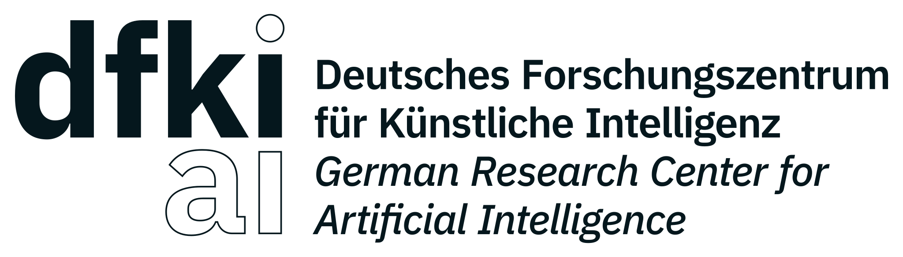
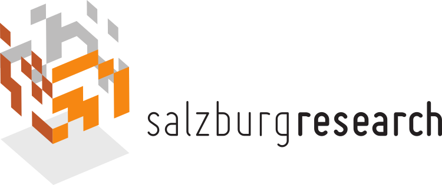

# Projektpartner {#sec-001_projektpartner .unnumbered}

## Empolis Information Management GmbH {.unnumbered}

{width="40%" fig-align="center"}

[Empolis Information Management GmbH](https://empolis.com){target="_blank"}

Die Empolis Information Management GmbH ist einer der führenden Anbieter von KI-basierten Lösungen in Deutschland. Insbesondere bei der Erschließung von schwach-strukturierten Dokumenten für Industrie, Patentämter & Öffentliche Verwaltung ist Empolis führend. Das Angebotsspektrum konzentriert sich auf zwei Bereiche: Zum einen bietet Empolis KI-basierte Wissens-management-Lösungen für die fertigende Industrie, mit denen die Erstellung und Nutzung von Informationen über Maschinen und Anlagen über den gesamten Lebenszyklus unterstützt werden. Das Kernprodukt in diesem Umfeld wird unter der Marke “Empolis Service Express” als schlüsselfertige Software-as-a-Service-Lösung von zahlreichen Maschinen- und Anlagenherstellern aus aller Welt eingesetzt, um KI-basiert Probleme an Maschinen und Anlagen frühzeitig zu erkennen, zu verhindern oder bei der Lösung solcher Probleme zu unterstützen.

Für Finanzindustrie, Behörden und öffentliche Einrichtungen setzt Empolis Lösungen zur Entscheidungsunterstützung auf Basis datenbasierter Lagebilder um und stellt dafür unter der Marke “Empolis Smart Cloud” ein Plattform-as-a-Service-Angebot bereit, auf dem Empolis selbst, aber auch Partner und Endkunden skalierende KI-Lösungen umsetzen. Insbesondere bei Sicherheitsbehörden wird die Lösungsumsetzung auch on Premise unterstützt.

Technologisch basieren Empolis-Lösungen wesentlich auf drei Kerntechnologien: Einer DataHub-Technologie, die die skalierende Verarbeitung und Nutzung großer und volatiler Mengen strukturierter und unstrukturierter Daten unterstützt, einer Insight-Engine, die gleichermaßen mit symbolischen wie subsymbolischen Verfahren Muster und Informationen aus Daten gewinnen kann und einer Knowledge-Graph-Komponente, in der Informationen in ihren spezifischen Zusammenhängen verknüpft werden können.

Als Dienstleister für die Unterstützung bei kritischen Entscheidern legt Empolis besonderen Wert auf Datenschutz, Datensicherheit und – insbesondere beim Einsatz von KI-Verfahren – auf die Nachvollziehbarkeit und Prüfbarkeit von KI-basierten Entscheidungen sowie auf die letztliche Verantwortung menschlicher Entscheider. Entsprechend basieren Empolis-Lösungen in der Regel auf hybriden KI-Verfahren.

Der Hauptsitz des Unternehmens ist in Kaiserslautern, weitere Standorte sind Bielefeld, Rimpar, Darmstadt und Berlin.

Die Empolis Information Management GmbH übernahm als Konsortialleiter die fachliche und organisatorische Koordination des Projekts EASY. Technisch lag der Schwerpunkt auf der Entwicklung und Integration der Kubernetes-basierten Edge-Cloud-Laufzeitumgebung einschließlich Dateninfrastruktur, Deployment-Prozessen und digitaler Zwillinge. Darüber hinaus war Empolis maßgeblich an der Umsetzung und Evaluation des Demonstrators Zerspanung im Bereich Föderiertes Lernen sowie an der Integration und dem Betrieb der Demonstratoren Zerspanung und Palettierungsroboterzelle beteiligt.

## Hochschule Trier {.unnumbered}

{width="40%" fig-align="center"}

[Hochschule Trier](https://easy-edge-cloud.de/?page_id=53){target="_blank"}

Das Institut für Softwaresysteme (ISS) wurde 2003 als Forschungsinstitut der Hochschule Trier am Umwelt-Campus Birkenfeld gegründet. Im Mittelpunkt unserer Forschung steht eine an Nachhaltigkeit und Ressourceneffizienz ausgerichtete Entwicklung und Anwendung der Informationstechnik. Das ISS gehört damit bundesweit zu den wenigen Forschungseinrichtungen, die sich aus Perspektive der Informatik mit Fragestellungen einer nachhaltigen Entwicklung und des Umweltschutzes auseinandersetzen.

Das Institut für Softwaresysteme hat bereits Projekterfahrung im Bereich IoT und IoT-Datenanalyse, in den Projekten „IoT-Pilot“ (BMEL-gefördert, 2018-2020) und „COSY“ (BMBF-gefördert, 2017-2019), in der Erforschung und Entwicklung von Verfahren der Zeitreihendatenanalyse speziell für klinische Daten im Projekt „IMEDALytics“ (BMBF, 2018-2021), sowie in der Entwicklung von Simulationen für die Evaluation von Algorithmen zur Zeitreihenanalyse im Projekt „Claire“ (EIT, 2019-2020) gesammelt. Im Bereich Mobilität und Logistik forschte und forscht das Institut in den Projekten „APEROL“ (BMVI, 2018-2020) und „LandLeuchten“ (BMVI, 2019-2023). Des Weiteren beforscht das Institut seit 2009 die systematische Modellierung (Projekt „GreenSoft“, 2009-2012, BMBF) und methodische Operationalisierung (Projekt „UFOPLAN – Sustainable Software Design“, 2015-2017, UBA) des Energie- und Ressourcenverbrauchs von Softwareprodukten, sowie dessen Transfer in Wissenschaft, Wirtschaft und die Fachöffentlichkeit (Projekte „REFOPLAN Ressourceneffiziente Software“, 2018-2020, UBA und „ISNE“, 2014-2023, MWG RLP und „GreenCoding“, 2022-2023, ISOC Foundation). Mit dem Blauen Engel für Ressourcen- und Energieeffiziente Softwareprodukte konnte das erste Umweltzeichen für Software verfügbar gemacht werden. Im Messlabor werden unter anderem Fragestellungen zu ressourcenintensiver Big Data und KI-Software sowie verteilten Systemen bearbeitet.

Das ISS ist mit den Arbeitsgruppen “Verteilte Systeme und Künstliche Intelligenz” (Prof. Dr.-Ing. Guido Dartmann) und “Green Software Engineering” (Prof. Dr. Stefan Naumann) im Projekt vertreten.

Ein Aufgabenbereich des Umwelt-Campus liegt in der Entwicklung einer Methodik zur Bestimmung der Ressourceneffizienz der beteiligten IKT-Systeme. Darüber hinaus erforschen wir Themen des Verteilten Lernens, Zero-Trust Anwendungen und unterstützen das Konsortium in den Bereichen IT-Security und Verteilte Systeme. Ausgewählte Ergebnisse werden anhand eines Labordemonstrators umgesetzt, welcher sicheres föderiertes Lernen für energieeffiziente Sensoren im IoT-Endknoten an die EASY-Infrastruktur anbindet.

[ISS](https://www.umwelt-campus.de/iss)

[Green Software Engineering](https://www.umwelt-campus.de/forschung/projekte/green-software-engineering/home){target="_blank"}

## Deutsches Forschungszentrum für Künstliche Intelligenz GmbH (DFKI) {.unnumbered}

{fig-align="center" width="50%"}

[Deutsches Forschungszentrum für Künstliche Intelligenz GmbH (DFKI)](https://easy-edge-cloud.de/?page_id=22){target="_blank"}

Das DFKI (dfki.de) ist auf dem Gebiet innovativer Softwaretechnologien auf der Basis von Methoden der Künstlichen Intelligenz die führende wirtschaftsnahe Forschungseinrichtung Deutschlands. In 27 Forschungsbereichen, neun Kompetenzzentren und acht Living Labs werden ausgehend von anwendungsorientierter Grundlagenforschung Produktfunktionen, Prototypen und patentfähige Lösungen im Bereich der Informations- und Kommunikationstechnologie entwickelt.

Im Rahmen des Projektes EASY (Energieeffiziente Analyse und Steuerungsprozesse im dynamischen Edge-Cloud-Kontinuum für die industrielle Fertigung) ist das DFKI mit dem Forschungsbereich Innovative Fabriksysteme (Leitung: Prof. Dr. Ing. Martin Ruskowski) und dem Forschungsbereich Erfahrungsbasierte Lernende Systeme (Leitung: Prof. Dr. Ralph Bergmann) beteiligt.

Das DFKI ist an mehreren Forschungsaspekten innerhalb des Projektes beteiligt. Dazu gehört die Bereitstellung einer neuartigen Laufzeitumgebung für ein dynamisches Edge-Cloud Kontinuum sowie darauf ausführbare offene und standardisierte Dienste. Des Weiteren erforscht das DFKI wie die ressourcenoptimierte Orchestrierung der Rechenoperationen auf den verschiedenen Stufen der Edge-Cloud-Hierarchie ermöglicht werden kann. Das vom DFKI geleitete Arbeitspaket beschäftigt sich mit einer flexiblen, effizienten und resilienten Gestaltung und Steuerung von Fertigungsprozessen. Dabei sollen KI-Methoden zur Workflowgestaltung in Verbindung mit zentralen Planungskomponenten entwickelt werden. Ein weiterer Fokus liegt auf der Anpassung der Methoden des Fallbasierten Schließens für eine Verteilte Ausführung zwischen Cloud und Edge.

Die erarbeiteten Konzepte werden im Testfeld des SmartFactory Living Labs des DFKI in Kaiserslautern demonstriert. In der SmartFactory kommen verschiedene Cloud-Lösungen innerhalb eines Produktionsnetzwerks zum Einsatz. Weitere Informationen zu der Projektbeteiligung des DFKI sind unter folgendem Link verfügbar: https://www.dfki.de/web/forschung/projekte-publikationen/projekt/easy

## Robert Bosch GmbH {.unnumbered}

{fig-align="center" width="38%"}

[Robert Bosch GmbH](https://www.bosch.de/){target="_blank"}

Die Bosch-Gruppe zählt zu den weltweit führenden Technologieunternehmen und treibt die Industrie 4.0 gleichermaßen als Leitanwender und als Leitanbieter voran. Das Ziel innerhalb des Projekts EASY war die Erforschung eines effizienten und nachhaltigen Edge-Cloud-Konzepts, das für das KI-gestützte Monitoring und die Optimierung von Parametern in komplexen Produktionslinien eingesetzt werden kann. Als technologische Grundlage wurde hierfür Edge-Computing in Kombination mit Föderiertem Lernen (Federated Learning) untersucht. Dieser Ansatz ermöglicht es Maschinen aus verschiedenen Produktionslinien, ein gemeinsames, generisches Modell zu trainieren und von geteiltem Wissen zu profitieren, ohne sensible Rohdaten zentral übertragen zu müssen.

Die zentrale Forschungseinheit vertrat die Robert Bosch GmbH, um die Ergebnisse für alle Geschäftszweige des Konzerns nutzbar zu machen. Bosch fokusierte sich zunächst darauf, die methodischen Grundlagen für die industrielle Nutzbarkeit dieser Technologien zu legen, diese den Projektpartnern zur Verfügung zu stellen und die Einbindung in die EASY-Umgebung zu ermöglichen. Es folgte die Evaluierung von Edge-Computing-Komponenten (Soft- und Hardware), einschließlich der ctrlX-Steuerungsplattform aus dem Hause Bosch Rexroth, in einem Demonstrationsaufbau. Ein besonderer Schwerpunkt lag dabei auf der systematischen Bewertung der föderalen Konzepte hinsichtlich ihrer Energie- und Ressourceneffizienz. Anhand dieses Demonstrators konnten Energie- und Dateneffizienz gemessen und daraus Hinweise für mögliche industrielle Einsatzszenarien von Föderiertem Lernen abgeleitet werden. Diese Erkenntnisse können perspektivisch zur Weiterentwicklung zukünftiger Fertigungskonzepte beitragen.

## Fraunhofer IOSB-INA {.unnumbered}

{width="40%" fig-align="center"}

[Fraunhofer IOSB-INA](https://easy-edge-cloud.de/?page_id=47){target="_blank"}

Das Fraunhofer-Institut in Lemgo ist eine führende Forschungseinrichtung im Bereich der industriellen Automation. Mit rund 100 Mitarbeitenden entwickelt und forscht das Fraunhofer IOSB-INA auf den folgenden Gebieten: Intelligente Sensorsysteme, Industrielle Kommunikation und IoT, Big Data Plattformen, Maschinelles Lernen, Mathematische Optimierung, Assistenzsysteme und Cybersicherheit.

Mit der SmartFactoryOWL und Lemgo Digital werden von Fraunhofer in Lemgo zwei herausragende Reallabore für die Nutzung von IoT-Technologien in der Fabrik der Zukunft und der Digitalen Stadt betrieben. Dadurch ergibt sich eine enge Rückkopplung zwischen anwendungsorientierter Forschung und dem praktischen Einsatz neuer Technologien in der Praxis. Bereits in vielen Forschungs- und Industrieprojekten konnte das Fraunhofer-Institut in Lemgo seine Expertise im Einsatz von KI-Methoden und der Dateninfrastruktur für die industrielle Produktion schärfen. Somit verfügt Fraunhofer über eine langjährige Erfahrung, insbesondere hinsichtlich der Entwicklung geeigneter Informationsmodelle und Algorithmen sowie in dem Aufbau geeigneter IT- und Algorithmen-Infrastrukturen.

Bezogen auf das Gesamtvorhaben bildeten die beiden Forschungsschwerpunkte des Fraunhofer IOSB-INA, namentlich die Dateninfrastruktur und verteilte Methoden zur Ursachenermittlung von Anomalien, eine inhaltliche Klammer. Die im Projekt EASY aufgebaute cloud-übergreifende Industrie‑4.0‑Service- und Dateninfrastruktur – einschließlich eines GAIA‑X-konformen Datenraums und AAS-basierter Digitaler Zwillinge für Maschinen, Komponenten und Services – stellte die semantische und logische Basis zur Entwicklung und prototypischen Umsetzung von Condition-Monitoring-Verfahren dar, die für die Überwachung komplexer, standortübergreifender Produktionslinien im Shared-Production-Szenario zwischen SmartFactoryOWL und SmartFactoryKL eingesetzt wurden. Der für Anwenderunternehmen wichtige Schluss von der Anomalie eines komplexen Systems zur Ursachenangabe wurde durch im Projekt entwickelte Diagnosemethoden für modulare Produktionssysteme und föderale Lernsysteme unterstützt, die auf föderiert trainierten KI-Modellen aufsetzten und in der Demonstratorumgebung praktisch erprobt wurden. Insofern trug Fraunhofer entscheidend zu einem nachhaltigen und praxisorientierten Einsatz von KI-Verfahren im Edge-Cloud-Kontinuum bei.

Das Fraunhofer IOSB-INA stellte im Projekt insbesondere folgende Kernkomponenten bereit bzw. entwickelte sie weiter:

-    cloud-übergreifende Industrie‑4.0‑Service- und Dateninfrastruktur

-    KI-integrierende Digitale Zwillinge auf Basis der Verwaltungsschale

-    Datensouveränität der Digitalen Zwillinge

-    Fehlerdiagnostik in modularen Produktionssystemen

-    Anomalieerkennung in föderalen Lernsystemen

-   Erprobungder EASY-Plattform in einer standortübergreifenden Demonstration zwischen der SmartFactoryKL in Kaiserslautern und der SmartFactoryOWL in Lemgo

Der im Projekt aufgebaute Shared-Production-Demonstrator wird über das Projektende hinaus in den Reallaboren weiterbetrieben und für Demonstrationen, Transferaktivitäten und Weiterentwicklungen genutzt. Damit leistet das Fraunhofer IOSB-INA einen nachhaltigen Beitrag zur praxisnahen Umsetzung von KI- und Edge-Cloud-Technologien in der industriellen Fertigung und zur weiteren Vernetzung der beteiligten Smart Factories.

## Salzburg Research Forschungsgesellschaft {.unnumbered}

{fig-align="center" width="45%"}

[Salzburg Research](https://easy-edge-cloud.de/?page_id=51){target="_blank"}

Salzburg Research hat Expertise als unabhängiges Forschungsinstitut für zuverlässige, sichere und intelligente Vernetzung im Internet der Dinge ins Projekt EASY eingebracht und fokussierte sich dabei auf die Bewertung, Vorhersage und Optimierung von Kommunikationsperformanz im Edge-Cloud-Kontinuum für den industriellen Einsatz.

Wesentlich war die Entwicklung effizienter Analyseprozesse zur Bewertung verfügbarer Bandbreiten und Latenzen entlang verteilter Edge-Cloud-Infrastrukturen. Diese Parameter bilden die Grundlage, um Dienste situationsgerecht zu verteilen und digitale Anwendungen performant, sicher und kosteneffizient zu betreiben.

Darüber hinaus wurde ein MQTT-basierter Messdienst umgesetzt, der Netzwerk-Performance-Metriken erfasst und für weiterführende Analysen, wie z.B. die Performance-Vorhersage, nutzbar macht. Ein weiterer Schwerpunkt lag auf der Anomalie-Erkennung in industriellen Kommunikationsnetzen mithilfe von föderierten Lernverfahren. Ziel dabei war es, sicherheits- und qualitätsrelevante Auffälligkeiten zu erkennen, ohne sensible Daten zentral zusammenzuführen.

Salzburg Research war an zwei der sieben Use Cases beteiligt und konnte dabei zentrale Ergebnisse in die Laufzeitumgebung des Gesamtprojekts einbringen. Die entwickelten Dienste wurden in einem Laborprototyp evaluiert und liefern Erkenntnisse für produzierende Industrie, KMU, Maschinenhersteller, Cloud-Diensteanbieter und Forschungseinrichtungen.

Erkenntnisse aus dem MQTT-Messdienst, der Performance-Vorhersage und der Anomalie-Erkennung fließen in weitere Forschungsaktivitäten ein. Ergebnisse der Netzwerksimulation, die Messmethodik und das Messsystem für 5G-Netzwerke wird in aktuellen Projekten weiterentwickelt. Damit leistet Salzburg Research einen nachhaltigen Beitrag zu vertrauenswürdiger, zuverlässiger und intelligenter Konnektivität für künftige digitale Geschäfts- und Produktionsprozesse.

## Coboworx GmbH {.unnumbered}

{fig-align="center" width="35%"}

[Coboworx GmbH](https://easy-edge-cloud.de/?page_id=44){target="_blank"}

Die coboworx GmbH entwickelte prozessfertige Industrieroboter und Automatisierungslösungen insbesondere für kleine und mittelständische Unternehmen. Das Unternehmen verfolgte einen modularen Ansatz, der einen einfachen Einsatz und Betrieb robotergestützter Systeme ermöglichte und durch digitale Service- und Fernwartungskonzepte ergänzt wurde.

Im Projekt EASY war coboworx für die Umsetzung und Integration des Demonstrators für eine Roboterzelle zur Palettierung verantwortlich. Im Fokus standen insbesondere die Einbindung des Empolis Analyse-Bots zur automatischen Anomalieerkennung, Überwachung der Remote-Anbindung per MQTT-Messdienst, die Integration eines KI-gestützten Service-Chats mit Problemlösungsvorschlägen, die Anbindung einer Wissensdatenbank zur Ergänzung von Statusmeldungen sowie die Realisierung eines VPN-basierten Remote-Zugriffs und einer vereinfachten Edge-Konfiguration über die Asset Administration Shell (AAS). Dadurch wurde der Demonstrator von einer reinen Monitoring-Lösung zu einer intelligenten Predictive-Maintenance-Plattform weiterentwickelt.

Aufgrund der Insolvenz des Unternehmens gegen Ende der Projektlaufzeit konnten die geplanten Arbeiten in der abschließenden Projektphase jedoch nicht mehr vollständig umgesetzt werden.

## Artiminds Robotics GmbH {.unnumbered}

{fig-align="center" width="35%"}

Die ArtiMinds Robotics GmbH war ein Technologieunternehmen im Bereich der intuitiven Roboterprogrammierung. Mit ihren Softwarelösungen für die Programmierung, Analyse und Optimierung roboterbasierter Fertigungsprozesse unterstützte ArtiMinds Industrieunternehmen bei der Umsetzung komplexer Automatisierungsaufgaben.

Im Projekt EASY war ArtiMinds ursprünglich für den Aufbau einer Daten-, Analyse- und Lerninfrastruktur für robotergestützte Fertigungsprozesse verantwortlich.

Aufgrund der Insolvenz des Unternehmens während der Projektlaufzeit konnte ArtiMinds seine Arbeiten jedoch nur in der ersten Projektphase einbringen und im weiteren Verlauf des Projektes keine weiteren Beiträge mehr leisten.
