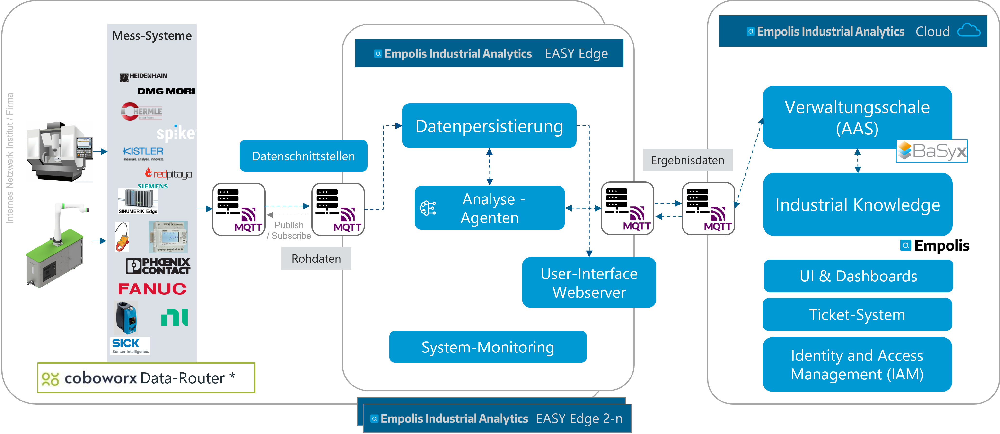
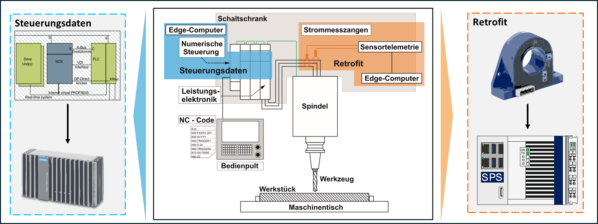
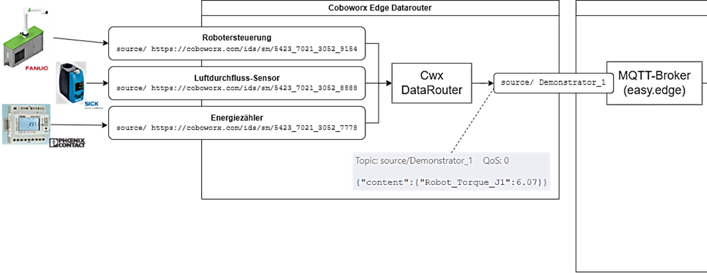
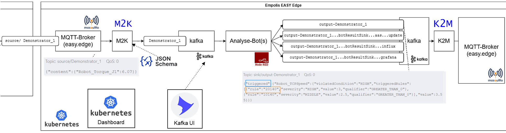
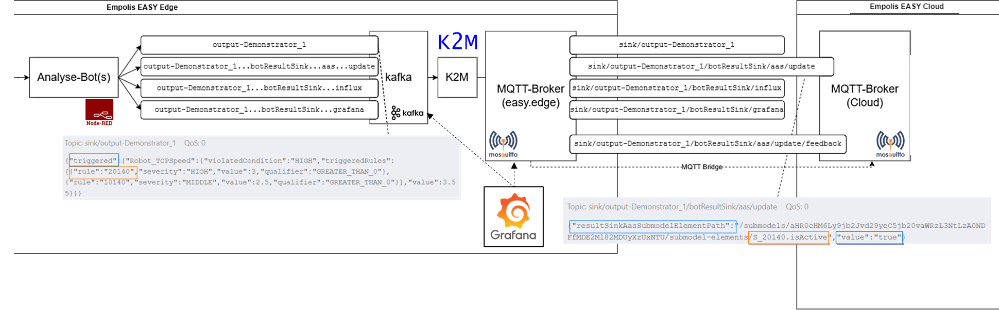
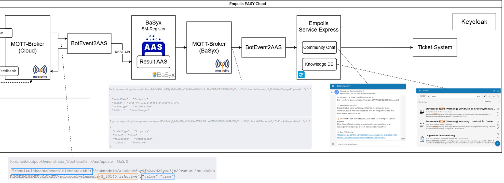

# Datenpipeline – Von der Maschine bis zur Aktion {#sec-002_datenpipeline}

Im vorhergehenden @sec-002_laufzeitumgebung_architektur_easy_cloud_edge wurde die Gesamt-Architektur der EASY Edge- und Cloud-Umgebungen und die darin enthaltenen Komponenten vorgestellt. Im folgenden Kapitel wird auf das Zusammenspiel und die Abhängigkeiten zwischen den einzelnen Services im Rahmen der Beschreibung der Datenpipeline eingegangen.

Die Datenpipeline wird anhand eines Datenanalyseprozesses skizziert beschrieben, wofür folgendes Abbild eine high-level Ansicht bietet:

{#fig-easy_architektur_datenpipeline}

Die Datenpipeline teilt sich grundsätzlich in eine Edge-Datenpipeline und in eine Cloud-Datenpipeline auf. Die Komponenten und Zusammenhänge der Edge-Datenpipeline spiegeln sich in der Cloud-Datenpipeline oder anderen Edge-Systemen wider. Zur Übersichtlichkeit wird im Folgenden das System anhand eines einfacheren Use-Cases mit einer Edge-Instanz und einer Cloud-Instanz beschrieben.

Wie in der obigen @fig-easy_architektur_datenpipeline dargestellt, teilt sich das System mit der Datenpipeline in drei Teile auf: Maschinenseitige Datenerfassung (durch SPS-Programme, Datenrouter), der EASY-Edge und der EASY-Cloud Komponenten. Die Datenerzeugung und darauffolgende -verarbeitung ist von links nach rechts zu lesen. An der Maschine, in steuerungsnahen SPS-Steuerungen oder zusätzlich verbauter Sensorik und Mess-Systeme werden (hochfrequente) Daten erfasst. Auf der OT-Ebene werden hardwarenahe Implementierungen eingesetzt, welche sich je Hardware-Device sehr unterscheiden können. In vielen Fällen wird bereits auf OPC UA (Open Platform Communications Unified Architecture) als weltweitführenden Kommunikationsstandard für die Industrieautomation gesetzt. Letztlich werden die Maschinenseitig erfassten Rohdaten über das MQTT-Potokoll in einheitlicher Weise in die EASY-Edge Umgebung versendet. In der EASY-Edge Umgebung werden die Rohdaten in einer Datenpersistierungsschicht (Kafka) gespeichert, mehrere Analyse-Agenten greifen lesend auf diese Daten zu, analysieren und verarbeiten diese und schreiben ihre Ergebnisse wieder über Kafka nach MQTT. Weitere Analyse-Agenten können auf diese (vor-) verarbeiteten Daten wiederum zugreifen und weiterverarbeiten oder die Ergebnisdaten werden ebenfalls wieder über das MQTT-Protokoll in die EASY-Cloud Umgebung geschickt. Auf dem Edge-Gerät können die (Zwischen-)Ergebnisse lokal auf Dashboards und weiteren Nutzeroberflächen (HMI) dargestellt werden. In der EASY-Cloud können, ähnlich zur Verarbeitung auf der Edge, weitere (rechenintensivere) Datenanalysen erfolgen oder als Ergebnis in eine passende Verwaltungsschale (Asset Administration Shell - AAS) geschrieben werden. In @sec-002-verwaltungsschale, @sec-002_laufzeitumgebung_architektur_easy_cloud_edge und @sec-002-demo-planung-monitoring-agent wird näher auf die Inhalte der jeweiligen Verwaltungsschalen eingegangen.

**Maschinenseitige Datenerfassung**

Als Beispiel zur maschinenseitigen Datenerfassung wird die Aufzeichnung von Stromsignalen einer CNC-Maschine während eines Zerspanungsprozesses herangezogen. Das beschriebene Vorgehen wurde in Vorarbeiten und im Rahmen des EASY-Box Zerspanungsdemonstrators umgesetzt (siehe @sec-006-demo_zerspanung_easy_box). Wie im folgenden Abbild dargestellt gibt es unterschiedliche Möglichkeiten Signaldaten zu erfassen. Steuerungsdaten können über teilweise schon in der Maschine verbauten Edge-Computern (hier Sinumerik Edge) von der Leistungselektronik erfasst werden. In dieser Steuerung müssen eben diese Dateninputs ausgewählt und Sinumerik-Edge-seitig in das passende Datenformat transformiert, verarbeitet werden und anschließend per MQTT versendet werden. Im EASY Projekt wurde im Zerspanungs-Use-Case eine Retrofit Variante zudem weiter ausgebaut, in welcher Strommesszangen an die Phasen des Motors der Maschine angeklemmt wurden (siehe auch @sec-006-demo_zerspanung_easy_box). Die Strommesszangen wurden an eine SPS Steuerung (Phoenix Contact oder Beckhoff Steuerung) angebunden. Auf der SPS wurden Programme implementiert, welche die erfassten Stromsignale miteinander verrechnen, in einen Datenstrom umwandeln und per MQTT versenden.

Im Use-Case mit Anbindung einer Robotersteuerung (siehe auch @sec-006-demo_roboter_use_case) wurden in ähnlicher Weise Roboter-Steuerungsinterne Daten per OPC UA abgegriffen und per MQTT versendet oder zusätzliche Sensorik, wie einen Luftdurchflusssensor oder Energiemesssysteme verbaut und ebenfalls deren Signale weiterverarbeitet. Ein gesonderter Edge Datenrouter wurde hier über ein IXON IoT Gateway Device realisiert.

Wie in folgender Abbildung skizziert, werden die Daten je Device an unterschiedliche MQTT Topics versendet und somit in die nächste Ebene der EASY-Edge gespielt.

Die Maschinenseitige Anbindung muss, wie in den obigen Beispielen zu sehen, sehr individuell und je Maschine erfolgen. Als einheitliche Schnittstelle wurde das MQTT Protokoll festgelegt. Im Payload der MQTT Nachricht werden die Sensordaten als JSON-Objekt oder JSON-Objekt Liste versendet. Das Format der JSON-Nachrichten wurde passend zur jeweiligen Umgebung und Maschinen- bzw Sensorkonfiguration in einem JSON-Schema definiert und zwischen den Systemen abgestimmt.

**Datenfluss in der EASY-Edge Umgebung**

Wie im vorherigen Kapitel vorgestellt, baut die EASY-Edge auf einer kubernetes Infrastruktur auf. Die von der Maschinenseite versendeten Daten kommen am MQTT-Broker innerhalb der EASY-Edge an. Ein zusätzlich implementierter MQTT-to-Kafka Datenrouter (M2K) validiert die ankommenden Datenpakete gegenüber einem JSON-Schema und leitet sie bei erfolgreicher Überprüfung vereinzelt (nicht als Datenbatch) nach Kafka weiter. In Kafka werden die Daten ebenfalls in unterschiedlichen, Maschinen und Edge-Device bezogenen Topics persistiert. Die Persistierung erfolgt in einer Daten-Queue kurzfristig in der Regel für ca. 20 Minuten. Die persistierten Daten werden anschließend (parallel) durch Analyse-Agenten weiterverarbeitet. Hier finden Edge-seitig Datentransformationen statt und Daten werden regelbasiert oder mithilfe von Machine-Learning Modellen ausgewertet. Die Agenten sind in Node-RED oder als eigenständige Container implementiert und können durch jeweils abgestimmte Schnittstellen modular miteinander kombiniert werden, sodass bspw. nach einer Datentransformation eine Modell-Inferenz in einem anderen Agenten stattfinden kann. Die Ergebnisse der Agenten werden widerum in ein Output oder Ergebnis Kafka Topic geschrieben. Im Beispiel eines "Threshold-Monitor" Agenten, welcher die Signale auf gewisse Grenzwerte alarmiert, werden die Ergebnisse in die Kafka-Topics "output-\<device-id\>...botResultSink" geschrieben und je nach Zielsystem nochmals nach "...grafana", "...influx" oder "...aas...update" aufgeteilt. Die Ergebnisnachricht enthält nun bspw. die Information, ob eine gewisse Grenzwertregeln erfüllt ("triggered") wurde, wie in folgender Abbildung dargstellt:

Die Ergebnis-Kafka-Topics werden abschließend wieder über einen Kafka-to-MQTT Datenrouter ("K2M") auf die korrespondierenden Topics am EASY-Edge MQTT-Broker gespiegelt. Je nach Konfiguration findet anschließend eine EASY-Edge-seitige Visualisierung (in Grafana), Langzeitpersistierung (in InfluxDB) oder Weiterverarbeitung in der Cloud statt. Da die EASY-Edge und EASY-Cloud Architektur sehr ähnlich zueinander gestaltet wurden, ist eine Cloud-seitige Datenverarbeitung im weiteren Cloud-System analog zu dem oben beschriebenen Vorgehen ebenfalls möglich. Im Folgenden wird jedoch nur auf die Weiterverarbeitung im Rahmen der Verwaltungsschale eingegangen.

**Datenfluss in der EASY-Cloud Umgebung**

Eine Datenverarbeitung wie im vorhergehenden Abschnitt beschrieben, kann analog auch in der Cloud stattfinden. Im Falle eines anvisierten Updates in einer Verwaltungsschale werden die Ergebnisse an ein MQTT-Topic mit dem Benennungsschema "sink/\<device-id\>/botResultSink/aas/update" gesendet. Über eine konfigurierte MQTT-Bridge werden nun die Daten zwischen EASY-Edge MQTT-Broker und EASY-Cloud MQTT-Broker synchronisiert.

Die Nachrichten, welche ein Status-Update in der Verwaltungsschale erwirken sollen, bestehen grundlegend aus dem eindeutigen Pfad in ein Verwaltungsschalen Teilmodel, dem sog. "resultSinkAasSubmodelElementPath", bestehend aus dem Teilpfad zum Submodel-Repository und der Submodel-ID "/submodels/\<submodel-id\>" und dem Pfad zum Submodel-Element "/submodel-elements/\<dot-separated submodel-path\>". Desweiteren der neue "value" dieses Submodel-Elementes. Das spezifische Submodel wird in der Konfiguration oder Implementierung der Analyse-Agenten festgelegt. Mit der Implementierung des Grenzwertwächters wurde ein "Status" Submodel eingeführt, welches in @sec-002-verwaltungsschale beschrieben wird. Somit ergibt sich die Beispielnachricht wie im obigen Abbild.

Der Cloud-Service "BotEvent2AAS" lauscht auf dieses Event am MQTT-Broker und sendet einen POST Request an die REST-API Schnittstelle des Submodel Repository des BaSyx Servers. Somit wird bspw. (siehe Beispiel in den Abbildungen) der Boolean Wert im Submodel "submodels/aHR0c HM6Ly 9jb2Jvd 29yeC 5jb20 vaWRzL3 NtLzA 0NDFf MDE2 Ml82MDUy XzUxNTU" (Submodel-ID ist Base64 codiert) im Submodel-Element "/submodel-elements/S_20140.isActive" auf den Wert "true" abgeändert.

Durch das Update im Submodel wird aus BaSyx ein MQTT Event am BaSyx MQTT-Broker am Topic "/submodels/\<submodel-id\>/xxx/submodel-elements/\<dot-separated submodel-path\>/updated" emmitiert. Diese Events werden wiederum vom "AASEvent2ESE" Service konsumiert und spielen diese Udates in weitere (externe) Systeme. In der prototypischen Implementierung wurde hier das Empolis Service Express System konnektiert und die Update Events hierin in einen sogenannten "Maschinen Community Chat" versendet. Über das Verwaltungsschalen Update Eventing werden somit gezielt Events und Nachrichten in anderen Systemen provoziert. Der "AASEvent2ESE" Service erstellt zudem einen Suchanfragen-Link für das Empolis Industrial Knowledge Portal (Wissensmanagement-System), sodass zur Meldung "Status xxx der Maschine ist aktiv" zusätzlich eine Verknüpfung zu einer Wissensdatenbank entsteht, in der genau hinterlegt ist, welche Bedeutung dieser Code hat oder wie gehandelt werden muss. Die Verknüpfung soll mit der Verlinkung zu Wissensartikeln in erster Linie eine "Hilfe zur Selbsthilfe" geben. Kann der "Human-in-the-middle", welcher diese Community-Chat Meldung erhält, das Problem durch diese Unterstützung nicht selbst lösen, können durch stringente Datenweitergabe nahtlos weitere Systeme angebunden werden. Im Projekt wurde zusätzlich ein Ticket-System integriert, indem durch eine weitere Aktion ("Klick auf Create-Ticket Link") ein Ticket zur weiteren Fall- und Problemlösung erstellt wird. Dabei werden die Informationen aus den vorherigen Systemen direkt mit übernommen.

Durch die Integration einer standardisierten Middleware, der Verwaltungsschale, können somit skalierbare Systeme geschaffen werden, die durch die standardisierten Beschreibungen und Schnittstellen interoperabel mit anderen Systemen agieren können.

Im EASY Projekt wurde somit eine durchgängige Datenpipeline im Edge-Cloud-Kontinuum implementiert, die Daten von der Maschine, über die EASY-Edge zur EASY-Cloud über standardisierte Beschreibungen durch Verwaltungsschalen auch in andere Systeme transferiert und verarbeitet.