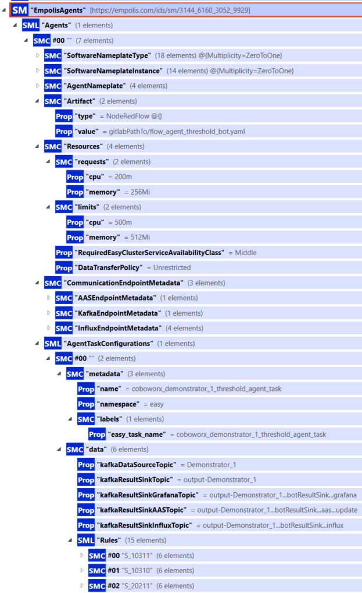
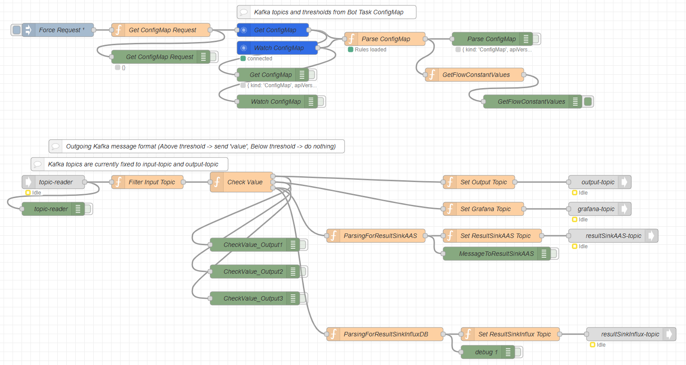
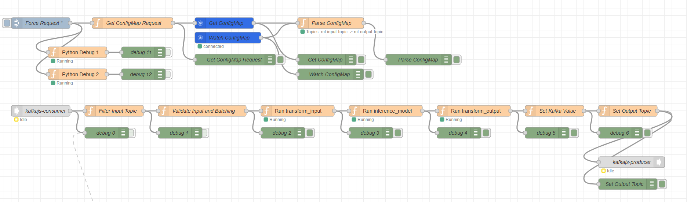

# Planungs- und Monitoring-Agenten {#sec-002-demo-planung-monitoring-agent}

In der EASY-Edge und -Cloud Umgebung werden Agenten eingesetzt, um eingehende Produktions- und Sensordaten zeitnah zu bewerten und daraus verwertbare Informationen abzuleiten. Ziel ist es, aus einem kontinuierlichen Datenstrom schnell diejenigen Signale herauszufiltern, die für den Betrieb, die Qualitätssicherung oder die Überwachung einer Anlage relevant sind. Dieses Kapitel beschreibt zwei zentrale Agent-Typen: einen regelbasierten *Threshold Monitoring Agent* zur Grenzwert- und Regelprüfung sowie einen *ML-Agent*, der ein trainiertes Machine Learning Modell zur Inferenz nutzt. Beide Ansätze sind für den Einsatz auf EASY-Edge und EASY-Cloud vorgesehen und so gestaltet, dass sich Konfigurationen zur Laufzeit anpassen lassen, ohne dass Quellcode geändert werden muss.

## Threshold Monitoring Agent

Der Threshold Monitoring Agent überwacht definierte Merkmale (Features) im Datenstrom und prüft diese gegen konfigurierbare Regeln, beispielsweise Grenzwerte. Im Vordergrund steht dabei der praktische Nutzen: Abweichungen oder kritische Zustände sollen früh erkannt und gezielt weitergeleitet werden, statt alle Rohdaten zentral zu sammeln und nachgelagert auszuwerten. Durch Einsatz dieses Threshold Monitoring Agents in der EASY-Edge Umgebung lassen sich Reaktionszeiten verkürzen, Datenmengen reduzieren und Auswertungen näher an den Ort der Entstehung verlagern.

**Implementierung (Node-RED und JavaScript)**

Der Agent ist als Node-RED Flow umgesetzt; die eigentliche Prüf- und Entscheidungslogik liegt in JavaScript-basierten Function-Nodes. Diese Kombination erleichtert die Wartung und Anpassung im Projektkontext, da die Datenflüsse visuell nachvollziehbar bleiben und die Regeln in einer klaren, textbasierten Form beschrieben werden.

**Konfiguration über ConfigMaps und Live-Updates**

Regeln und Basisparameter (z. B. Auswahl eines Features, Eingangs- und Ausgangskanäle) werden in Kubernetes als **ConfigMap** bereitgestellt. Der Agent liest diese Konfiguration im Betrieb ein und übernimmt Änderungen zur Laufzeit. Damit können zum Beispiel Grenzwerte angepasst oder zusätzliche Regeln ergänzt werden, ohne den Agent neu bauen oder neu deployen zu müssen. Das Vorgehen unterstützt insbesondere iterative Inbetriebnahmephasen, in denen sich Schwellenwerte schrittweise aus Mess- und Betriebserfahrungen ergeben.

**Beispiel: Regeldefinition in einer ConfigMap (aktuelles Schema)**

Die Konfiguration liegt als Key-Value-Einträge in der ConfigMap. Da ConfigMaps ausschließlich String-basierte Schlüssel/Werte unterstützen, wird eine strukturierte Regeldefinition “flach” über Punkt-Notation und Indizes abgebildet. Im aktuellen Schema werden Regeln als Liste modelliert: `data.Rules.<index>.<Feld>` (z. B. `data.Rules.0.RuleName`).

``` yaml
apiVersion: v1
kind: ConfigMap
metadata:
  name: threshold-bot-task
  namespace: easy
data:
  kafkaDataSourceTopic: "Demonstrator_1"
  kafkaResultSinkTopic: "output-Demonstrator_1"
  kafkaResultSinkGrafanaTopic:
    "output-Demonstrator_1...botResultSink...grafana"
  kafkaResultSinkAASTopic:
    "output-Demonstrator_1...botResultSink...aas...update"
  kafkaResultSinkInfluxTopic:
    "output-Demonstrator_1...botResultSink...influx"

  # Regeln als Liste: data.Rules.<index>.<Feld>
  data.Rules.0.RuleName: "S_10311"
  data.Rules.0.Value: "24.0"
  data.Rules.0.Qualifier: "GREATER_THAN_0"
  data.Rules.0.Severity: "MIDDLE"
  data.Rules.0.ResultSink.AAS.isActive:
    "/submodels/<submodelId-b64>/submodel-elements/
    S_10311.isActive"
  data.Rules.1.RuleName: "S_20211"
  data.Rules.1.Value: "7.0"
  data.Rules.1.Qualifier: "GREATER_THAN_0"
  data.Rules.1.Severity: "HIGH"
  data.Rules.1.ResultSink.AAS.isActive:
    "/submodels/<submodelId-b64>/submodel-elements/
    S_20211.isActive"
```

Das Schema orientiert sich an der Regelstruktur in der AAS: Regeln werden nicht mehr als “Feature-spezifische” Keys (ältere Varianten wie `Feature.Rule.Property`) abgelegt, sondern als Liste modelliert. Dadurch lassen sich beliebig viele Regeln pro Task definieren und die Struktur bleibt konsistent zwischen AAS und Cluster-Konfiguration.

**Mapping: AAS → ConfigMap**

Die Task-Konfiguration wird in EASY zunächst semantisch in der Verwaltungsschale gepflegt (Submodel `AgentTaskConfigurations`). @fig-aas-agent-task-config zeigt den relevanten Ausschnitt: unter `data` stehen u. a. die Kafka-Topics; unter `Rules` die Regel-Liste. Beim Übergang in Kubernetes materialisiert der BotTasksOperator (siehe @sec-002-k8s-operatoren) die strukturierte Beschreibung als ConfigMap, indem Listen über Indizes und verschachtelte Felder über Punkt-Notation abgebildet werden.

::: {#fig-aas-agent-task-config layout-ncol="2" layout-valign="bottom" fig-cap="AAS des Monitoring-Agenten und zugehörige Task-Konfiguration (Ausschnitte)."}
{width="90%" height="10cm" fig-align="center"}

{width="90%" height="10cm" fig-align="center"}
:::

Eine Zuordnung lässt sich beispielhaft wie folgt lesen:

| AAS-Feld                           | ConfigMap-Key              |
|------------------------------------|----------------------------|
| `data.kafkaDataSourceTopic`        | `kafkaDataSourceTopic`     |
| `data.kafkaResultSinkTopic`        | `kafkaResultSinkTopic`     |
| `Rules[0].RuleName`                | `data.Rules.0.RuleName`    |
| `Rules[0].Value`                   | `data.Rules.0.Value`       |
| `Rules[0].Severity`                | `data.Rules.0.Severity`    |
| `Rules[0].ResultSink.AAS.isActive` | `data.Rules.0.ResultSink.` |
|                                    | `AAS.isActive`             |

**Datenverarbeitung am Edge und Ergebnisbereitstellung**

Die Regelprüfung läuft typischerweise auf der EASY-Edge. Statt große Datenmengen ungefiltert weiterzuleiten, werden primär verdichtete Ergebnisse und Ereignisse erzeugt, beispielsweise “Regel verletzt” oder “Zustand unauffällig”. Diese Ergebnisse können je nach Einsatzszenario an unterschiedliche Ziele geschrieben werden: häufig nach **Kafka** (Ereignisse/Status auf Topics zur Weiterverarbeitung oder Visualisierung), optional für Monitoring nach **InfluxDB** (Zeitreihen) oder in eine **AAS** (Asset Administration Shell, z. B. über BaSyx), um Zustandsinformationen strukturiert bereitzustellen.

**Aktuelles Input-Datenformat (anpassbar)**

Als Eingang erwartet die Grenzwertprüfung aktuell eine JSON-Nutzlast (z. B. als Kafka `value`) mit Zeitstempel, Gerätebezug und einem `content`-Objekt, das die zu prüfenden Merkmale enthält:

``` json
{
  "timestamp": "2024-10-04T08:00:00+02:00",
  "deviceId": "IfW_Device",
  "content": {
    "tool_run": 1,
    "tool_id": "ifw_tool_id_1003",
    "P_Spindel": 120.5,
    "I_Spindel": 3.2
  }
}
```

Das Format ist **anpassbar**. In der Praxis werden Anpassungen entweder in einer vorgelagerten Aufbereitung (z. B. Mapping/Routing in der Datenpipeline) oder direkt in der Function-Node vorgenommen, die die Nutzlast interpretiert und auswertet.

**Beispiel: Output (Ereignis bei Regelverletzung)**

Wird mindestens eine Regel ausgelöst, erzeugt der Agent eine Ereignisnachricht, die die relevante Information in komprimierter Form enthält:

``` json
{
  "timestamp": "2024-10-04T08:00:00+02:00",
  "deviceId": "IfW_Device",
  "tool_run": 1,
  "tool_id": "ifw_tool_id_1003",
  "triggered": {
    "P_Spindel": {
      "violatedCondition": "HIGH",
      "value": 120.5,
      "triggeredRules": [
        {
          "rule": "Rule1",
          "severity": "HIGH",
          "value": 100.0,
          "qualifier": "GREATER_EQUAL_2"
        }
      ]
    }
  }
}
```

{#fig-threshold-agent-flow width="100%" fig-align="center"}

**Live-Update der Konfiguration (GET/WATCH auf ConfigMaps)**

Beim Start lädt der Agent die aktuelle ConfigMap per Kubernetes-API (HTTP `GET`). Zusätzlich wird ein Watch auf ConfigMaps im Namespace registriert, sodass Änderungen an der BotTask-ConfigMap (z. B. durch den BotTasksOperator; siehe @sec-002-k8s-operatoren) automatisch erkannt werden. Bei einem Update werden Regeln/Topics erneut geparst und im Flow-Kontext aktualisiert – die Auswertung läuft anschließend unmittelbar mit den neuen Parametern weiter, ohne dass ein Redeploy des Agents notwendig ist.

## Generischer ML-Agent

Der ML-Agent führt eine Inferenz auf dem Datenstrom aus, um beispielsweise Anomalien, Zustandsklassen oder Qualitätsindikatoren zu erkennen. Anders als beim regelbasierten Ansatz basiert die Bewertung hier auf einem vorab trainierten Machine Learning Modell, das aus historischen Daten gelernt hat. Der Einsatz ist sowohl auf der EASY-Edge (nahe an der Maschine) als auch in der EASY-Cloud vorgesehen, abhängig von Anforderungen an Latenz, Rechenressourcen und Verfügbarkeit.

In der Cloud kommt ein separat implementierter ML-Agent zum Einsatz, welcher in Scala und mithilfe des Flink Frameworks implementiert wurde und gegenüber einen gesonderten ML- oder Triton-Server (über Seldon-Core) an dort extern gehostete ML-Modelle per REST-Api die Requests an die ML-Modelle stellt. In der folgend beschriebenen Umsetzung des ML-Agents wurde sich bewusst auf einen leichtgewichtigen Ansatz fokussiert, sodass sich dieser Agent insbesondere für den Einsatz auf der EASY-Edge eignet.

**Aufbau in drei Verarbeitungsschritten**

Der ML-Agent ist als Node-RED Flow umgesetzt und besteht konzeptionell aus drei Schritten: Zunächst werden Rohdaten aufbereitet und in ein geeignetes Modell-Inputformat überführt (*Transform Input*). Anschließend wird das Modell ausgeführt und liefert ein Ergebnis (*Inference*). Abschließend wird dieses Ergebnis in ein standardisiertes Ausgabeformat transformiert (*Transform Output*), sodass es in der Datenpipeline konsistent weiterverarbeitet oder visualisiert werden kann.

**Rolle von `model.py` und einheitliche Modellstruktur**

Die Modelllogik liegt in einer Python-Datei `model.py`. Dort sind das Laden des Modellartefakts (z. B. `model.onnx`) sowie die für die drei Schritte benötigten Transformationen und die Inferenz beschrieben. Der Agent greift zur Laufzeit auf diese Datei zu (z. B. aus einem definierten Modellverzeichnis). Die Ablagestruktur orientiert sich an der im Projekt verwendeten Struktur des Modell-Repositories, sodass dasselbe Modellprinzip sowohl am Edge als auch in der Cloud eingesetzt werden kann. Zudem ist es durch diese Strukturierung möglich, dass unterschiedliche Machine Learning Modelle trainiert, bspw. zur Anomalie-Detektion oder zur Remaining-Use-Life Vorhersage (Regression), und in diesem Kontext angewendet werden können. Durch Austausch der `model.py` Datei, welche Inferenz, Datenvor- und Nachverarbeitung beinhalten, und zugehöriges Modellartefakt, kann der generische ML-Agent somit unterschiedliche Use-Cases abdecken.

**Modell-Update-Mechanismus**

Modellartefakte (z. B. `model.py` und `model.onnx`) werden im Hintergrund automatisch aktualisiert, ohne dass der Agent selbst neu gebaut werden muss. Konzeptionell kann ein Update aus einem zentralen Modellmanagement (z. B. MLflow) stammen und über eine Synchronisierung in die jeweilige Zielumgebung (Edge/Cloud) verteilt werden. Dadurch bleibt der Betrieb flexibel: Neue Modellstände lassen sich einspielen, während die Integrationslogik und der Einbettungsrahmen im Agent stabil bleiben.

**Aktuelles Input-Datenformat (anpassbar)**

Der ML-Agent arbeitet aktuell mit einem JSON-Format, das Sensordaten in einem `content`-Objekt transportiert. Das folgende Minimalbeispiel zeigt die Grundstruktur:

``` json
{
  "timestamp": "2024-10-04T08:00:00+02:00",
  "eventType": "sensor_reading",
  "deviceId": "IfW_Device",
  "content": {
    "tool_run": 1,
    "I_Spindel": -51.48,
    "I_Z": 3.33,
    "P_Z": 0.0,
    "P_Spindel": 29203.16,
    "tool_id": "ifw_tool_id_1003",
    "tool_run_end": false
  }
}
```

Auch dieses Format ist **anpassbar**, etwa durch andere Feature-Sets, alternative Aggregationslogik oder eine andere Bündelung von Einzelmessungen. Entscheidend ist, dass die Transformationen in `model.py` und die verwendete Pipeline-Konfiguration zusammenpassen.

**Beispiel: Output (Klassifikation)**

Als Ergebnis liefert der ML-Agent eine strukturierte Ausgabe (Beispiel: “Anomaly” vs. “Normalzustand”), die anschließend z. B. nach Kafka geschrieben und dort weiterverarbeitet oder visualisiert werden kann:

``` json
{
  "output_tensor_0": [1],
  "output_tensor_1": [["label", "Anomaly"], ["class", "1"]]
}
```

{#fig-ml-agent-flow width="100%" fig-align="center"}