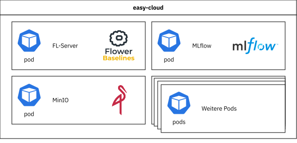
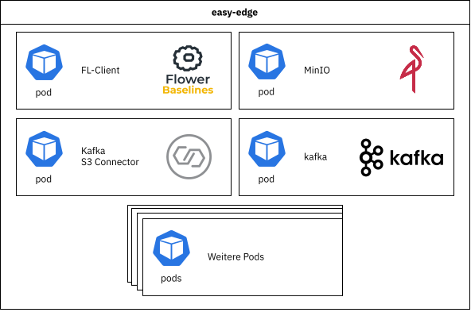
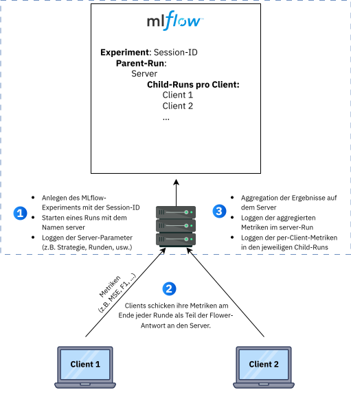

# Integration Federated-Learning in EASY Umgebung {#sec-002_integration_federeated_learning}

In diesem Abschnitt wird auf die Einbindung der erforderlichen Federated-Learning Komponenten in der EASY Kubernetes-Umgebung Architektur eingegangen. Auf das prinzipielle Konzept des Federated-Learning wird im @sec-004-fl-intro eingegangen und anhand zahlreicher Demonstratoren näher erläutert.

Damit in der EASY-Umgebung Federated-Learning-Prozesse laufen können, wurde die Infrastruktur um zusätzliche Dienste auf Edge- und Cloud-Ebene erweitert. Im Zentrum stehen dabei der FL-Server (Flower) in der Cloud und die FL-Clients (Flower) auf den Edge-Geräten, die über das Flower-Framework miteinander kommunizieren.

Der FL-Server koordiniert die Trainingsrunden und aggregiert die von den Clients gesendeten Modellparameter zu einem globalen Modell. Rohdaten werden dabei nie übertragen, stattdessen werden ausschließlich Modellgewichte und Metriken zwischen Edge und Cloud ausgetauscht. Auf den Edge-Geräten führt jeder FL-Client das lokale Training auf den jeweiligen Produktionsdaten durch und sendet anschließend die aktualisierten Gewichte an den Server zurück.

Auf der Cloud-Seite wurde die EASY Kubernetes-Umgebung um drei zentrale Komponenten erweitert:

-   FL-Server (Flower) als zentrale Koordinationsinstanz
-   MLflow als System für Experiment-Tracking
-   MinIO als S3-kompatibler Objektspeicher für Modelle und weitere Artefakte

Die genannten Services wurden in Kubernetes-Pods im Namespace easy im EASY-Cloud Cluster deployt.

{#fig:easy-cloud fig-pos="H" width="60%"}

Auf den Edge-Geräten wurde die EASY-Edge Kubernetes-Umgebung um einen FL-Client ergänzt, der das lokale Training und die lokale Auswertung übernimmt. Zudem wurde MinIO als Objektspeicher zur gebündelten Ablage der aus den Rohdaten extrahierten Trainingsdaten integriert. Weiterhin wurde ein Kafka-s3-Connector integriert, welcher die Roh-Streamingdaten als Batches im Objektspeicher ablegt.

{#fig:easy-Edge fig-pos="H" width="60%"}

So entsteht aus der ursprünglichen EASY-Umgebung eine verteilte Architektur, in der Federated Learning mit Produktionsdaten möglich wird und gleichzeitig Speicherung von Modellen und Artefakten sowie das Experiment-Tracking zentral koordiniert werden können, während Datenhoheit und Datenschutz auf den Edge-Geräten gewahrt bleiben.

Im nächsten Abschnitt werden die einzelnen Komponenten im Detail vorgestellt.

## FL-Server

Der FL-Server bildet das Zentrum der Federated-Learning-Architektur in der Cloud. Er verwendet das Flower-Framework [^integration_federated_learning-1], um mehrere verteilte FL-Clients zu koordinieren, Trainingsrunden zu steuern und die von den Clients gelernten Modellparameter zu einem globalen Modell zu aggregieren.

[^integration_federated_learning-1]: <https://flower.ai/>

Der Server ist so ausgelegt, dass wichtige Aspekte des Federated-Learning-Prozesses konfigurierbar sind. Dazu gehören unter anderem die Anzahl der Trainingsrunden, der Anteil der Clients, die pro Runde am Training teilnehmen, der Anteil der Clients für die Evaluation sowie die minimale Anzahl an Clients, die verfügbar sein muss, bevor eine Runde gestartet wird. Auf diese Weise lässt sich das Verhalten des Systems an unterschiedliche Datenlagen und Infrastrukturbeschränkungen anpassen.

Darüber hinaus ist der FL-Server an die zentralen Dienste für Speicherung und Experiment-Tracking angebunden. Er stellt die globalen Modellstände, Konfigurationen und Metriken bereit, die in MinIO und MLflow verwaltet werden. Details dazu werden in den Abschnitten zu MinIO und MLflow beschrieben.

Die auf dem Server implementierten Federated-Learning-Strategien sind so eingebunden, dass beim Start einer Federated-Learning-Session zwischen verschiedenen Ansätzen gewählt werden kann. Es stehen unter anderem Varianten von FedAvg, FedProx und FedRep zur Verfügung, die sich hinsichtlich Aggregationslogik, Personalisierungsgrad und Logging-Verhalten unterscheiden. Eine detaillierte Beschreibung der eingesetzten Strategien und ihrer Eigenschaften erfolgt im eigenen @sec-004-fl-strategien zu den Strategien für Federated Learning.

Der FL-Server wird im Cloud Kubernetes Cluster als Kubernetes-Pod deployt. Der Flower-Server sowie die Flower-Clients (Federated Learning) werden sessionspezifisch als Kubernetes-Jobs mit entsprechender Konfiguration gestartet und ausschließlich bei Bedarf gezielt getriggert. Ein Re-Training der Machine-Learning Modelle kann somit gezielt gestartet werden, entweder beispielsweise durch einen manuellen Trigger oder einen durch einen Prozess-Wechsel oder Model-Drift erzeugten Trigger.

## FL-Client

Der FL-Client läuft auf den Edge-Geräten im EASY-Edge Kubernetes-Cluster und verbindet die lokale Datenverarbeitung mit dem Federated-Learning-Server. Er übernimmt die Vorbereitung der Sensordaten, das lokale Modelltraining und die Auswertung der Ergebnisse auf dem jeweiligen Gerät und stellt diese Funktionen über die Flower-Client-Schnittstelle dem Server zur Verfügung.

Nach dem Start greift der FL-Client auf die ihm zugeordneten Sensordaten zu, führt eine konfigurierte Datenvorverarbeitung durch und leitet daraus Trainings-, Validierungs- und Testdaten ab. Auf dieser Grundlage initialisiert er sein Modell mit dem aktuellen globalen Stand des Servers, führt mit den aufbereiteten Daten das lokale Training mit den vorgegebenen Hyperparametern aus und sendet anschließend die angepassten Modellgewichte zusammen mit ausgewählten Kennzahlen an den Server zurück. So wird beispielsweise ein CNN-Autoencoder zur Anomaliedetektion auf jedem Edge-Gerät mithilfe der FL-Clients Runde für Runde Edge-seitig lokal nachtrainiert und anhand der lokalen Training-, Validierungs- und Testdaten vollständig evaluiert und die Gewichte des Neuronalen Netzwerkes und die Evaluationsmetriken werden an den FL-Server gesendet.

Das Verhalten des FL-Clients im Lernprozess hängt von der gewählten Federated-Learning-Strategie ab. Der Client orientiert sich an den Vorgaben des Servers und passt zum Beispiel an, welche Teile des Modells lokal trainiert werden, welche Parameter an den Server zurückgesendet werden und wie stark lokale und globale Anteile berücksichtigt werden. Auf diese Weise kann dieselbe Client-Implementierung für unterschiedliche Strategien genutzt werden, ohne dass die Einbettung in die EASY Kubernetes-Umgebung geändert werden muss.

Für Transparenz und Nachvollziehbarkeit werden Modellstände und lokale Informationen der Trainingsdurchläufe des Clients als Artefakte erfasst. Die technische Ablage erfolgt über den in der Umgebung bereitgestellten Objektspeicher, der im Abschnitt zu MinIO beschrieben wird.

## Objektspeicher (MinIO)

Sowohl auf Serverseite als auch auf Clientseite wurde MinIO als s3-kompatibler Objektspeicher integriert. Er dient jeweils als Ablage für die aufbereiteten Trainings-, Validierungs- und Testdaten, sowie in der Federated-Learning-Umgebung als zentraler Artefaktspeicher.

Auf der Serverseite werden unter anderem globale Modellstände, Konfigurationsdateien und Logdateien der einzelnen Federated-Learning-Sessions im Objektspeicher abgelegt. Bereits trainierte globale Modelle können aus dem Objektspeicher wieder geladen und in einer neuen Federated-Learning-Session weitertrainiert werden.

Auf den Edge-Geräten nutzen die FL-Clients den Objektspeicher (MinIO) ebenfalls. Direkt nach dem Start laden sie ihre jeweils zugeordneten Daten aus einem dafür vorgesehenen Bucket und verwenden diese als Basis für die lokale Datenvorverarbeitung und das Training. Zusätzlich können die Clients ihre lokalen Modellstände und Logs der jeweiligen Trainingsdurchläufe strukturiert nach Session, Runde und Client im Objektspeicher speichern.

Die serverseitige MinIO-Instanz ist gleichzeitig als Artefaktspeicher für MLflow eingebunden. MLflow verwaltet Metriken, Parameter und Tags im Tracking-Backend, während zugehörige Artefakte wie Auswertungsdateien in MinIO abgelegt werden. Dadurch entsteht auf Serverseite ein zentraler Speicherort für alle relevanten Artefakte, der direkt mit den in MLflow dokumentierten Federated-Learning-Läufen verknüpft ist.

## Kafka–S3-Connector

Die in der Produktion anfallenden Datenströme werden in der Streamingdaten-Plattform Kafka kurzzeitig persistiert. Damit diese Daten mittelfristig auch als zusammengefasste Trainingsdaten in die Federated-Learning-Umgebung eingebunden werden können, kommt auf der Edge-Seite ein Kafka–S3-Connector zum Einsatz. Er bildet die Brücke zwischen den in Apache Kafka bereitgestellten Datenströmen und dem Objektspeicher MinIO. Der Connector konsumiert ausgewählte Topics aus Kafka und schreibt die Nachrichten in strukturierter Form in definierte Buckets in MinIO, zum Beispiel als zeitlich segmentierte Dateien.

Im Kontext des Federated Learning ermöglicht der Kafka–S3-Connector, kontinuierlich entstehende Sensordaten aus Edge-nahen Systemen automatisiert in den Objektspeicher zu überführen, ohne dass die FL-Clients selbst eine direkte Anbindung an Kafka benötigen. Die FL-Clients greifen ausschließlich auf die in MinIO abgelegten Dateien zu, führen darauf ihre lokale Vorverarbeitung und das Training durch und bleiben damit von der konkreten Streaming-Infrastruktur entkoppelt. Gleichzeitig wird durch die Persistierung in MinIO sichergestellt, dass dieselben Datenstände sowohl für initiale Trainingsläufe als auch für späteres Retraining reproduzierbar zur Verfügung stehen.

## MLflow

MLflow hat sich im maschinellen Lernen als Standardwerkzeug für Experiment-Tracking etabliert. Es zeichnet Hyperparameter, Metriken und Artefakte auf, fasst Trainingsläufe als sogenannte Runs zusammen und unterstützt den Vergleich von Modellen und Konfigurationen über die Zeit. Parameter beschreiben dabei die verwendeten Einstellungen, Metriken die erreichte Qualität, und Artefakte enthalten beispielsweise gespeicherte Modelle oder Auswertungsdateien.

Überträgt man dieses Prinzip auf Federated Learning, ergeben sich zusätzliche Anforderungen. Das Training findet dezentral auf mehreren Clients statt und jeder Client erzeugt abhängig von seinen lokalen Daten eigene Metriken. Auf dem Server wird dagegen nicht direkt trainiert, dort liegen zunächst nur die aggregierten Ergebnisse der Clients vor. Hinzu kommen praktische Herausforderungen, etwa die konsistente Zuordnung verteilter Clientereignisse zu Föderationsrunden, das Vermeiden doppelter oder fragmentierter Runs, der Schutz von Zugangsdaten und eine robuste Protokollierung trotz Latenzen und möglicher Ausfälle. In der Praxis werden diese Themen zum Beispiel in Kombination von MLflow mit Frameworks wie NVFlare oder Flower adressiert, typischerweise über serverzentrierte Logging-Konzepte, bei denen die Clients ihre Kennzahlen an den Server melden und dieser sie gesammelt in MLflow schreibt ([@flower-network-communication; @nvflare-mlflow-experiment-tracking]).

Diese Beobachtungen bilden auch die Grundlage für das hier gewählte Design (vgl. @fig-mlflow-logging). In der realisierten Federated-Learning-Umgebung wird MLflow serverzentriert eingesetzt. Die Auswertung der Modelle und die Berechnung der Kennzahlen erfolgt zwar auf den Clients, die Ergebnisse werden jedoch im Rahmen des Federated-Learning-Protokolls an den Server zurückgegeben und dort in MLflow eingetragen. Auf diese Weise bleiben die Rohdaten auf den Edge-Geräten, während die zugehörigen Auswertungen zentral sichtbar und vergleichbar werden.

{#fig-mlflow-logging}

Zur Laufzeit verwendet jede Trainings-Session ein eigenes MLflow-Experiment. Zu Beginn einer Session liest der Server die MLflow-Tracking-Adresse aus der Umgebung, startet einen übergeordneten Lauf und protokolliert zunächst die zentralen Serverparameter und Strategiewahlen. Dieser sogenannte "Run" dient als Sammelstelle für rundenbasierte Kennzahlen und Artefakte. Pro Föderationsrunde schreibt der Server in diesen Run die aus den Clientmeldungen abgeleiteten aggregierten Kennzahlen sowie die Anzahl der tatsächlich beteiligten Clients und kann zusätzlich kompakte CSV-Artefakte mit zusammengefassten Clientergebnissen ablegen.

Parallel dazu existiert für jeden Client ein eigener, untergeordneter Lauf, in dem der Server die vom jeweiligen Client gelieferten Metriken rundenweise ergänzt. Die getrennte Protokollierung macht Leistungsunterschiede zwischen Clients sichtbar und ermöglicht datenbasierte Entscheidungen, zum Beispiel den gezielten Ausschluss einzelner Clients aus dem Training, wenn diese konsistent schwach abschneiden. Artefakte wie Auswertungsdateien werden über MLflow registriert und physisch im Objektspeicher (MinIO) gespeichert, sind aber direkt aus der MLflow-Oberfläche heraus erreichbar.

Auf diese Weise entsteht eine konsistente Struktur über die unterschiedlichen Trainingsdurchläufe, in der sich Strategien, Sessions und Clients systematisch vergleichen lassen, ohne dass die verteilte Natur des Federated Learning die Auswertung erschwert.