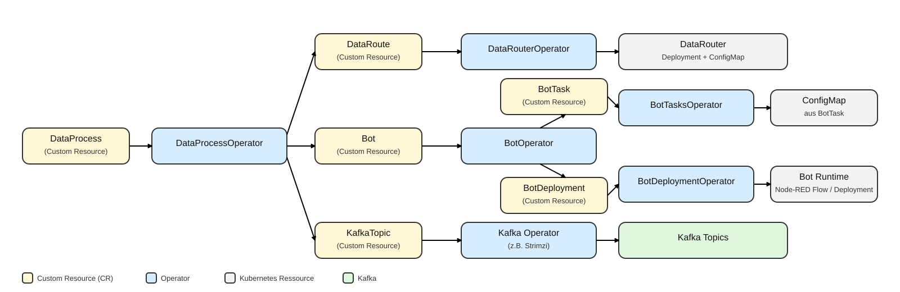

# Kubernetes Operatoren {#sec-002-k8s-operatoren}

In der EASY-Edge und Cloud Kubernetes Umgebung werden sogenannte Kubernetes Operatoren eingesetzt, um wiederkehrende Betriebsaufgaben zuverlässig zu automatisieren. Dazu zählen das Ausrollen von Deployments, das Nachziehen von Konfigurationen, das Bereitstellen von Kafka Topics sowie der konsistente Betrieb von Agenten entlang der Datenpipeline. Der zentrale Gedanke ist dabei das *Reconcile*-Prinzip: Ein gewünschter Zustand wird in Kubernetes deklarativ beschrieben, und der Operator sorgt fortlaufend dafür, dass der tatsächliche Zustand im Cluster diesem Zielbild entspricht. Dies reduziert manuelle Eingriffe, erhöht die Nachvollziehbarkeit von Änderungen und unterstützt einen stabilen Betrieb auch bei häufigen Anpassungen.

## Operator Pattern im Überblick

Ein Kubernetes Operator ist konzeptionell ein Controller, der domänenspezifisches Wissen in das Cluster “einbettet”. Statt einzelne Deployments, ConfigMaps oder Topics manuell zu erstellen, wird eine fachliche Beschreibung als Ressource abgelegt (z. B. “diese Daten sollen so geroutet werden” oder “dieser Bot soll mit dieser Konfiguration laufen”). Der Operator:

-   beobachtet relevante Ressourcen (inkl. Custom Resources),
-   leitet daraus die benötigten Kubernetes-Bausteine ab (z. B. Deployments, ConfigMaps),
-   führt Änderungen kontrolliert nach und hält den Zustand konsistent (Reconcile Loop).

Für den Betrieb in der EASY Kubernetes Umgebung ist wichtig, dass dieser Mechanismus idempotent ausgelegt ist: Der Operator kann denselben gewünschten Zustand mehrfach “reconciliieren”, ohne dass inkonsistente Nebenwirkungen entstehen. Das ist eine zentrale Voraussetzung für robuste Automatisierung in dynamischen Umgebungen.

## Implementierung mit dem Kopf Framework

Die Operatoren sind in Python mit dem Framework **Kopf** umgesetzt. Kopf bietet einen pragmatischen Rahmen, um projektspezifische Kubernetes-Ressourcen zu überwachen und daraus automatisiert Aktionen abzuleiten. Technisch reagiert ein Operator auf Ereignisse wie “Anlegen”, “Ändern” oder “Löschen” einer Ressource und führt daraufhin die notwendigen Schritte aus, um den gewünschten Zustand herzustellen. Für den Betrieb ist insbesondere relevant, dass Fehlerfälle abgefangen und wiederholt versucht werden können (Retry/Backoff), sodass auch temporäre Störungen (z. B. nicht erreichbare Abhängigkeiten) robuster behandelt werden.

Ein weiterer Vorteil ist die klare Trennung zwischen fachlicher Spezifikation und technischer Umsetzung: Anwender:innen arbeiten mit einer vergleichsweise kompakten Beschreibung (Custom Resource), während der Operator die wiederkehrenden Details (z. B. Labels, OwnerReferences, Namenskonventionen, Verkettung von Ressourcen) automatisiert erzeugt.

## Operatoren im EASY-Kontext

Die Operatoren in der EASY Kubernetes Umgebung sind entlang der Datenpipeline und der Agent-Ausführung organisiert. Sie übersetzen deklarative Beschreibungen (Custom Resources) in konkrete Kubernetes-Bausteine wie Deployments, ConfigMaps oder Topics. Damit wird aus einer fachlich verständlichen Spezifikation schrittweise eine lauffähige Konfiguration, die im Cluster konsistent umgesetzt wird.

## Beispielhafte Ressourcen (vereinfacht)

Um das Prinzip zu verdeutlichen, zeigt das folgende YAML-Beispiel ein schematisches Beispiel einer “Wunschbeschreibung” als `DataProcess`. Die konkreten Feldnamen können je nach Projektstand variieren; entscheidend ist das Muster: Aus einer kompakten Beschreibung erzeugt der Operator die technischen Ressourcen.

``` {#lst-dataproc-schematic .yaml caption="Schematisches Beispiel einer DataProcess-Ressource (vereinfacht)."}
apiVersion: easy/v1
kind: DataProcess
metadata:
  name: ifw-monitoring
spec:
  inputTopic: "ifw.raw"
  bots:
    - name: threshold-monitor
      outputTopic: "ifw.monitor.events"
    - name: ml-agent
      outputTopic: "ifw.ml.results"
```

Ähnlich gilt für Bot-Konfigurationen: Eine deklarative `BotTask`-Beschreibung (z. B. Schwellenwerte, Topics, Feature-Auswahl) wird vom BotTasksOperator in eine ConfigMap materialisiert, die der Agent zur Laufzeit einliest (siehe @sec-002-demo-planung-monitoring-agent).

**DataProcessOperator**

Der DataProcessOperator verarbeitet `DataProcess`-Ressourcen und orchestriert daraus eine vollständige Datenverarbeitung. Dazu gehören insbesondere das Anlegen bzw. Aktualisieren von Routing-Beschreibungen (`DataRoute`), das Erzeugen der benötigten Agent-/Bot-Beschreibungen (`Bot`) sowie das Bereitstellen der erforderlichen Kafka Topics. Aus Anwendersicht fungiert er damit als Einstiegspunkt: Eine Datenverarbeitung wird einmal beschrieben, und die dafür nötigen Cluster-Ressourcen werden automatisch vorbereitet.

**DataRouterOperator**

Der DataRouterOperator verarbeitet `DataRoute`-Ressourcen und stellt sicher, dass ein DataRouter im Cluster läuft und entsprechend konfiguriert ist. Er erzeugt bzw. aktualisiert dazu unter anderem ein Deployment und eine ConfigMap für die Laufzeitkonfiguration. Auf diese Weise wird das Routing von Datenströmen reproduzierbar und nachvollziehbar abgebildet, ohne dass jedes Detail manuell im Cluster gepflegt werden muss.

**BotOperator**

Der BotOperator verarbeitet `Bot`-Ressourcen und trennt die Bot/Agent-Beschreibung in zwei klar abgegrenzte Teile: das Ausroll-Artefakt (`BotDeployment`) und die Task-Konfiguration (`BotTask`). Diese Trennung unterstützt ein verständliches Betriebsmodell: *Wie* ein Bot bereitgestellt wird (z. B. Node-RED Flow oder Container-Image) ist unabhängig davon, *mit welchen Parametern* er arbeiten soll (z. B. Regeln, Topics, Schwellenwerte). Änderungen an Parametern können dadurch gezielt erfolgen, ohne die Bereitstellung neu aufzusetzen.

**BotTasksOperator**

Der BotTasksOperator verarbeitet `BotTask`-Ressourcen und materialisiert deren Inhalt als Kubernetes ConfigMap. Diese ConfigMap enthält typischerweise Eingangs- und Ausgangskanäle sowie weitere Parameter (z. B. Grenzwerte oder Regeldefinitionen) und wird von Agenten zur Laufzeit eingelesen. Dadurch wird Konfiguration als Teil des Systems transparent versionierbar und kann unabhängig vom Code gepflegt werden.

**BotDeploymentOperator**

Der BotDeploymentOperator verarbeitet `BotDeployment`-Ressourcen und rollt die eigentliche Bot-Implementierung aus. Abhängig vom Artefakt-Typ werden beispielsweise Node-RED Flows in eine laufende Node-RED Instanz übertragen oder klassische Kubernetes Deployments für Container-Images erstellt bzw. aktualisiert. Damit wird der technische Betriebsschritt des Ausrollens standardisiert und wiederholbar.

Hinweis: Kafka Topics können im Cluster ebenfalls deklarativ bereitgestellt werden (z. B. über `KafkaTopic`-Ressourcen wie sie von gängigen Kafka-Operatoren unterstützt werden). In EASY wird dieses Prinzip genutzt, um Topics konsistent zu verwalten, ohne dass sie manuell “nebenher” angelegt werden müssen.

## Zusammenspiel der Operatoren

Im typischen Betrieb beschreibt ein **DataProcess** die gewünschte Verarbeitung (z. B. Routing, beteiligte Bots, benötigte Topics). Der DataProcessOperator erzeugt daraus die passenden `DataRoute`- und `Bot`-Ressourcen sowie die erforderlichen Topics. Der BotOperator leitet für jeden Bot die Ressourcen `BotDeployment` (Bereitstellung) und `BotTask` (Konfiguration) ab. Der BotTasksOperator überführt `BotTask` in eine ConfigMap, die von den Agenten zur Laufzeit gelesen wird. Der BotDeploymentOperator rollt anschließend das Artefakt aus (Node-RED Flow oder Kubernetes Deployment). Durch dieses Zusammenspiel entsteht eine klar nachvollziehbare Kette vom gewünschten Zielzustand bis zur laufenden Implementierung.

{#fig-easy-operatoren-uebersicht width="100%" fig-align="center"}

Der Ablauf lässt sich vereinfacht in fünf Schritten darstellen:

1.  Anwender:innen legen einen `DataProcess` an (deklarativ).
2.  DataProcessOperator erzeugt/aktualisiert daraus `DataRoute`, `Bot` und (falls erforderlich) Topics.
3.  BotOperator teilt jeden `Bot` in `BotDeployment` (Rollout) und `BotTask` (Konfiguration).
4.  BotTasksOperator schreibt die `BotTask`-Parameter in eine ConfigMap.
5.  BotDeploymentOperator bringt die Bot-Implementierung in den gewünschten Laufzustand.

Ein wichtiger Vorteil ist, dass Agenten ConfigMaps aktiv beobachten können und Konfigurationen ohne Redeploy übernehmen (siehe @sec-002-demo-planung-monitoring-agent). Damit lassen sich Anpassungen im Betrieb (z. B. Grenzwerte oder Routingparameter) kontrolliert und schnell umsetzen.

## Beispiel: Änderung an einer ConfigMap führt zu Live-Update im Agent

Eine besondere Stärke dieses Ansatzes ist, dass Anpassungen nicht als Codeänderung erfolgen, sondern als Konfigurationsänderung. Wird beispielsweise ein Grenzwert in einer ConfigMap aktualisiert, kann der betroffene Agent diese Änderung zur Laufzeit übernehmen und unmittelbar nach der neuen Vorgabe arbeiten. Der Ablauf lässt sich wie folgt beschreiben:

Typischerweise wird die ConfigMap nicht “direkt” editiert, sondern ergibt sich aus der deklarativen BotTask-Ressource: Eine Änderung an `BotTask` wird durch den BotTasksOperator in eine aktualisierte ConfigMap überführt. Der Agent überwacht die ConfigMap und lädt die neuen Regeln/Parameter, ohne dass sein Deployment geändert werden muss. Dieses Prinzip unterstützt schnelle Iterationen, insbesondere in Inbetriebnahmephasen mit häufigen Parameteranpassungen.