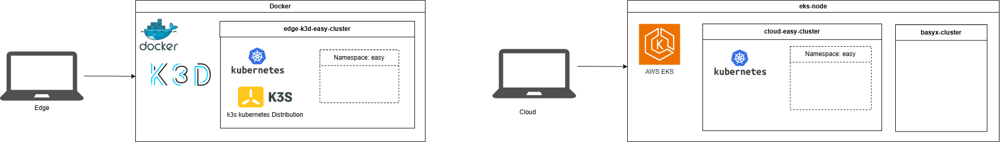

# Laufzeitumgebung und Architektur der EASY Edge-Cloud Umgebung {#sec-002_laufzeitumgebung_architektur_easy_cloud_edge}

In folgendem Kapitel wird die Architektur der EASY Edge und Cloud Komponenten skizziert und die einzelnen Komponenten beschrieben. Bevor genauer auf die Ergebnisse zur Architektur eingegangen wird, werden vorab die im Projekt gesetzten Rahmenbedingungen erläutert.

\
Folgende Ziele und Rahmenbedingungen wurden im Rahmen der Implementierung einer Edge-Cloud fähigen Laufzeitumgebung gesetzt:

-   **Dynamische Ausführbarkeit von Diensten**\
    Analyse- und Produktionsdienste sollen innerhalb eines Edge-Cloud-Kontinuums flexibel deploybar und skalierbar sein

-   **Geringer Ressourcenverbrauch auf Edge-Geräten**\
    Da Edge-Hardware oft limitiert ist (CPU, RAM, Speicher), muss die Laufzeitumgebung besonders leichtgewichtig und effizient sein. Das System soll in einer ressourcenstarken Cloud, auf einem Far-Edge oder ressourcenschwachen Edge lauffähig sein.

-   **Datensicherheit und Datenschutz**\
    Sensible Daten sollen möglichst lokal (on Edge) verarbeitet werden, um Latenzen zu reduzieren und Datenschutzanforderungen einzuhalten. Die Kommunikation zwischen Edge und Cloud soll gesichert sein.

-   **Multicluster-Fähigkeit**\
    Das System soll mehrere Cluster (Cloud und Edge) parallel verwalten und orchestrieren können.

-   **Hohe Verfügbarkeit und Resilienz**\
    Dienste sollen auch bei Netzwerkunterbrechungen zwischen Edge und Cloud weiterhin funktionsfähig bleiben.

-   **Monitoring und Observability**\
    Eine durchgängige Überwachung der Systemzustände, Ressourcen und Dienste ist erforderlich.

-   **Portabilität und Plattformunabhängigkeit**\
    Die Lösung soll auf unterschiedlichen Betriebssystemen und Umgebungen lauffähig sein.

-   **EASY Edge und Cloud bestehen grundlegend aus Open-Source Komponenten**

## Grundlegendes Systemdesign

Die implementierte Laufzeitumgebung basiert auf der Container-Orchestrierungs-plattform Kubernetes [^laufzeitumgebung_architektur_easy_cloud_edge-1]. Kubernetes ermöglicht die automatisierte Bereitstellung, Skalierung und Verwaltung containerisierter Anwendungen und bildet die Grundlage für die flexible Verteilung der Analyse- und Produktionsdienste.

[^laufzeitumgebung_architektur_easy_cloud_edge-1]: <https://kubernetes.io/>

Das System ist als verteilte Architektur ausgelegt, bestehend aus mindestens einem Cloud-Cluster und mehreren Edge-Clustern. Der Cloud-Cluster ist für die zentrale Steuerung, langfristige Datenverarbeitung oder ressourcenintensiven Analysen zuständig und bietet auch eine zentrale Bereitstellung der Verwaltungsschalen. Zudem werden in der Cloud die Repositories und Registries zur Verfügung gestellt. Die Edge-Cluster sind maschinen- und datenquellen nah positioniert, fokussieren die lokale Verarbeitung von Daten und garantieren damit eine geringere Latenz und erhöhte Datensouveränität. Alle Cluster arbeiten unabhängig und kommunizieren bei Bedarf (Verteilung Workloads, Analysen, ...) miteinander. Das System ist in solcher Weise implementiert, dass es auf verschiedenen Ebenen generisch deployed werden kann. So kann das System auch Multi-Level Near- und Far-Edge zum Einsatz kommen, zusätzlich auf einem bspw. firmeninternen Server und letztlich auch in einer zentralen Cloud.

Zu Projektbeginn wurde die Umsetzung einer Multi-Cloud-Cluster-Architektur diskutiert. Dieser Ansatz wurde jedoch verworfen, da moderne Cloud-Plattformen bereits innerhalb einer einzelnen Cloud-Umgebung eine bedarfsgerechte Skalierung von Ressourcen ermöglichen. Eine Verteilung von Workloads über mehrere Cloud-Anbieter hinweg hätte für die betrachteten Anwendungsfälle keinen zusätzlichen Nutzen geboten, jedoch die Komplexität und den Betriebsaufwand deutlich erhöht. Stattdessen wurde die Plattform cloudagnostisch ausgelegt, sodass Anwendungen und Dienste flexibel auf unterschiedlichen Cloud- und Edge-Infrastrukturen betrieben und bei Bedarf migriert werden können. Im Ausblick in @sec-ausblick wird jedoch die Anbindung an industrielle Datenräume betrachtet, um eine sichere und standardisierte Vernetzung von Unternehmen, Produktionsstandorten und Dienstanbietern über Organisations- und Infrastrukturgrenzen hinweg zu ermöglichen.

**Kubernetes-Distribution: k3s**

In der konkreten Umsetzung kommt, insbesondere auf den Edge-Systemen, die leichtgewichtige Kubernetes-Distribution k3s zum Einsatz. Diese ist speziell für ressourcenbeschränkte Umgebungen optimiert und zeichnet sich durch einen reduzierten Ressourcenbedarf, vereinfachte Installation und Wartung und Integration zentraler Kubernetes-Komponenten in kompakter Form aus. Dadurch eignet sich k3s besonders für den Einsatz auf Edge-Geräten.

**Containerisierte Cluster in k3d**

Zum Einsatz auf den Edge-Geräten, zur lokalen Entwicklung und zum Testen der Cluster wird k3d verwendet. k3d ermöglicht das Ausführen von k3s-Clustern innerhalb von Docker-Containern. Dies bietet eine schnelle und leichtgewichtige Bereitstellung von Kubernetes-Umgebungen, welche reproduzierbare Cluster-Konfigurationen und einen geringen Ressourcenverbrauch aufweisen. Durch k3d können prinzipiell mehrere Kubernetes-Cluster aufgesetzt werden, aufgrund der Ressourcen-beschränkungen wird auf der Edge ein k3d-Cluster aufgesetzt.

**Docker als Container-Laufzeitumgebung**

Die Grundlage für die Ausführung von k3d bildet Docker. Docker stellt die Container-Laufzeit-umgebung bereit, in der die Kubernetes-Komponenten ausgeführt werden. Docker wird auf unterschiedlichen Betriebssystemen (Windows, macOS, Linux) unterstützt, schafft eine Isolation der Anwendungen und somit konsistente Laufzeitumgebungen.

Für das Deployment on Edge (und für lokale Entwicklungszwecke) werden plattformübergreifende Tools wie Rancher Desktop oder Docker Desktop eingesetzt. In der Cloud werden innerhalb virtueller Maschinen (EC2-Instanzen) Kubernetes Cluster deployed, bspw. Amazon AWS EKS (Elastic Kubernetes Service), Microsoft Azure Kubernetes Service (AKS), Google Kubernetes Engine (GKE).

Die implementierte Laufzeitumgebung kombiniert eine leichtgewichtige Kubernetes-Distribution mit containerbasierten Entwicklungswerkzeugen, um eine flexible, skalierbare und ressourceneffiziente Cloud-Edge-Architektur zu realisieren. Durch die Trennung in Cloud- und Edge-Cluster sowie die Nutzung standardisierter Technologien wird sowohl eine hohe Portabilität als auch eine einfache Erweiterbarkeit des Systems gewährleistet. In folgendem Abbild wird die grundlegende Kubernetes Architektur skizziert:

**Deployment der Dienste innerhalb der Edge und Cloud Cluster**

Innerhalb der Kubernetes-Cluster erfolgt die Ausführung der verschiedenen Dienste und Anwendungen in Abhängigkeit von der jeweils verfügbaren Ressourcenbeschaffenheit der zugrunde liegenden Infrastruktur. Dabei wird gezielt berücksichtigt, dass Edge-Knoten typischerweise über deutlich eingeschränktere Ressourcen verfügen als Cloud-Umgebungen. Entsprechend werden leichtgewichtige, latenzkritische Dienste bevorzugt am Edge betrieben, während rechenintensive oder zentral koordinierende Anwendungen in der Cloud ausgeführt werden.

## Dienste in der EASY Edge-Cloud-Umgebung

Die folgende Abbildung veranschaulicht die Verteilung zentraler Pods und Services innerhalb der Edge- und Cloud-Cluster:

In dieser Architektur übernehmen Edge-Cluster vor allem Aufgaben der Datenerfassung, Protokollverarbeitung und Voraggregation. Dienste wie ein MQTT-Broker ermöglichen hierbei eine effiziente Kommunikation mit angebundenen Geräten und die Kommunikation aggregierter Ergebnisdaten in die Cloud. In der Cloud hingegen werden die Daten zentral gesammelt, persistent gespeichert und weiterverarbeitet. Zusätzlich sind dort Monitoring- und Visualisierungskomponenten angesiedelt, die einen systemweiten Überblick ermöglichen.

Zu den eingesetzten Kernkomponenten auf der Edge und in der Cloud zählt unter anderem das leichtgewichtige Messaging-Protokoll MQTT welches insbesondere für die Kommunikation in IoT-nahen Edge-Szenarien geeignet ist. Für die Verarbeitung und Kurzzeit-Persistierung größerer Datenströme kommt Kafka zum Einsatz, das eine skalierbare und fehlertolerante Streaming-Plattform bereitstellt. Ergänzend wird Node-RED verwendet, um Datenflüsse visuell zu modellieren und insbesondere am Edge flexibel anzupassen. Die Überwachung und Visualisierung von Systemzuständen erfolgt schließlich über Grafana, wodurch eine transparente Beobachtbarkeit der gesamten Infrastruktur gewährleistet wird. Speziell implementierte Datenrouter gewährleisten den Datenfluss zwischen den verschiedenen Kernkomponenten.

Im folgenden Abschnitt wird näher auf die einzelnen Services eingegangen und deren jeweilige Funktion sowie Integration innerhalb der beschriebenen Edge-Cloud-Architektur detaillierter erläutert.

**MQTT Mosquitto Broker**[^laufzeitumgebung_architektur_easy_cloud_edge-2]

[^laufzeitumgebung_architektur_easy_cloud_edge-2]: <https://mosquitto.org/>

Eclipse Mosquitto ist ein leichtgewichtiger MQTT-Broker, der für die zuverlässige Kommunikation zwischen Edge-Geräten und der Cloud eingesetzt wird. Er implementiert das Publish/Subscribe-Prinzip und eignet sich besonders für ressourcenarme Umgebungen bspw. auf Edge-Knoten. Im vorliegenden System übernimmt Mosquitto die Rolle der ersten Schnittstelle und Datensammelinstanz. Der MQTT-Broker wird ohne Persistenz verwendet, d.h. es werden keine Nachrichten dauerhaft gespeichert. Durch ein per Konvention festgelegtes Topic-Bennenungsschema werden Daten, bspw. von Sensoren aufgenommen, über ein "Source"-Topic in die EASY-Edge Umgebung gesendet und Ergebnisse wiederum nach außen an ein "Sink" MQTT Topic versendet. Für die Kommunikation zwischen mehreren Edge-Devices und zur Cloud muss das Benennungsschema bei Bedarf mit einer (eindeutigen) Device-ID erweitert werden, sodass das Routing jeweils eindeutig durchgeführt werden kann. So ergeben sich zum Beispiel Topic-Benennungsschema wie: *"\<deviceID-1\>/source", "\<deviceID-1\>/sink",* *"\<deviceID-2\>/source/sensor1", "\<deviceID-2\>/sink", "\<cloud-1\>/sink", ...*

**Kafka**[^laufzeitumgebung_architektur_easy_cloud_edge-3]

[^laufzeitumgebung_architektur_easy_cloud_edge-3]: <https://kafka.apache.org/>

Kafka (Apache Kafka) dient als zentrale Streaming-Plattform für die Verarbeitung großer Datenmengen. Es ermöglicht die persistente Speicherung und Weiterleitung von Datenströmen in Echtzeit und asynchrones Verarbeiten dieser Daten. Kafka wird auf der Edge und in der Cloud als erste Persistierungsschicht eingesetzt. Die "von außen" am MQTT-Broker ankommenden Daten werden über die MQTT-2-Kafka (M2K) und Kafka-2-MQTT (K2M) Datarouter nach Kafka weitergeleitet und dort persistiert. Auf der Edge wird aufgrund begrenzter Ressourcen eine geringere *Retention-Time (bspw. 20 Minuten) konfiguriert.* Im Cloud-Cluster betrieben, wo ausreichend Ressourcen vorhanden sind, kann eine längere Retention-Time (bspw. mehrere Monate) verwendet werden und zusätzlich mit mehreren *Replica* zur Erhöhung der Ausfallsicherheit, Skalierung und hohe Durchsatzraten das System angepasst werden. Durch Topics und Partitionierung können Daten effizient organisiert werden. Dies bildet die Grundlage für nachgelagerte Analyseprozesse.

**Kafka UI**[^laufzeitumgebung_architektur_easy_cloud_edge-4]

[^laufzeitumgebung_architektur_easy_cloud_edge-4]: <https://github.com/provectus/kafka-ui>

Kafka UI ist eine webbasierte Oberfläche zur Verwaltung und Überwachung von Kafka-Clustern. Sie ermöglicht das Einsehen von Topics, Partitionen und Nachrichtenströmen. Darüber hinaus können Nachrichten direkt inspiziert und getestet werden. Dies erleichtert Debugging und Systemanalyse erheblich.

**MQTT-2-Kafka und Kafka-2-MQTT Datarouter**

Zwei eigens entwickelte Datarouter sorgen dafür, dass die Daten von MQTT nach Kafka bzw. von Kafka nach MQTT geroutet werden. Durch Topic-Filterung wird der Inhalt nur von explizit vorkonfigurierten Topics weitergeleitet. Zudem findet ein Re-Mapping der Topic-Namen statt. Das MQTT Topic-Benennungsschema kann nicht direkt für Kafka übernommen werden, da "/" (Slash) als Zeichen in Kafka Topic-Namen nicht zulässig sind. Daher wird das Slash-Zeichen in den Dataroutern durch "..." ersetzt (bspw. *"\<deviceID-2\>...source...sensor1").* Die Nachrichteninhalte werden als JSON-Objekte erwartet und weitgehend unverändert übernommen. JSON-Nachrichten, welche in einer Liste empfangen werden, werden vereinzelt und als einzelne Elemente nach Kafka geschrieben. Optional kann in den Dataroutern eine JSON-Schema[^laufzeitumgebung_architektur_easy_cloud_edge-5] Validierung aktiviert werden, welche das Datenformat der empfangenen Nachrichten überprüft.

[^laufzeitumgebung_architektur_easy_cloud_edge-5]: <https://json-schema.org/>

**Node-RED**[^laufzeitumgebung_architektur_easy_cloud_edge-6]

[^laufzeitumgebung_architektur_easy_cloud_edge-6]: <https://nodered.org/>

Node-RED ist ein visuelles Entwicklungswerkzeug und Low-Code Plattform zur Erstellung von Datenflüssen, sogenannten *Flows*. Es ermöglicht die einfache Integration und Transformation von Daten aus unterschiedlichen Quellen. Besonders im Edge-Bereich wird Node-RED genutzt, um Daten lokal vorzuverarbeiten. Durch die grafische Oberfläche können auch komplexe Logiken schnell implementiert werden. Dies erleichtert die Anpassung an unterschiedliche Anwendungsfälle. Durch die grafische Benutzeroberfläche wird somit auch ein niederschwelliger Zugang für Experten aus anderen Disziplinen ermöglicht. Demnach wird Node-RED auch in der Cloud eingesetzt. Es wurden diverse Node-RED Flows zur Transformation und Analyse von Datenströmen implementiert (siehe @sec-002-demo-planung-monitoring-agent). Durch Plugins wie Node-RED Dashboard 2.0 können auch einfache HMIs implementiert werden und Ergebnisdaten der Flows visualisiert werden.

**Kubernetes Dashboard**[^laufzeitumgebung_architektur_easy_cloud_edge-7]

[^laufzeitumgebung_architektur_easy_cloud_edge-7]: <https://kubernetes.io/docs/tasks/access-application-cluster/web-ui-dashboard/>

Das Kubernetes Dashboard stellt eine grafische Benutzeroberfläche zur Verwaltung von Kubernetes-Clustern bereit. Es ermöglicht die Überwachung von Pods, Deployments und anderen Ressourcen. Darüber hinaus können administrative Aufgaben direkt über die Oberfläche durchgeführt werden. Dies erleichtert insbesondere die Fehleranalyse und das Debugging. Das Dashboard wird sowohl für Cloud- als auch Edge-Cluster eingesetzt.

**Grafana**[^laufzeitumgebung_architektur_easy_cloud_edge-8]

[^laufzeitumgebung_architektur_easy_cloud_edge-8]: [**https://grafana.com/**](https://grafana.com/){.uri}

Grafana wird zum einen zur Visualisierung von Metriken und Systemzuständen eingesetzt. Es ermöglicht die Erstellung interaktiver Dashboards für Monitoring-Daten. Datenquellen wie Zeitreihendatenbanken können direkt angebunden werden. Dadurch entsteht eine zentrale Übersicht über die gesamte Systemlandschaft. Zum anderen wird Grafana auch zur Visualisierung der Ergebnisdaten aus den Node-RED Flows verwendet. In Dashboards werden so bspw. Live-Sensordaten oder deren Auswertung bezüglich etwaiger Anomalien dargestellt.

**MinIO**[^laufzeitumgebung_architektur_easy_cloud_edge-9]

[^laufzeitumgebung_architektur_easy_cloud_edge-9]: [**https://www.min.io/**](https://www.min.io/){.uri}

MinIO ist ein S3-kompatibler Objektspeicher, der für die persistente Ablage von Daten verwendet wird. Er eignet sich besonders für große, unstrukturierte Datenmengen. Im System wird MinIO beispielsweise für Rohdaten oder ML-Artefakte genutzt. Zum Beispiel werden die zugrundeliegenden Trainingsdaten für ein Föderiertes Lernen in MinIO Buckets abgelegt. Durch seine Skalierbarkeit kann MinIO sowohl im Edge- als auch im Cloud-Umfeld betrieben werden.

**PostgreSQL**

PostgreSQL ist ein leistungsfähiges relationales Datenbanksystem zur strukturierten Datenspeicherung. Es wird für transaktionale Daten und Metadaten eingesetzt. Im System übernimmt PostgreSQL zentrale Persistenzaufgaben für verschiedene Services. Die Integration erfolgt containerisiert innerhalb der Kubernetes-Umgebung.

**InfluxDB**[^laufzeitumgebung_architektur_easy_cloud_edge-10]

[^laufzeitumgebung_architektur_easy_cloud_edge-10]: [**https://www.influxdata.com**](https://www.influxdata.com){.uri}

InfluxDB ist eine spezialisierte Datenbank für Zeitreihendaten. Sie wird insbesondere zur Speicherung von Sensordaten und Monitoring-Metriken eingesetzt. Durch ihre optimierte Struktur ermöglicht sie effiziente Schreib- und Lesezugriffe auf Zeitreihendaten. InfluxDB wird vor allem im Cloud-Kontext genutzt, auf der Edge nur bei Bedarf und ausreichenden Rechenressourcen (siehe auch Definition der "EASY-Cluster-Service-Availability-Classes", @sec-easy-cluster-service-classes)

**Telegraf**[^laufzeitumgebung_architektur_easy_cloud_edge-11]

[^laufzeitumgebung_architektur_easy_cloud_edge-11]: [**https://github.com/influxdata/telegraf**](https://github.com/influxdata/telegraf){.uri}

Telegraf ist ein Agent zur Sammlung und Weiterleitung von Daten. Er unterstützt eine Vielzahl von Input- und Output-Plugins. Dadurch können Daten aus unterschiedlichen Quellen aggregiert werden. Im System wird Telegraf zur Erfassung von System- und Anwendungsmetriken und Anbindung unterschiedlicher Sensor-Schnittstellen eingesetzt. Die gesammelten Daten werden anschließend an Datenbanken wie InfluxDB weitergeleitet.

**Keycloak**[^laufzeitumgebung_architektur_easy_cloud_edge-12]

[^laufzeitumgebung_architektur_easy_cloud_edge-12]: [**https://www.keycloak.org/**](https://www.keycloak.org/){.uri}

Keycloak ist eine Open-Source-Lösung für Identity- und Access-Management. Es ermöglicht die zentrale Verwaltung von Benutzerkonten und Zugriffsrechten. Im System sorgt Keycloak für die Absicherung von Diensten und APIs aus der Edge oder in der Cloud. Dadurch wird eine konsistente Authentifizierung und Autorisierung gewährleistet.

**Label Studio**[^laufzeitumgebung_architektur_easy_cloud_edge-13]

[^laufzeitumgebung_architektur_easy_cloud_edge-13]: [**https://labelstud.io/**](https://labelstud.io/){.uri}

Label Studio ist ein Tool zur Annotation und Aufbereitung von Daten. Es wird insbesondere im Kontext von Machine-Learning Anwendungen eingesetzt. Nutzer können Daten manuell labeln und für Trainingsprozesse vorbereiten, was eine wichtige Voraussetzung für überwachte Lernverfahren ist. Im System wird es Cloud-seitig zur Vorbereitung von Trainingsdatensätzen als Grundlage für das Föderierte Lernen eingesetzt.

**MLflow**[^laufzeitumgebung_architektur_easy_cloud_edge-14]

[^laufzeitumgebung_architektur_easy_cloud_edge-14]: <https://mlflow.org/>

MLflow ist eine Plattform zur Verwaltung des gesamten Machine-Learning Lebenszyklus. Sie ermöglicht das Tracking von Experimenten, das Speichern von Modellen und deren Versionierung. Darüber hinaus unterstützt MLflow das Deployment von Modellen, welche zuvor im MinIO Backend persistiert werden. Im System wird es zur Organisation und Nachvollziehbarkeit von ML-Prozessen im Föderierten Lernkontext eingesetzt.

**Zammad**[^laufzeitumgebung_architektur_easy_cloud_edge-15]

[^laufzeitumgebung_architektur_easy_cloud_edge-15]: <https://zammad.com/> , <https://github.com/zammad/zammad>

Zammad wird als webbasiertes Ticket-System zur Verwaltung von Supportanfragen und Störungen Cloud-seitig eingesetzt. Es ermöglicht eine strukturierte Nachverfolgung von Problemen im Betrieb. Probleme, welche auf der Edge detektiert und in einem Event resultieren, können somit in ein Ticket-System zur weiteren Problembehandlung überführt werden.

**Eclipse BaSyx**[^laufzeitumgebung_architektur_easy_cloud_edge-16]

[^laufzeitumgebung_architektur_easy_cloud_edge-16]: <https://basyx.org/>

Eclipse BaSyx wird im Cloud-Cluster als zentrale Middleware für die Umsetzung von Industrie-4.0-Konzepten eingesetzt. Es ermöglicht die Verwaltung und Bereitstellung von Asset Administration Shells (AAS), welche digitale Zwillinge von physischen Assets repräsentieren. Dadurch können Daten und Funktionen standardisiert beschrieben und systemübergreifend genutzt werden. BaSyx übernimmt im System insbesondere die Integration und Orchestrierung von Asset-bezogenen Informationen aus den Edge-Clustern. Technische Geräte, Maschinen, aber auch Teile von Software-Services oder des EASY-Edge Frameworks werden als Verwaltungsschale innerhalb von Submodellen modelliert und beschrieben. Somit bildet es eine wichtige Grundlage für interoperable und skalierbare Beschreibung und Steuerung von Assets und Anwendungen innerhalb der Gesamtarchitektur.

**Containerisierte Anwendungen für Analyse und Produktionssteuerung**

Neben den zuvor beschriebenen Basisdiensten werden innerhalb der Kubernetes-Umgebung auch spezifische, containerisierte Anwendungen zur Analyse und Steuerung von Produktionsprozessen betrieben. Diese Anwendungen sind als Docker-Images umgesetzt und können somit standardisiert, portabel und reproduzierbar in unterschiedlichen Clustern mit konsistenter Ausführung unabhängig von der zugrunde liegenden Infrastruktur bereitgestellt werden. Neben den in Node-RED implementierten Agenten und Flows besteht hierüber die Möglichkeit weitere Services und Agenten zu integrieren.

Die Deployment-Prozesse erfolgen über Kubernetes wodurch eine flexible Skalierung sowie eine automatisierte Verwaltung der Anwendungen gewährleistet wird. Je nach Ressourcenanforderung und Einsatzzweck können diese Anwendungen sowohl im Edge- als auch im Cloud-Cluster ausgeführt werden.

Im folgenden @sec-002_datenpipeline wird auf das Zusammenspiel und die Abhängigkeiten zwischen den einzelnen Services im Rahmen der Beschreibung der Datenpipeline eingegangen.

## EASY-Cluster-Service-Availability-Classes {#sec-easy-cluster-service-classes}

Zur systematischen Steuerung dieser Verteilung wurden sogenannte "EASY-Cluster-Service-Avail-ability-Classes" definiert. Diese beschreiben unterschiedliche Klassen von Ressourcenverfügbarkeiten innerhalb der Clusterlandschaft, bilden diese auf die Klassen "Low, Middle, High, High-End" ab und sind somit die Grundlage für Scheduling- und Skalierungsentscheidungen im Cluster und Dienste Deployment. Zusätzlich werden je Klasse noch bei Bedarf die jeweiligen Komponenten für Federated Learning (Flower-Client, Flower-Server, MinIO, ML-Flow) gesondert integriert. Während Edge-Cluster mit niedriger Ressourcenausstattung primär für Datenerfassung und einfache Vorverarbeitung vorgesehen sind, können leistungsfähigere Edge-Knoten bereits erste Analyseaufgaben übernehmen. Die Cloud-Cluster hingegen stellen umfangreiche Rechen- und Speicherkapazitäten bereit und sind für komplexe Datenverarbeitung sowie zentrale Dienste ausgelegt. Eine übersichtliche tabellarische Darstellung dieser Klassifikation wird im Folgenden dargestellt:

Die Zuordnung von Anwendungen zu den jeweiligen Clustern erfolgte auf Abschätzung der minimalen (requests) und maximalen (limits) Anforderungen bez. CPU, RAM und Storage der jeweiligen Dienste und wie diese skaliert werden können. Aufgrund dieser Zuordnung können abhängig der Klassenbezeichnungen durch Kubernetes Methoden die Cluster bestückt werden.