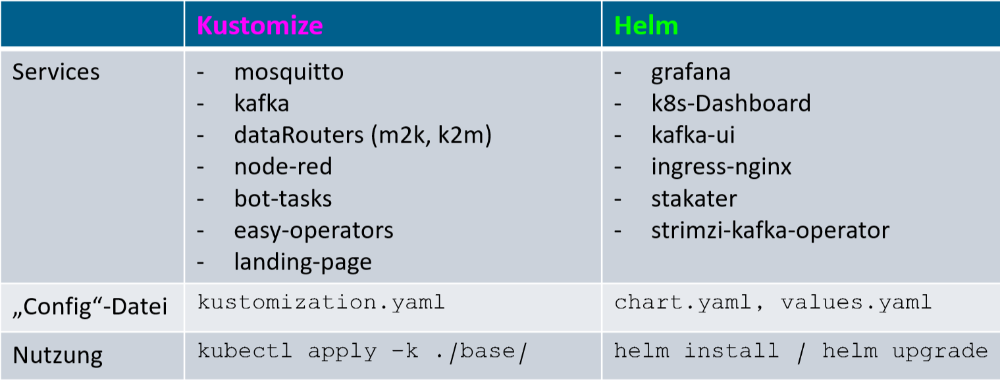
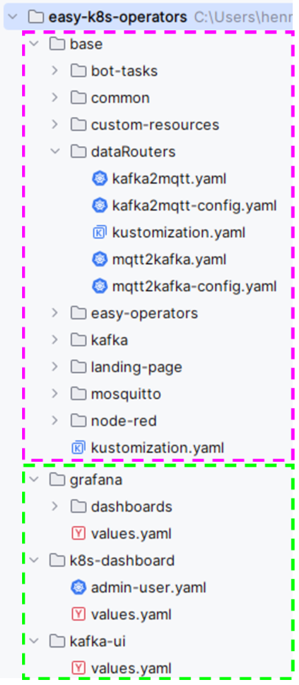
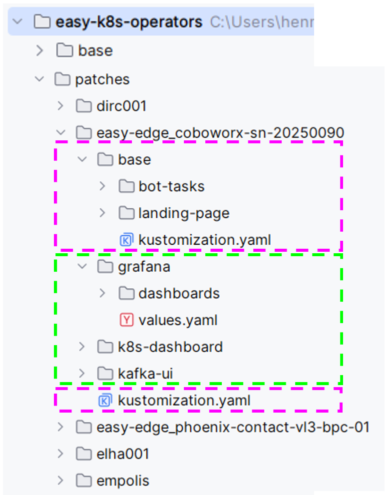
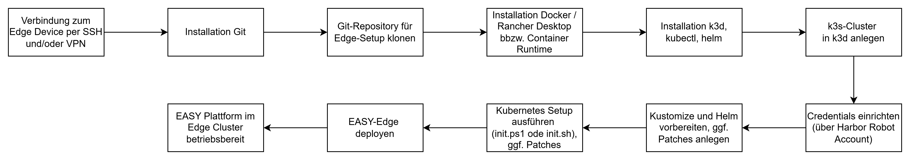
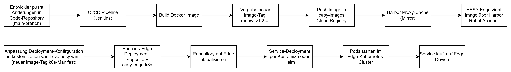
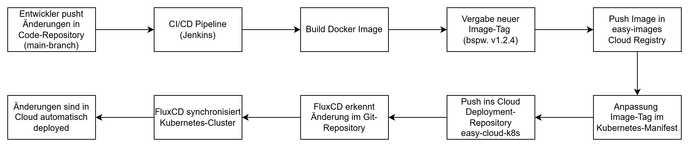

# Service Federation {#sec-002-service-federation}

In diesem Kapitel wird beschrieben, wie und in welcher Struktur die EASY-Edge und EASY-Cloud Code Ressourcen verwaltet werden und wie die Verteilung und das Deployment der einzelnen Services durchgeführt wird.

## Setup EASY Edge Umgebung

Die EASY Plattform basiert auf einer Kubernetes Architektur, wie in @sec-002_laufzeitumgebung_architektur_easy_cloud_edge beschrieben. Somit erfolgt das Deployment der Services auf einem Edge Device über ein lokal betriebenes Kubernetes-Cluster. Die Kubernetes-Infrastruktur stellt dabei eine standardisierte Laufzeitumgebung bereit, in der Services containerisiert ausgeführt, aktualisiert und verwaltet werden können. Der Fokus liegt auf einer reproduzierbaren Installation, einer einfachen Wartbarkeit sowie der Möglichkeit, Services abhängig von den Ressourcen und Anforderungen des jeweiligen Edge Devices anzupassen.

Die Kubernetes-Manifeste werden zentral in einem Git-Repository "easy-k8s-operators" (Abkürzung k8s für kubernetes) verwaltet. Darin befinden sich sowohl die Deployment-Beschreibungen der einzelnen Services als auch Initialisierungsskripte für das grundlegende Kubernetes-Setup. Diese Skripte sind als Bash- und PowerShell-Skripte umgesetzt und automatisieren wiederkehrende Einrichtungsschritte. Dadurch kann das Setup auf unterschiedlichen Edge Devices konsistent und nachvollziehbar durchgeführt werden.

Das Setup auf dem Edge Device beginnt mit der Installation der benötigten Programme wie PowerShell in Windows-Betriebssystemen oder Bash in Linux-basierten Betriebssystemen, docker (Rancher-Desktop oder Docker-Desktop), kubectl, helm und git, um das zentrale Repository auf das Zielsystem zu klonen. Anschließend wird k3d installiert, sodass ein leichtgewichtiges k3s-basiertes Kubernetes-Cluster innerhalb einer Docker-Umgebung angelegt werden kann. Über das Teilskript `init_k3d_setup.ps1` wird ein initialer Kubernetes Clusters mithilfe von k3d erstellt. Anschließend werden die benötigten Credentials eingerichtet, damit das Edge Device Zugriff auf geschützte Ressourcen wie Container-Images erhält.

Im weiteren Verlauf werden die Kubernetes-Konfigurationen vorbereitet. Dazu gehören die Einrichtung von Kubernetes Kustomize-basierten Konfigurationen sowie die Installation und Vorbereitung von Helm. Diese Schritte werden über das Initialisierungsskript `init.ps1` automatisiert. Für jeden Service existiert entweder eine Kustomize-Konfiguration oder ein Helm-Chart beziehungsweise ein entsprechendes Installationsskript. Dadurch können Services einzeln, reproduzierbar und bei Bedarf angepasst deployed werden. Die aufgezeigten Powershell `xxx.ps1` Skripte (Windows) wurden auch analog als Bash-Skripte für Linux Systeme umgesetzt.

Die für die Services benötigten Docker-Images werden in einem zentralen Image-Repository "easy-container-images" (in AWS ECR) abgelegt. Um den Zugriff der Edge Devices besser zu steuern und die Abhängigkeit vom externen Repository zu reduzieren, wird Harbor als Proxy-Cache beziehungsweise Mirror eingesetzt. Harbor spiegelt die benötigten Images und stellt sie den Edge Devices lokal oder kontrolliert zur Verfügung. Die Benutzerverwaltung für die Edge Devices erfolgt dabei nicht direkt über AWS ECR, sondern über Harbor. Jedes Edge Device erhält hierfür einen eigenen Robot-Account. Über diesen Account und zugehörigen Credentials kann das jeweilige Gerät die freigegebenen Images aus Harbor ziehen. Dieses Vorgehen erhöht die Sicherheit, vereinfacht die Zugriffskontrolle und ermöglicht eine klarere Trennung der Berechtigungen pro Edge Device.

Beim Deployment wird zwischen einem Base-Setup und einem Custom-Setup unterschieden. Das Base-Setup enthält alle grundlegenden Komponenten, die auf jedem Edge Device benötigt werden. Dazu zählen beispielsweise Basisdienste, allgemeine Kubernetes-Konfigurationen sowie zentrale Verbindungs- und Sicherheitskomponenten.

Die folgende Tabelle in @fig-tabelle-k8s zeigt eine Übersicht über die Services, welche entweder Kustomize- oder Helm-basiert aufgesetzt werden. Die einzelnen Services selbst werden in @sec-002_laufzeitumgebung_architektur_easy_cloud_edge näher erläutert.

{#fig-tabelle-k8s}

Das Custom-Setup ergänzt dieses Grundsystem um gerätespezifische Anpassungen. Diese werden je nach eingesetzter Technologie entweder in der `kustomization.yaml` bei Kustomize oder in der `values.yaml` bei Helm vorgenommen. Typische Anpassungen sind Host-Adressen, Einträge für eine Landing Page, das Corporate Design, spezifische Agent-Tasks oder das Deployment zusätzlicher Services. Welche Services installiert werden, hängt unter anderem von der EASY-Cluster-Service-Availability-Classes des Edge Devices und somit von den verfügbaren Ressourcen sowie den fachlichen Anforderungen ab. So können beispielsweise Metrikdienste, InfluxDB oder weitere Analysekomponenten nur auf Geräten installiert werden, die ausreichend Ressourcen bereitstellen. Die Verwaltung des spezifischen Setups wird über sogenannte "Patches" Ordner strukturiert. Falls ein Patch angewendet werden soll, wird der zugehörige Patch-Ordner bei der Installation über das `init.ps1` Skript ausgewählt und die Inhalte dieser Ordner überschreiben die des `base` Ordners. In der folgenden @fig-k8s-ordnerstruktur und @fig-k8s-ordnerstruktur-patches wird die Struktur des `base`- und des `patches`-Ordners gezeigt, wobei die farbliche Markierung zwischen Kustomize (rosa) und Helm (grün) jeweils unterscheidet.

{#fig-k8s-ordnerstruktur width="30%"}

{#fig-k8s-ordnerstruktur-patches width="30%"}

Die Verbindung zum Edge Device erfolgt je nach Einsatzszenario auf unterschiedliche Weise. In einem lokalen oder direkt erreichbaren Szenario kann der Zugriff per SSH oder alternativ über eine Remote Desktop Verbindung auf den IPC erfolgen. Darüber werden die vorgestellten Installationsschritte ausgeführt, Repositories aktualisiert und Betriebszustände geprüft. In anderen Use Cases erfolgt der Zugriff über eine VPN-Verbindung. Hierbei wurde beispielsweise ein IXON-VPN-Device eingesetzt, um eine sichere Verbindung zum industriellen Netzwerk beziehungsweise zum Edge Device herzustellen. Dadurch ist auch eine entfernte Wartung und Aktualisierung der Kubernetes-basierten Dienste möglich, ohne dass das Edge Device direkt öffentlich erreichbar sein muss.

In folgender @fig-init-easy-setup wird das initiale Setup der EASY-Edge grafisch nochmal zusammengefasst:

{#fig-init-easy-setup}

## Code-Repository und CI/CD-Pipeline für eigene Services

Für eigene Analyse- und Produktionsdienste werden mehrere separate Code-Repositories verwendet. Dieses Repository enthält den Quellcode der jeweiligen Services (containerized oder als Node-RED Flow) sowie die zugehörigen Dockerfiles und Build-Konfigurationen. Dadurch sind Anwendungsentwicklung und Kubernetes-Deployment klar voneinander getrennt.

Nach dem Einchecken einer Änderung in den `main`-Branch wird automatisch eine CI/CD-Pipeline, hier über Jenkins, gestartet. Die Pipeline baut aus dem Quellcode ein neues Docker-Image und versieht dieses mit einem neuen Image-Tag, typischerweise durch Anpassung der Versionsnummer. Anschließend wird das erzeugte Image in das zentrales Image-Repository (AWS ECR) übertragen und für die Edge Devices über Harbor bereitgestellt.

Der neue Image-Tag kann danach in den Kubernetes-Manifesten referenziert werden. Dies erfolgt je nach Setup durch Anpassung der entsprechenden `kustomization.yaml` oder Helm-`values.yaml`. Damit wird festgelegt, welche Version eines Services auf dem jeweiligen Cluster ausgeführt werden soll.

Der Deployment-Prozess folgt damit einem GitOps-orientierten Ansatz. Änderungen am Anwendungscode erzeugen neue versionierte Images, während Änderungen an den Kubernetes-Manifesten definieren, welche Image-Version tatsächlich auf einem Edge Device oder Cloud-Cluster ausgerollt wird. Dadurch bleibt der gesamte Prozess nachvollziehbar, versionierbar und reproduzierbar.

In folgender @fig-deploy-easy-edge wird der Deployment Prozess auf der Edge grafisch nochmal zusammengefasst:

{#fig-deploy-easy-edge}

## Setup EASY Cloud Umgebung

Das Deployment der Services in der Cloud folgt grundsätzlich dem gleichen Prinzip wie das Deployment auf den Edge Devices, da auch hier eine Kubernetes-basierte Infrastruktur als Laufzeitumgebung genutzt wird. Im vorliegenden System wurde bewusst auf die Nutzung proprietärer Cloud-Dienste verzichtet. Stattdessen wurden sämtliche zentralen Funktionen wie Datenaggregation, persistente Speicherung, Monitoring und Benutzerverwaltung vollständig innerhalb des Kubernetes-Clusters umgesetzt. Die Cloud dient dabei primär als Infrastrukturplattform zur Bereitstellung der Cluster-Nodes, beispielsweise über Amazon EKS. Dieser Ansatz wurde gewählt, um eine Open-Source-basierte, portable und auf andere Cloud-Anbieter übertragbare Architektur zu gewährleisten. Der Fokus liegt somit auf einer unabhängig betreibbaren, skalierbaren und kontrollierbaren Systemumgebung innerhalb des Kubernetes-Clusters.

Für die Cloud-Deployments werden dedizierte Git-Repositories verwendet, die getrennt von den Edge-spezifischen Repositories verwaltet werden. Diese Trennung ermöglicht eine klare Unterscheidung zwischen Cloud- und Edge-Konfigurationen und reduziert das Risiko, versehentlich ungeeignete Services oder Konfigurationen in der falschen Umgebung auszurollen. In den Cloud-Repositories befinden sich die Kubernetes-Manifeste, Helm-Konfigurationen, Kustomize-Strukturen sowie umgebungsspezifische Parameter wie Hostnamen, Ressourcenlimits, Ingress-Konfigurationen oder Service-spezifische Einstellungen.

Ein zentraler Bestandteil des Cloud-Deployments ist der Einsatz von FluxCD. FluxCD ist ein GitOps-Werkzeug, das den gewünschten Zustand des Kubernetes-Clusters kontinuierlich mit dem Zustand im Git-Repository abgleicht. Änderungen an den Kubernetes-Manifesten werden dadurch automatisch erkannt und in das Cluster übernommen. Das Git-Repository bildet somit die zentrale Quelle (single source of truth) für den Clusterzustand. Dadurch wird der Deployment-Prozess nachvollziehbar, versionierbar und reproduzierbar.

Zusätzlich wurde auch hier eine CI/CD-Pipeline aufgebaut, welche die Entwicklung und Bereitstellung eigener Services automatisiert. Wird eine Änderung am Anwendungscode in das Repository gepusht, startet die Pipeline automatisch den Build-Prozess. Dabei wird ein neues Container-Image erzeugt, mit einem aktualisierten Versions-Tag versehen und anschließend in das zentrale Image-Repository übertragen. Sobald der neue Image-Tag im entsprechenden Kubernetes-Manifest angepasst wird, erkennt FluxCD die Änderung und rollt die neue Version automatisch im Cloud-Cluster aus.

Neben dem eigentlichen Deployment ergeben sich in der Cloud zusätzliche Anforderungen an Absicherung und Betrieb. Dazu zählen insbesondere die geschützte Erreichbarkeit der Dienste, eine saubere Routing-Struktur sowie die Konfiguration von DNS-Einträgen. Externe Zugriffe werden nicht direkt auf einzelne Pods oder Services geführt, sondern kontrolliert über definierte Ingress- oder Gateway-Komponenten. Auf diese Weise können TLS-Verschlüsselung, Authentifizierung, Autorisierung und Zugriffsbeschränkungen zentral umgesetzt werden.

Darüber hinaus müssen cloudseitige Dienste so konfiguriert werden, dass nur die tatsächlich benötigten Endpunkte erreichbar sind. Administrative Oberflächen, Datenbanken oder interne APIs werden entsprechend geschützt oder ausschließlich innerhalb des Clusters beziehungsweise über gesicherte Netzwerkverbindungen zugänglich gemacht. Ergänzend werden Secrets, Credentials und Zugriffstokens verwaltet und nur verschlüsselt in der Cloud abgelegt, um sensible Konfigurationsdaten nicht ungeschützt in Manifesten abzulegen.

Ergänzend wird Keycloak als zentrale Komponente für Authentifizierung und Autorisierung innerhalb der Cloud-Umgebung integriert. Keycloak wird dabei vollständig containerisiert innerhalb des Kubernetes-Clusters betrieben und ist somit Teil der selbst verwalteten Plattform. Es übernimmt die Benutzerverwaltung sowie die Absicherung von Anwendungen und Services über etablierte Standards wie OAuth2 und OpenID Connect. Durch die Integration in die Ingress- bzw. Routing-Struktur können geschützte Dienste zentral über Keycloak abgesichert werden. Nutzer müssen sich einmal authentifizieren (Single Sign-On), um Zugriff auf verschiedene Plattformkomponenten zu erhalten. Gleichzeitig können Rollen und Berechtigungen fein granular definiert werden, wodurch sich der Zugriff auf bestimmte Services gezielt steuern lässt. Die Entscheidung, Keycloak innerhalb des Clusters zu betreiben, unterstützt den Ansatz, keine externen Cloud-Services zu verwenden und stattdessen alle sicherheitsrelevanten Funktionen selbst zu kontrollieren. Dadurch bleibt die Architektur vollständig portabel und unabhängig von spezifischen Cloud-Anbietern.

Insgesamt ermöglicht das Cloud-Deployment eine automatisierte und kontrollierte Bereitstellung zentraler Plattformdienste. Durch die Kombination aus Kubernetes, dedizierten Deployment-Repositories, CI/CD-Pipelines und FluxCD entsteht ein stabiler GitOps-basierter Prozess, bei dem Änderungen nachvollziehbar über Git verwaltet und automatisiert in die Cloud-Infrastruktur ausgerollt werden.

In folgender @fig-deployment-easy-cloud wird der Deployment Prozess in der Cloud grafisch zusammengefasst:

{#fig-deployment-easy-cloud}

## Authentifizierung und Autorisierung

**Integration Keycloak**

Zur Authentifzierung und Autorisierung der Services, welche in @sec-002_laufzeitumgebung_architektur_easy_cloud_edge beschrieben sind, wird als zentrale Komponente Keycloak[^service_federation-1] eingesetzt. Keycloak wird vollständig containerisiert innerhalb des Kubernetes-Clusters in der EASY Edge und EASY Cloud betrieben und ist damit integraler Bestandteil der selbst verwalteten Plattformarchitektur. Es übernimmt die Benutzerverwaltung sowie die Absicherung von Anwendungen und Services auf Basis etablierter Standards wie OAuth2 und OpenID Connect.

[^service_federation-1]: <https://www.keycloak.org/>

Durch die Integration in die Ingress- und Routing-Struktur können sowohl Cloud- als auch Edge-Services zentral abgesichert werden. Nutzer authentifizieren sich einmalig über Single Sign-On (SSO) und erhalten anschließend Zugriff auf freigegebene Plattformkomponenten. Gleichzeitig ermöglicht Keycloak eine fein granulare Definition von Rollen und Berechtigungen, wodurch Zugriffe auf Services, Dashboards und Schnittstellen gezielt gesteuert werden können.

Im Sinne des Zero-Trust-Prinzips beschränkt sich die Sicherheitsarchitektur dabei nicht ausschließlich auf die Authentifizierung von Personen, sondern umfasst ebenfalls die Autorisierung von Software-Services innerhalb der Service Federation. Dadurch wird sichergestellt, dass ausschließlich vertrauenswürdige und autorisierte Komponenten miteinander kommunizieren dürfen.

Die Entscheidung, Keycloak vollständig innerhalb des Kubernetes-Clusters zu betreiben, unterstützt den Ansatz, keine externen Cloud-Dienste einzusetzen und stattdessen sämtliche sicherheitsrelevanten Funktionen eigenständig zu kontrollieren. Dadurch bleibt die Architektur portabel, unabhängig von spezifischen Cloud-Anbietern und sowohl für Cloud- als auch für Edge-Szenarien konsistent umsetzbar.

Im Rahmen dieses Arbeitsschrittes wurde die sichere Authentifizierung und Autorisierung für die Service Federation umgesetzt. Diese umfasst Sicherheitsmechanismen sowohl auf der Edge als auch in der Cloud und gewährleistet gemäß dem Zero-Trust-Prinzip eine durchgängige Absicherung aller beteiligten Benutzer und Dienste.

**MQTT-Autorisierung über konfigurierte Routes**

Für die Kommunikation zwischen Edge und Cloud kommt MQTT als zentrales Messaging-Protokoll zum Einsatz. Die Autorisierung erfolgt über dediziert konfigurierte MQTT-Routen, in denen präzise festgelegt wird, welche Topics von welchen Services oder Benutzern publiziert beziehungsweise abonniert werden dürfen. Benutzer und Benutzer-Topic Zuweisungen werden in sogenannten Access-Control-Listen (ACL) am MQTT Broker hinterlegt. Diese fein granulare Steuerung stellt sicher, dass ausschließlich autorisierte Datenflüsse innerhalb des Systems zugelassen werden. Nicht zulässige Kommunikationspfade werden effektiv unterbunden, wodurch die Integrität, Vertraulichkeit und Sicherheit der Datenübertragung gewährleistet bleibt. Gleichzeitig ermöglicht dieser Ansatz eine kontrollierte und nachvollziehbare Kopplung zwischen Edge- und Cloud-Kompo-nenten innerhalb der Federation.

**Rollenbasierte Zugriffskontrolle (RBAC)**

Ergänzend zur Absicherung des Messaging-Backbones wurde eine rollenbasierte Zugriffskontrolle (Role-Based Access Control, RBAC) für die Benutzeroberflächen umgesetzt. Diese findet sowohl in den unterschiedlichen Services, im Edge Dashboard als auch im Cloud Dashboard (Empolis Service Express) oder BaSyx Anwendung.

Die RBAC-Umsetzung wurde auf den spezifischen Use Case (insbesondere beschrieben in @sec-006-demo_roboter_use_case) abgestimmt und umfasst folgende Rollen:

-   Operator (Maschinenbediener): Zugriff auf die Bedienoberfläche sowie auf Monitoring-Funktionalitäten zur Überwachung von Maschinen- und Prozessdaten.

-   Manager (Produktions- bzw. Schichtleiter): Zugriff auf erweiterte Analyse- und Reporting-Funktionen sowie Freigabe- und Verwaltungsfunktionen für Konfigurationen.

-   Service-Techniker (Coboworx / Integrator-Service): Vollzugriff auf Konfiguration, Remote-Zugriff, Troubleshooting sowie die Integration neuer Geräte und Services.

**Mehrwert der Sicherheitsarchitektur**

Die Kombination aus MQTT-Routen-Autorisierung und rollenbasierter Zugriffskontrolle gewährleistet:

-   den Schutz der Datenkommunikation auf technischer Ebene,

-   eine klare Trennung von Verantwortlichkeiten bei der Benutzerinteraktion,

-   sowie die einfache Erweiterbarkeit und Anpassbarkeit der Service Federation an zukünftige Anforderungen.

Damit wird die im Projekt spezifizierte Sicherheitsarchitektur praktisch umgesetzt und die Grundlage für einen sicheren, skalierbaren und anwendergerechten Betrieb der Federation-Dienste geschaffen.