# Die Verwaltungsschalen in der EASY Architektur {#sec-002-verwaltungsschale}

Die Verwaltungsschale (engl. Asset Administration Shell, AAS) ist ein zentrales Konzept im Kontext von Industrie 4.0 und bildet die technische Grundlage für die Umsetzung digitaler Zwillinge. Ein digitaler Zwilling beschreibt dabei die digitale Repräsentation eines realen Assets, wie beispielsweise Maschinen, Komponenten oder auch Software-Systeme. Ziel ist es, sämtliche relevanten Informationen und Funktionen eines Assets strukturiert, standardisiert und systemübergreifend verfügbar zu machen. Dadurch wird eine einheitliche Beschreibung ermöglicht, die unabhängig vom Hersteller oder eingesetzten System interpretiert werden kann. Dies ist insbesondere in verteilten Architekturen, wie sie im vorliegenden Edge-Cloud-System umgesetzt wurden, von zentraler Bedeutung.

Durch den Einsatz der AAS ergeben sich mehrere wesentliche Vorteile. Einer der wichtigsten Aspekte ist die herstellerübergreifende Interoperabilität, da alle beteiligten Systeme auf eine gemeinsame Struktur und Semantik zugreifen können. Darüber hinaus wird der Datenaustausch erheblich vereinfacht, da Informationen einheitlich beschrieben und übertragen werden. Dies erleichtert wiederum die Integration in industrielle IoT-Umgebungen (IIoT). Die Verwaltungsschale ist zudem so konzipiert, dass sie maschinenlesbar ist aber auch von Menschen leicht gelesen werden kann. Ein weiterer Vorteil liegt in der durchgängigen Nutzung von Informationen über den gesamten Lebenszyklus eines Assets hinweg – von der Entwicklung über die Produktion und den Betrieb bis hin zum Service oder dem Produktlebensende.

Das zugrunde liegende Metamodell der AAS definiert die grundlegenden Bausteine und Beziehungen, aus denen eine Verwaltungsschale besteht, wie beispielsweise Assets, Submodelle, Properties, Referenzen und weitere Elementen. Dabei stellt die AAS selbst die übergeordnete Hülle dar, die eine eigene eindeutige AAS-ID besitzt. Diese Hülle referenziert über eine sogenannte Global Asset ID das tatsächliche physische oder logische Asset, beispielsweise eine Maschine oder ein konkretes Produkt mit Seriennummer. Die eigentlichen Inhalte der Verwaltungsschale werden nicht direkt in der Hülle gespeichert, sondern über referenzierte Submodelle eingebunden. Diese Submodelle enthalten die strukturierten Daten und Funktionen zu spezifischen Aspekten des Assets, wie technische Eigenschaften, Zustände oder Betriebsdaten. Hier werden häufig Submodelle wie "Technical Data", "Digital Nameplate", "Bill of Material", "Handover Documentation" oder "Asset Interface Description" verwendet. Zur Standardisierung solcher Submodelle stellt die Industrial Digital Twin Association (IDTA) vordefinierte Templates bereit. Für detaillierte Spezifikationen und Modellbeschreibungen wird auf die offizielle Dokumentation der IDTA verwiesen.[^1_idta]

[^1_idta]: <https://industrialdigitaltwin.org/content-hub/aasspecifications>

Die AAS fungiert im Gesamtsystem als zentrales Element zur Beschreibung des Systems und der einzelnen Komponenten, sowie der Beschreibung der standardisierten Kommunikation zwischen Edge- und Cloud-Komponenten. Alle Hardware-Komponenten und Konfigurationen des Systems werden somit in einheitlicher Weise dokumentiert. Verschiedene Systeme können damit auf diese single-source-of-truth und unabhängig voneinander im verteilten Edge-Cloud-System agieren.

Im Rahmen des Projekts wurden überwiegend bestehende, standardisierte IDTA-Submodelle verwendet und mit konkreten Daten befüllt. Diese werden im folgenden @sec-easy-as-aas beschrieben. In einigen Fällen wurden diese Submodelle projektspezifisch erweitert, um zusätzliche Anforderungen abzubilden. Darüber hinaus wurden auch neue, aktuell noch nicht standardisierte Submodelle definiert, wenn keine passenden Templates verfügbar waren. Diese Submodelle werden in @sec-sw-as-aas beschrieben. Dieses Vorgehen ermöglicht einerseits die Nutzung etablierter Standards und andererseits die notwendige Flexibilität zur Abbildung individueller Anforderungen.

Im Folgenden werden mehrere Verwaltungsschalen, welche in den Demonstratoren und Use Cases verwendet wurden, beispielhaft beschrieben.

## Verwaltungsschalen im Edge-Cloud Kontinuum {#sec-easy-as-aas}

Aus dem Use Case zum Demonstrator der Roboterzelle (siehe @sec-006-demo_roboter_use_case) ergeben sich angelehnt an die in @sec-002_laufzeitumgebung_architektur_easy_cloud_edge beschriebene Architektur, mehrere Verwaltungsschalen, die das System beschreiben. In der folgenden @fig-easy-gesamt-aas wird die Beziehung zwischen mehreren AAS, welche die EASY-Edge beschreiben, dargestellt.

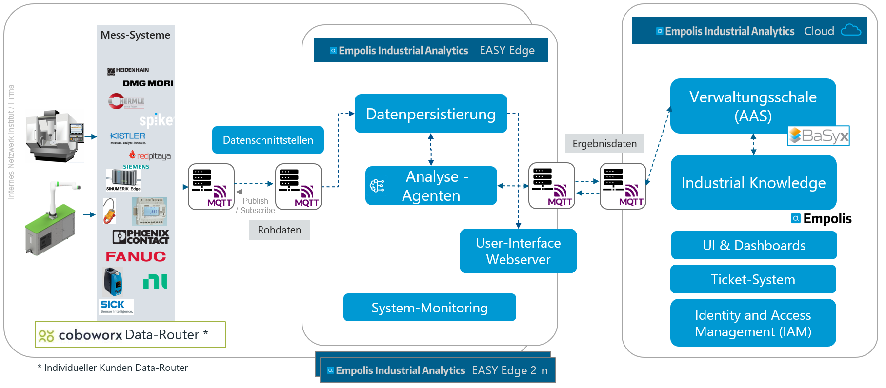

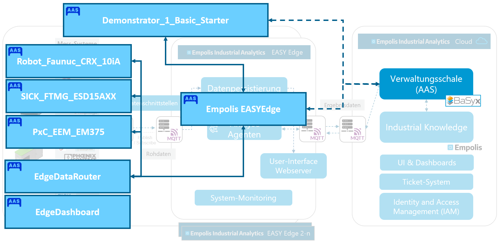{#fig-easy-gesamt-aas}

### Verwaltungsschalen für Hardware-Komponenten in der Palletierzelle

In der obigen @fig-easy-gesamt-aas werden insbesondere die physischen Hardware-Devices, die in der Roboter Zelle "Demonstrator_1_Basic_Starter" verbaut sind, als AAS modelliert. Wie in der Abbildung zu sehen, wird der Roboter selbst (Robotersteuerung) "Robot_Faunuc_CRX_10iA", ein Druckdurchfluss-Sensor "SICK_FTMG_ESD15AXX" und ein Energiemessgerät "PxC_EEM_EM375" als AAS beschrieben. Für das Energiemessgerät wurde von der Firma Phoenix Contact eine Typ-Verwaltungsschale bereitgestellt und konnte somit als Grundlage verwendet werden. Durch die Anpassung der gerätespezifischen Konfigurationen und Anpassung der Seriennummer, wurde somit daraus eine konkrete AAS-Instanz. In den jeweiligen AAS wurden die jeweiligen Submodelle "Nameplate", "AssetInterfaceDescription", "AssetInterfaceMappingConfiguration", "HandoverDocumentation" oder "Technical Data" mit konkreten Werten beschrieben. In folgender Abbildung wird ein Überblick über die AAS und die jeweiligen Submodelle gegeben:

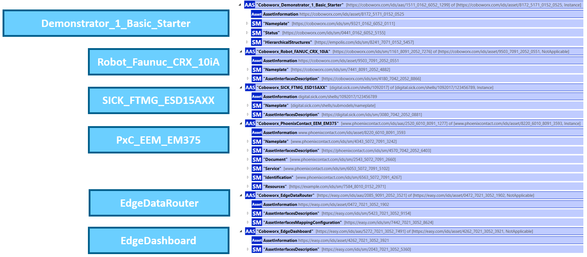

Neben den Hardware-Devices Verwaltungsschalen wurde eine AAS "Demonstrator_1_Basic_Starter" implementiert, welche über die Integration des Submodels "Hierarchical Structures" die Beziehungen zwischen den AAS und somit die Zugehörigkeit zur Roboterzelle beschreibt. Zudem wurde hier ein neues Submodell "Status" eingeführt, welches den aktuellen Status- oder Fehler-Code der Anlage beschreibt. In @sec-sw-as-aas wird darauf näher eingegangen.

### Verwaltungsschalen für Hardware-Komponenten im Lüftungsdemonstrator {#sec-aas-ucb-lueftungsdemo}

Im Rahmen der Entwicklung des Lüftungsdemonstrators wurde ebenfalls eine Verwaltungsschale zur Beschreibung des Systems implementiert. Hier wurden die standardisierten Submodelle Nameplate, TimeSeries, Technical Data und Asset Interface Description verwendet. In @fig-aas-lueftungsdemonstrator wird die Verwaltungsschale auszugsweise dargestellt:

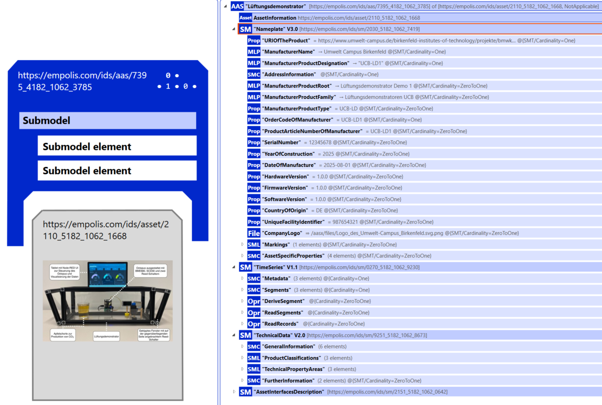{#fig-aas-lueftungsdemonstrator}

Neben den technischen Informationen zum Gehäuse und Herstellern wurde insbesondere die Asset Interface Description dafür genutzt, um zu beschreiben, wie die Kommunikation per MQTT zwischen Lüftungsdemonstrator und EASY-Cloud stattfindet. Hierfür werden, wie in @fig-aas-ucb-aid dargestellt, bspw. die Endpunkte des MQTT Brokers ("EndpointMetadata") oder auch die versendeten Sensorwerte ("Interaction Metadata") integriert.

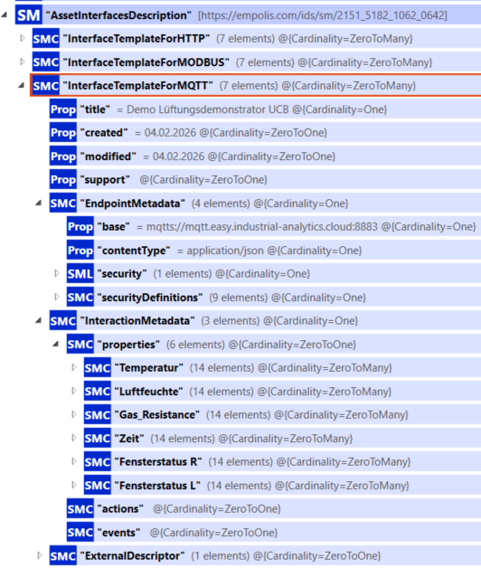{#fig-aas-ucb-aid width="45%"}

Der Lüftungsdemonstrator versendet sekündlich Sensordaten per MQTT. Die eingerichtete MQTT-Bridge zum Empolis EASY-Cloud Broker synchronisiert diese Daten. In der EASY-Cloud werden die über MQTT empfangenen Sensordaten des Lüftungsdemonstrators in Kafka persistiert und über einen "Kafka-to-InfluxDB" Telegraf Agenten in eine InfluxDB Zeitreihendatenbank geschrieben, siehe auch @sec-002_datenpipeline . Die Sensordaten werden somit nicht nur auf dem Nutzerinterface des Lüftungsdemonstrator selbst dargestellt, sondern auch in einer geeigneten Zeitreihendatenbank in der Cloud persistiert. Zusätzlich erfolgt eine Verknüpfung dieser Daten in die Verwaltungsschale über das TimeSeries Submodel. Hier gibt es, wie in @fig-aas-ucb-timeseries dargestellt, die Möglichkeit den API Endpoint der InfluxDB anzugeben und unter "Query" die passende Flux Query zu integrieren.

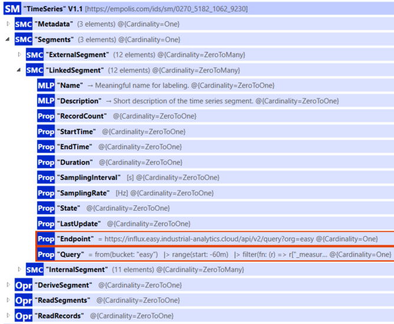{#fig-aas-ucb-timeseries width="50%"}

Bei passend hinterlegten Zugrifftokens kann somit in der Cloud in BaSyx durch die Anbindung der verlinkten InfluxDB direkt die Zeitreihe dargestellt werden. Wie in @fig-aas-ucb-luft-basyx dargestellt, wird das Ergebnis der im Hintergrund ausgeführten Flux Query ggü. InfluxDB in der BaSyx UI dargestellt.

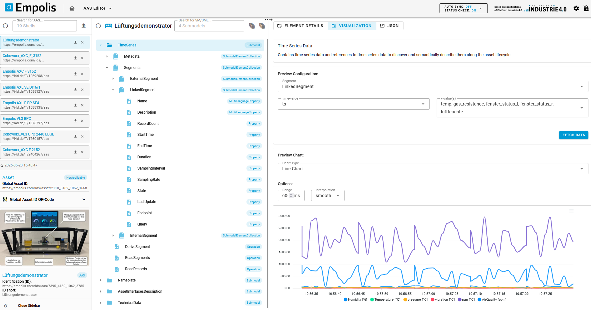{#fig-aas-ucb-luft-basyx}

### Verwaltungsschalen für Software-Komponenten {#sec-aas-für-sw-agenten}

#### Modellierung der Datenschnittstellen

Neben den Beschreibungen für physische Assets kann auch Software als "Asset" angesehen werden, sodass Komponenten wie der "EdgeDataRouter" oder das "EdgeDashboard", insbesondere bezüglich ihrer Schnittstellen (mittels "AssetInterfaceDescription" Submodel), in Verwaltungsschalen beschrieben werden. Ziel war es, die Interoperabilität unterschiedlicher industrieller Datenquellen – wie etwa des Roboters FANUC CRX 10iA (vgl. @fig-AID-UC-Roboter) – mit der Konfiguration des Edge Data Routers sicherzustellen.

Für die Modellierung der Schnittstellen wurden neben Standard-Submodellen wie Nameplate die von der Industrial Digital Twin Association (IDTA) bereitgestellten Submodelle "AssetInterfacesDescription" und "AssetInterfacesMappingConfiguration" eingesetzt[^2]. Diese Submodelle ermöglichen eine standardisierte Beschreibung von Schnittstellen (z. B. Feldbus, MQTT, OPC UA) sowie deren systematische Abbildung (Mapping) auf die Kommunikations- und Routing-Funktionalitäten des Edge Data Routers. Damit wurde ein durchgängiges Konzept implementiert, das sowohl die semantische Beschreibung der Datenquelle (z. B. Drehmomentdaten der einzelnen Roboterachsen) als auch die technische Bindung an Kommunikationsprotokolle umfasst.

[^2]: Siehe <https://industrialdigitaltwin.org/content-hub/teilmodelle> und <https://github.com/admin-shell-io/submodel-templates>

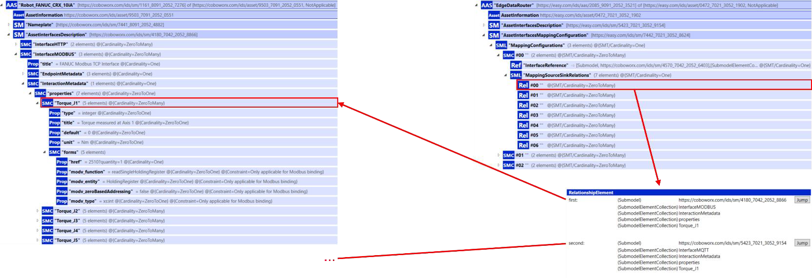{#fig-AID-UC-Roboter}

**Konfiguration von Datenquellen**

Am Beispiel des FANUC CRX 10iA-Roboters wurden die Sensor- und Steuerungsdaten über eine MODBUS-Schnittstelle beschrieben. Über die Submodel-Collection-Properties wurden Parameter wie Torque_J1 … Torque_J5 modelliert. Zu jedem Parameter sind Metadaten wie Einheit, Standardwert, Datentyp sowie Modbus-spezifische Bindungen (Register, Adressierung, Funktionscode) hinterlegt. Diese einheitliche Beschreibung ermöglicht es, die Roboterwerte nahtlos in die Edge-Architektur einzubinden und für übergeordnete Dienste bereitzustellen.

**Mapping im Edge Data Router**

Die Abbildung der Datenquellen auf den Edge Data Router erfolgte mit Hilfe des Submodells "AssetInterfaceMappingConfiguration". Hierbei werden die zuvor beschriebenen Schnittstellen-Elemente (z. B. Torque_J1) über MappingSourceSinkRelations mit den Zielkonfigurationen des Routers verknüpft. Dies erlaubt eine direkte logische Zuordnung zwischen den Modbus-Registern der Robotersteuerung und den MQTT-/Kafka-Endpunkten des Edge Data Routers. Durch die Nutzung von RelationshipElements können Quell- und Ziel-Elemente eindeutig referenziert werden, siehe @fig-AID-UC-Roboter . Damit entsteht ein standardisierter Konfigurationspfad, der sowohl eine automatisierte Generierung von Routing-Tabellen als auch eine Wiederverwendbarkeit der Konfigurationen für andere Datenquellen unterstützt.

**Bewertung und Mehrwert**

Die Umsetzung der AAS-basierten Schnittstellenbeschreibung und -abbildung bringt mehrere Vorteile:

-   Interoperabilität: Unterschiedliche Feldbusprotokolle werden über einheitliche AAS-Modelle in die Edge-Architektur eingebunden.

-   Automatisierbarkeit: Durch die standardisierte Beschreibung können Mapping-Regeln automatisiert erstellt und ausgerollt werden.

-   Wiederverwendbarkeit: Einmal modellierte Schnittstellen können für weitere Geräteklassen oder Use-Cases adaptiert werden.

-   Transparenz: Die explizite Modellierung der Parameter (z. B. Torque-Werte) macht die Datenquelle für andere Dienste eindeutig verständlich und nutzbar. Damit wird die Basis geschaffen, die im letzten Bericht beschriebene Architektur (MQTT, Kafka, Containerisierung, Security) nun auch über die Verwaltungsschale als interoperables Bindeglied zwischen Datenquelle und Edge-Infrastruktur zu erweitern.

#### Modellierung Software-Agenten als Verwaltungsschale {#sec-sw-as-aas}

Im Rahmen der Implementierung der Analyse Agenten (siehe auch @sec-002-demo-planung-monitoring-agent) wurde auch ein neues, nicht standardisiertes Submodel, wie in folgendem Bild gezeigt, entworfen.

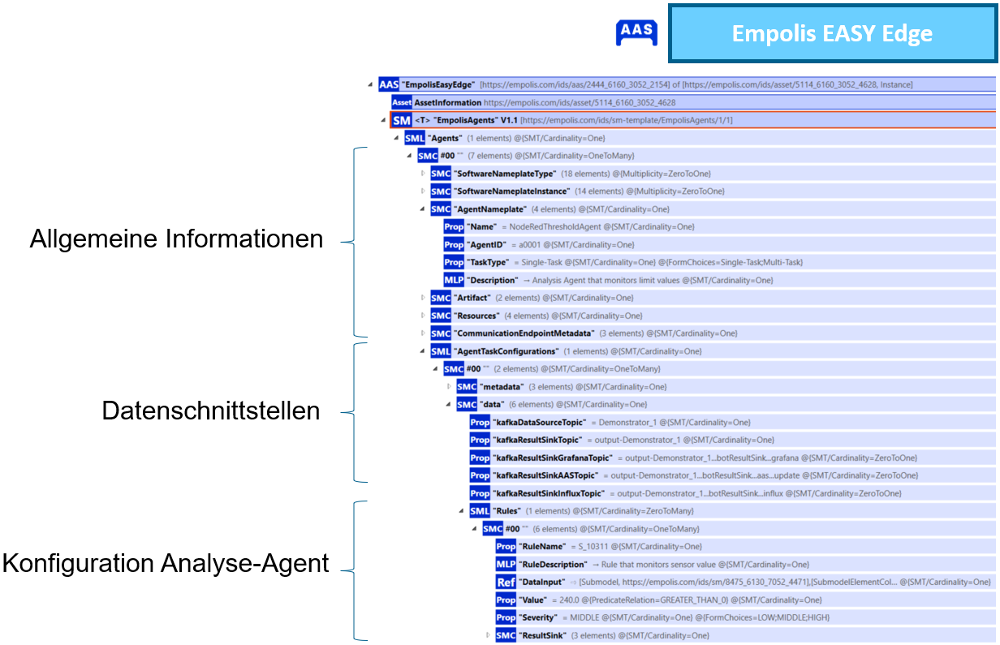

Konkret ausgestaltet wurde das Submodel unter anderem anhand der Implementierung des Grenzwertwächter-Agenten (siehe @sec-002-demo-planung-monitoring-agent). Hierbei wurden zum einen die Konfigurationen des Agenten in einer Kubernetes ConfigMap hinterlegt und die daraus resultierende Struktur überwiegend in die Struktur des Submodells überführt, wie in folgendem @fig-aas-k8s-mapping gezeigt wird:

{#fig-aas-k8s-mapping}

Somit soll erreicht werden, dass bei einer Konfigurationen des Agenten in der Verwaltungsschale nahezu ein 1:1 Mapping in eine ConfigMap stattfinden kann.

Um die Daten-Schnittstellen des Agenten zu beschreiben, wurden die standardisierten Submodelle "Asset Interface Description (AID)" und "Asset Interface Mapping Configuration (AIMC)" verwendet. Die @fig-aas-aid und @fig-aas-aimc zeigen konkrete Beispiele und deren Relationen. Die Schnittstelle nach außen oder zu anderen Agenten ist MQTT. Daher werden im Bereich Endpoint Metadata der MQTT-Broker und weitere Verbindungsinformationen hinterlegt. Im Bereich InteractionMetadata werden als Properties die konkret zu erwartenden Datenpunkte zu Strom, Temperatur, Druck, Spannung beschrieben, inkl. Angabe der Einheiten oder Wertebereiche.

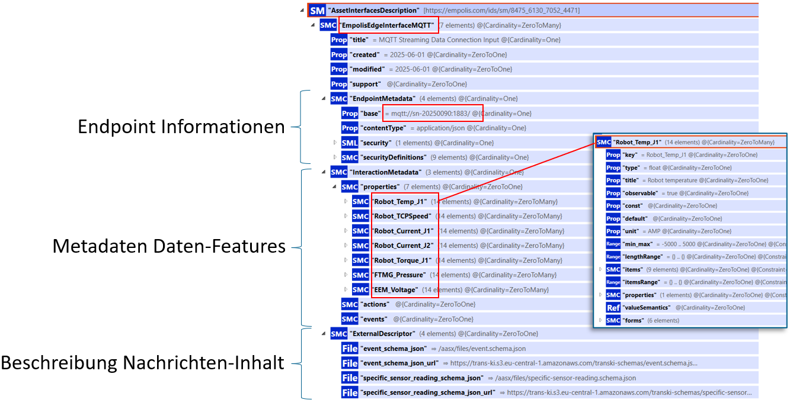{#fig-aas-aid}

Über das Submodell Asset Interface Mapping Configuration wird das Mapping zwischen Asset Interface Description und Analyse-Bot Submodell hergestellt, wie in folgender @fig-aas-aimc zu sehen:

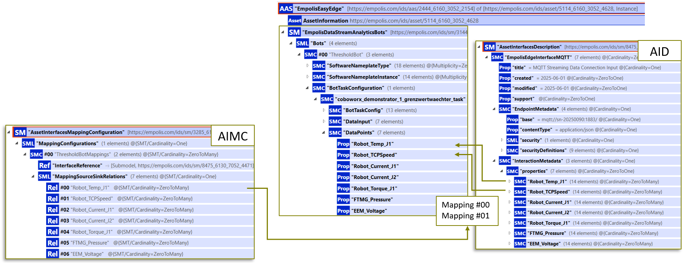{#fig-aas-aimc}

Eine weitere Interaktion mit der Verwaltungsschale findet über die abschließende Dokumentation der Ergebnisse der Analyse-Agenten durch Schreiben dieser in das Status Submodel der Maschine (per BaSyx REST-API) statt. Bei erfüllten Regeln wird durch ein AAS Update der Wert des Status über die Property "isActive" auf den Wert True gesetzt:

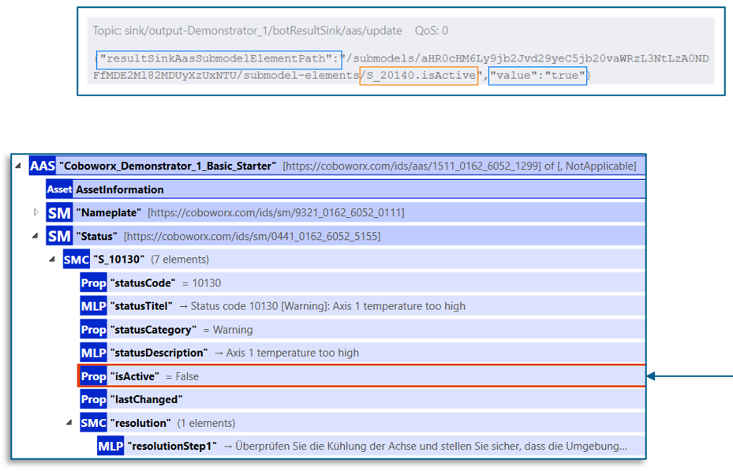{width="65%"}