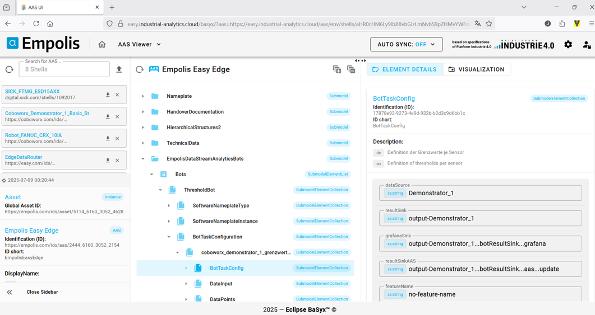
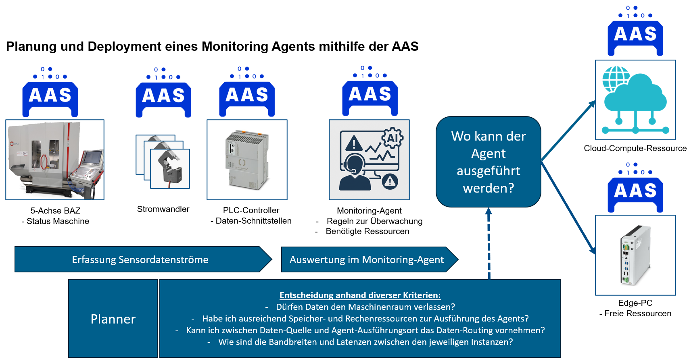
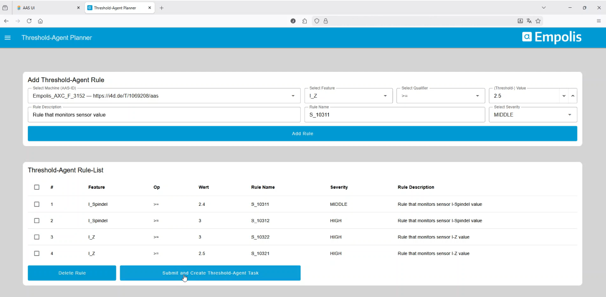
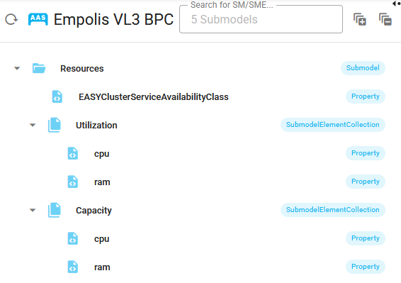
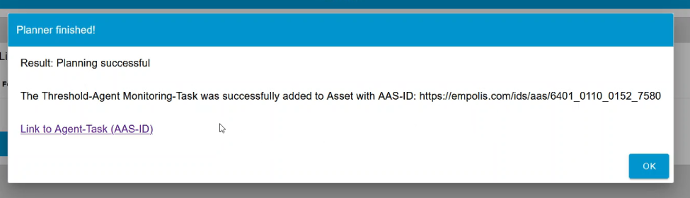
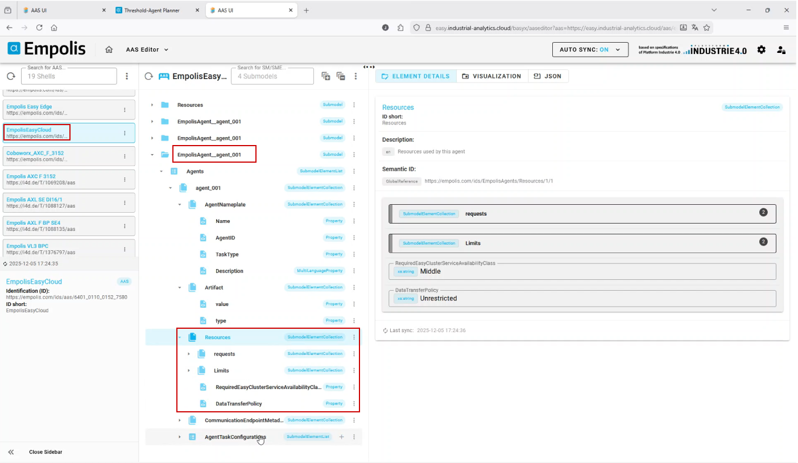

# Hosting der Verwaltungsschale und Integration von Eclipse BaSyx in die EASY Laufzeitumgebung {#sec-002-verwaltungsschale-architektur}

## Eigenes Hosting von Eclipse BaSyx in der Cloud

Für die Bereitstellung der Verwaltungsschalen-Infrastruktur wurde Eclipse BaSyx[^verwaltungsschale_architektur-1] eigenständig innerhalb des Cloud-Kubernetes-Clusters betrieben. BaSyx ist eine Open-Source-Middleware zur Umsetzung von Asset Administration Shells und stellt zentrale Komponenten für digitale Zwillinge in Industrie-4.0-Architekturen bereit. Die Plattform ermöglicht eine standardisierte Verwaltung, Bereitstellung und Abfrage von AAS- und Submodell-Informationen.

[^verwaltungsschale_architektur-1]: <https://basyx.org/>

Das Hosting erfolgt bewusst innerhalb der eigenen Kubernetes-Infrastruktur und nicht über externe Cloud-Dienste. Aufbauend auf den Open-Source-Komponenten von BaSyx wurden eigene Helm-Charts erstellt, mit denen die einzelnen BaSyx-Dienste reproduzierbar installiert, konfiguriert und aktualisiert werden können. Dadurch bleibt die Lösung portabel, versionierbar und unabhängig von einem spezifischen Cloud-Anbieter.

Die bereitgestellte BaSyx-Umgebung besteht aus mehreren spezialisierten Komponenten. Dazu gehören die BaSyx UI als Benutzeroberfläche, die AAS Discovery zur Auffindbarkeit von Verwaltungsschalen, die AAS Registry und Submodel Registry zur Registrierung verfügbarer AAS- und Submodell-Endpunkte sowie das AAS Repository und Submodel Repository zur Speicherung und Bereitstellung der eigentlichen Inhalte. Ergänzend wird ein Concept Description Repository betrieben, um semantische Beschreibungen und Begriffsdefinitionen zentral verfügbar zu machen. Alle Komponenten stellen eigene REST-APIs bereit, über die andere Systeme automatisiert auf AAS, Submodelle und semantische Informationen zugreifen können. Damit bildet BaSyx eine zentrale Integrationsschicht zwischen Edge- und Cloud-Systemen. Produktionsdaten, Zustände oder Metadaten können standardisiert abgelegt, gefunden und von nachgelagerten Analyse- oder Visualisierungsdiensten genutzt werden.

Die Absicherung der BaSyx-Komponenten erfolgt über Keycloak. Dabei werden Zugriffe auf Benutzeroberflächen und APIs zentral authentifiziert und autorisiert. Durch diese Integration können Rollen und Berechtigungen einheitlich verwaltet werden, sodass nur berechtigte Nutzer und Services auf die jeweiligen AAS-Informationen zugreifen können.

{#fig-basyx-screenshot}

## Planung und Deployment eines Monitoring Agenten - die Verwaltungsschale in Aktion

Wie in den vorhergehenden Abschnitten beschrieben, wurden diverse Verwaltungsschalen zur Beschreibung des Systems implementiert, AAS zur Maschine und Hardware, aber auch zur Beschreibung und Konfiguration von Software. Im Projekt wurde zudem die AAS als Grundlage genutzt, um mithilfe eines "Planners" zu entscheiden, wo ein Software-Agent ausgeführt und anschließend automatisch deployed werden kann. Der Planner trifft Entscheidungen anhand diverser Kriterien, wie: Dürfen Daten den Maschinenraum verlassen? Habe ich ausreichend Speicher- und Rechenressourcen zur Ausführung des Agenten? Kann ich zwischen Datenquelle und Agent-Ausführungsort das Datenrouting vornehmen? Wie sind die Bandbreiten und Latenzen zwischen den jeweiligen Instanzen?

Die Antworten auf diese Fragen können mehrere Verwaltungsschalen liefern und der Planner soll die Entscheidung treffen, ob ein Monitoring-Task auf einer Edge- oder Cloud-Ressource ausgeführt werden kann. Diese Grundstruktur wird in folgendem @fig-aas-planner zusammengefasst:

{#fig-aas-planner}

Neben den Verwaltungsschalen zur Hardware wurde eine Konfigurations-Oberfläche für den Analyse-Agenten implementiert. Innerhalb dieser Konfigurationsoberfläche kann man die Datenschnittstellen (welches Datenfeature soll überwacht werden) auswählen und mit entsprechenden Grenzwert-Regeln konfigurieren. Grundlage für diese Konfigurationsoberfläche sind Verwaltungsschalen, insbesondere alle, die eine Asset Interface Description als Submodel besitzen. Nach Auswahl eines Assets (über AAS-ID) kann man verfügbare Feature Datenpunkte (Properties in AID Submodel) auswählen, mit Regeln versehen und eine "Threshold-Agent Rule-List hinzufügen", wie in folgendem Screenshot @fig-planner-ui der Web-Oberfläche zu sehen:

{#fig-planner-ui}

Diese Konfiguration des Agenten führt im "Plan Creator" zu einem neuen AAS Monitoring-Agent Submodel. Zusätzlich werden alle Verwaltungsschalen mit einem Submodel "Resources" abgefragt. Das Submodel "Resources" enthält die Informationen, welche CPU und RAM Kapazitäten (Capacity) das Gerät besitzt und wie die Auslastung (Utilization) aktuell ist, wie in folgender @fig-aas-resources zu sehen:

{#fig-aas-resources}

Inklusive der Angabe der "EASY-Cluster-Service-Availabilty-Class" (siehe auch @sec-easy-cluster-service-classes) werden die Informationen zur Resourcenauslastung der verfügbaren Geräte zusammen mit dem neuen AAS Monitoring-Agent Submodel an den "Planning Service" gesendet. Der Planning-Service trifft nun anhand der benötigten Rechenressourcen des Agenten und der je Hardware zur Verfügung stehenden freien Rechenressourcen die Entscheidung, wo der Agent deployed werden soll. Auf den Planning Service selbst wird in @sec-005-zusammenfassung näher eingegangen. Mit dieser Entscheidung (Angabe der AAS-ID) wird das Agent Submodel in der Ziel-AAS hinzugefügt. Durch dieses Update wird in BaSyx ein MQTT Event emittiert. Dieses Event wird entweder über Cloud oder auf Edge über den "Distributor" weitergeleitet und jeweils durch den "Plan-Executor" entgegen genommen und durch den "Agent-Operator" (Kubernetes Operator) in der Ziel Umgebung als neuen Kubernetes Agent-Task deployed. Der komplette Ablauf wird in folgender @fig-planner-ablauf dargestellt:

![Vollständiger Ablauf der Planung und des Deployments eines Analyse-Agenten. Aufgrund der Informationen aus den Verwaltungsschalen (z.B. freie Rechenressourcen und verfügbare Sensorik) und der Konfiguration des Agenten wird im Planning Service die Entscheidung getroffen, auf welchen Hardware-Devices der Agent ausgeführt werden kann und diese Information als neues Submodel Element in die AAS geschrieben. Daraufhin werden über Plan-Executor und Operatorenn die jeweiligen Agent in der jeweiligen Umgebung deployed.](pictures/planner-3.png){#fig-planner-ablauf}

Nach erfolgreicher Planung wird ein Feedback an den Konfigurator gegeben:

Mit Link auf die Verwaltungsschale kann man nachvollziehen, auf welchem Device der Agent deployed wurde. In folgender @fig-final-agent werden neben den Konfigurationen auch die benötigten Rechenresourcen des Agenten dargstellt, welche letztlich mit den freien Resourcen (siehe @fig-aas-resources) im Planning Service verglichen werden.

{#fig-final-agent}