# Kriterien und Indikatoren zum Thema Ressourcen-, Energie- und Dateneffizienz {#sec-003-ergebnisse_anforderungsanalyse_kriterien_ressourcen}

## Entwicklung des Ordnungsrahmens

Im Folgenden werden die Ergebnisse der methodischen sowie inhaltlich-formalen Entwicklung des Rahmenmodells für die Ressourcen-, Energie- und Dateneffizienz beschrieben. 

### Darstellung bestehender Modelle

**Referenzarchitekturmodell Industrie 4.0**

Das RAMI 4.0 ist ein dreidimensionales Schichtenmodell, das Industrie-4.0-Systeme strukturiert und standardisiert [@PLA18].
Es ermöglicht eine einheitliche Kommunikation zwischen physischen und digitalen Objekten im Industrieumfeld und fördert die Interoperabilität durch standardisierte Schnittstellen. Das Modell besteht aus drei Achsen: Architekturschichten, Lebenszyklus & Wertstrom sowie Hierarchieebenen. Die Architekturschichten (Geschäftsprozesse, Funktionen, Informationen, Kommunikation, Integration und Asset) definieren die funktionalen Ebenen eines Industrie-4.0-Systems. Die Lebenszyklus- & Wertstrom-Achse beschreibt die Phasen eines Produkts von der Entwicklung bis zur Nutzung und Entsorgung. Die Hierarchieebenen (Produkt, Feldgerät, Steuerungseinheit, Station (Maschine), Technische Anlage, Unternehmen, Vernetzte Welt) und integrieren IT-Systeme. „Eine vergleichende Übersicht der herangezogenen Modelle ist @fig-rami zu entnehmen.

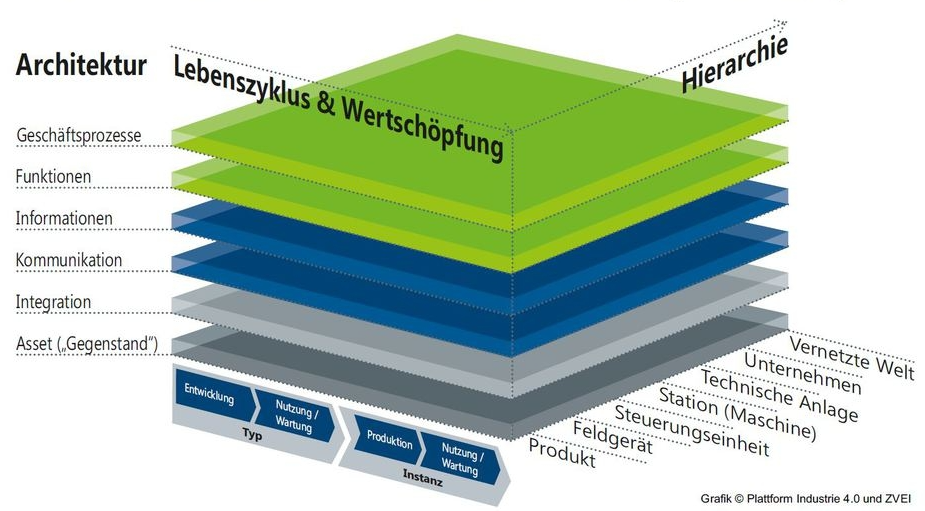{#fig-rami width="80%" fig-align="center"}

**Referenzmodell für grüne und nachhaltige Software und deren Entwicklung**

Das GREENSOFT-Modell dient als Referenzmodell zur Strukturierung von Konzepten, Strategien, Aktivitäten und Prozessen im Bereich Green IT, insbesondere für nachhaltige Software und deren Entwicklung [@NAU11]. Es hilft, Forschungsergebnisse, Maßnahmen und Modelle zu organisieren und enthält eine Roadmap für zukünftige Entwicklungen an der Schnittstelle von IKT und Nachhaltigkeit. Das Modell basiert auf vier Hauptkomponenten Lebenszyklus von Software, Kriterien und Metriken zur Bewertung direkter und indirekter Nachhaltigkeitseffekte, Verfahrensmodelle für die nachhaltige Entwicklung, Beschaffung, Nutzung und den Betrieb von Software, sowie Empfehlungen und Werkzeuge zur praktischen Umsetzung des Modells. Das Referenzmodell betrachtet Software nicht isoliert, sondern im Kontext aller damit verbundenen Produkte und Dienstleistungen, die Nachhaltigkeitsauswirkungen haben. Neben den direkten Effekten berücksichtigt das Modell auch indirekte (zweite- und dritte Ordnung) Auswirkungen, die die eigentlichen Einsparungen übersteigen oder aufheben können. Zudem integriert es verschiedene Konzepte wie Green IT, Green by IT und Sustainable IT und kann sowohl in der Wissenschaft als auch in Unternehmen angewendet werden. 

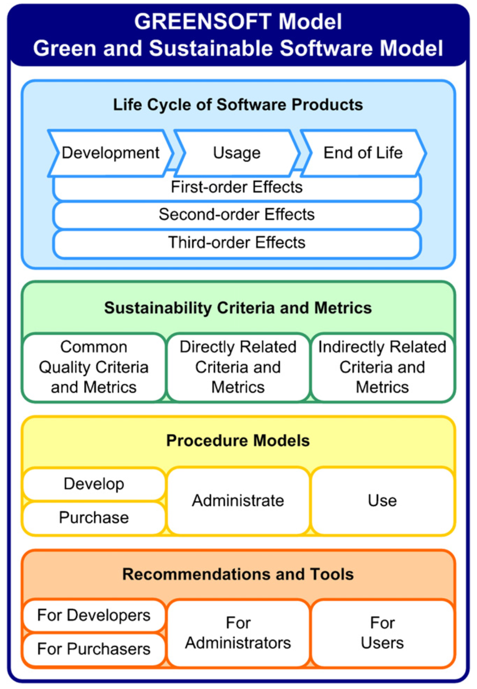{#fig-greensoft width="80%" fig-align="center"}

**Rahmenwerk für Energieeffizienztests zur Verbesserung der Umweltziele von Software**

Das FEETINGS-Modell (Framework for Energy Efficiency Testing to Improve Environmental Goals of the Software) ist ein Ansatz zur Analyse und Optimierung des Energieverbrauchs von Software [@MAN21]. Es besteht aus drei Hauptkomponenten: einer Ontologie, die einheitliche Begriffe und Definitionen für die Software-Energiemessung bereitstellt, einem Prozess, der Forschende bei der strukturierten Messung des Energieverbrauchs unterstützt, und einer technologischen Umgebung, die die Erfassung, Analyse und Interpretation von Verbrauchsdaten ermöglicht. FEETINGS wurde entwickelt, um das Bewusstsein für die Umweltauswirkungen von Software zu schärfen und nachhaltige Nutzungspraktiken zu fördern. Die in @fig-greensoft dargestellte Übersicht verdeutlicht die jeweiligen Schwerpunkte der betrachteten Referenzmodelle.

### Expertenbefragung 

Im Zuge des Projekts wurde eine Expertenbefragung mit 15 Fragen zur Entwicklung eines Referenzmodells für Anwendungen der nachhaltigen Künstlichen Intelligenz (Green AI) in Edge-Cloud Systemen durchgeführt [@GSE24]. Die Umfrage beleuchtet, wie KI-Technologien nachhaltiger und energieeffizienter gestaltet werden können. Ziel war es, Ansätze zu identifizieren, die die Leistungsfähigkeit von Künstlicher Intelligenz in Edge-Cloud-Systemen bewahren, während gleichzeitig deren ökologische Auswirkungen reduziert werden. Im Folgenden werden zentrale Ergebnisse der Befragung vorgestellt. 

**Teilnehmer und deren Rollen innerhalb ihrer Organisationen** 

Im Jahr 2024 haben insgesamt 33 Fachleute aus Wirtschaft, Wissenschaft und industrieller Forschung an der Befragung teilgenommen, darunter Führungskräfte, Entwickler und Nutzer/ Anwender. Eine Übersicht der an der Expertenbefragung beteiligten Teilnehmenden ist @fig-teilnehmer zu entnehmen. Die Verteilung der Teilnehmenden nach ihrer Rolle ist in @fig-rolle dargestellt.

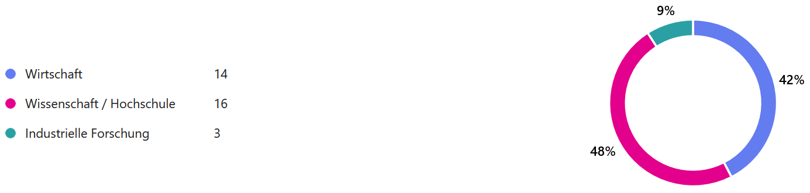{#fig-teilnehmer width="100%" fig-align="center"}

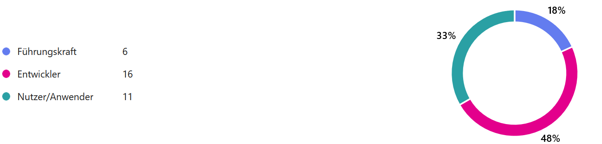{#fig-rolle width="100%" fig-align="center"}

**Optimierungsbedarf im Hinblick auf Ressourceneffizienz**

Die von den Befragten genannten Optimierungsbedarfe sind in @fig-optimierungspotenzial zusammengefasst. Die Befragten setzen generative KI-Methoden häufig zur Erzeugung von Texten und Bildmaterial ein und stufen den Optimierungsbedarf hinsichtlich der Ressourceneffizienz in diesem Bereich als sehr hoch ein. Zudem kommen natürliche Sprachverarbeitung für Textanalyse und Übersetzung sowie Verfahren des überwachten, unüberwachten und bestärkenden maschinellen Lernens verstärkt zum Einsatz, dicht gefolgt von Methoden aus dem Fachgebiet Computer Vision. In diesen Bereichen wird der Optimierungsbedarf als hoch eingestuft. 

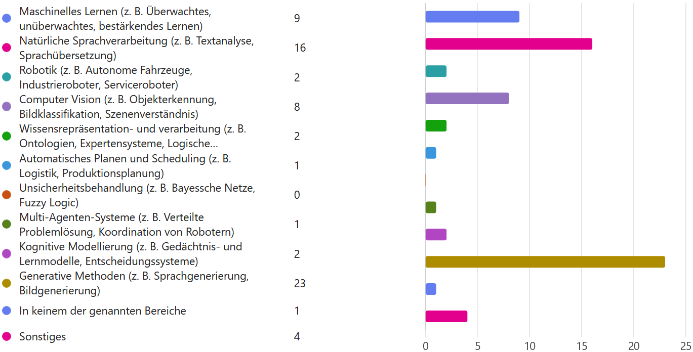{#fig-optimierungspotenzial width="100%" fig-align="center"}

**Bedeutung des Einsatzes von Green AI Methoden**

Für 61% der Befragten ist der Einsatz von Green-AI-Methoden zur Steigerung der Nachhaltigkeit von KI-Anwendungen sehr wichtig, während 18 % dies als wichtig erachten. Die Einschätzung der Befragten zur Wichtigkeit einzelner Green-AI-Methoden ist in @fig-wichtigkeit wiedergegeben.

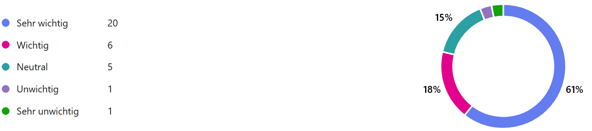{#fig-wichtigkeit width="100%" fig-align="center"}

**Maßnahmen zur Steigerung der Ressourceneffizienz von KI-Modellen**

Auf die Frage nach konkreten Maßnahmen zur Steigerung der Ressourceneffizienz von eingesetzten KI-Modellen gaben die meisten Befragten an, dass sie darauf keinen direkten Einfluss haben. Zudem wurden in der Umfrage die Reduzierung der Modellkomplexität sowie die Optimierung von Algorithmen als wichtigste Ansätze zur Steigerung der Ressourceneffizienz von KI-Modellen genannt. 

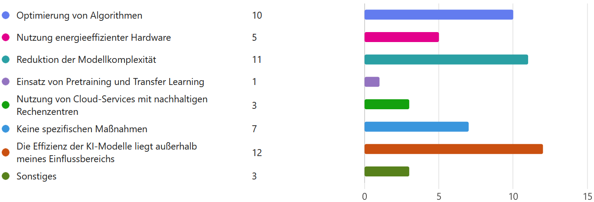{#fig-massnahmen width="100%" fig-align="center"}

**Voraussetzungen für eine verstärkte Nutzung von Green-AI-Methoden**

Auf die Frage, welche Veränderungen erforderlich wären, um verstärkt Methoden der Green AI in ihre Arbeit zu integrieren, nannten 9 % der Befragten die Zeit als entscheidenden Faktor. Zudem wurden die Themen Bürokratieabbau und bessere Aufklärung als weitere Faktoren genannt. Einen Überblick über die von den Befragten priorisierten Maßnahmen zur Steigerung der Ressourceneffizienz liefert @fig-massnahmen. Die nach Einschätzung der Befragten erforderlichen Änderungen sind in @fig-aenderung dargestellt.

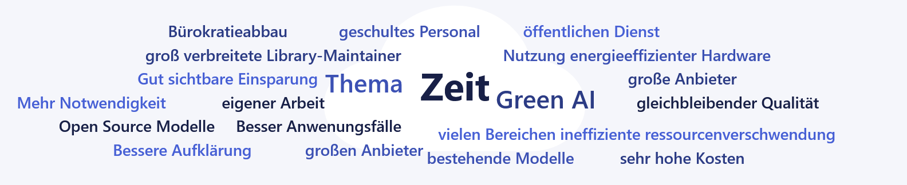{#fig-aenderung width="100%" fig-align="center"}

**Die größten Herausforderungen beim Einsatz von Green AI**

Die mit dem Einsatz von Green AI verbundenen Herausforderungen sind in @fig-herausforderungen zusammengestellt. Die Befragten sehen den Mangel an Wissen als die größte Herausforderung beim Einsatz von Green AI an. Zudem werden eine geringe Priorisierung innerhalb der Organisation sowie das Fehlen klarer Richtlinien und Standards als große Hürden wahrgenommen. 

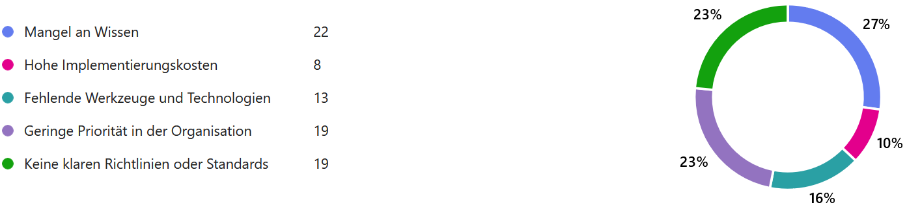{#fig-herausforderungen width="100%" fig-align="center"}

**Die größten negativen Einflussfaktoren auf die Ressourceneffizienz von KI**

Die als negativ bewerteten Einflussfaktoren auf die Ressourceneffizienz sind in @fig-einflussfaktoren ausgewiesen. Die größten negativen Einflussfaktoren auf die Ressourceneffizienz Künstlicher Intelligenz sind nach Einschätzung der Befragten die Anwendungsfälle sowie die dabei eingesetzten Modelle. Als kleinster negativer Einflussfaktor wurden die verwendeten Werkzeuge angegeben. 

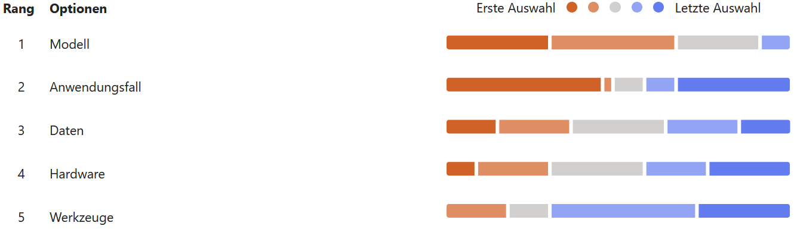{#fig-einflussfaktoren width="100%" fig-align="center"}

Zusammenfassend erachten die Befragten den Einsatz von Green-AI-Methoden überwiegend als wichtig, doch gleichzeitig sehen viele Teilnehmer ihren persönlichen Einfluss auf die Ressourceneffizienz der eingesetzten KI-Technologien als sehr begrenzt an. Als zentrale Maßnahmen zur Steigerung der Ressourceneffizienz gelten die Reduzierung der Modellkomplexität und die Optimierung von Algorithmen. Zudem beeinflussen laut der Befragten die spezifischen Anwendungsfälle und die verwendeten Modelle die Ressourceneffizienz maßgeblich. Herausforderungen bestehen vor allem in fehlendem Wissen, begrenzten zeitlichen Ressourcen, einer geringen Priorisierung innerhalb der Organisation und dem Mangel an klaren Richtlinien und Standards. 

## Aufbau des Ordnungsrahmens

Der Ordnungsrahmen stellt die Grundlage für ein Rahmenwerk zur Förderung der Nachhaltigkeit von KI-Anwendungen in Edge-Cloud-Systemen über ihren gesamten Lebenszyklus hinweg dar. Es zielt darauf ab, den ökologischen Fußabdruck von KI-Technologien zu minimieren, indem es zentrale Einflussfaktoren wie Hardware, Werkzeuge, Daten, Anwendungsfälle und Modelle systematisch darstellt. Besonders im Kontext von Edge-Cloud-Systemen, die zunehmend hohe Rechenleistungen erfordern, da ständig wachsende Datenmengen verarbeitet werden müssen, spielt dieses Rahmenwerk eine wichtige Rolle. Es schafft eine wissenschaftlich fundierte Grundlage für nachhaltige Standards und unterstützt sowohl technische als auch nicht-technische Stakeholder dabei, ökologische Aspekte in ihre KI-Strategien zu integrieren. Eine zusammenfassende Darstellung der für Green AI relevanten Einflussfaktoren findet sich in @fig-einflussfaktore-green-ai.

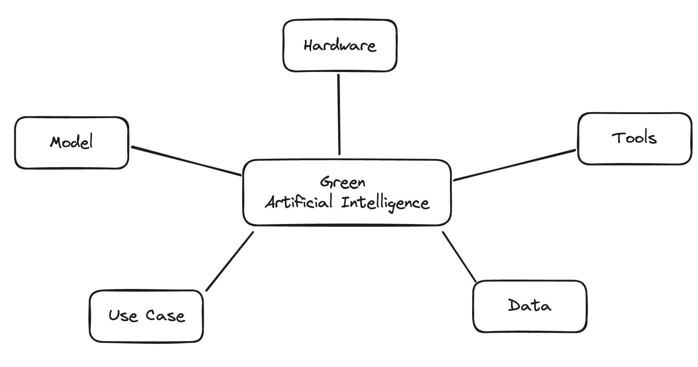{#fig-einflussfaktore-green-ai width="100%" fig-align="center"}

**Hardware**
Die Wahl der Hardware beeinflusst maßgeblich die Energieeffizienz von Edge-Cloud-Systemen. Während energieeffiziente Chipsätze und spezialisierte Prozessoren (z.B. TPUs) den Stromverbrauch reduzieren können, erfordert leistungsstarke KI-Inferenz oft GPUs mit hohem Energiebedarf. Zudem spielen die Optimierung von Speicher- und Netzwerkressourcen sowie energieeffiziente Kühltechnologien eine wichtige Rolle, um den ökologischen Fußabdruck zu minimieren. Dem geringeren Energieverbrauch stehen allerdings immer die Embodied Emissions gegenüber. Diese können die CO2 Einsparungen, durch einen niedrigen Verbrauch der Hardware, in der Herstellung wieder negieren.  

**Tools**
Software-Werkzeuge und Entwicklungsumgebungen beeinflussen die Nachhaltigkeit von KI-Workloads, indem sie energieeffiziente Modellarchitekturen, Quantisierungs-techniken und prädiktive Lastverteilung ermöglichen. Frameworks wie TensorFlow Lite oder ONNX Runtime unterstützen optimierte Inferenz auf Edge-Geräten, während Cloud-native Orchestrierungstools energieeffiziente Ressourcenverwaltung in hybriden Edge-Cloud-Umgebungen erleichtern. 

**Daten**
Die Qualität, Menge und Verarbeitung der Daten hat direkte Auswirkungen auf die Energieeffizienz von KI-Modellen in Edge-Cloud-Systemen. Durch Vorverarbeitung der Daten auf der Edge können unnötige Datenübertragungen zur Cloud reduziert und so Energie eingespart werden. Zudem ermöglicht Federated Learning eine dezentrale Modellaktualisierung, wodurch weniger Rechenleistung in zentralen Rechenzentren benötigt wird. 

**Modell**
Kompakte Modelle wie MobileNet oder prädiktive Modellkompressionstechniken (z. B. Pruning, Knowledge Distillation) reduzieren den Rechenaufwand und damit den Energieverbrauch. Gleichzeitig müssen Modelle so optimiert werden, dass sie mit begrenzten Edge-Ressourcen arbeiten können, ohne dass signifikante Einbußen der Performance hingenommen werden müssen. 

**Anwendungsfall**
Der spezifische Use Case bestimmt, wie und wo KI-Berechnungen in einem Edge-Cloud-System ausgeführt werden. Echtzeit-Anwendungen im Umfeld der Industrie 4.0 erfordern lokale Verarbeitung, um Latenzen zu minimieren, während andere Anwendungen von einer zentralisierten Verarbeitung in energieeffizienten Cloud-Rechenzentren profitieren. Ein intelligentes Load Balancing zwischen Edge- und Cloud-Ressourcen kann dazu beitragen, den Energieverbrauch zu optimieren. 

## Explorative Analyse von geeigneten Kriterien, Indikatoren und Metriken

In diesem Kapitel werden die Begriffe Kriterium, Indikator und Metrik definiert und die Ergebnisse der explorativen Analyse geeigneter Bewertungsgrößen vorgestellt und diskutiert. 

### Begriffsdefinitionen

**Kriterium**

Ein Kriterium ist eine Variable oder Bedingung, die betrachtet wird, um die Gültigkeit einer Aussage, Annahme oder Hypothese zu beurteilen. Durch (mehrere) Indikatoren lässt sich bestimmen, ob dieses Kriterium erfüllt ist. 

**Indikator**

Ein Indikator ist eine empirisch bestimmbare Größe. Er kann aus mehreren Metriken/Maßen zusammengesetzt sein, Ergebnisse wie „Ja/Nein“ enthalten oder ordinalskaliert sein. 

**Metrik**

Eine Metrik ist ein numerisches Maß, das zur Analyse und Bewertung der Leistung verwendet wird. Eine Softwarequalitäts-Metrik ist eine Funktion, die eine Software-Einheit in einem Zahlenwert abbildet. Dieser berechnete Wert ist interpretierbar als der Erfüllungsgrad einer Qualitätseigenschaft. 

### Auswahl und Evaluation geeigneter Kriterien, Indikatoren und Metriken

Zur Analyse und Bewertung der Ressourceneffizienz von KI-Anwendungen in Edge-Cloud-Systemen wurden verschiedene Kriterien, Metriken und Indikatoren ausgewählt und evaluiert. Diese sind in die fünf Hauptkategorien Effizientes Training, Effiziente Inferenz, Effiziente Datenverarbeitung, Effizienz der Infrastruktur und Effizienz der Anwendungen unterteilt. Als Hilfestellung zur Analyse und Bewertung der Ressourceneffizienz wurde ein Werkzeug für Entwickler und Entscheider bereitgestellt, dass die Suche nach Bewertungsfaktoren anhand der Phasen im KI-Lebenszyklus und der Komponenten im Edge-Cloud-Continuum ermöglicht. Dadurch können die notwendigen Kriterien, Indikatoren und Metriken zielgerichtet ausgewählt werden.

**Effizientes Training**

Diese Kategorie enthält verschiedene Metriken zur Bewertung der Effizienz von Trainingsprozessen. Dazu gehören der Energiebedarf, die Trainingszeit pro Epoche, die Konvergenzgeschwindigkeit (wie schnell ein Modell ein bestimmtes Ziel erreicht), die Rechenleistung in FLOPs, die Nutzung von Speicher (RAM) und Hardware (CPU, GPU). Zu den Indikatoren zählen unter anderem die Performance (z. B. precision, recall, f1-score), die Anzahl der Epochen während des Trainings, die Startgenauigkeit sowie die Effizienz iterativer Trainingsprozesse. Auch die Testzeit, die Modelloptimierung und die Batchgröße werden betrachtet. 

**Effiziente Inferenz**

Diese Kategorie bewertet, wie effizient ein trainiertes Modell in der Inferenzphase arbeitet. Berücksichtigt werden der Energiebedarf, die Zeit pro Inferenz, der Durchsatz (Anzahl der Inferenzoperationen pro Sekunde), die Nutzung von Speicher und Rechenressourcen sowie die Performance des Modells. Außerdem werden CPU-, GPU- und RAM-Auslastung während der Inferenzphase betrachtet. 

**Effiziente Datenverarbeitung**

In dieser Kategorie geht es um die Optimierung des Datenflusses in einem KI-System. Metriken umfassen den Energieverbrauch pro Datenmenge, Datenkompression, Echtzeitfähigkeit, Datenübertragungsrate und Latenz. Zusätzlich wird die Anpassungsfähigkeit an veränderte Bedingungen, die Datenvorverarbeitungseffizienz sowie Priorisierung und Caching von Daten betrachtet. 

**Effizienz der Infrastruktur**

Diese Kategorie bewertet, wie gut die Hardware- und Server-Infrastruktur genutzt wird. Dazu zählen die Effizienz von Rechenzentren (z. B. Power Usage Effectiveness (PUE)), die Auslastung von Servern und die Orchestrierung von Workloads über Edge- oder Cloud-Geräte. 

**Effizienz der Anwendungen**

Diese Metriken messen den Energieverbrauch auf Anwendungsebene, etwa durch Leistungsaufnahme während der Nutzung, den CO₂-Fußabdruck und den Anteil erneuerbarer Energien am Gesamtenergiebedarf. Auch die Rechenintensität (Energieverbrauch pro Rechenoperation) wird betrachtet. 

Die folgende Tabelle zeigt eine Auswahl relevanter Metriken, die im Rahmen des EASY-Projekts noch erweitert wurde: 

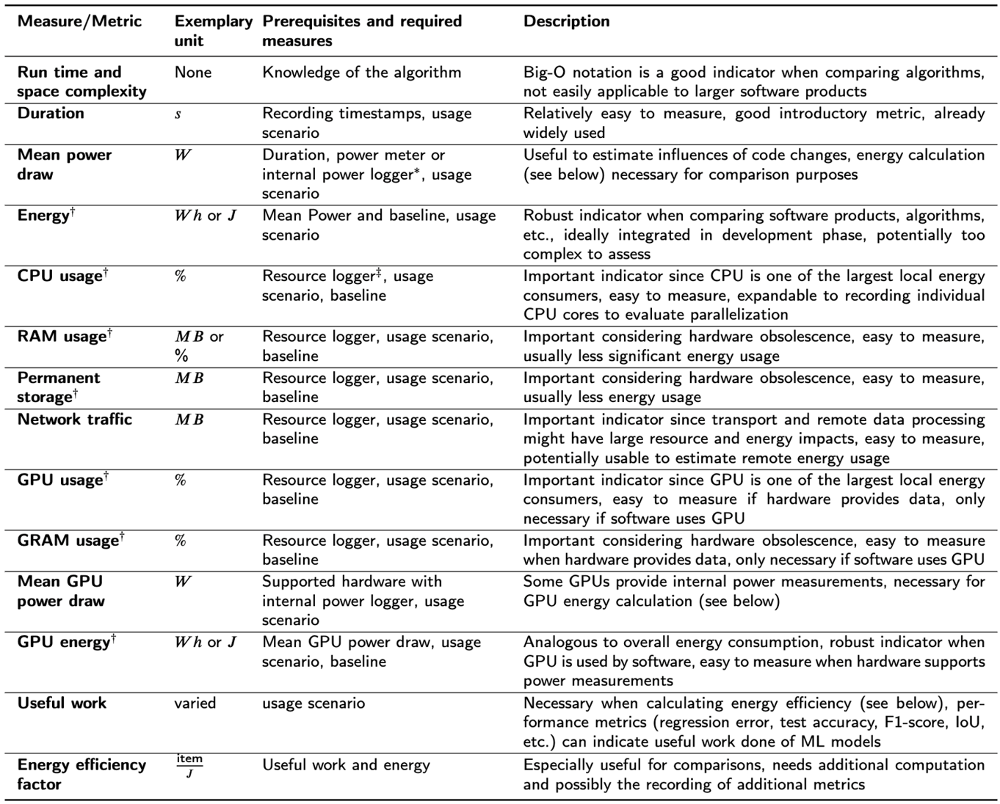{#fig-gssm-metriken width="100%" fig-align="center"}

<!-- @UCB: Bitte folgende Kapitel in Euren Text integrieren. -->

<!-- AP 3.4 -->
## Definition und Selektion der Anwendungs-Szenarien/Use-Cases und Demonstratoren für die Datenanalysewerkzeuge

### Vorstellung der Use-Cases

Ausgangspunkt der Demonstratoren sind industrielle Szenarien, in denen Datenanalyse- und KI-Verfahren zur Überwachung und Steuerung von Produktionsanlagen eingesetzt werden. Im Use-Case von Bosch stehen Zeitreihendaten im Vordergrund, wie sie im Rahmen der Erfassung von Temperatur, Vibration, Lage oder Motorströmen in Werkzeugmaschinen anfallen. Diese Daten dienen sowohl der frühzeitigen Erkennung von Verschleiß als auch der laufenden Prozessüberwachung, bei der entschieden wird, ob sich eine Anlage in einem Normalzustand befindet oder ob eine Anomalie vorliegt. Aufgrund heterogener Maschinenparks und variierender Prozesse selbst auf baugleichen Maschinen entsteht eine stark heterogene Datenlandschaft, in der sich Messdaten zwischen Maschinen und Zeitpunkten teils deutlich unterscheiden. Ziel ist es daher, Erfahrungswissen über Maschinenzustände zwischen Maschinen zu teilen, sodass auch bisher unauffällige Maschinen von bereits aufgetretenen Störungen profitieren können. Hierfür wurden verteilte Lernverfahren als notwendige Grundlage identifiziert.

Zur Verarbeitung der Maschinendaten wurden tiefe neuronale Netze als Modellklasse ausgewählt, da sie sich in den letzten Jahren sowohl für Bild- als auch für Zeitreihenanalyse als leistungsfähig erwiesen haben [@fawaz2019deep]. Die Kapazität dieser Modelle lässt sich durch Regularisierung an unterschiedliche Anwendungsfälle anpassen, um Over- und Underfitting zu vermeiden. Im Rahmen dieses Projektes wurde beschlossen, sich auf eine bewährte ResNet-basierte 1D-CNN-Architektur zu konzentrieren [@fawaz2019deep], die eine hohe Genauigkeit bei gleichzeitig begrenzter Anzahl an Parametern bietet und daher auf Edge-Geräten effizient trainiert und ausgeführt werden kann.

Im Use-Case des DFKI wird ein Demonstrator zur flexiblen, effizienten und resilienten Steuerung von Fertigungsprozessen in der Smart Factory in Kaiserslautern[^ergebnisse_anforderungsanalyse_kriterien_ressourcen-1] betrachtet. Der zugrunde liegende Prozess umfasst den 3D-Druck kundenspezifischer Werkstücke, die Planung und Ausführung der Aufträge, die Handhabung der Werkstücke durch einen Roboter, den Transport über ein Transportsystem sowie eine bildbasierte Qualitätskontrolle. Auf Basis dieses Szenarios wurden verschiedene Planungs- und Demonstrationsfälle definiert, unter anderem die Kopplung mit der Smart Factory in Lemgo[^ergebnisse_anforderungsanalyse_kriterien_ressourcen-2] zur Erhöhung der Verfügbarkeit, die verteilte Qualitätsprüfung auf Edge und in der Cloud, flexible Umplanung bei veränderten Kundenprioritäten sowie die Reaktion auf unterschiedliche Fehlerfälle im System.

### Anforderungen an ProCAKE

Zur Umsetzung der in den Use-Cases definierten Analyse- und Planungsverfahren wird das ProCAKE-Framework als zentrales Softwarewerkzeug eingesetzt. ProCAKE ist ein generisches Open-Source-Framework für prozessorientiertes Fallbasiertes Schließen (Case-Based Reasoning, CBR), das verschiedene Methoden des CBR bereitstellt und die Darstellung prozessorientierter Fälle unterstützt [@BergmannGMZ2019; @AamodtP1994]. Im Kontext des Projektes wird ProCAKE sowohl zur Analyse von Produktionsdaten, insbesondere von Zeitreihendaten [@MalburgSB2023], als auch zur Planung in Kombination mit CBR in Fertigungsprozessen genutzt [@Bergmann1996; @MinorMRG2014]. Damit bildet ProCAKE die methodische Grundlage für intelligente Prozesssteuerung, indem es ermöglicht, empirisches Erfahrungswissen über vergangene Fälle für neue Anfragen nutzbar zu machen.

Im Gegensatz zu anderen CBR-Frameworks unterstützte ProCAKE zu Projektbeginn keine verteilten CBR-Anwendungen [@SchultheisZB2023]. Es stellt jedoch die erforderliche Prozessunterstützung sowie erprobte Funktionalität zur Prozessdatenanalyse bereits zur Verfügung, weshalb es als bestgeeignetes Framework für die im Projekt verfolgten Ziele identifiziert wurde. Auf dieser Basis wurden Anforderungen an die Erweiterung von ProCAKE abgeleitet. Aus der Definition der Demonstratoren (@sec-006-zusammenfassung) ergeben sich funktionale Anforderungen, die insbesondere die Lauffähigkeit im Edge-Cloud-Kontinuum betreffen. Um diese Demonstratoren zu realisieren, müssen folgende funktionale Anforderungen erfüllt werden:

1. **Lauffähigkeit im Edge-Cloud-Kontinuum:** ProCAKE muss als jeweils separate Instanz sowohl auf Edge- als auch auf Cloud-Geräten verfügbar sein. Jede Instanz soll entweder über eigene Daten- und Ähnlichkeitsmodelle sowie Fallbasen verfügen, sodass diese Anfragen bearbeiten kann, oder diese mitgegeben bekommen, wenn sie benötigt wird.
2. **Kompatibilität mit Orchestrierungskomponente:** Eine Orchestrierungskomponente im Edge-Cloud-Kontinuum verteilt die Rechenlast (z.B. ressourcen-optimiert) zwischen den Edge-Instanzen und der Cloud. ProCAKE muss über eine Schnittstelle verfügen, die diese Orchestrierungskomponente ansprechen kann und von der diese Komponente die Ergebnisse erhält. Die Orchestrierungskomponente benötigt zudem eine Funktion, mit der die Ergebnisse zusammengeführt und weiterverarbeitet werden.
3. **Kompatibilität mit Kube-Edge:** Als Architektur des Edge-Cloud-Kontinuums ist Kube-Edge[^ergebnisse_anforderungsanalyse_kriterien_ressourcen-3] angedacht (@sec-002_laufzeitumgebung_architektur_easy_cloud_edge). Diese Architektur baut wiederum auf Kubernetes[^ergebnisse_anforderungsanalyse_kriterien_ressourcen-4] auf, wobei es sich um ein System handelt, in dem Anwendungen als Container bereitgestellt werden können. ProCAKE soll in einen solchen Container gebracht werden und als solcher lauffähig sein. Der Container soll die bereits präsentierten funktionalen Anforderungen aus Arbeitspaket 6 bereitstellen. Eine Möglichkeit zur Umsetzung ist die Bereitstellung eines Docker-Interfaces[^ergebnisse_anforderungsanalyse_kriterien_ressourcen-5] für ProCAKE, aus dem ein Container gebaut werden kann.
4. **Uniforme Kommunikation zwischen den Instanzen:** Die Kommunikation innerhalb des Edge-Cloud-Kontinuums soll uniform erfolgen, somit auch die Kommunikation zwischen den ProCAKE-Instanzen. Hierfür wurden formal #Kafka[^ergebnisse_anforderungsanalyse_kriterien_ressourcen-6] (innerhalb der Edge- bzw. Cloud-Ebene) und MQTT (zwischen Edge und Cloud) als präferierte Konnektoren in Aussicht gestellt. Die Anfragen sowie mögliche Daten- und Ähnlichkeitsmodelle sowie Fallbasen, die innerhalb des Edge-Cloud-Kontinuums verschickt werden, sollen in die hierfür bereitgestellten, serialisierbaren Nachrichtenformate integrierbar sein. ProCAKE ermöglicht eine XML-Instanziierung seiner Anfragen, Modelle und Fallbasen, welche sich in diese Nachrichtenformate integrieren lässt.
5. **Autonome Instanzen:** Edge-Knoten sollen in der EASY-Laufzeitumgebung auch unabhängig von der Cloud laufen können. Bricht beispielsweise die Kommunikation ab, soll der Edge-Knoten seine aktuellen Aufgaben fortführen sowie eigenständige Berechnungen durchführen können. Dies muss auch für die dort laufende ProCAKE-Instanz gelten. Ein laufender CBR-Prozess darf nicht unterbrochen werden und das Edge-Gerät muss auch eigene CBR-Anfragen mit seiner ProCAKE-Instanz bearbeiten können.

ProCAKE ist daher so zu erweitern, dass es sowohl in vollständig verteilten als auch in teilweise isolierten Betriebsmodi funktionsfähig ist. Zusammengenommen führen diese funktionalen und technischen Anforderungen zu einem klaren Zielbild: ProCAKE wird zu einem verteilungsfähigen, containerisierten CBR-Framework weiterentwickelt, das nahtlos in eine KubeEdge-basierte Laufzeitumgebung integriert werden kann und die Use-Cases von Bosch und DFKI auf Edge und in der Cloud unterstützt.

### Anforderungen an Edge-Devices und Empfehlung

Aus der angestrebten Ausführung von ProCAKE im Edge-Cloud-Kontinuum ergeben sich konkrete Hardwareanforderungen an die einzusetzenden Edge-Geräte. Diese betreffen sowohl die allgemeine Einbettung in die KubeEdge-Architektur[^ergebnisse_anforderungsanalyse_kriterien_ressourcen-3] als auch den spezifischen Ressourcenbedarf von ProCAKE und weiteren Komponenten des Maschinellen Lernens (ML). Die Anforderungen lassen sich wie folgt zusammenfassen:

1. **Container-Kompatibilität:** Das Edge-Gerät soll eine Hardwareausstattung besitzen, die ermöglicht, dass ein Docker Container unterstützendes Betriebssystem installiert werden kann oder bereits vorinstalliert ist. Ohne ein Container-unterstützendes-System ist ein Einsatz in der vorgesehenen KubeEdge-Architektur[^ergebnisse_anforderungsanalyse_kriterien_ressourcen-3], die auf containerisierten Anwendungen basiert, nicht möglich.

2. **Mindest-Arbeitsspeicher für den Betrieb im Kontinuum:** Der verfügbare RAM des Edge-Geräts muss mindestens 2 GB betragen, um überhaupt als Edge-Knoten im Kontinuum eingebunden werden zu können. Bei dieser Anforderung handelt es sich um die Mindestgröße, um den grundlegenden Betrieb in KubeEdge sicherzustellen.

3. **Datenträgerkapazität für Anwendungen:** Zusätzlich zum Arbeitsspeicher benötigen die Edge-Geräte ausreichend freien, nichtflüchtigen Speicher, um Anwendungen wie ProCAKE, weitere ML-Komponenten und notwendige Systemsoftware zu installieren und betreiben zu können. Hierfür sollten mindestens 32 GB Speicher verfügbar sein; eine höhere Speicherkapazität wird ausdrücklich empfohlen, um Reserven für zukünftige Erweiterungen vorzuhalten.

4. **Kommunikationsfähigkeit:** Das Edge-Gerät muss über geeignete Kommunikationsschnittstellen verfügen, um im Edge-Cloud-Kontinuum eingesetzt werden zu können. Insbesondere sind Schnittstellen zu unterstützen, die eine Nutzung von Kafka[^ergebnisse_anforderungsanalyse_kriterien_ressourcen-6] und MQTT als Konnektor erlauben, damit Datenströme, Anfragen und Ergebnisse zuverlässig zwischen Edge- und Cloud-Komponenten ausgetauscht werden können.

5. **ProCAKE-spezifischer Arbeitsspeicherbedarf:** Bei einer typischen, mit ProCAKE erstellten Anwendung liegt der benötigte Arbeitsspeicher zwischen etwa 1,5 und 4 GB. Bei großen Fallbasen, komplexen Datenstrukturen (z.B. Zeitreihen oder Workflowgraphen) oder rechenintensiven Ähnlichkeitsmaßen kann der Bedarf deutlich höher ausfallen. Da parallel auch das Betriebssystem und die KubeEdge-Komponenten ausgeführt werden, sollen Edge-Geräte deshalb mindestens 8 GB RAM aufweisen; Geräte mit höherem Speicher werden ausdrücklich empfohlen.

6. **Rechenkapazität:** Die Rechenkapazität des Edge-Geräts muss so ausgelegt sein, dass ProCAKE Analyseprozesse möglichst echtzeitnah ausführen und bei Steuerungsaufgaben zeitnah Ergebnisse liefern kann. Es ist daher ein relativ leistungsstarker Prozessor sicherzustellen, dessen Leistungsfähigkeit zu den in den Use-Cases vorgesehenen CBR- und ML-Verfahren passt.

7. **Speicherplatz für ProCAKE-Komponenten:** Für ProCAKE sind mindestens ca. 2,2 GB Speicher für den Core inklusive der Maven-Dependencies sowie etwa 70 MB für die REST-Schnittstelle einzuplanen. Somit sollten zusätzlich zur Größe des Docker-Containers mindestens 2,3 GB freier Speicher speziell für ProCAKE zur Verfügung stehen, um das Framework zuverlässig auf Edge-Geräten betreiben zu können.

Auf Basis dieser Anforderungen wurden verschiedene Edge-Geräte evaluiert und konkrete Hardwareempfehlungen abgeleitet. Das DFKI hat ein NVIDIA Jetson Orin mit 32 GB LPDDR5-RAM und 64 GB eMMC-Speicher beschafft, das zusätzlich um eine 1 TB SSD erweitert wurde. Diese Konfiguration bietet ausreichend Ressourcen, um ProCAKE, die zugehörigen Container-Komponenten und weitere ML-Verfahren parallel zu betreiben. Die Robert Bosch GmbH hat ein NVIDIA Jetson Nano mit GPU und Quad-Core-Prozessor sowie weitere Modelle der Jetson-Xavier-Serie angeschafft und untersucht zusätzlich den Einsatz von Bosch-eigenen ctrlX-Geräten mit leistungsfähigen CPUs. Diese Geräte erfüllen die oben formulierten Anforderungen hinsichtlich Speicher, Rechenkapazität, Kommunikationsfähigkeit und Linux-Kompatibilität und stellen damit eine geeignete Hardwarebasis für die Implementierung und Evaluation der verteilten CBR- und ML-Verfahren im geplanten Edge-Cloud-Kontinuum dar.

[^ergebnisse_anforderungsanalyse_kriterien_ressourcen-1]: <https://www.smartfactory.de/>
[^ergebnisse_anforderungsanalyse_kriterien_ressourcen-2]: <https://smartfactory-owl.de/>
[^ergebnisse_anforderungsanalyse_kriterien_ressourcen-3]: <https://kubeedge.io/>
[^ergebnisse_anforderungsanalyse_kriterien_ressourcen-4]: <https://kubernetes.io/de/>
[^ergebnisse_anforderungsanalyse_kriterien_ressourcen-5]: <https://www.docker.com/>
[^ergebnisse_anforderungsanalyse_kriterien_ressourcen-6]: <https://kafka-kommunikation.de/>

<!-- AP 3.6 -->
## Auswahl und Implementierung geeigneter ML-Algorithmen zur Umsetzung der Use Cases und Bewertung der Effizienz

### Auswahl und Begründung des CBR-Frameworks

Zu Projektbeginn wurde eine systematische Untersuchung existierender CBR-Frameworks durchgeführt, um deren Eignung für die im Projekt verfolgten Use-Cases sowie insbesondere für eine verteilte Ausführung im Edge-Cloud-Kontinuum (ECC) zu bewerten. Die Ergebnisse dieser Analyse sind in [@SchultheisZB2023] dokumentiert. Dabei zeigte sich, dass zwar mehrere Frameworks Teilaspekte der Prozessunterstützung oder des Fallbasierten Schließens abdecken, jedoch kaum Ansätze eine verteilte Ausführung explizit unterstützen und insbesondere kein Framework eine vollständig nutzbare, verteilte CBR-Laufzeitumgebung bereitstellt. ProCAKE sticht in dieser Untersuchung dadurch hervor, dass es bereits umfangreiche Funktionen für prozessorientiertes CBR und die Verarbeitung komplexer Datenstrukturen bereitstellt und damit die in EASY adressierten Anwendungsfälle weitgehend abdeckt. Auf dieser Grundlage – und in Übereinstimmung mit der TVB – wurde ProCAKE als zentrale CBR-Komponente für die fallbasierte Analyse ausgewählt. Die weiteren Arbeiten zielten darauf ab, ProCAKE in das ECC zu integrieren, semantisch zu beschreiben, für den Einsatz auf Edge-Geräten zu optimieren und dessen verteilte Ausführung sowie Ressourceneffizienz systematisch zu evaluieren.

### Architektur und semantische Beschreibung im Edge-Cloud-Kontinuum

Die semantische Selbstbeschreibung der ProCAKE-Dienste folgt dem in EASY entwickelten generischen Konzept für Dienste im ECC. ProCAKE-Dienste werden über eine Verwaltungsschale (Asset Administration Shell, AAS) beschrieben, in der Metadaten zu Fähigkeiten, Schnittstellen und Einsatzkontext des jeweiligen Dienstes abgelegt sind. ProCAKE wurde in diese Beschreibungssystematik integriert und als CBR-spezifischen Diensttyp modelliert; Details zu Struktur und Submodellen der AAS werden in Kapitel (@sec-002-verwaltungsschale) für alle Dienste im ECC definiert. Zur technischen Bereitstellung der CBR-Funktionalität wurde ProCAKE über eine REST-API nach außen exponiert und in einem Docker-Container gekapselt, der ProCAKE samt REST-Schnittstelle enthält. Dieser Container wurde in Kubernetes und testweise in KubeEdge als Pod ausgerollt. Damit liegt ProCAKE in einer Form vor, die sich konsistent in die containerbasierte Laufzeitumgebung des ECC integrieren lässt und eine klare Trennung zwischen Dienstbeschreibung (AAS), Schnittstelle (REST) und Ausführung (Container/Pod) erlaubt. Für die Nutzung verteilter ProCAKE-Instanzen wurden einheitliche Schnittstellen und Datenaustauschformate spezifiziert. XML wird vor allem für komplexe ProCAKE-interne Strukturen wie Fallbasen und Ähnlichkeitsmodelle verwendet, während JSON für serviceorientierte Kommunikationsmuster wie Anfragen und Antworten der REST-API eingesetzt wird. Die Schnittstellenspezifikation umfasst Endpunkte für CBR-Anfragen, das Laden und Aktualisieren von Fallbasen, die Konfiguration von Ähnlichkeitsmodellen sowie Status- und Monitoringabfragen. Ein eigens implementierter Load-Balancer bezieht die für die Verteilung relevanten Metriken direkt aus der Kubernetes-Umgebung über die AAS der beteiligten Dienste. Für jede ProCAKE-Instanz werden u.a. Anzahl der CPU-Kerne, aktuelle CPU-Nutzung, verfügbarer Speicher und Energieklasse abgefragt. Die Aktualisierung dieser Metriken anhand der aktuellen Auslastung und des Knotenzustands ist im Kontext der projektübergreifenden Edge-Cloud-Architektur beschrieben. Hier werden diese Mechanismen genutzt, um zur Laufzeit Zuordnungsentscheidungen für CBR-Anfragen zu treffen. Der Load-Balancer ist selbst dockerisiert und als Pod im ECC betreibbar.

### Optimierungen für den Einsatz auf Edge-Geräten

Durch die Containerisierung ist die ProCAKE-Laufzeitumgebung grundsätzlich hardwareunabhängig; praktisch entscheidend sind jedoch die Ressourcen der jeweiligen Edge-Geräte und die spezifischen CBR-Anwendungen. Je nach eingesetzten Ähnlichkeitsmaßen und Datenstrukturen können leistungsschwächere Edge-Knoten deutlich längere Laufzeiten aufweisen. Um dies abzufedern, wurden verschiedene Optimierungsstrategien entwickelt. Auf algorithmischer Ebene können beispielsweise MAC-FAC-Ansätze („Many Are Called, Few Are Chosen“) und ressourcenschonende Vorfilterung angewendet werden, um zunächst eine kleinere Menge vielversprechender Kandidatenfälle zu selektieren, bevor komplexe Ähnlichkeitsmaße angewendet werden [@MalburgSB2023]. Ergänzend wurden Strategien betrachtet, bei denen rechenintensive Ähnlichkeitsmaße vorrangig in der Cloud ausgeführt werden, während Edge-Knoten einfachere Maße nutzen oder nur Teilaufgaben übernehmen. Für Zeitreihendaten wurden Embedding-Verfahren untersucht, die Zeitreihen in kompakte Repräsentationen abbilden, um Ähnlichkeitsberechnungen und Fallselektion effizienter zu machen [@WeichSHB2025]. Parallel dazu wurde die Optimierung von Ähnlichkeitsmaßen selbst adressiert: Durch erklärungsbasierte Analysen der Beiträge einzelner Merkmale konnten Ähnlichkeitsmaße gezielt so angepasst werden, dass sie bei vergleichbarer oder verbesserter Retrievalqualität weniger Rechenressourcen benötigen [@SchultheisHMB2023]. Ergänzend wurden Verfahren zur Erkennung von Prozessen auf Basis von Sensordaten entwickelt, die direkt auf Edge-Geräten lauffähig sind [@SeigerSB2025]. Der Ansatz ist bewusst ressourcenarm gestaltet, sodass Prozessabläufe möglichst nah an der Datenquelle erkannt und in CBR-basierte Steuerungs- und Analyseprozesse integriert werden können. Insgesamt ermöglichen diese Optimierungen, ProCAKE-Instanzen auch auf ressourcenbeschränkten Edge-Geräten sinnvoll zu betreiben, während dieselbe Codebasis in leistungsstärkeren Cloud-Umgebungen mit umfangreicheren Konfigurationen verwendet werden kann.

### Verteilte CBR-Szenarien und Fallbasen

Für die Untersuchung des verteilten CBR im ECC wurden drei komplementäre Fallbasen eingesetzt, die unterschiedliche strukturelle Eigenschaften und Anwendungsdomänen abbilden. Die Gebrauchtwagen-Fallbasis ist strukturell flach, enthält aber über 100.000 Fälle mit überwiegend einfachen Attributen. Hier resultiert der Aufwand primär aus der Menge der Fälle, weniger aus der Komplexität der einzelnen Fallstruktur. Die Rezepte-Fallbasis umfasst lediglich 40 Fälle, beschreibt jedoch komplexe Workflows und dient als vereinfachtes Modell für prozessuale Unternehmensabläufe und POCBR-Szenarien [@MalburgBB2023]. Die dritte Fallbasis enthält 4.811 Fälle aus einer Smart Factory des IoT-Labors Trier [^ergebnisse_anforderungsanalyse_kriterien_ressourcen-7], bei denen jeder Fall zehn Zeitreihen sowie Metaattribute umfasst und damit sowohl zeitliche als auch strukturelle Komplexität vereint [@SchultheisMGWBBSA2024; @SchultheisBGMBSA2025; @MalburgSB2023]. In allen drei Fallbasen wurden mehrere CBR-Anfragen gestellt und über eine längere Experimentsitzung verteilt; die gemessenen Laufzeiten geben die aufsummierte Gesamtzeit aller Anfragen pro Verteilungsstrategie wieder. Der Load-Balancer verteilte die Anfragen alternativ nach Gleichverteilung („Even“), orientiert an CPU-Kernen, CPU-Last, freiem Speicher und Energieklasse. Zusätzlich wurde eine reine Cloud-Variante ohne Verteilung auf Edge-Knoten betrachtet. Die gemessenen Laufzeiten (in Sekunden) sind nachfolgend aufgeführt; die ursprünglichen Prozentwerte wurden für die Auswertung nicht weiter verwendet.

[^ergebnisse_anforderungsanalyse_kriterien_ressourcen-7]: <https://iot.uni-trier.de/>

### Ressourceneffizienz und Implikationen für das Edge-Cloud-Kontinuum

Strategie                | Autos 	| Rezepte	| Zeitreihen
|------------------------|----------|-----------|-----------:|
Even Distribution        | 3:37:16 	| 190:53:31	| 394:07:10  |
CPU Usage 		         | 2:12:02	| 32:37:52	| 179:24:26  |
Permanent Storage        | 1:49:44	| 36:04:31	| 98:14:43   |
Energy Efficiency Factor | 3:58:50	| 86:29:32	| 407:44:19  |
Cloud (centralized) 	 | 0:15:56	| 30:06:52	| 91:09:44   |

Die drei Fallbasen unterscheiden sich hinsichtlich Fallzahl und struktureller Komplexität deutlich, was sich in der Wirkung der Verteilungsstrategien im ECC widerspiegelt. In der flachen Gebrauchtwagen-Fallbasis mit über 100.000 Fällen, aber geringer Strukturkomplexität je Fall, profitierte die Ausführung moderat von ressourcenorientierten Strategien: Speicher- und CPU-basierte Verteilungen („Memory“, „CPU-Cores“, „CPU-Load“) führten hier zu geringeren Laufzeiten als Gleichverteilung oder eine reine Orientierung an Energieklassen. Die Unterschiede sind jedoch relativ begrenzt, da der Aufwand primär aus der großen Fallzahl resultiert und sich gut parallelisieren lässt. In den beiden strukturell komplexeren Fallbasen – den 40 Workflow-basierten Rezeptfällen und den 4.811 Smart-Factory-Fällen mit je zehn Zeitreihen pro Fall – zeigt sich hingegen ein anderes Bild. Trotz unterschiedlicher Größe ist beiden gemeinsam, dass jede Anfrage auf komplexen, reich strukturierten Fällen operiert. Hier dominieren Serialisierungs-, Kommunikations- und Orchestrierungsaufwände im ECC, sodass die reine Cloud-Ausführung in beiden Fällen die geringsten Laufzeiten aufweist. Selbst die besten ECC-internen Strategien (CPU- oder Speicher-basiert) bleiben deutlich hinter der Cloud-Variante zurück, während naive Gleichverteilung und energieklassenbasierte Verteilung die Laufzeiten teilweise um Größenordnungen erhöhen. Über alle Szenarien hinweg legt dies nahe, dass eine Verteilung von CBR-Workloads im ECC aus rein ressourcentechnischer Sicht häufig keinen Vorteil bietet. Insbesondere bei wenigen, aber komplex strukturierten Fällen oder ausgeprägter Zeitreihenkomplexität steigen die Overheads durch Datenübertragung, Synchronisation und Lastverteilung so stark an, dass die Vorteile paralleler Ausführung im ECC nicht kompensiert werden. Ressourceneffizient ist in diesen Fällen in der Regel eine zentralisierte Cloud-Ausführung. Eine verteilte Ausführung im ECC bleibt dennoch aus anderen Gründen relevant: Anforderungen an Datenschutz und Datenhoheit (wenn Daten das lokale Umfeld nicht verlassen dürfen), begrenzte Cloud-Kapazitäten, erhöhte Verfügbarkeits- und Resilienzanforderungen oder geringe Latenz durch datennahe Verarbeitung können eine Verteilung rechtfertigen, auch wenn diese aus Ressourcensicht suboptimal ist. Die hier durchgeführte CBR-basierte Untersuchung generiert dabei wertvolle Kennzahlen zur Laufzeit und Ressourcenausnutzung, die sich auf andere Dienste im ECC übertragen lassen. Diese Potenziale für die systematische Bewertung von Edge-Cloud-Systemen wurden von der Begleitforschung aufgegriffen und weiterverwertet [@bewertung_edge_cloud_2025] und tragen dazu bei, Kriterien und Metriken für zukünftige Architekturen und Orchestrierungsstrategien im Edge-Cloud-Kontext zu schärfen.