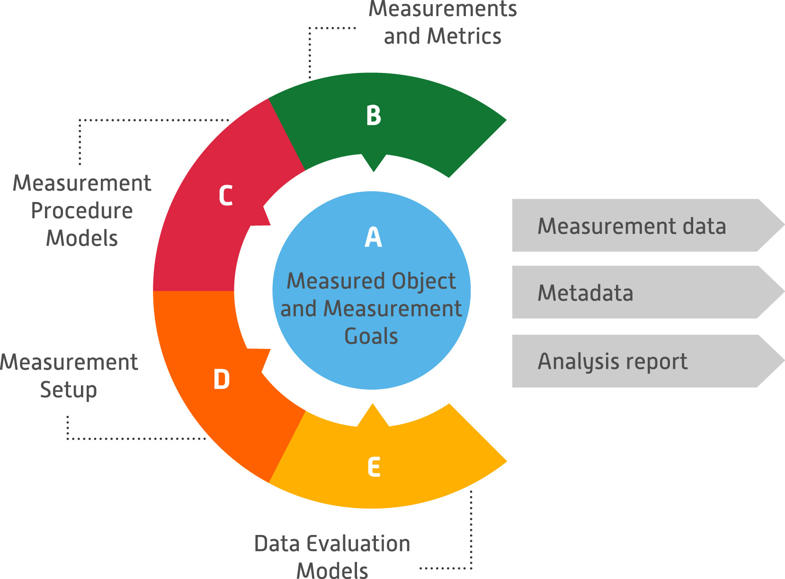

# Messaufbau und Modellierung {#sec-003-messaufbau-modellierung}

In diesem Kapitel werden die Ergebnisse der Analyse, Erstellung und Evaluation einer Methode sowie eines Messaufbaus zur Erfassung und Bewertung der Ressourceneffizienz von Diensten auf geeigneten Hardwarekomponenten vorgestellt. Zudem werden Handlungsempfehlungen für die praktische Anwendung vorgestellt. 

## Entwicklung einer Messmethodik und Evaluation anhand der Labordemonstratoren

Das im Rahmen von EASY entwickelte Green Software Measurement Model (GSMM) dient als übergeordnetes Referenzmodell zur Bewertung der Energie- und Ressourceneffizienz von Softwareprodukten und deren Komponenten @GUL24. Es beschreibt die wesentlichen Elemente der Messung von Energie- und Hardwarenutzung, darunter das Messobjekt, die Messziele, Maßnahmen, Metriken, Verfahrensmodelle, Messaufbauten und Datenauswertungsmodelle. Dadurch unterstützt es die Entwicklung, Planung, Durchführung und Analyse von Messungen zur Energie- und Ressourceneffizienz von Edge-Cloud-Systemen.  

Dabei ist zu berücksichtigen, dass eine Bewertung zunächst nur eine Momentaufnahme darstellt. Einzelwerte wie der Energieverbrauch pro Prozess, die Menge der verarbeiteten Daten oder die genutzten Verschlüsselungsoptionen liefern für sich genommen oft begrenzte Aussagen. Im Verlauf der Weiterentwicklung eines ECS kann eine kontinuierliche Analyse jedoch dazu beitragen, Ressourcen effizienter zu nutzen und dessen Sicherheit und Effektivität zu steigern. Ein fortlaufendes Monitoring ist besonders wichtig, um trotz der anfänglichen Aufwände für Mess- und Analysetools langfristige Vorteile zu erzielen. Den Gesamtaufbau des Green Software Measurement Models zeigt @fig-gsmm.

{#fig-gsmm width="100%" fig-align="center"}

## Darstellung der Messmethodik 

Im Folgenden werden die fünf wesentlichen Bestandteile der Messmethodik anhand des GSMM-Modells beschrieben: 

**Messobjekt und Messziele (A)**

Zunächst muss festgelegt werden, welches Produkt oder welche Komponente eines Edge-Cloud Systems [@EASY24] gemessen werden soll. Das Ziel der Messung kann der Vergleich innerhalb des Entwicklungsprozesses, zwischen verschiedenen Versionen oder zwischen konkurrierenden Produkten sein. Zudem sollte bestimmt werden, welche Funktionen oder Prozesse eine hohe Ressourcenlast verursachen und welche Art von Messung – langfristig, wiederholt oder einmalig – durchgeführt werden soll. 

**Messungen und Metriken (B)**

Die Auswahl geeigneter Metriken hängt von den Messzielen, der verwendeten Hard- und Software sowie den spezifischen Anforderungen im jeweils betrachteten Edge-Cloud System ab. In vielen Fällen werden Metriken wie beispielsweise CPU-Auslastungen, Speicherverbräuche, Latenzen, Netzwerkauslastungen oder Laufzeiten benötigt, um die Performance von Anwendungen bewerten und Optimierungsentscheidungen treffen zu können.  

**Messverfahren (C)**

Auf Basis der definierten Ziele und Metriken wird das Messverfahren entwickelt. Dazu gehört die Definition der Messmethode, die Auswahl von Tools und die Gestaltung von Szenarien (z. B. Leerlauf, Nutzung oder Lasttests). Szenarien können automatisiert oder manuell ausgeführt werden. Es wird unterschieden zwischen Black-Box- und White-Box-Messungen, je nachdem, ob der Fokus auf dem Gesamtverbrauch oder auf einzelne Funktionen gelegt wird. 

**Messaufbau (D)**

Der Messaufbau umfasst die benötigte Hardware und Software für die Datenerfassung. Hierzu zählen Messgeräte, Logging-Tools und Betriebssysteme zur Durchführung von Messungen. Zudem müssen Parameter wie Messgenauigkeit, Abtastrate und mögliche Fehlerquellen berücksichtigt werden. Abhängig vom Setup können Messungen entweder softwarebasiert oder mit externer Hardware durchgeführt werden. 

**Datenauswertung (E)**

Nach der Datenerfassung erfolgen die Visualisierung und die Analyse der Messergebnisse. Dies kann durch Mittelwerte, Standardabweichungen oder inferenzstatistische Methoden erfolgen. Energieverbrauch wird meist als Integral der Leistungsaufnahme über die Zeit berechnet. Die Ergebnisse werden in Diagrammen oder Tabellen aufbereitet und können zur Optimierung von Edge-Cloud Systemen hinsichtlich Energie- und Ressourceneffizienz genutzt werden. 

## Handlungsempfehlungen zur Anwendung

Vor der Durchführung von Messungen in Edge-Cloud-Systemen muss definiert werden, welche Komponenten oder Prozesse untersucht werden sollen. Die Messziele können z. B. den Vergleich innerhalb des Entwicklungszyklus oder zwischen konkurrierenden Systemen umfassen. Besonders wichtig ist die Identifikation von ressourcenintensiven Prozessen, um Optimierungspotenziale zu entdecken. Ebenso sollte festgelegt werden, ob Messungen einmalig, periodisch oder langfristig erfolgen sollen. Die Bestimmung geeigneter Metriken hängt von den spezifischen Anforderungen des Edge-Cloud-Systems sowie der eingesetzten Hard- und Software ab. Während Entwickler detaillierte Analysen zu Effizienz und Ressourcenverbrauch benötigen, sind für Endnutzer oft einfachere Kennzahlen wie Reaktionszeit, Speicherbelegung oder Netzwerkauslastung entscheidend, die auch abhängig vom jeweiligen Client-Gerät sind. Zu den relevanten Metriken gehören beispielsweise CPU- und Speicherverbrauch, Energieeffizienz und Latenzzeiten. Basierend auf den definierten Messzielen und Metriken muss ein geeignetes Messverfahren entwickelt oder ausgewählt und ggf. angepasst werden. Dazu gehört die Festlegung der Messmethodik, die Auswahl geeigneter Messwerkzeuge sowie die Definition von Nutzungsszenarien. Szenarien können dabei entweder manuell oder automatisiert getestet werden, beispielsweise durch Lasttests oder Simulationen im Echtbetrieb. 

Ein gut durchdachter Messaufbau ist entscheidend für die Validität der Messergebnisse. Dies umfasst die Auswahl geeigneter Hardware- und Softwaretools zur Datenerfassung, darunter Logging-Software, Monitoring-Tools und externe Messgeräte. Faktoren wie Messgenauigkeit, Abtastrate, sowie potenzielle Fehlerquellen und Umgebungseinflüsse müssen berücksichtigt werden, um aussagekräftige Ergebnisse zu gewährleisten. Die Messungen können entweder softwarebasiert oder mit externer Hardware erfolgen, abhängig von den verfügbaren Ressourcen und Anforderungen. Nach der Datenerhebung erfolgt die Analyse und Visualisierung der Ergebnisse. Hierbei können deskriptive Statistiken (insb. Mittelwert, Standardabweichung) und inferenzstatistische Verfahren (insb. t-Tests zum Mittelwertvergleich) zur Anwendung kommen. Die gesammelten Daten sollten leicht verständlich aufbereitet und dargestellt werden und als Grundlage für Optimierungen der Energieeffizienz und Ressourcennutzung innerhalb des Edge-Cloud-Systems dienen. 

Basierend auf den gewonnenen Erkenntnissen sollten gezielte Maßnahmen zur Optimierung des Systems ergriffen werden. Hierzu gehören beispielsweise die Anpassung von Algorithmen, der Austausch von Bibliotheken und die Verbesserung von Lastverteilungsstrategien. Eine kontinuierliche Messung und Überwachung hilft langfristige Trends zu identifizieren und das System schrittweise weiterzuentwickeln. 

