# Demonstratoren {#sec-003-szenarien-demonstratoren}

Dieses Kapitel präsentiert verschiedene Forschungsdemonstratoren zur Evaluierung der Energie- und Dateneffizienz von KI-gestützten Systemen in industriellen Anwendungen. Anhand praktischer Szenarien wird untersucht, wie durch gezielte Optimierungsmaßnahmen sowohl der Energieverbrauch als auch die benötigte Datenmenge erheblich reduziert werden können.

Die vorgestellten Demonstratoren folgen einer einheitlichen Methodik, die von der Definition der Messobjekte und -ziele über den systematischen Messaufbau bis zur Auswertung der erfassten Daten reicht. Dabei werden relevante Metriken wie Energieverbrauch, Datenmengen, Erkennungsraten und Latenzzeiten analysiert. Die Untersuchungen umfassen sowohl bildbasierte Fehlererkennungssysteme als auch den Vergleich verschiedener Hardwareplattformen für maschinelles Lernen und zeigen konkrete Einsparpotenziale auf.

Die gewonnenen Erkenntnisse liefern eine fundierte Grundlage zur Bewertung von Trade-offs zwischen Rechenleistung, Energieverbrauch und Dateneffizienz und unterstreichen die Relevanz intelligenter Lastverteilung zwischen Edge- und Cloud-Infrastrukturen für nachhaltige KI-Anwendungen.

## Demonstrator zur Fehlererkennung in der additiven Fertigung

Für den konkreten Anwendungsfall zur Erfassung der Energie- und Dateneffizienz eines Systems zur Fehlererkennung im Anwendungsgebiet des 3D-Drucks dient das Green Software Measurement Model (GSMM) als Vorgehensmodell. Das folgende Schaubild veranschaulicht die verschiedenen Ebenen und Komponenten des untersuchten Fehlererkennungssystems (System under Test (SuT)). Den schematischen Aufbau des Demonstrators zur additiven Fertigung zeigt @fig-3d-druck. Die im Demonstrator eingesetzte Hardware ist in @fig-3d-druck-hardware dokumentiert.

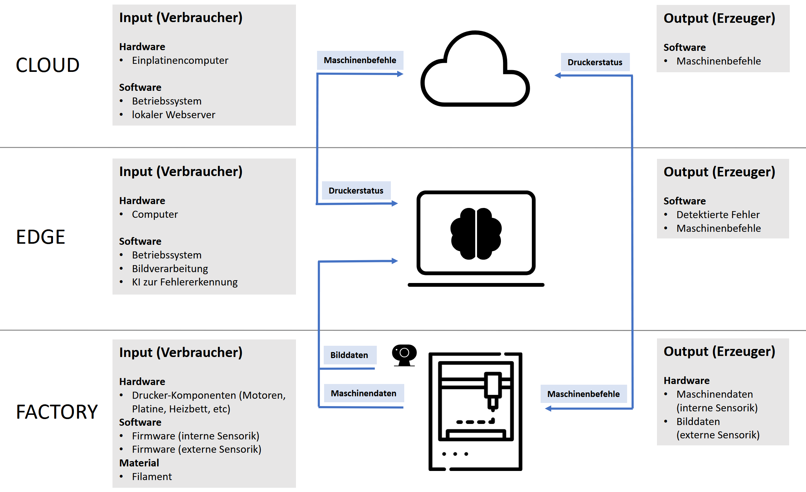{#fig-3d-druck width="100%" fig-align="center"}

**Messobjekt und Messziele (A)**

Um die Energie- und Dateneffizienz eines bildbasierten Fehlererkennungssystems im 3D-Druck zu bestimmen, wird zunächst das zu messende Objekt definiert. Hierbei handelt es sich um die IKT-Komponenten des Systems, die zur Fehlererkennung verwendet werden. Das Hauptziel ist es, die Dateneffizienz zu optimieren, das heißt, die Menge der für eine erfolgreiche Fehlererkennung benötigten Daten zu minimieren, ohne dabei die Erkennungsgenauigkeit zu beeinträchtigen.

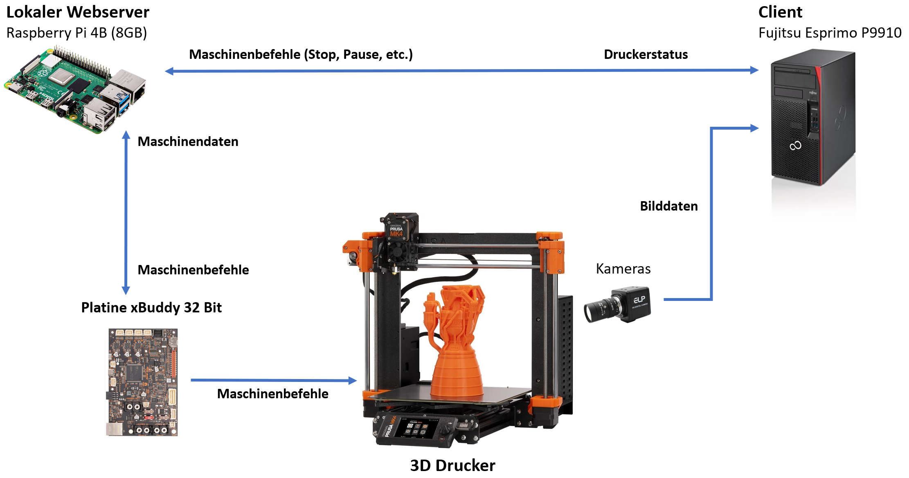{#fig-3d-druck-hardware width="100%" fig-align="center"}

**Messungen und Metriken (B)**

Im nächsten Schritt werden die relevanten Metriken festgelegt. Für das bildbasierte Fehlererkennungssystem wurden in diesem Forschungsprojekt exemplarisch die Metriken Datenmenge, Erkennungsrate (Präzision, Recall, F1-Score) sowie Energiebedarf analysiert. Diese Metriken dienen dazu, den Einfluss der Datenmenge auf die Leistung und die Energieeffizienz des Systems sichtbar zu machen.

**Messverfahren (C)**

Zur Messung des Energiebedarfs wurde ein fehlerfreier und vollständiger Druck sowie ein fehlerbehafteter und vorzeitig abgebrochener Druck erstellt. Im Rahmen der Messung wird das Potenzial zur Energieeinsparung durch den Vergleich eines vollständigen Drucks mit einem frühzeitig abgebrochenen Druck aufgrund eines identifizierten Fehlers analysiert.

**Messaufbau (D)**

Als Testobjekt diente ein herkömmlicher Würfel (3 cm Kantenlänge), der bei einer Betttemperatur von 75°C und einer Düsentemperatur von 230°C gedruckt wurde. Zur Erfassung des Energiebedarfs wurde das Messgerät Janitza Power Analyser UMG6042 eingesetzt. Während der Analyse wurden alle notwendigen IKT-Komponenten überwacht. Hierzu zählen Beleuchtung, Kamera und der Rechner mit laufendem Fehlererkennungssystem. Zur Referenzierung wurde zunächst eine Baseline-Messung ohne Ausführung der Fehlererkennung durchgeführt, um den zusätzlichen Energieverbrauch durch das Fehlererkennungssystem isolieren zu können. Parallel dazu erfasste eine Gude-Messleiste den Energieverbrauch des 3D-Druckers unter verschiedenen Bedingungen – sowohl bei fehlerfreien Druckvorgängen als auch bei vorzeitig abgebrochenen Drucken nach Fehlererkennung. Die @fig-3d-druck-hardware, @fig-3d-druck-messaufbau und @fig-3d-druck-vorzeitiger-abbruch zeigen den Messaufbau mit Messrechner und exemplarischer Messung (links) und dem Versuchsaufbau mit 3D-Drucker (rechts).

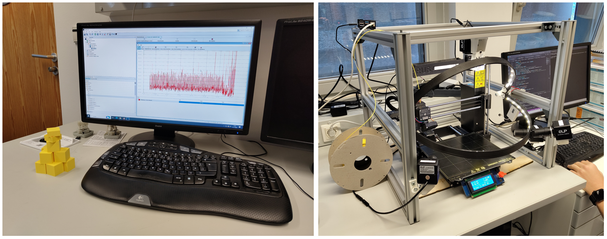{#fig-3d-druck-messaufbau width="100%" fig-align="center"}

**Datenauswertung (E)**

Der für die Energiemessung verwendete Messaufbau ist in @fig-3d-druck-messaufbau dargestellt. Die beiden gegenübergestellten Szenarien — mit und ohne automatisierten Abbruch — sind in @fig-3d-druck-vorzeitiger-abbruch visualisiert. Die gemessenen Daten bieten eine solide Grundlage zur Bewertung des Einflusses der Fehlererkennung auf den Energieverbrauch des Druckers. Die Auswertung der Messwerte zeigte, dass der vollständige Druck 44 Minuten und 4 Sekunden benötigte und 90,90 Wh verbrauchte, während der abgebrochene Druck nach 25 Minuten und 30 Sekunden mit 51,08 Wh auskam. Dadurch wurde eine Energieeinsparung von etwa 39,82 Wh, also 44%, erzielt. Die Ergebnisse belegen, dass die kürzere Druckdauer der Hauptfaktor für den Unterschied im Energieverbrauch ist, was eine erhebliche Reduktion des Energie- und Materialverbrauchs ermöglicht.

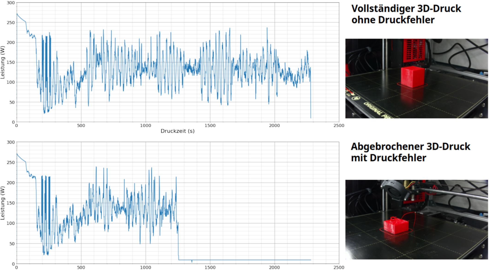{#fig-3d-druck-vorzeitiger-abbruch width="100%" fig-align="center"}

Bei der Betrachtung des Gesamtenergieverbrauchs aller IKT-Komponenten, die neben dem 3D-Drucker zur Fehlererkennung eingesetzt wurden, wurde deutlich, dass der Desktop-PC inklusive der angeschlossenen Kameras mit 88,9% den größten Anteil am Gesamtenergieverbrauch hat, während der Energiebedarf der Beleuchtung nur 3,6% beträgt. Diese Werte verdeutlichen, dass eine Portierung des Fehlererkennungssystems auf eine ressourcenschonendere Hardware den Energiebedarf des Gesamtsystems erheblich senken kann.

Die in der folgenden Abbildung dargestellten Ergebnisse verdeutlichen, dass die Fehlererkennungssoftware in unserem System under Test (SuT) insbesondere unter hoher Last einen erheblichen Energieaufwand erfordert. Während des Betriebs mit aktivierter Fehlererkennung und Druckabbruch lag der durchschnittliche Energieverbrauch bei 38,92 W, was einer Erhöhung um 9,33 W gegenüber der Basis entspricht. Zudem stiegen sowohl der minimale als auch der maximale Energieverbrauch deutlich auf 33,25 W bzw. 51,48 W, verglichen mit den Basiswerten von 27,40 W und 32,03 W.

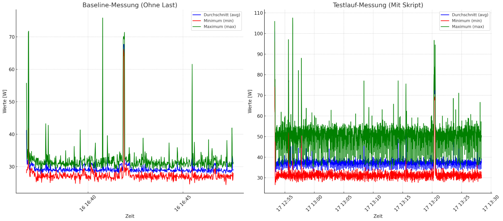{#fig-3d-druck-anteil-energie-2 width="100%" fig-align="center"}

Bei der Verarbeitung von Bilddaten in Echtzeit spielt die Datenmenge eine große Rolle. Für die Übertragung der Daten in einem Netzwerk ist eine Vorverarbeitung der Daten sehr sinnvoll, um die Netzwerklast und die Latenz zu reduzieren. Durch die Extraktion der wichtigsten Informationen mit einem Convolutional Neural Network (CNN) gelingt es, die Datenmenge eines Bildes von 95,38 KB auf 8,03 KB zu reduzieren. Hierdurch werden 91,58 % der Informationen verworfen, sodass nur noch die wichtigsten Bildinformationen erhalten bleiben, was sich positiv auf alle folgenden Schritte in der Datenverarbeitung auswirkt.

### Bewertung der Ergebnisse

Die durchgeführte Analyse verdeutlicht, dass die Software zur Fehlererkennung sowohl im Normalbetrieb als auch während der Erkennung von Fehlern einen erheblichen Energiebedarf aufweist. Insbesondere der hohe maximale Energieverbrauch lässt auf ressourcenintensive Berechnungen schließen, die direkt auf der Edge-Ebene ausgeführt werden. Dies unterstreicht die Relevanz energieeffizienter Algorithmen sowie einer intelligenten Lastverteilung, um die vorhandenen Rechenressourcen optimal zwischen Edge- und Cloud-Infrastrukturen zu nutzen und so den Energieverbrauch gezielt zu reduzieren.

## Lüftungsdemonstrator

{#fig-lueftung width="100%" fig-align="center"}

**Messobjekt und Messziele (A)**

Der Lüftungsdemonstrator in Kombination mit dem AI on Device Board dient als weiteres Referenzszenario zur Anwendung der entwickelten Methodik. Ziel ist es, den Energieverbrauch, die Latenzzeiten bei der Verarbeitung eingehender Sensordaten sowie den Datendurchsatz im laufenden Betrieb zu bestimmen. Darüber hinaus soll die Effizienz verschiedener Modellvarianten (z. B. unterschiedlich quantisierte Netze) im realen Nutzungskontext bewertet werden. Ziel ist es, die weiteren Demonstratoren wie den Lüftungsdemonstrator und eine Gefahrenstofferkennung mit Hilfe der genannten Hardware umzusetzen. Den Aufbau des Lüftungsdemonstrators zeigt @#fig-lueftung.

**Metriken (B)**

Die Messgrößen umfassen die mittlere Inferenzdauer, den Arbeitsspeicher- und CPU-Bedarf auf ESP32 und Raspberry Pi, die Energieaufnahme sowie die über ESP-NOW übertragenen Datenmengen. Damit lassen sich sowohl Ressourcen- als auch Dateneffizienz vergleichen.

**Messverfahren (C)**

Die Messungen erfolgen durch Ausführen verschiedener maschineller Lernmodelle auf der erstellten Hardware. Für die Kommunikation wird ESP-NOW genutzt, sodass der Demonstrator bei Bedarf auch in ein verteiltes Setup integriert werden kann.

**Messaufbau (D)**

Als Benchmark dient das Mnist Dataset sowie ein über den Demonstrator aufgenommenes Lüftungsdataset. Zur Erfassung des Energiebedarfs wurde ebenfalls das Messgerät Janitza Power Analyser UMG6042 eingesetzt. Zur Bestimmunge der Energieeffizienz wurde die Modellberechnung für ein LSTM, RNN, MLP und CNN zunächst auf der AI on Device Hardware als auch einem GPU basierten Rechnersystem mit einer GTX 1060 ausgeführt. Zur Referenzierung wurde zunächst eine Baseline-Messung ohne Modellberechnung vorgenommen. Wird der Wert der Baselinemessung nun mit den Ergebnissen der Algorithmen verrechnet erhält man den Bedarf der Algorithmen für die jeweilige Hardware.

**Auswertung (E)**

Die erfassten Daten werden zunächst deskriptiv ausgewertet und anschließend inferenzstatistisch verglichen. Damit lassen sich Unterschiede zwischen Modellvarianten sowie die Effekte verschiedener Übertragungs- und Ausführungsmodi belegen.

Ein ergänzender Vergleich der Energieeffizienz wurde zwischen einem Raspberry Pi 4 und einem klassischen PC-System mit integrierter Grafikeinheit durchgeführt. Ziel war es, zu untersuchen, inwieweit sich die Ausführung typischer Trainingsaufgaben auf ressourcenschwacher, aber energieeffizienter Hardware gegenüber einem leistungsstärkeren Desktop-System unterscheidet.

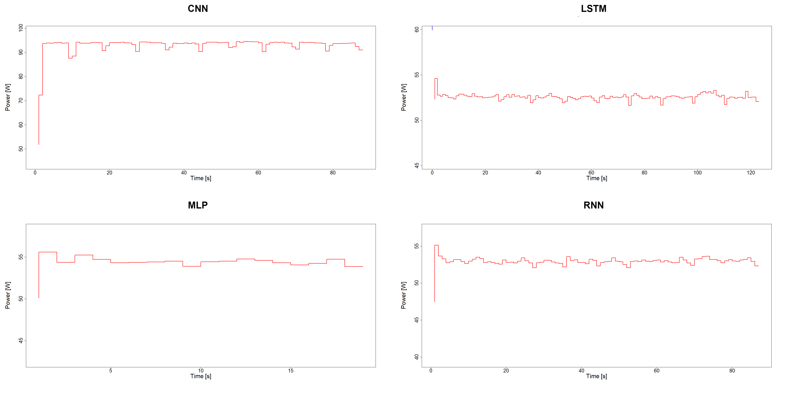{#fig-messung-pc width="100%" fig-align="center"}

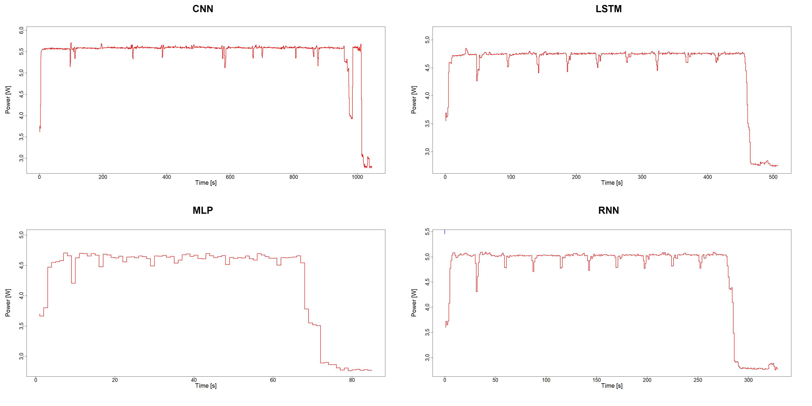{#fig-messung-pi width="100%" fig-align="center"}

Die Ergebnisse zeigen, dass der Raspberry Pi zwar eine deutlich längere Rechenzeit für die betrachteten Modelle benötigt, dieser Nachteil jedoch durch den geringeren Grundverbrauch kompensiert wird. Beim Training eines Convolutional Neural Network (CNN) lag der Energieverbrauch des Raspberry Pi bei 1,52 Wh, während der PC hierfür 2,24 Wh benötigte – eine Einsparung von rund 32 %. Noch ausgeprägter war der Unterschied beim LSTM, bei dem sich eine Einsparung von 65 % ergab. Für MLP und RNN lag die Reduktion sogar bei jeweils 69 %.

Damit wird deutlich, dass auch komplexere Modelle auf einem Raspberry Pi in akzeptabler Zeit trainiert werden können und dabei erheblich weniger Energie verbrauchen als auf einem konventionellen Desktop-System. Gleichzeitig zeigt die Auswertung, dass für viele Anwendungsfälle im Bereich des Edge-Computing keine dedizierte GPU erforderlich ist. Der Raspberry Pi erfüllt die gestellten Anforderungen sowohl hinsichtlich Mobilität als auch Energieeffizienz, während der PC vor allem durch seine höhere Rechengeschwindigkeit punktet.

Die Messergebnisse verdeutlichen somit die Trade-offs zwischen Energieverbrauch und Trainingsdauer und liefern eine belastbare Grundlage für die Bewertung von Hardwarealternativen. Sie unterstreichen zudem die Relevanz der entwickelten Methodik, da sich anhand standardisierter Metriken wie Energieaufnahme pro Trainingsepoche oder pro Modellvariante objektiv aufzeigen lässt, welche Plattform im Hinblick auf Ressourcenschonung besser geeignet ist. Die Ergebnisse der vergleichenden Messung sind in @fig-messung-pc und @fig-messung-pi zusammengefasst.

## Evaluation und Weiterentwicklung der Methodik

Die wissenschaftliche Weiterentwicklung der Methodik kann sowohl die Anpassung an verschiedene Architekturen zur Bewertung der Ressourcennutzung als auch die Integration von KI-gestützten Prognosemodellen zur Vorhersage und Optimierung des Energieverbrauchs umfassen. Anhand empirischer Studien kann die Korrelation zwischen Software-Metriken und Energieverbrauch gemessen werden – wie dies bereits in Teilen in @FAZ24 im Rahmen des Forschungsprojekts umgesetzt wurde. Beim Einsatz bildbasierter Fehlererkennung mithilfe verschiedener Bildklassifizierungsalgorithmen (bzgl. Demonstrator zur Fehlererkennung) ist es essenziell, unterschiedliche Architekturen im Hinblick auf ihre Energie- und Dateneffizienz zu untersuchen. In @FAZ24 wurden hierzu u. a. populäre Bildklassifizierungsalgorithmen systematisch verglichen, um belastbare Erkenntnisse über Ressourcenbedarf und Leistungsfähigkeit zu gewinnen. Des Weiteren kann die Entwicklung von Standards und Normen zur Bestimmung der Ressourceneffizienz von Edge-Cloud Systemen ein weiterer Baustein für eine effizientere Produktion sein. Durch den vermehrten Einsatz von Anwendungen der generativen Künstlichen Intelligenz besteht auch ein Bedarf an Metriken, die dabei helfen, den Ressourcenbedarf dieser Systeme zu erfassen und zu verbessern. Hierzu gibt es bereits erste Ansätze, die im Rahmen des Forschungsprojekts entwickelt wurden @BAS24. Das GSMM hat sich auch in weiteren Arbeiten und Publikationen als Vorgehensmodell bewährt. So wurde es beispielsweise in den Veröffentlichungen @FAZ24 und @CET241 erfolgreich angewendet. Bei letzterer half die Methodik, durch gezielte Vorverarbeitungsoptimierungen Energieeinsparungen zu erzielen, wobei andere multivariate Zeitreihendaten und Architekturen als bei den oben genannten Demonstratoren analysiert wurden. Darüber hinaus kam das GSMM insbesondere nochmals im Kontext des Lüftungsdemonstrators in AP4.3 (AP4.3.4 und AP4.3.6) zum Einsatz.

Ein weiterer Demonstrator (@flenergy) wurde im Projektkontext realisiert, um die Potenziale föderierter Lernverfahren im Hinblick auf Energieeffizienz und Ressourcenschonung zu verdeutlichen. Der Demonstrator wurde entwickelt, um die Potenziale föderierter Lernverfahren hinsichtlich Energieeffizienz und Ressourcenschonung empirisch zu untersuchen. Damit adressiert der Demonstrator zentrale Fragestellungen im Bereich der Green AI und ergänzt die bisherige methodische Evaluation um praxisorientierte Einsichten.

**Messobjekt und Aufbau**

Der Demonstrator umfasst eine zentrale Serverkomponente (@fig-vl-2) sowie vier Edge-Clients (@fig-vl-1) auf Jetson-Nano-Basis. Während der Server die Aggregation der lokal trainierten Modelle steuert und über ein Touch-Display die Ergebnisse visualisiert, führen die Edge-Clients die Trainingsprozesse aus und erfassen parallel Leistungsdaten wie CPU- und GPU-Auslastung, Stromverbrauch und Speicherbedarf. Diese Kennzahlen werden in Echtzeit über ein 7-Zoll-Touch-Display dargestellt.

Die Architektur bildet den vollständigen Ablauf föderierter Lernverfahren ab, wobei die Rohdaten auf den jeweiligen Edge-Geräten verbleiben. Dadurch wird ein praxisnahes Szenario für dezentrale Datenverarbeitung geschaffen, das die Ressourcennutzung systematisch analysierbar macht. Die Möglichkeit zur Eingabe handgeschriebener Ziffern dient nicht nur der Demonstration der Modellfunktionalität, sondern zugleich der Validierung, indem die Systemreaktionen direkt mit den gemessenen Ressourcendaten in Beziehung gesetzt werden können. Der Demonstrator stellt somit ein experimentelles Testfeld zur Untersuchung der Energieeffizienz föderierter Lernansätze dar. Den serverseitigen Aufbau sowie die Netzwerkanbindung des Flenergy-Demonstrators zeigt @fig-vl-1.

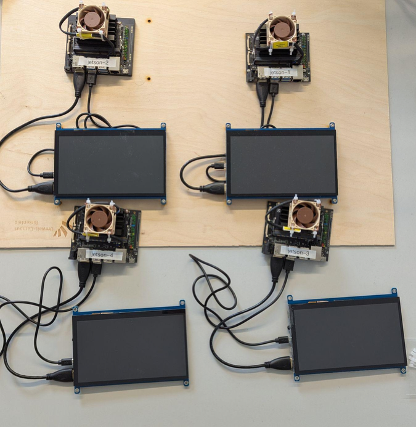{#fig-vl-1 width="100%" fig-align="center"}

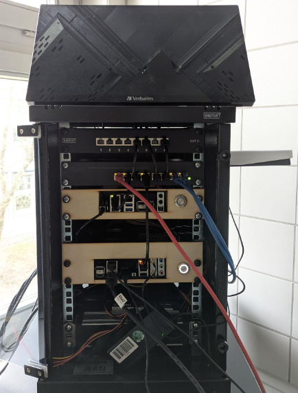{#fig-vl-2 width="100%" fig-align="center"}

**Use Case und Vorgehen**

Als Anwendungsfall wurde der MNIST-Datensatz herangezogen, der im Kontext föderierter Lernverfahren eine etablierte Vergleichsbasis darstellt. Im Gegensatz zu zentralisierten Ansätzen wurde der Datensatz bewusst ungleichmäßig auf die Edge-Clients verteilt, sodass jeder Knoten lediglich über eine Teilmenge der Ziffern verfügte. Erst durch die Aggregation im Rahmen des föderierten Lernens entstand ein globales Modell, das sämtliche Ziffern zuverlässig klassifizieren konnte, ohne dass Rohdaten an den Server übertragen werden mussten. Dieses Vorgehen reduzierte sowohl den Netzwerkverkehr als auch die Serverlast und ermöglichte gleichzeitig die Untersuchung eines praxisnahen Szenarios für dezentrale Trainingsprozesse.

**Messung des Ressourcenverbrauchs**

Zur Erfassung der Ressourcennutzung auf den Jetson Nanos wurde das Tool jetson-stats1 integriert. Dieses ermöglicht die kontinuierliche Visualisierung zentraler Leistungsparameter, darunter CPU- und GPU-Auslastung, Stromverbrauch sowie Speicherbedarf. Die Daten werden in Echtzeit aufgezeichnet und bereitgestellt, wodurch sowohl die Performance des föderierten Lernansatzes als auch dessen Energieprofil transparent nachvollzogen werden konnte. Damit wurde eine methodische Grundlage geschaffen, um Effizienz und Belastung unterschiedlicher Systemkomponenten systematisch zu evaluieren.

**Wesentliche Erkenntnisse**

Im Verlauf der Implementierung zeigte sich, dass die GPU-Ressourcen der Jetson-Nano-Boards trotz vorhandener Hardwarefähigkeiten nicht genutzt werden konnten. Ursache hierfür ist eine Inkompatibilität zwischen den für das Flower-Framework erforderlichen Softwarekomponenten und den verfügbaren JetPack-Versionen: Während JetPack 4.0 GPU-Zugriffe unterstützt, ist es auf Python-Versionen unterhalb von 3.9 beschränkt. Neuere JetPack-Versionen bieten zwar die erforderliche Python-Kompatibilität, werden jedoch für den Jetson Nano nicht mehr bereitgestellt.
Diese Konstellation verdeutlicht das Problem einer softwareinduzierten Hardware-Obsoleszenz, bei der leistungsfähige Hardware aufgrund mangelnder Softwarepflege nicht in vollem Umfang genutzt werden kann. Der Demonstrator liefert damit nicht nur empirische Erkenntnisse zur Energieeffizienz föderierter Lernverfahren, sondern verweist zugleich exemplarisch auf die Abhängigkeit zwischen Hard- und Software, die die nachhaltige Nutzung von KI-Infrastrukturen maßgeblich beeinflusst.

## Erstellung einer AI on Device Hardware

Die Entwicklung einer eigenen AI-on-Device Hardware verfolgte das Ziel, ein praktisches und zugleich flexibles System zu schaffen, mit dem sich die im Rahmen von AP3 entwickelten Konzepte zur Messung und Bewertung von Ressourcen-, Energie- und Dateneffizienz prototypisch erproben lassen. Während herkömmliche PC- oder Cloud-Infrastrukturen zwar eine hohe Rechenleistung bereitstellen, sind sie im Hinblick auf Energieaufnahme, Datenvolumen und Reproduzierbarkeit von Messungen für den Einsatz im EASY-Kontext nur eingeschränkt geeignet.

### Anforderungen

Das AI-on-Device Board adressiert diese Anforderungen durch eine klare Trennung von Aufgaben: Eine Sensing-Node auf Basis eines ESP32 übernimmt die kontinuierliche Datenerfassung und die lokale Inferenz, während eine Model-Node auf Basis eines Raspberry Pi 4 nur bei Bedarf aktiviert wird, um Trainings- oder Konvertierungsprozesse durchzuführen. Auf diese Weise entsteht eine Hardware, die sowohl energieeffizient im Dauerbetrieb als auch flexibel in der Funktionserweiterung ist. Weitere Anforderungen bestanden in einer stabilen und reproduzierbaren Betriebsweise, einer einfachen Messbarkeit von Energie- und Rechenparametern sowie einer Vernetzbarkeit mehrerer Knoten zur Unterstützung föderierter Lernverfahren.

### Architekturübersicht

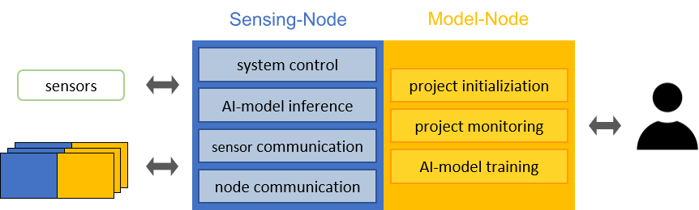{#fig-ai-nodesplit width="100%" fig-align="center"}

Das Gesamtsystem folgt einer modularen Architektur. Im Mittelpunkt steht die Sensing-Node (ESP32), die als dauerhafte Komponente in Betrieb ist und Sensordaten erfasst, erste Vorverarbeitungsschritte durchführt und Inferenzläufe mit eingebundenen Modellen ausführt. Ergänzend steht die Model-Node (Raspberry Pi 4) zur Verfügung, die bedarfsorientiert zugeschaltet wird. Ihre Aufgaben umfassen das Modelltraining auf Grundlage lokaler oder übertragener Daten, die Konvertierung trainierter Modelle in ein für Mikrocontroller ausführbares TFLite-Format sowie die Bereitstellung dieser Modelle über die gemeinsame SD-Karte.

Diese Aufgabenteilung reduziert sowohl den Energiebedarf als auch das übertragene Datenvolumen erheblich. Während die ESP32-Node den energiearmen Dauerbetrieb gewährleistet, ist der Raspberry Pi nur dann aktiv, wenn rechenintensive Operationen tatsächlich erforderlich sind. Durch diese Architektur wird ein Gleichgewicht zwischen Flexibilität, Effizienz und Messbarkeit hergestellt, das im EASY-Kontext eine solide Grundlage für die Bewertung von AI-on-Device Ansätzen bildet.

### Schaltungskonzepte und Energiepfade

Ein zentrales Element der Hardware ist die Ausgestaltung der Energiepfade und Schaltmechanismen, um einen stabilen Betrieb bei gleichzeitig minimalem Energieverbrauch sicherzustellen.

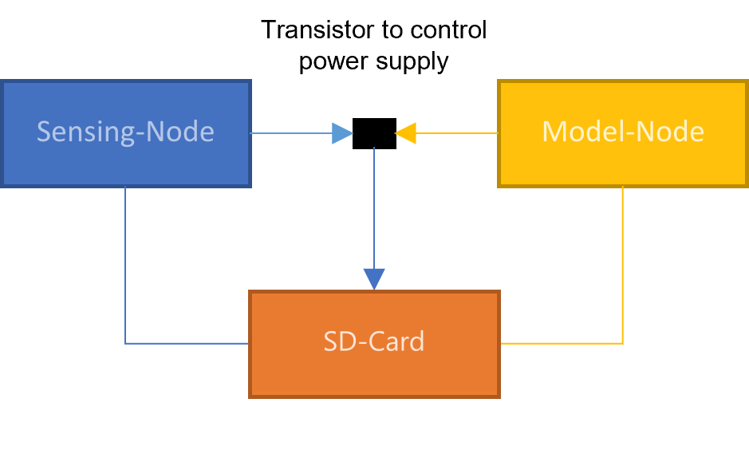{#fig-ai-sdpin width="100%" fig-align="center"}

Die gemeinsame SD-Karte dient als Datenspeicher und ist so ausgeführt, dass sie je nach Betriebszustand entweder durch den Raspberry Pi über SDIO oder durch den ESP32 über SPI angesprochen wird. Damit es beim Wechsel der Zugriffsrechte nicht zu Bus-Kollisionen kommt, werden die ungenutzten Pins jeweils als Eingänge geschaltet. Zusätzlich sorgt eine kurze stromlose Phase für eine saubere Re-Initialisierung der Karte, wodurch ein konsistenter Betrieb gewährleistet bleibt.

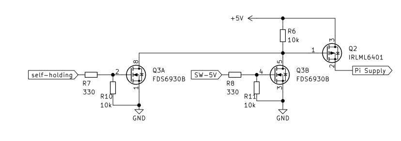{#fig-ai-selbst width="100%" fig-align="center"}

Um den Energieverbrauch des Raspberry Pi zu kontrollieren, wurde ein MOSFET-basierter Abschalt- und Zuschaltmechanismus implementiert. Hierbei ist die 5-Volt-Versorgung des Pi nur dann aktiv, wenn entweder der ESP32 oder der Pi selbst über einen Selbsterhaltungspin ein Freigabesignal liefert. Auf diese Weise bleibt die Model-Node vollständig spannungslos, solange sie nicht benötigt wird.

Ergänzend verfügt die Platine über einen Selbsterhaltungsmechanismus, der insbesondere während Flash-Vorgängen oder bei Wechselzuständen eine stabile Versorgung sicherstellt. Dieser Mechanismus verhindert ungewollte Neustarts des Raspberry Pi und erhöht die Robustheit des Systems im Dauerbetrieb.

Durch diese Kombination aus umschaltbarer SD-Karte, abschaltbarer Model-Node und Selbsterhaltungslogik entsteht ein Schaltungskonzept, das sowohl die Anforderungen an Messbarkeit als auch an Energieeffizienz erfüllt und die Grundlage für reproduzierbare Experimente bildet.

### Softwareintegration

Die Softwarekette des Systems ist entlang eines deterministischen Workflows aufgebaut, der die Entwicklung, Optimierung und Ausführung von KI-Modellen abbildet. Ausgangspunkt ist die Modellerstellung und -schulung auf der Model-Node unter Nutzung gängiger Frameworks wie TensorFlow. Anschließend werden die Modelle mittels Verfahren wie Quantisierung oder Pruning reduziert, um sie speicher- und energieeffizienter zu machen. Darauf folgt die Konvertierung in ein kompaktes .tflite-Modell mit dem TensorFlow Lite Converter.

Zur Einbindung auf der Sensing-Node wird dieses Modell in ein C-Array übersetzt und in die Firmware des ESP32 integriert. Für die Ausführung dient die Bibliothek TensorFlow Lite for Microcontrollers (TFLM), die mit einer statisch dimensionierten Tensor Arena arbeitet. Dieser deterministische Softwarepfad stellt sicher, dass Modellversionen nachvollziehbar bleiben und die Ergebnisse von Messungen reproduzierbar sind.

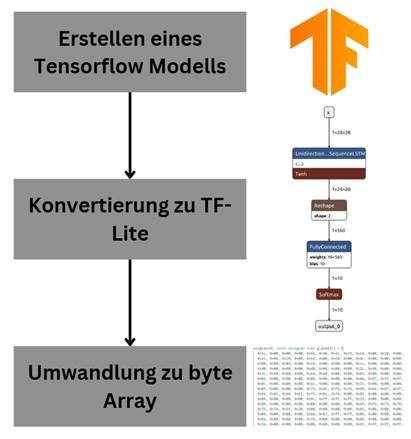{#fig-ai-konvertierung width="40%" fig-align="center"}

Ergänzt wird der Ablauf durch eine einfache Kommando-Schnittstelle zwischen ESP32 und Raspberry Pi. Die Sensing-Node signalisiert Zustände wie „check“, „download start“ oder „build model“, woraufhin die Model-Node die entsprechenden Schritte durchführt. Nach Fertigstellung wird das optimierte Modell zurückgespielt und unmittelbar für Inferenzläufe nutzbar gemacht.

### Automatisierte Modellanpassung

Im Rahmen der Entwicklung des AI-on-Device Boards wurde ein Verfahren entwickelt, das es einem lernenden System ermöglicht, sein verwendetes Modell während des laufenden Betriebs automatisch zu aktualisieren und damit dauerhaft an veränderte Bedingungen anzupassen. Die grundlegende Idee besteht darin, dass das System selbstständig erkennt, wann die Leistungsfähigkeit des aktuellen Modells nicht mehr ausreicht, und daraufhin ein neues Modell erzeugt, das besser zu den aktuellen Datenverteilungen passt.

Der Ablauf gliedert sich in zwei Funktionsbereiche:

  1. Kontinuierliche Datenerfassung und Modellausführung,

  2. Ereignisbasierte Modellaktualisierung, sobald ein Anpassungsbedarf identifiziert wird.

Während der regulären Ausführung werden eingehende Zeitreihendaten fortlaufend mit dem vorhandenen Modell ausgewertet. Parallel dazu prüft das System, ob bestimmte Bedingungen darauf hinweisen, dass sich die Umgebungs- oder Prozessbedingungen so verändert haben, dass das Modell nicht mehr angemessen reagiert. Dies kann zum Beispiel auftreten, wenn langfristige Driftprozesse, saisonale Veränderungen oder geänderte Nutzungsmuster dazu führen, dass die Modellvorhersagen systematisch schlechter werden.

Sobald eine solche Veränderung erkannt wird, wird automatisiert ein neuer Trainingsprozess ausgelöst. Hierzu werden die im Betrieb aufgezeichneten Daten wiederverwendet und um aktuelle Messwerte ergänzt. Auf dieser erweiterten Datengrundlage wird ein aktualisiertes Modell trainiert, das die gegenwärtigen Bedingungen besser abbildet. Anschließend ersetzt das neue Modell das zuvor eingesetzte und wird unmittelbar im weiteren Betrieb genutzt.

Ein wichtiger Aspekt der Konzeption besteht darin, dass ein Retraining nicht permanent, sondern ausschließlich bei tatsächlichem Anpassungsbedarf erfolgt. Auf diese Weise bleibt das System ressourceneffizient und vermeidet unnötige Trainingszyklen. Gleichzeitig stellt der automatische Ablauf sicher, dass das System im Laufe der Zeit flexibel auf Veränderungen reagieren kann, ohne dass manuelle Eingriffe erforderlich sind.

Das entwickelte Vorgehen erzeugt somit einen geschlossenen Kreislauf aus laufender Modellausführung, Überwachung der Modellgüte und ereignisgesteuerter Modellneuberechnung. Dadurch wird ein kontinuierlich lernfähiges System geschaffen, das seine Leistungsfähigkeit auch unter veränderten Rahmenbedingungen langfristig aufrechterhalten kann.

Die beschriebene Methodik zur automatisierten Anpassung der Lernfähigkeit wurde anschließend auf den Demonstrator übertragen und in dessen Gesamtablauf integriert. Dabei dient der Demonstrator als reale Ausführungsumgebung, in der sowohl die kontinuierliche Modellausführung als auch die ereignisgesteuerte Modellneuberechnung praktisch umgesetzt wurden.

In diesem Fall werden die im Demonstratorbetrieb aufgezeichneten Zeitreihendaten gesammelt, aufbereitet und für ein erneutes Training bereitgestellt. Die Modellaktualisierung erfolgt anschließend auf Basis dieser Daten und erzeugt einen Modellstand, der die aktuellen raumklimatischen Verhältnisse besser abbildet. Das neue Modell wird daraufhin in das laufende System integriert und übernimmt ohne Unterbrechung die weitere Auswertung der Echtzeitdaten.

Durch die Umsetzung dieser Methodik kann der Demonstrator langfristig auf Veränderungen reagieren, die beispielsweise durch jahreszeitliche Schwankungen, variierende Nutzergewohnheiten oder Driftprozesse der Klimadynamik entstehen.

### Kommunikation und Vernetzung

Für die Kommunikation zwischen mehreren Boards wird ESP-NOW eingesetzt, ein von Espressif entwickeltes, leichtgewichtiges Peer-to-Peer-Protokoll. Es erlaubt direkte Verbindungen zwischen Knoten ohne Access Point und zeichnet sich durch einen geringen Overhead aus, der den Energiebedarf im Vergleich zu klassischen WLAN-Protokollen deutlich reduziert. Übertragen werden Datenpakete bis zu einer Größe von 250 Byte, die für Modellparameter, Statusmeldungen und Steuerkommandos ausreichen.

Die Architektur unterstützt sowohl 1:1-Verbindungen als auch komplexere Stern-, Ketten- oder Mesh-Topologien. Reichweitentests ergaben, dass mit den integrierten Antennen des ESP32 eine zuverlässige Kommunikation bis zu rund 30 m möglich ist, während im Maximalfall Entfernungen bis zu 50 m erreicht werden können. Damit eignet sich ESP-NOW auch für verteilte Trainingsszenarien in größeren Laborumgebungen, ohne dass zusätzliche Infrastruktur benötigt wird.

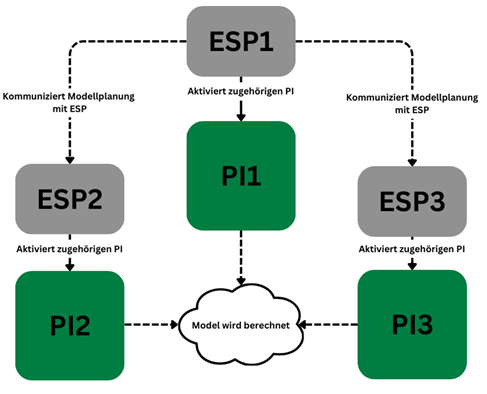{#fig-fedlearn width="60%" fig-align="center"}

Für verteilte Trainingsszenarien ist die Hardware so ausgelegt, dass mehrere Boards über ESP-NOW in einer Föderation zusammenarbeiten können. Dabei übernimmt eine Sensing-Node die Rolle des Koordinators: Sie aktiviert die beteiligten Knoten, verteilt die initialen Modellgewichte und startet anschließend den Trainingsprozess. Jede Model-Node führt lokal ein Training auf den ihr vorliegenden Daten durch und berechnet dabei angepasste Modellparameter.

Nach Abschluss einer Trainingsrunde werden ausschließlich die Gewichtsänderungen (Gradienten oder Teilparameter) über ESP-NOW an den Koordinator zurückgesendet. Dieser aggregiert die eingegangenen Updates, beispielsweise durch Mittelung, und verteilt das neue globale Modell wieder an die Teilnehmer. Auf diese Weise wird ein vollständiger Lernprozess über mehrere Runden realisiert, ohne dass Rohdaten zwischen den Knoten ausgetauscht werden müssen (@sec-004-fl-intro).

Die Tests zeigten, dass bei gleichmäßiger Datenverteilung die Loss-Kurven im föderierten Training nahezu identisch zum zentralisierten Training verlaufen. Bei heterogenen Datenbeständen lassen sich dennoch robuste Ergebnisse erzielen, wobei die Kommunikation über ESP-NOW durch ihren geringen Overhead den Energie- und Zeitaufwand für den Austausch der Modellparameter gering hält. Damit ermöglicht das Board nicht nur den Betrieb einzelner Nodes, sondern auch die Untersuchung und Evaluation von föderierten Lernverfahren im Laborumfeld.

### Evaluation und Einsatz im EASY-Kontext

Die entwickelte Hardware wurde in ersten Messungen erprobt und mit klassischen PC-Systemen verglichen. Dabei zeigte sich, dass der Raspberry Pi bei Trainingsaufgaben zwar deutlich längere Laufzeiten aufweist, jedoch durch seinen geringen Grundverbrauch in der Gesamtbilanz erheblich energieeffizienter ist. Damit konnte belegt werden, dass auch komplexere Modelle auf ressourcenschwacher, aber energieeffizienter Hardware ausgeführt werden können, ohne dass dafür eine dedizierte GPU erforderlich ist.

Zusätzlich wurde gezeigt, dass durch die bedarfsgerechte Zuschaltung der Model-Node weitere Einsparpotenziale erschlossen werden. Im Verbund mit der leichten Vernetzbarkeit über ESP-NOW eröffnen sich neue Möglichkeiten für föderierte Lernansätze, bei denen nicht mehr vollständige Datensätze, sondern lediglich Modellgewichte ausgetauscht werden. Dies reduziert sowohl das Kommunikationsvolumen als auch die Abhängigkeit von zentralen Serverstrukturen und stärkt den Datenschutz.

Insgesamt stellt das AI-on-Device Board damit ein praxisnahes Mess- und Bewertungsobjekt dar, das die im EASY-Projekt entwickelten methodischen Rahmenwerke in eine konkrete technische Umsetzung überführt. Es erlaubt die Untersuchung realer Energie- und Datenflüsse und bietet so die Grundlage für eine belastbare Weiterentwicklung ressourceneffizienter KI-Systeme.

## Umsetzung der Demonstratoren

Der Lüftungsdemonstrator wurde entwickelt, um raumklimatische Bedingungen zu simulieren und die Wirkung von Lüftungsvorgängen zu erfassen. Hierfür ist ein Aufbau vorgesehen, der einen Raum mit zwei Fenstern nachbildet und eine Vielzahl relevanter Umweltparameter misst. Zentrale Komponente ist ein IoT-Mikrocontroller (Octopus-Plattform), ausgestattet mit einem BME680-Sensor zur Erfassung von Temperatur, Luftfeuchtigkeit, Luftdruck und flüchtigen organischen Verbindungen (VOCs). Zusätzlich ist ein SCD30-Sensor integriert, der präzise CO₂-Messungen ermöglicht. Zwei Reed-Schalter an den Fenstern erkennen deren Zustand (geschlossen, geöffnet oder gekippt) und liefern so den Kontext für die Ventilationssituation. Zur Simulation der Anwesenheit von Personen wird eine Flasche mit kohlensäurehaltigem Wasser in den Versuchsraum gestellt, um CO₂-Emissionen nachzuahmen.

Die Daten werden in kurzen Intervallen erfasst und zu Sequenzen verarbeitet, die den zeitlichen Verlauf von Umweltbedingungen abbilden. Auf diese Weise lassen sich Zustandsübergänge – etwa das Öffnen oder Schließen eines Fensters – zuverlässig detektieren und klassifizieren. Für die Speicherung und Visualisierung kommt im Originalaufbau eine Kombination aus Raspberry Pi, InfluxDB und Grafana zum Einsatz.

In Verbindung mit AI-on-Device Board lässt sich der Demonstrator nutzen, um Raummodelle föderiert zu trainieren. Jeder Knoten erfasst lokal seine Umgebungsdaten über die Sensing-Node (ESP32) und kann unmittelbar einfache Inferenzaufgaben ausführen, beispielsweise die Erkennung, ob gelüftet wird. Für Trainingsaufgaben wird die Model-Node (Raspberry Pi 4) zugeschaltet, die mit den lokalen Sensordaten die Modellgewichte anpasst. Im Anschluss werden lediglich die aktualisierten Gewichte, nicht aber die Rohdaten, über ESP-NOW an einen Koordinator übermittelt. Dort erfolgt die Aggregation mehrerer Teilmodelle und die Rückverteilung an die beteiligten Demonstratoren.

Dieses Vorgehen ermöglicht es, föderierte Raummodelle aufzubauen, die aus den Daten mehrerer Räume lernen, ohne dass sensible Umweltdaten zentral gesammelt werden müssen. Der Kommunikationsaufwand wird auf den Austausch kleiner Gewichtsdateien reduziert, und gleichzeitig bleibt der Energieverbrauch durch die Nutzung der energieeffizienten AI-on-Device Hardware gering. Damit bietet der Lüftungsdemonstrator ein praxisnahes Szenario, um die Leistungsfähigkeit des entwickelten Boards im Kontext dezentraler, nachhaltiger Smart-Building-Lösungen zu evaluieren.

Ferner wurde in Zusammenarbeit mit Bosch vom UCB ein Demonstrator zum Federated Learning (FL) zur Erkennung von Anomalien auf Werkzeugmaschinen aufgebaut. Hierzu steuerte der Umwelt-Campus sowohl Front- als auch Backend des Demonstrators bei, welches durch FL-Implementierungen von Bosch erweitert wurde (@sec-004-fl_demo_dali_machine).

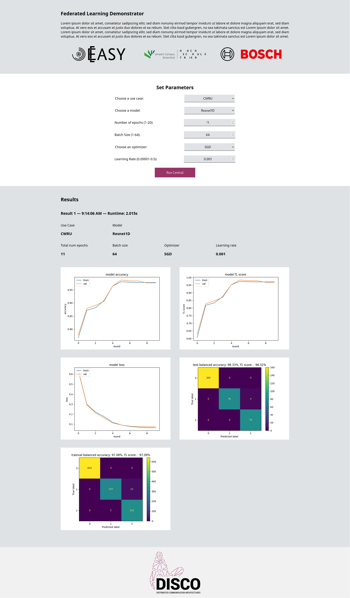{#fig-bosch-demo width="100%" fig-align="center"}

## Zero-Trust-Ansatz für AI-on-Device Hardware

Die Nutzung von AI-on-Device Hardware in vernetzten Umgebungen eröffnet Chancen für energieeffiziente KI-Anwendungen, bringt aber zugleich Sicherheitsrisiken mit sich. Da mehrere Knoten Daten erfassen, Modelle austauschen und föderierte Lernverfahren durchführen, entstehen potenzielle Angriffsflächen. Klassische Sicherheitsmechanismen, die auf implizitem Vertrauen basieren, reichen in solchen Szenarien nicht aus. Ein zeitgemäßer Ansatz ist das Zero-Trust-Modell, das davon ausgeht, dass keinem Gerät, keiner Verbindung und keinem Nutzer automatisch vertraut werden darf. Jeder Zugriff muss kontinuierlich überprüft und abgesichert sein. Im Folgenden wird beschrieben, wie sich diese Prinzipien auf das AI-on-Device Board übertragen lassen.

Im Rahmen des Arbeitspakets wurde ein Ansatz für eine Zero-Trust-Architektur mit dezentraler Policy-Durchsetzung und der Nutzung cyber-physischer Verträge entwickelt und publiziert @zta. Der Fokus dieses Ansatzes liegt auf der Abkehr von zentralen Policy-Enforcement-Instanzen hin zu einer verteilten Durchsetzung auf Ressourcenebene sowie auf einer kryptographisch abgesicherten Policy-Administration. Cyber-physische Verträge dienen dabei als Mechanismus zur nachvollziehbaren und sicheren Authentisierung und Autorisierung von Kommunikationsbeziehungen innerhalb der Zero-Trust-Architektur.

Die Übertragung dieses Konzepts auf den Kontext energieeffizienter IoT-Endknoten wurde im Projekt primär simulativ untersucht, mit dem Ziel, die grundsätzliche Machbarkeit und Übertragbarkeit auf ressourcenbeschränkte Edge- und Sensorhardware zu bewerten. Die Simulation wurde im Rahmen der Publikation Open Source verfügbar gemacht. Ergänzend zur Simulation wurde der Ansatz auch experimentell im Labordemonstrator erprobt und konnte dort in seiner grundlegenden Funktionsweise erfolgreich eingesetzt werden, insbesondere hinsichtlich sicherer Anbindung, dezentraler Zugriffssteuerung und der Einbindung cyber-physischer Verträge. Diese Arbeiten dienten jedoch vor allem der Validierung des Konzepts und der Identifikation praktischer Randbedingungen, unter anderem im Hinblick auf Energieeffizienz, Komplexität und Integrationsaufwand.

Auf Basis der hierbei gewonnenen Erkenntnisse wurde im weiteren Projektverlauf ein veränderter und stärker angepasster Ansatz für den finalen Labordemonstrator entwickelt. Dieser baut auf den zentralen Ideen des untersuchten Zero-Trust-Konzepts auf, berücksichtigt jedoch die spezifischen Anforderungen und Einschränkungen der Zielhardware und der Demonstratorumgebung deutlich stärker. Die konkrete Ausgestaltung und Umsetzung dieses finalen Ansatzes werden in den nachfolgenden Kapiteln beschrieben.

### Grundprinzipien und Übertragung auf das Board

Der Zero-Trust-Ansatz beruht auf den Grundsätzen Authentifizierung, minimale Rechtevergabe, Integritätssicherung, Segmentierung und kontinuierliches Monitoring. Diese werden auf das AI-on-Device Board wie folgt übertragen: Jeder Knoten (Sensing- oder Model-Node) muss sich vor Kommunikationsaufnahme eindeutig identifizieren, Zugriffsrechte werden streng auf die jeweilige Rolle beschränkt, und alle Daten oder Modelle werden vor ihrer Ausführung auf Unversehrtheit geprüft. Kommunikationspfade sind nur für autorisierte Partner geöffnet, und der gesamte Betrieb wird laufend überwacht, um Auffälligkeiten frühzeitig zu erkennen. Damit wird die Hardware nicht nur als Plattform für ressourceneffiziente KI, sondern zugleich als sichere Komponente in verteilten Systemen nutzbar.

### Authentifizierung, Rechtevergabe und Modellintegrität

Ein zentraler Aspekt ist die eindeutige Authentifizierung der Nodes. Dies kann über hardwaregebundene Identifikatoren, Zertifikate oder vergleichbare Verfahren erfolgen. Erst nach erfolgreicher Prüfung darf eine Verbindung aufgebaut werden. Zudem wird nach dem Prinzip des Least Privilege Access gearbeitet: Eine Sensing-Node darf lediglich Daten erfassen und Modelle ausführen, während die Verteilung von Modellartefakten ausschließlich durch einen Koordinator erfolgt.
Darüber hinaus muss die Integrität der Modelle gesichert sein. Da das Board TensorFlow-Lite-Modelle oder Gewichtsupdates verarbeitet, wird vor jedem Einsatz eine Integritätsprüfung durchgeführt. Kryptographische Signaturen oder Hash-Verfahren stellen sicher, dass nur autorisierte und unveränderte Modelle ausgeführt werden. Auf diese Weise lässt sich verhindern, dass manipulierte oder fehlerhafte Modelle in den Betrieb gelangen.

### Kommunikationssicherheit und Segmentierung

Die Kommunikation zwischen den Boards erfolgt über ESP-NOW oder WLAN. Um Angriffe zu vermeiden, wird das Netzwerk nach dem Prinzip der Mikrosegmentierung strukturiert: Nur explizit hinterlegte Peer-Beziehungen dürfen Daten austauschen. Jeder Datenfluss wird klar definiert, sodass unautorisierte Verbindungen blockiert bleiben. Damit lassen sich auch föderierte Lernumgebungen sicher umsetzen. Hierbei sendet jede Node nach einem lokalen Training nur ihre Modellgewichte an den Koordinator. Durch die Segmentierung ist sichergestellt, dass ausschließlich autorisierte Partner an diesem Prozess teilnehmen. Gleichzeitig reduziert sich die Angriffsfläche, da nicht das gesamte Netzwerk offensteht, sondern nur ausgewählte Kommunikationskanäle aktiv sind.

### Monitoring und Anwendung im föderierten Lernen

Ein wesentlicher Bestandteil des Zero-Trust-Ansatzes ist das kontinuierliche Monitoring. Auf dem AI-on-Device Board können Kommunikationsereignisse, Energieverbrauchsmuster oder Speicherzugriffe protokolliert und regelmäßig ausgewertet werden. Auffälligkeiten, etwa wiederholte fehlgeschlagene Authentifizierungen oder ungewöhnlich hohe Datenvolumina, werden erkannt und automatisch beantwortet, z. B. durch temporäres Sperren eines Knotens.
Besonders beim föderierten Lernen zeigt sich der Nutzen dieses Vorgehens. Da nur Modellgewichte ausgetauscht werden, muss sichergestellt sein, dass diese Updates von vertrauenswürdigen Quellen stammen und nicht manipuliert wurden. Der Koordinator aggregiert daher ausschließlich Modellupdates, die eine Authentifizierung und Integritätsprüfung bestanden haben. Somit wird verhindert, dass Schadcode oder kompromittierte Modelle in den globalen Lernprozess einfließen.

# Demonstrator: Schätzung von Performance-Metriken in drahtlosen Netzwerken {#sec-003-demonstrator-performancemetrics-wirelessnetworks}

<!--
---
author:
    - Christian Maier
---
-->

Ziel maschineller Lernmodelle als digitale Zwillinge im Netzwerkmanagement ist es, Vorhersagen zu Leistungskennzahlen im Netzwerk auf Basis des Zustandes des Netzwerkes zu liefern (@sec-004-fl_demo_wireless_network). Im Zusammenhang mit Edge-Cloud-Netzwerken sind wichtige Kennzahlen die End-to-End-Latenz, der Jitter und der Paketverlust von Paketflüssen. Diese Leistungsvorhersage soll Messungen oder Schätzungen durch Simulationen ersetzen, da diese in der Regel mit einem erheblichen Aufwand (in Bezug auf Netzwerk-Overhead oder Rechenzeit) verbunden sind. Die Vorhersage von Leistungskennzahlen kann mit einer Vielzahl verschiedener maschineller Lernmodelle erfolgen, wie z. B. Entscheidungsbäumen oder künstlichen neuronalen Netzen. Ein in der Literatur häufig verwendeter Ansatz ist die Vorhersage von Netzwerkleistungskennzahlen mithilfe von Graph Neural Networks (GNNs). GNNs haben sich aufgrund ihrer Fähigkeit, komplexe Beziehungen und Abhängigkeiten zwischen Netzwerkkomponenten zu modellieren, als leistungsstarkes Werkzeug für die Vorhersage von Leistungskennzahlen in Kommunikationsnetzwerken etabliert. Durch die Darstellung des Netzwerks als Graph, in dem Knoten Geräten oder Netzwerkelementen entsprechen und Kanten Verbindungen oder Interaktionen darstellen, können GNNs die topologische Struktur und das dynamische Verhalten des Netzwerks effektiv erfassen.

Jüngste Studien [@rusek2020routenet] haben gezeigt, dass GNNs verschiedene Leistungskennzahlen wie Latenz, Durchsatz und Paketverlust vorhersagen können, indem sie aus historischen Daten und Netzwerkkonfigurationen lernen. Ihre Fähigkeit, sowohl Knotenmerkmale (z. B. Bandbreite, Rechenleistung) als auch Kantenmerkmale (z. B. Verbindungsqualität, Entfernung) zu berücksichtigen, ermöglicht ein differenzierteres Verständnis darüber, wie verschiedene Faktoren die Gesamtleistung des Netzwerks beeinflussen. Darüber hinaus lassen sich GNNs gut auf unbekannte Netzwerktopologien übertragen, wodurch sie sich für Echtzeitanwendungen eignen, bei denen sich die Netzwerkbedingungen häufig ändern können. Diese Anpassungsfähigkeit in Verbindung mit ihrer Fähigkeit, große Datenmengen effizient zu verarbeiten, macht GNNs zu einem vielversprechenden Ansatz für die Verbesserung der Leistungsvorhersagefähigkeiten in modernen Kommunikationsnetzwerken, insbesondere in Szenarien mit dynamischen und heterogenen Umgebungen (was für Edge-Cloud-Netzwerke gilt).

Das Training eines GNN zur Vorhersage von Leistungskennzahlen in Kommunikationsnetzwerken umfasst in der Regel mehrere Schritte. Zunächst wird das Netzwerk als Graph dargestellt, wobei die Knoten den Netzwerkelementen (wie Routern und Switches) entsprechen und die Kanten die Verbindungen zwischen ihnen darstellen. Jeder Knoten und jede Kante ist mit Merkmalen verbunden, die relevante Informationen wie Bandbreite und Datenverkehrsauslastung erfassen. Für GNNs ist es nicht relevant, ein vollständiges Bild des zugrunde liegenden Netzwerks einschließlich aller Komponenten zu haben, sondern nur für die Knoten und Verbindungen, die analysiert werden sollen. Der Trainingsprozess beginnt mit der Erfassung historischer Leistungsdaten, die als Grundwahrheit für die zu prognostizierenden Kennzahlen dienen. Diese Daten werden verwendet, um beschriftete Trainingsbeispiele zu erstellen, wobei die Eingabe aus der Graphstruktur und den zugehörigen Merkmalen besteht, während die Ausgabe den Leistungskennzahlen (z. B. Latenz, Durchsatz) entspricht. Während des Trainings lernt das GNN, Informationen von benachbarten Knoten und Kanten durch mehrere Schichten der Nachrichtenübermittlung zu aggregieren. Dieser Prozess ermöglicht es dem Modell, sowohl lokale als auch globale Muster im Graphen zu erfassen. Das GNN wird in der Regel mit überwachten Lerntechniken trainiert, bei denen eine Verlustfunktion (z. B. der mittlere quadratische Fehler) die Differenz zwischen den vorhergesagten Metriken und den tatsächlichen Werten aus den Trainingsdaten misst. Optimierungsalgorithmen minimieren diese Verlustfunktion durch Anpassung der Modellparameter. Nach dem Training kann das GNN anhand eines separaten Validierungsdatensatzes bewertet werden, um seine Vorhersageleistung zu beurteilen. Zur Verbesserung der Genauigkeit kann eine Feinabstimmung vorgenommen werden, und das Modell kann für Echtzeitvorhersagen in dynamischen Kommunikationsumgebungen eingesetzt werden, wobei es sich an Änderungen der Netzwerkbedingungen anpasst, sobald neue Daten verfügbar werden. Insgesamt nutzt das Training von GNNs für die Vorhersage von Leistungsmetriken die einzigartige Graphstruktur von Kommunikationsnetzwerken, um die Vorhersagegenauigkeit und -effizienz zu verbessern.

In unserem Demo Szenario "Schätzung von Performance-Metriken in drahtlosen Netzwerken" wird die Anwendung von GNNs zur Vorhersage von Leistungskennzahlen in Edge-Cloud-Netzwerken untersucht. Durch die Modellierung des Edge-Cloud-Netzwerks als Graph, in dem Knoten Geräte und Kanten Kommunikationsverbindungen darstellen, erfassen GNNs effektiv die komplexen Abhängigkeiten und Interaktionen innerhalb des Netzwerks. Wir zeigen, dass GNNs wichtige Leistungskennzahlen wie Latenz und Jitter anhand von Daten aus realen Netzwerkbedingungen genau vorhersagen können. Unsere Ergebnisse unterstreichen das Potenzial von GNNs zur Verbesserung der Leistungsüberwachung und -optimierung in Edge-Cloud-Umgebungen und ebnen den Weg für ein effizienteres Ressourcenmanagement und eine höhere Energieeffizienz.

Dazu wurde ein Hardware-Testbed aufgebaut und in diesem durch geeignete Netzwerk-Messungen einen Datensatz erstellt (@sec-004-fl_demo_wireless_network). Ein Übersichtsdiagramm unserer Hardware-Konfiguration ist in @fig-testbed-ap3 dargestellt. Sie besteht aus zwei lokalen Edge-Netzwerken, von denen eines 5G und das andere WLAN-Geräte verwendet. Das 5G-Edge-Netzwerk wurde unter Verwendung einer 5G-Indoor-Basisstation in unserem Labor aufgebaut, die mit dem 5G-Core im Gebäude des Telekommunikationsanbieters verbunden ist. Zwei Messendpunkte sind über WLAN-Router mit der Indoor-Basisstation verbunden, ein dritter Messendpunkt ist im 5G-Core installiert. Messdatenströme werden zwischen allen drei Knoten in beide Richtungen generiert. Das andere Edge-Netzwerk basiert auf 5-GHz-WLAN-Technologie („Wi-Fi 5“) und verfügt ebenfalls über drei Messpunkte. Alle Messknoten davon befinden sich in unserem Labor, zwei auf drahtlosen Knoten und ein Knoten, der über ein Kabel mit dem WLAN-Router verbunden ist. Auch in diesem Teil des Netzwerks werden Messdatenströme zwischen allen drei Knoten in beide Richtungen generiert.

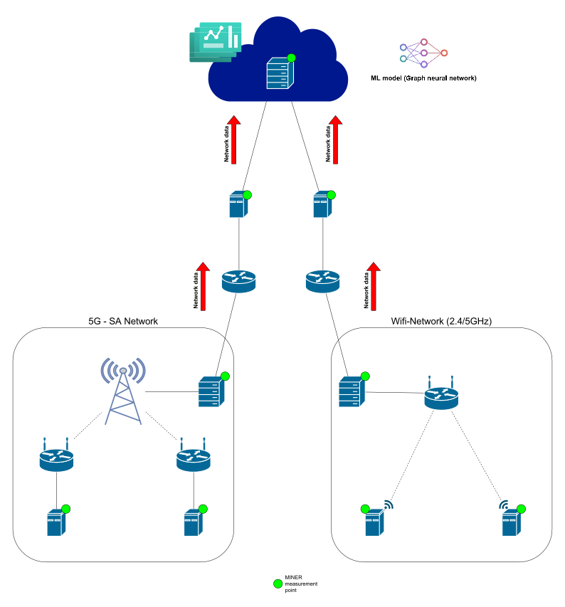{#fig-testbed-ap3 width=80% fig-align="center"}

Um einen Datensatz in unserem Hardware-Testbed zu erstellen, haben wir folgenden Ansatz verwendet: Wir wählen zufällig Paketgrößen und Paketabstände für jeden Paketfluss in unseren lokalen Edge-Netzwerken aus. Da es in jedem lokalen Netzwerk sechs Paketflüsse gibt, ergibt dies zwölf Parameter für jede Messung. Die Paketgrößen variieren zwischen 300 und 1500 Byte und die Paketraten zwischen 10 und 100 Paketen pro Sekunde, was zu Bitraten von 20 bis 1200 kbps für die Messflüsse führt. Die gewählten Paketgrößen und Inter-Paket-Zeiten definieren die Konfiguration des Netzwerkverkehrs. Für jede Konfiguration messen wir diverse Performancemetriken (d. h. Latenz, Jitter und Paketverlust, wobei Latenz und Jitter sowohl auf Anwendungs- als auch auf Paketebene gemessen werden) für ein Messintervall von 10 Sekunden. Der Datensatz wird schließlich als JSON-Datei gespeichert. Unser Datensatz im 5G-Netzwerk umfasst Messungen vom 26. Februar 2024 bis zum 31. Dezember 2024. Jeden Tag zwischen 21 Uhr und 5 Uhr morgens wurde alle 4 Minuten eine zehnsekündige Messung durchgeführt. Wir haben nur nachts und nur alle vier Minuten Messungen durchgeführt, da in diesem Netzwerk tagsüber und in anderen Zeitfenstern (die für diese Arbeit nicht relevant sind) andere Messungen durchgeführt werden. Da einige der Messungen (aus verschiedenen Gründen, z. B. Stromausfälle oder Störungen im 5G-Netz) fehlgeschlagen sind, enthält der vorverarbeitete Datensatz nicht für jeden Messzeitpunkt ein Messergebnis. Aus organisatorischen Gründen liefen die Messungen im WLAN-Netzwerk vom 22. Mai 2024 bis zum 31. Dezember 2024. Der Zeitraum zwischen zwei Messungen betrug auch hier 4 Minuten (um mit den 5G-Messungen konsistent zu sein), aber die Messungen wurden über den ganzen Tag hinweg durchgeführt, um einen Datensatz zu erhalten, der in seiner Größe dem im 5G-Netzwerk ähnelt. Für jede Messung und jedes übertragene Paket haben wir die Latenz und den Jitter, sowohl auf Paket- als auch auf Anwendungsebene, sowie die erfolgreiche Übertragung des Pakets gespeichert. So erhielten wir fünf Zeitreihen für jeden Paketfluss. Aus diesen Zeitreihen berechnen wir statistische Mittelwerte für die Latenz und den Jitter.

Die Struktur des verwendeten GNNs ist wie folgt: Die Knoten des Graphen entsprechen den Verbindungen und Flüssen im Datensatz. Das bedeutet, dass die von uns betrachteten Graphen aus Knoten zweier Arten bestehen: Verbindungen und Flüsse. Für jede Verbindung gibt es eine gerichtete Kante zu jedem Fluss, der diese Verbindung nutzt. Für jeden Fluss gibt es eine gerichtete Kante zu jeder Verbindung, die von diesem Fluss genutzt wird. Für die Implementierung des GNN-Modells haben wir das iGNNition-Framework verwendet [^ignnition_framework-1]. iGNNition ist ein TensorFlow-basiertes Framework für das schnelle Prototyping von GNNs. Es bietet eine codelose Programmierschnittstelle, über die Benutzer ihre eigenen GNN-Modelle in einer YAML-Datei implementieren können. IGNNITION enthält außerdem eine Reihe von Tools und Funktionen, die Benutzer während des Entwurfs- und Implementierungsprozesses des GNN unterstützen.

Wir haben die folgenden Szenarien bewertet: (A) Ein GNN-Modell für jedes lokale Edge-Netzwerk und (B) ein gemeinsames GNN-Modell für beide Edge-Netzwerke. Bei Szenario (A) wird jedes Modell nur mit den Daten aus dem entsprechenden Edge-Netzwerk trainiert. Bei Szenario (B) verwenden wir die gesamten Daten (sowohl aus dem 5G-Netzwerk als auch aus dem WLAN-Netzwerk), um das Modell zu trainieren. In beiden Szenarien wurden die Daten in einer Vorverarbeitung skaliert. Das Training der beiden separaten GNN-Modelle für jedes lokale Netzwerk erreichte eine zufriedenstellende Leistung sowohl für die Latenz- als auch für die Jitter-Vorhersage (relativer Fehler < 1%). Sobald wir jedoch versuchten, ein gemeinsames Modell für beide Netzwerke zu trainieren, erreichten wir keine ausreichende Leistung (selbst nach verschiedenen Versuchen, die Hyperparameter anzupassen). Unsere Erklärung dafür ist, dass die Verteilungen der Daten in den beiden Netzwerken zu unterschiedlich sind. Selbst eine Skalierung der Daten hat bisher keine Verbesserung gebracht.

Dies veranschaulicht das erhebliche Potenzial von Graph Neural Networks als leistungsstarkes Werkzeug für die Leistungsvorhersage und das Netzwerkmanagement in Edge-Cloud-Systemen. Durch die Nutzung der inhärenten Graphstruktur dieser Netzwerke liefern GNNs genaue Einblicke in kritische Metriken wie Latenz und Jitter und ermöglichen so fundiertere Entscheidungen für die Ressourcenzuweisung und -optimierung. Die Ergebnisse unterstreichen das Potenzial von GNN-basierten Ansätzen zur Steigerung der Effizienz, Zuverlässigkeit und Nachhaltigkeit der Edge-Cloud-Infrastruktur, was letztlich zu reaktionsschnelleren und energieeffizienteren Netzwerkumgebungen beiträgt.

[^ignnition_framework-1]: <https://ignnition.org/doc/intro.html>

# Ausblick

Aufbauend auf dem in diesem Kapitel entwickelten Ordnungsrahmen, dem Green Software Measurement Model (GSMM) sowie den umgesetzten Demonstratoren ergeben sich mehrere Forschungs- und Entwicklungslinien, die für eine nachhaltige, industriell tragfähige Künstliche Intelligenz im Edge-Cloud-Kontinuum zentral erscheinen.

Methodisch ist die Überführung des Ordnungsrahmens und des GSMM in verbindliche, branchenübergreifende Standards anzustreben, um die Bewertung der Ressourcen-, Energie- und Dateneffizienz reproduzierbar und plattformübergreifend zu gestalten. Inhaltlich bedarf es einer Ausweitung der Methodik auf Anwendungen der generativen Künstlichen Intelligenz, deren Ressourcenbedarf bislang nur unzureichend erfasst ist, sowie einer expliziten Berücksichtigung der sogenannten Embodied Emissions, da Einsparungen im Betrieb durch Herstellungs- und Entsorgungsaufwände andernfalls teilweise kompensiert werden können. Technisch erscheint die Integration KI-gestützter Prognose- und Orchestrierungsverfahren in die Lastverteilung des Edge-Cloud-Kontinuums vielversprechend, um Verteilungsentscheidungen dynamisch an Energie- und Auslastungsdaten koppeln zu können. Die im Projektverlauf beobachtete softwareinduzierte Hardware-Obsoleszenz verdeutlicht darüber hinaus den Bedarf an langfristigen Software-Pflege- und Treiberstrategien, damit die ökologischen Potenziale energieeffizienter Hardware nicht durch fehlende Framework-Unterstützung verloren gehen. Mit Blick auf den industriellen Transfer sind föderierte Lernverfahren und der Zero-Trust-Ansatz hinsichtlich Skalierbarkeit, Auditierbarkeit und Robustheit gegenüber heterogenen Datenbeständen weiterzuentwickeln. Schließlich erscheint die Übertragung der entwickelten Konzepte auf weitere industrielle Anwendungsfälle sowie auf Smart-Building-Szenarien erfolgversprechend, um den nachhaltigen Einsatz Künstlicher Intelligenz schrittweise in produktive Wertschöpfungsketten zu überführen.
