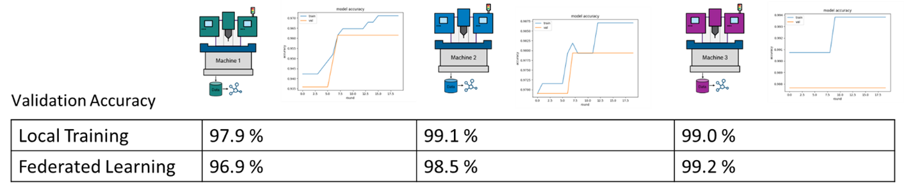
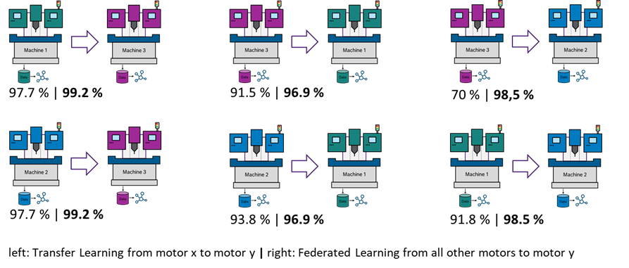

# FL Demonstrator Anomalien in Fräsprozessen {#sec-004-fl_demo_dali_machine}

```{=html}
<!--
---
author: 
  - Sabine Haag
---
-->
```

Dieser Use-Case zur Untersuchung des föderierten Lernens konzentriert sich auf die Maschinenüberwachung mittels Vibrationsdaten. Es handelt sich dabei um die Überwachung von Fräsprozessen auf CNC-Maschinen.

Für insgesamt drei Brown-Field Maschinen wurde über einen Zeitraum von 6 Monaten die Vibration der Maschinen mittels eines Beschleunigungssensors (Bosch CISS Sensor) mit einer Frequenz von 2 kHz in drei Richtungen X, Y, Z, aufgezeichnet. Dabei wurden insgesamt 15 unterschiedliche Prozesse durchlaufen. Die Daten sind nach "OK" und "NOK" gelabelt. Dieser Datensatz eignet sich sehr gut, um die Charakteristika des föderierten Lernens zu untersuchen. Er beinhaltet sowohl unterschiedliche Maschinen als auch unterschiedliche Prozesse pro Maschine, sodass verschiedenste Realszenarien eingestellt werden können.

Trotz der insgesamt guten Datenlage gibt es hier eine typische Schwierigkeit von Anomalie-Datensätzen: pro Prozess und Maschine gibt es eine sehr geringe Anzahl von NOK-Samples und die Aufteilung in Trainings- und Test-Daten kann die erzielte Performance maßgeblich beeinflussen.

Der Datensatz wurde von Bosch Research bereits veröffentlicht und ist unter \ https://github.com/boschresearch/CNC_Machining (CC BY 4.0) abrufbar.

**Hardware-Demonstrator zur Untersuchung von FL**

Es wurde ein Hardware-Demonstrator aufgebaut, um FL auf einer Umgebung auszuführen, die einer Umsetzung in der Produktion nachempfunden ist. Eine aufgebaute Version, die alle Grundfunktionalitäten abbildet, ist in @fig-fl-demo-Dali-Demonstrator dargestellt. Der Fokus des Demonstrators liegt dabei auf der Untersuchung des föderierten Lernens mit physisch getrennten Edge-Devices. In der realen Anwendung werden Maschinen und Sensoren an IPCs wie beispielsweise die CtrlX oder Geräte von Nvidia angebunden. Daten erreichen eine Softwareanwendung (bspw. Applikation zur Anomalieerkennung) also immer über einen solchen Hardwarebaustein (Schnittstelle). Mittels des Demonstrators können Use-Cases abgebildet werden, indem die IPCs mit entsprechenden Daten gespeist werden. Die Edge Devices können am Demonstrator je nach Aufgabe ohne größeren Aufwand ausgetauscht werden.

In der dargestellten Version des Demonstrators wurde die FL-API aus @sec-004-evaluation-metriken implementiert. Die Experimente sind mittels eines yaml-Files konfigurierbar und können verteilt auf ausgewählten Edge-Devices ausgeführt werden. Die Ergebnisse deuten auf eine grundsätzliche technische Übertragbarkeit auf reale Anwendungen hin. Für eine spätere Integration in einer realen Produktionsumgebung müsste der FL-Code auf die entsprechenden Edge-Devices vor Ort in der Produktion übertragen werden.

{#fig-fl-demo-Dali-Demonstrator fig-align="center" width="30%"}

**Proof-of-Value-Experiment mit CNC-Datensatz: Experimentelles Design und Ergebnisse**

Als Modell wurde ein 1D-Resnet verwendet. In Voruntersuchungen hat dies einen guten Kompromiss zwischen Rechenintensität und Genauigkeit gezeigt.

Zunächst wurde untersucht, ob FL für den CNC-Maschinen-Use-Case erfolgversprechend ist. Dies soll zeigen, ob Federated Learning grundsätzlich als sinnvolle Alternative zum klassischen Maschinellen Lernen verwendet werden kann.

Wie in @fig-fl-demo-Dali-Vergleich zu erkennen, ist die Genauigkeit durch lokales Training (also jeder Client trainiert ein eigenes Modell nur mit den eigenen Daten) bereits sehr hoch. Eine weitere Verbesserung wird durch FL hier nicht erreicht.

{#fig-fl-demo-Dali-Vergleich fig-align="center" width="90%"}

Im nächsten Schritt wurde untersucht, ob FL gegenüber lokalem Training einen Vorteil bringt, wenn neue Anlagen hinzukommen. Aus @fig-fl-demo-Dali-Dateneffizien ist ersichtlich, dass für neue Anlagen tatsächlich schneller eine hohe Genauigkeit erreicht werden kann, wie wenn nur ein Modell von einer einzelnen anderen Anlage als Grundlage dient.

{#fig-fl-demo-Dali-Dateneffizien fig-align="center" width="90%"}