# FL-Demonstrator Raumluft {#sec-004-fl_demo_raumluft}

## Entwicklung und Evaluierung effizienter Konzepte des Verteilten Lernens

Die zunehmende Verbreitung von IoT-Geräten und verteilten Sensorsystemen erfordert Lernverfahren, die sowohl leistungsfähig als auch ressourceneffizient arbeiten. Insbesondere bei limitierten Rechenkapazitäten, Energiebudgets und Bandbreiten müssen Algorithmen und Systemarchitekturen sorgfältig ausgewählt und optimiert werden. Die Arbeiten in diesem Bereich konzentrierten sich daher auf die systematische Analyse geeigneter Konzepte des Verteilten Lernens, deren Implementierung und Evaluierung in Simulationsumgebungen sowie die Überführung der Erkenntnisse auf physische Labordemonstratoren.

### Anforderungsanalyse und Framework-Auswahl

Zu Beginn stand eine umfassende Anforderungsanalyse, um die am besten geeigneten Konzepte und Werkzeuge für das Verteilte Lernen (VL), insbesondere das Föderierte Lernen (FL), im Projektkontext zu identifizieren. Ziel war es, eine Plattform zu finden, die sowohl für Forschungsanwendungen zugänglich ist als auch das Potenzial für eine spätere Industrialisierung bietet.

Die wesentlichen Kriterien für die Bewertung umfassten:

-   **Lizenzmodell und Wartbarkeit:** Open-Source-Lizenzen (z. B. Apache 2.0) und aktive Community-Unterstützung.
-   **Hardware-Anforderungen:** Fähigkeit zur Implementierung auf ressourcenbeschränkten Endgeräten (Edge-Devices) ohne spezielle Hardwarebeschleuniger.
-   **Technologische Basis:** Präferenz für Python und Unterstützung gängiger ML-Bibliotheken (PyTorch, TensorFlow, scikit-learn).
-   **Skalierbarkeit:** Kompatibilität mit heterogenen Clients.

Auf Basis dieses Kriterienkatalogs wurde eine breite Literatur- und Marktstudie zu bestehenden Frameworks durchgeführt, darunter TensorFlow Federated, PySyft, FATE und OpenFL.

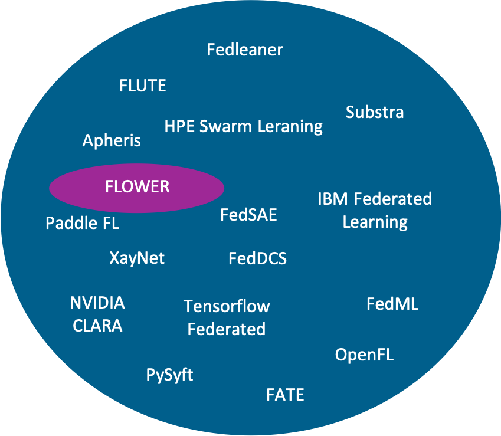

Die Bewertung ergab, dass das Framework **FLOWER** die Anforderungen des Projekts am besten erfüllt. FLOWER zeichnet sich durch seine Skalierbarkeit, die effiziente API in Python und die flexible Unterstützung diverser ML-Bibliotheken aus. Entscheidend für die Auswahl war zudem die Möglichkeit, unterschiedliche Edge-Devices zunächst lokal zu simulieren.

### Simulationsumgebungen und Kalibrierungsmethodik

Aufbauend auf der Auswahl der Konzepte wurde eine Simulationsumgebung implementiert, um die Verfahren effektiv zu evaluieren.



1.  Simulation von Raumluftdaten und Verteiltem Lernen

Es wurde eine Simulationsumgebung zur Erstellung von simulierten Raumluftdaten gemäß Nutzungsprofilen entwickelt. Dies beinhaltete eine grafische Benutzeroberfläche (GUI) zur Generierung der Daten und ein Python-Programm zur Simulation des verteilten Lernens bei Zeitreihendaten. Ziel war die Auswertung verteilter Lernalgorithmen beim Erkennen und Empfehlen von Lüftungsvorgängen, angelehnt an den realen Anwendungsfall.

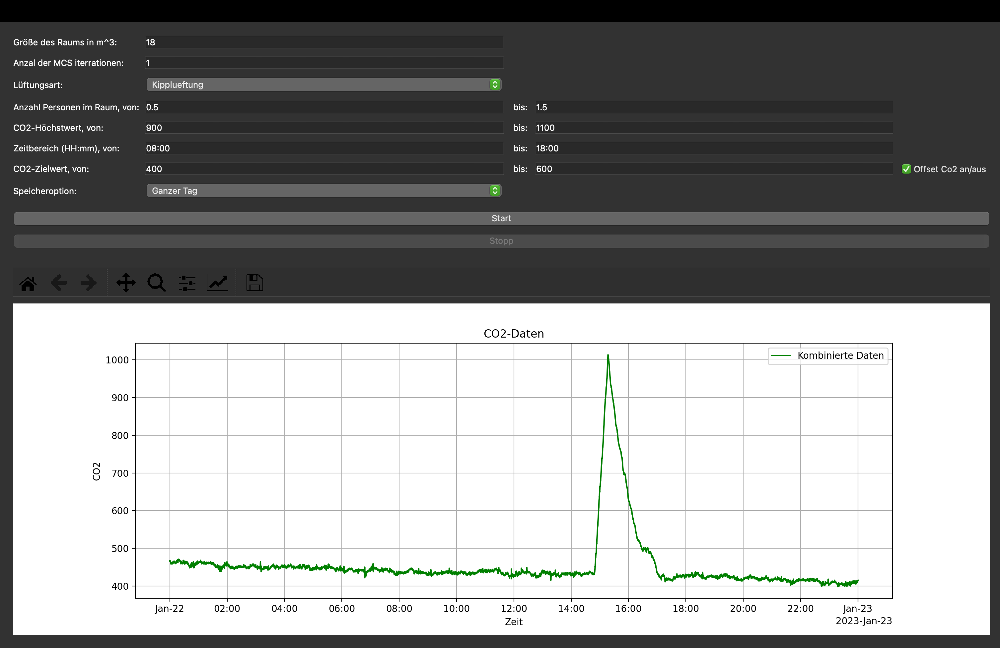

2.  Methodik zur Sensordatenkalibrierung bei Heterogenität

Eine wesentliche Herausforderung im Verteilten Lernen mit Sensordaten ist die Heterogenität der Datenquellen. Sensoren unterliegen oft nicht-identischen Fertigungsfehlern oder Drifts, was zu Verschiebungen oder Rotationen im Merkmalsraum führt. Dies verhindert oft ein erfolgreiches gemeinsames Training.

Im Kontext der Sensordatenkalibrierung wurde daher ein Forschungsstrang vertieft, der sich mit der effizienten Adaption von Messungen zwischen Sensoren befasst. Die zentrale Idee zur Korrektur dieser Abweichungen ist die Nutzung von **Affinen Transformationen (AT)**, um die Datenräume zweier Systeme (Sensoren) anzugleichen. Hierzu wurde ein Ansatz aus der Glaziologie von Gleser und Watson (1973) adaptiert und weiterentwickelt, der Maximum Likelihood Estimation (MLE) nutzt.

Die Forschungsarbeiten umfassten:

1.  **Erweiterung auf Affine Transformationen:** Nutzung augmentierter Matrizen.
2.  **Ableitung einer recheneffizienten Lösung:** Aus den stationären Bedingungen der Maximum-Likelihood-Zielfunktion ergibt sich eine einfache Least-Squares-Schätzung der affinen Transformationsparameter.
3.  **Entwicklung eines hybriden Ansatzes:** Ein neuer hybrider Algorithmus (Algorithmus 3) wurde entwickelt, der die Vorteile der Methode von Gleser und Watson (bessere Schätzung durch Eigenvektor-Denoising) mit der Effizienz der Least-Squares-Lösung kombiniert.

Die entwickelten Algorithmen wurden mittels umfangreicher Monte-Carlo-Simulationen sowie mit realen Messdaten eines Multi-Sensor-Boards validiert. Die Ergebnisse bestätigten, dass die Transformation mittels AT eine deutlich bessere Angleichung der Datenräume ermöglicht als eine einfache merkmalsweise Normalisierung. Diese Arbeiten bilden einen wichtigen Bestandteil für eine softwarebasierte Kalibrierung und Wartung von Sensordrifts sowie für zukünftige verteilte Lernmethoden (Expert-supported Learning). Eine umfassende Darstellung der Methodik, der entwickelten Algorithmen und der detaillierten Evaluationsergebnisse findet sich in der Veröffentlichung @Machhamer2024.

### Realisierung am Lüftungsdemonstrator

Neben der simulativen Evaluation erfolgte die Übertragung auf den physischen Demonstrator. Ein Ziel war die Etablierung von Benchmarks und die Analyse der Gesamteffizienz unter realen Bedingungen. Der Lüftungsdemonstrator wurde in die EASY-Verwaltungsschale integriert. Über diese ist es möglich, den aktuellen Raumstatus in Echtzeit einzusehen sowie die erfassten Sensordaten übersichtlich darzustellen und historische Daten einzusehen.

**Datenerzeugung im Lüftungsdemonstrator**

Um multivariate Zeitreihendaten für die Analyse zu generieren, wurde im Lüftungsdemonstrator ein experimenteller Aufbau gewählt. Ein Glas mit Sprudelwasser wurde platziert, um durch die $CO_{2}$-Emission die Personenpräsenz im Raum zu simulieren. Mithilfe verschiedener Sensoren, wie dem Sensirion SCD30 und Bosch BME680, wurden über 10 Merkmale mit einer Frequenz von 0,2 Hz erfasst. Zu diesen Merkmalen gehören unter anderem die $CO_{2}$-Konzentration, die Luftfeuchtigkeit und die Temperatur.

Über mehrere Stunden wurden unterschiedliche Lüftungsszenarien erprobt, wobei Fenster wechselnd geöffnet oder geschlossen wurden und das Wasser regelmäßig erneuert wurde. Die Fensterzustände wurden mittels magnetischer Reed-Schalter protokolliert. Der so entstandene Datensatz diente u. a. der Analyse verschiedener Modellarchitekturen hinsichtlich Genauigkeit und Energiebedarf.

**Vergleich konventioneller ML-Architekturen**

Es wurde eine Recherchearbeit angestellt, mit dem Ziel, u. a. die optimalen konventionellen ML-Architekturen sowie die besten Trainingsmerkmale für den Anwendungsfall des Lüftungsdemonstrators zu identifizieren. Es sollte ein möglichst kompaktes Modell mit gleichzeitig hoher Erkennungsgenauigkeit erzielt werden, wobei die Optimierung der Energie- und Dateneffizienz im Vordergrund stand. Insgesamt wurden 49 unterschiedliche Anwendungsszenarien analysiert, die sich in Modelltyp, Datenumfang und Merkmalen unterschieden, aber unter identischen Hardwarebedingungen getestet wurden. Analog zu vorangegangenen Untersuchungen erfolgte auch hier die Energieerfassung und Validierung mithilfe desselben Messgeräts sowie einer Baseline-Messung.

Zu den betrachteten Architekturen gehörten:

-   Gradient Boosting Classifier (GBC)
-   Hist-Gradient Boosting Classifier (HGBC)
-   Bagging Classifier (BC)
-   Extra Trees Classifier (ETC)
-   Decision Tree Classifier (DTC)
-   Random Forest Classifier (RFC)
-   Ein Ensemble-Modell, bestehend aus diesen Einzelarchitekturen.

Die Ergebnisse dieser Untersuchung wurden wissenschaftlich veröffentlicht in @Cetkin2024 und dienen als Referenz für die Bewertung weiterer Ansätze.

**Ergebnisse der Energieeffizienz-Analyse**

Wie beim Fehlererkennungssystem der additiven Fertigung wurden auch in diesem Anwendungsfall die Metriken Datenmenge, Erkennungsrate (Präzision, Recall, F1-Score) und Energiebedarf analysiert. Ein zentraler Aspekt dabei war die Betrachtung der Modellgenauigkeit im Verhältnis zum Gesamtenergieverbrauch, welcher sowohl für das Training als auch die Inferenz der Modelle berücksichtigt wurde.

Als Kennzahl hierfür wurde der Quotient aus dem Gesamtenergieverbrauch und dem F1-Score gebildet. Diese Kennzahl wurde anschließend für jedes Modell mit dem entsprechenden Wert eines Ensemble-Modells verglichen. Je niedriger der dargestellte Wert, desto vorteilhafter ist das Modell hinsichtlich hoher Genauigkeit bei gleichzeitig geringem Energieverbrauch.

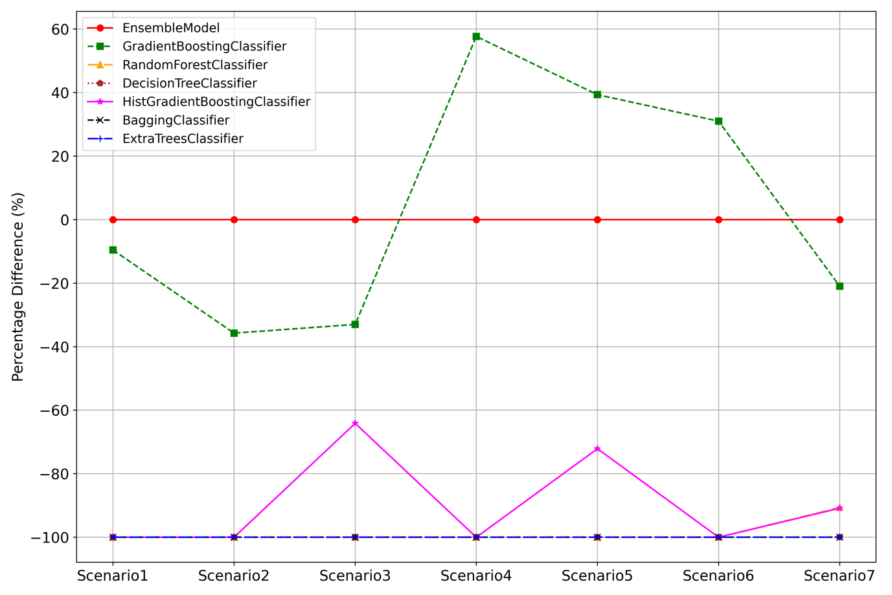

Zusätzlich zeigt folgende Grafik den Verlauf der F1-Scores über die unterschiedlichen Szenarien hinweg.

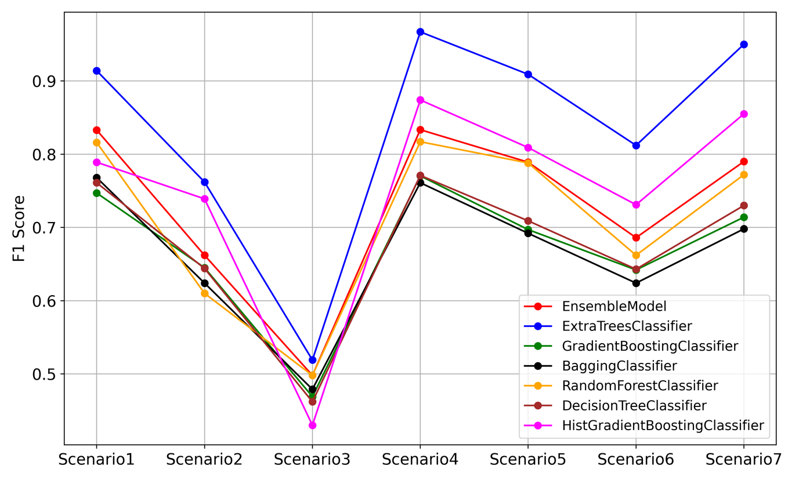

Im Zuge der Untersuchung kristallisierten sich Modelle heraus, wie beispielsweise der **Extra Trees Classifier (ETC)**, der teilweise, unter spezifischen Bedingungen einer eigens entwickelten Vorverarbeitungsmethodik, eine Genauigkeit von über 90% erreichte und gleichzeitig die höchste Energieeffizienz aufwies.

### Analyse neuronaler Netzarchitekturen und Feature-Extraction

Aufbauend auf den Benchmarks der konventionellen ML-Verfahren wurde eine umfassende Analyse von neuronalen Netzarchitekturen und Feature-Extraktionsalgorithmen auf der Raspberry-Pi-Plattform durchgeführt. Diese Untersuchung ist essenziell, um Architekturen und Methoden zu identifizieren, die für dezentrale Lernparadigmen wie Federated Learning (FL) und Incremental Learning (IL) geeignet sind.

Hierbei sind sowohl die Effizienz des lokalen Trainings auf dem Edge-Device als auch die Kompaktheit der Modelle (zur bspw. Reduzierung der Kommunikationslast) entscheidend. Die Analyse quantifizierte die komplexen, oft nicht-linearen Trade-offs zwischen Vorhersageleistung, Modellkapazität und tatsächlichem Ressourcenverbrauch.

Hierzu wurden vier strukturell und funktionell grundlegend unterschiedliche Architekturen evaluiert:

-   **MLP** (Multi-Layer Perceptron)
-   **CNN** (Convolutional Neural Network)
-   **GRU** (Gated Recurrent Unit)
-   **KAN** (Kolmogorov-Arnold Network)

Insbesondere KAN wurde aufgrund seiner „potenziell“ höheren Parametereffizienz durch lernbare Aktivierungsfunktionen untersucht. Um eine realistische Bewertung und faire Vergleichsbedingungen zu gewährleisten, wurde ein experimentelles Framework entwickelt, welches bspw. eine automatisierte Architektursuche umfasst (siehe nachfolgende Abbildung).



**Algorithm 1: Automated Multi-Model Architecture Search**

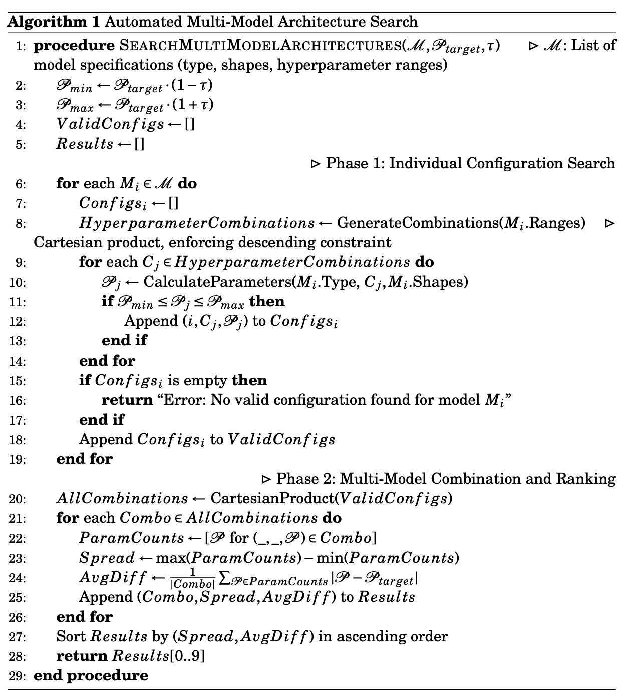

**Ergebnisse der Baseline-Analyse (Ohne Feature-Extraction)**

In der Baseline-Analyse wurden die Architekturen unter identischen Parameterbudgets verglichen. Es zeigten sich signifikante Unterschiede in der Ressourceneffizienz:

1.  **MLP:** Erwies sich durchweg als die energieeffizienteste Architektur und bot die beste Balance aus kompetitiver Leistung und niedrigstem Ressourcenverbrauch (Energie und Latenz).
2.  **GRU:** Erreichte oft die höchste Genauigkeit, jedoch auf Kosten eines signifikant höheren Energiebedarfs und längerer Latenzzeiten, bedingt durch die sequentielle Verarbeitung.
3.  **CNN:** Bot ein ausgewogenes Profil zwischen Leistung und Effizienz.
4.  **KAN:** Die theoretisch postulierte Parametereffizienz bestätigte sich in diesen multivariaten Zeitreihenszenarien nicht. KAN zeigte sowohl eine geringere Leistung als auch den höchsten Ressourcenbedarf, was auf die rechenintensive Spline-Berechnung auf Standard-Hardware zurückzuführen ist.

Die nachfolgenden Abbildungen zeigen die Ergebnisse der Vorhersagegenauigkeit und Ressourceneffizienz anhand der Daten des Lüftungsdemonstrators.

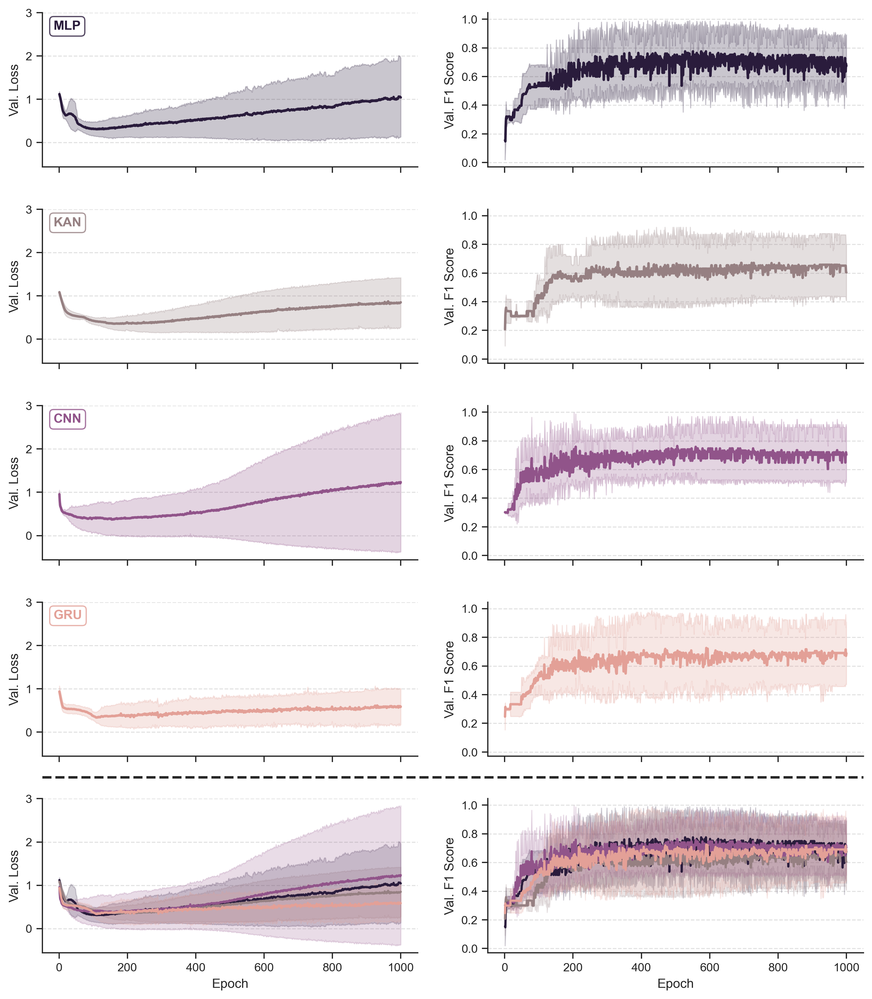

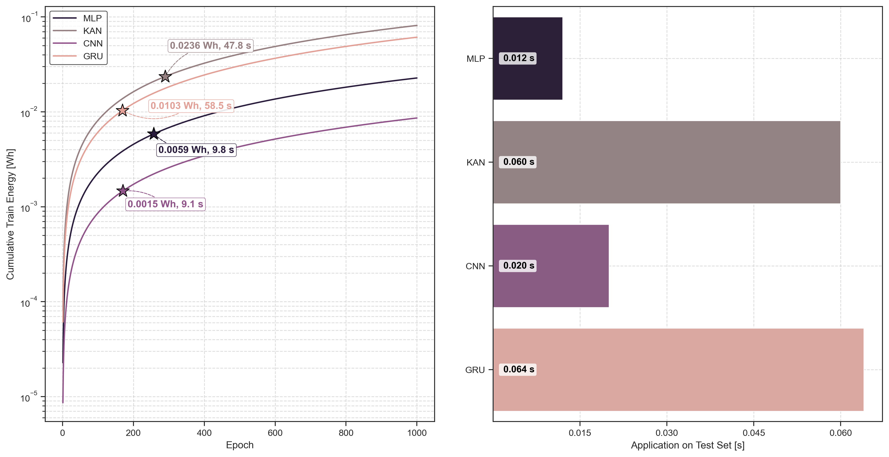

**Analyse von Feature-Extraktionsalgorithmen**

Die Integration von Feature-Extraktionsalgorithmen ist eine Schlüsselstrategie, um die Berechnungslast zu reduzieren und Daten zu komprimieren. Dies kann den Kommunikationsaufwand in FL-Szenarien minimieren oder lokales Training beschleunigen. Die Analyse ergab jedoch sehr unterschiedliche Effizienzprofile: **PAA**: Diese Methode zur temporalen Dimensionsreduktion erwies sich als äußerst effizient mit vernachlässigbarem Overhead (Komplexität $O(D \cdot T)$; $D =$ Dimension der Merkmale, $T =$ Sequenzlänge). Die Reduzierung der Sequenzlänge verringerte die Berechnungslast drastisch. Ein wichtiger Nebeneffekt war die differentielle Auswirkung auf die Modellkapazitäten: Während die Parameterzahl bei MLP, CNN und KAN signifikant sank, blieb sie bei GRU unverändert. Trotz dieser reduzierten Kapazität zeigte das MLP eine bemerkenswerte Resilienz und erreichte in mehreren Szenarien die höchste Vorhersageleistung. PAA+MLP Kombinationen resultieren in extrem kompakten und effizienten Pipelines, ideal für hochgradig ressourcenbeschränkte industrielle IoT-Geräte und FL-Anwendungen. **TS2Vec**: Dieser Ansatz lernt robuste, dimensionsreduzierte Embeddings und ist industriell relevant, da er das Lernen auf ungelabelten Daten ermöglicht (Self-Supervised Learning). Die Analyse zeigte jedoch einen massiven Overhead während der Trainingsphase, bedingt durch die quadratische Komplexität des hierarchischen Kontrastiven Lernens ($O(T \cdot B^2 + B \cdot T^2)$; $B =$ Batchgröße). Dieser Overhead überstieg die Kosten für das Training der nachfolgenden Modelle um Größenordnungen. Dies erschwert On-Device-Training oder häufiges Nachtrainieren (wie oft in IL/FL benötigt) erheblich und favorisiert ein Deployment-Muster, bei dem das Training offline (Cloud) erfolgt und nur der effiziente Encoder On-Device zur Feature-Extraktion genutzt wird. **LB-DAAGD**: Dieser neuartige Ansatz wurde zur Extraktion struktureller Merkmale untersucht. LB-DAAGD inferiert die Struktur eines Stochastischen Petri-Netzes (SPN) aus den Daten, um die zugrundeliegende Systemdynamik zu erfassen. Diese strukturellen Features sind besonders relevant für die Klassifikation von Systemzuständen in industriellen Prozessen. Um die variierende Dimensionalität der erzeugten Inzidenzmatrizen zu handhaben, wurde ein Standardisierungsverfahren entwickelt (Sortierung nach $L_2$-Norm und Padding), das eine konsistente Eingabe für die DL-Modelle gewährleistet.

Die nachfolgenden Tabellen zeigen exemplarisch die Ergebnisse der Feature-Extraktionsalgorithmen (TS2Vec, PAA, LB-DAAGD) anhand der Daten des Lüftungsdemonstrators.

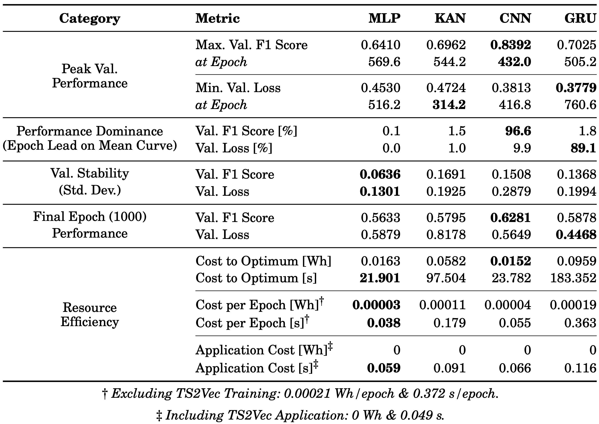

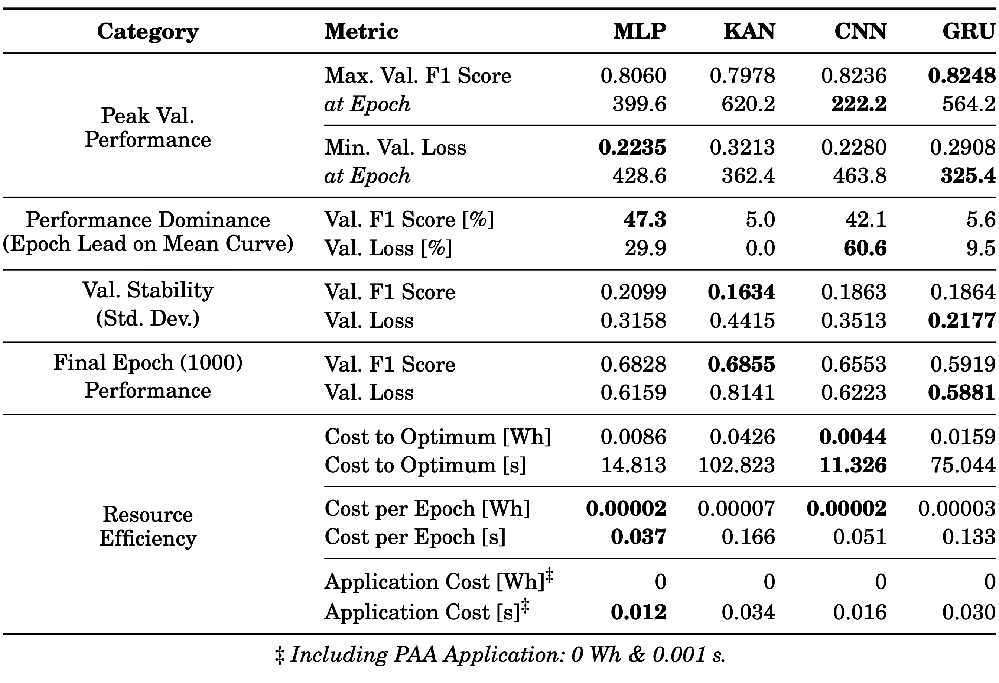

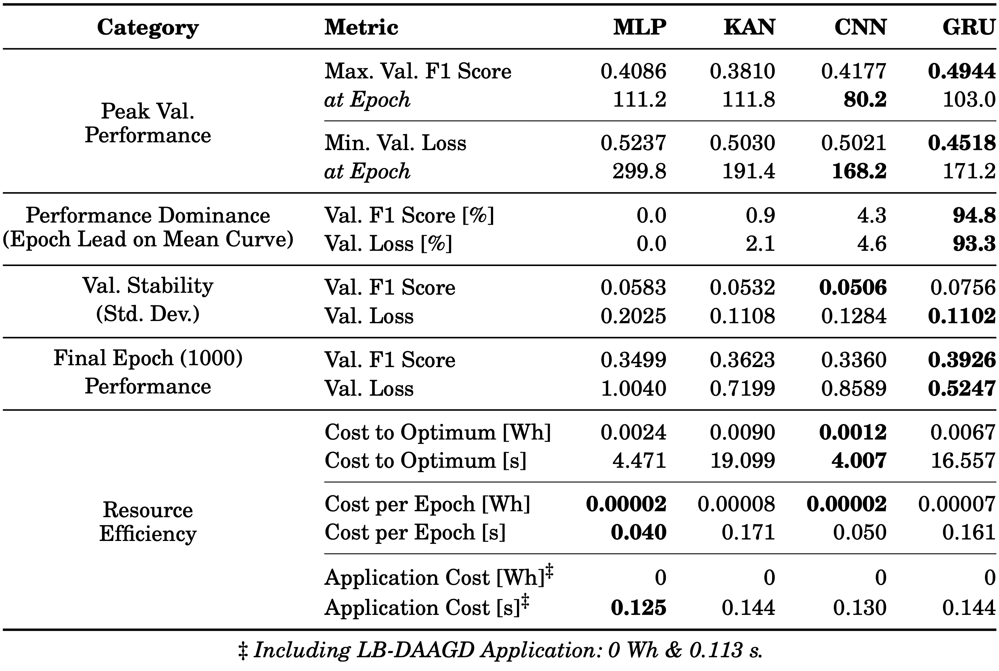

Die Untersuchung hat verdeutlicht, dass die Architektureffizienz kontextabhängig ist und dass die Wahl der Feature-Extraktionsstrategie kritische Trade-offs einführt. Eine isolierte Betrachtung der Vorhersagegenauigkeit ist für das Design von Edge-Systemen unzureichend, da Unterschiede im Ressourcenverbrauch mehrere Größenordnungen umfassen können. Für den Einsatz im industriellen Umfeld und für Verteilte Lernverfahren liefern die Ergebnisse eine detaillierte, evidenzbasierte Grundlage zur Auswahl optimierter Pipeline-Kombinationen. Insbesondere die Kombination von effizienter Feature-Extraktion (wie PAA) und leichtgewichtigen Architekturen (wie MLP) stellt einen vielversprechenden Ansatz dar, um eine hohe Genauigkeit bei minimalem Ressourcenverbrauch zu erzielen.

### Erweiterung: Gefahrstofferkennung - AI on Device Board

Ziel ist es, den Lüftungsdemonstrator um weitere Anwendungsfälle zu erweitern, die für eine hohe industrielle Relevanz stehen und leicht verständlich sind. Die Erkennung von Gefahrstoffen oder gesundheitsgefährdenden Stoffen in der Umgebungsluft ist von entscheidender Bedeutung, denn nur so können entsprechende Maßnahmen ergriffen werden. Dieses Beispiel eignet sich sehr gut, um das Umformtraining von unterschiedlichen Raummodellen mit verschiedenen Raumluftbelastungen an einem konkreten Beispiel zu demonstrieren.

**Validierung der Gefahrstoffauswahl**

Zu Beginn der Umsetzung stand die Auswahl an Stoffen, die eine Innenraumrelevanz aufweisen, beispielsweise durch Verwendung in Möbeln, Farben oder Reinigungsmitteln, und die eine Einstufung als Gesundheitsgefahr gemäß CLP (**Classification, Labelling and Packaging**) besitzen oder als sehr stark störend wahrgenommen werden. Aus einer anfänglichen Liste mit über 60 unterschiedlichen Stoffen wurden fünf ausgewählt (siehe nachfolgende Abbildung), die die Kriterien Innenraumrelevanz, leichte Handhabung und sensorische Erfassbarkeit erfüllten.

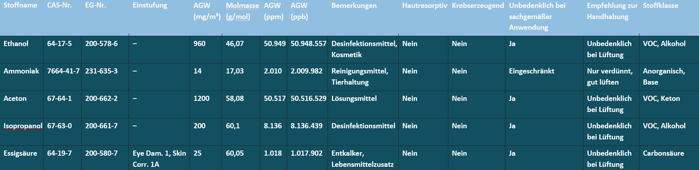

Für die zuverlässige Analyse von Gasen und flüchtigen Substanzen ist eine kontrollierte Messumgebung entscheidend, da Schwankungen in Temperatur und Luftfeuchtigkeit die Sensorantwort erheblich beeinflussen. Im Labor wurden die Stoffe in einer kontrollierten Atmosphäre (Temperatur, Luftfeuchte, Luftaustausch) miteinander verglichen, um die Reaktion des Bosch BME688 auf verschiedene Substanzen zu überprüfen.

Als Basis für die Messungen kam der **Sensortrainer** zum Einsatz. Dabei handelt es sich um ein modulares System, das speziell für die Untersuchung von Gas- und Luftqualitätsparametern in einem anderen Forschungsprojekt am Umweltcampus entwickelt wurde. Er bietet eine kleine Messkammer, die eine optimale Reaktion auf der Sensoroberfläche gewährleistet, sowie eine automatisierte Steuerung der Messabläufe und Spülzyklen. Zwischen den einzelnen Proben wurde eine Erholungszeit von 10 bis 15 Minuten eingehalten, in der die Kammer mit gereinigter Druckluft gespült wurde. So wird sichergestellt, dass sich die Sensormesswerte stabilisieren und eine Vermischung der Proben ausgeschlossen wird.

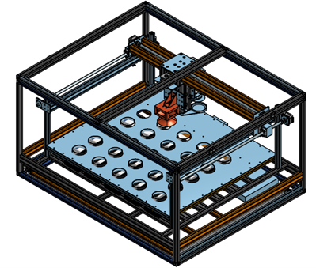

Das System integriert verschiedene Sensortypen:

-   BME690/BME688 (Bosch) für Gaswiderstandsmessungen
-   ENS160 (ScioSense) für Luftqualitätsindikatoren wie AQI, TVOC und $eCO_{2}$
-   SPG40 (Sensirion) für VOC Messungen
-   Multi-Channel Gas Sensor V2 (Seeed Studio) für $NO_{2}$, Ethanol, VOC und CO
-   Zusätzlich werden Temperaturüberwachungen mit STH41 und DS18B20 durchgeführt.

**Datenerfassung und Messablauf**

Unter konstanten Bedingungen wurden sechs Proben (Aceton-, Essig-, Ammoniak- und Ethanollösung sowie Wasser und Raumluft) untersucht. Die 20-prozentigen Lösungen von Aceton, Essigsäure, Ammoniak und Ethanol wurden durch das Mischen von jeweils 20 Volumenanteilen der Stammsubstanz mit 80 Volumenanteilen demineralisiertem Wasser hergestellt. Für die Herstellung der Ethanollösung wurde Brennspiritus verwendet. Dieser enthält mindestens 95 % reinen Ethanol sowie ca. 2 % 2-Propanol und Butanon. Dabei wurden für jede Probe 20 Messungen im Abstand von 12,5 Sekunden durchgeführt. Insgesamt umfasste die Untersuchung zehn Zyklen mit Spülungen zwischen den Proben, um Restgase zu entfernen. Die Rohdaten umfassen Gaswiderstände, Luftqualitätsindikatoren und weitere Sensormesswerte.

**Datenaufbereitung und Analyse**

Die Daten wurden mittels Z-Score-Normalisierung skaliert. Eine Hauptkomponentenanalyse (PCA) ergab, dass die ersten beiden Komponenten zusammen rund 76% der Gesamtvarianz erklären (PC1: \~55%, PC2: \~21%). PC1 wird stark durch Gaswiderstände geprägt, während PC2 Unterschiede in Luftqualitätsindikatoren widerspiegelt. Die Visualisierung als Biplot verdeutlichte die Gruppierung der Proben nach Substanzklassen.

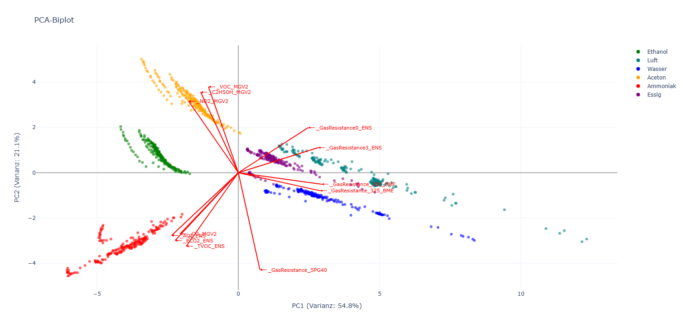

Zur Klassentrennung wurde eine lineare Diskriminanzanalyse (LDA) eingesetzt. LD1 trennt polare Flüssigkeiten (Wasser, Essig) von organischen Lösungsmitteln (Aceton, Ethanol), LD2 differenziert zwischen Luft und Ammoniak. Die LDA-Visualisierung bestätigte eine klare Trennung der Klassen.

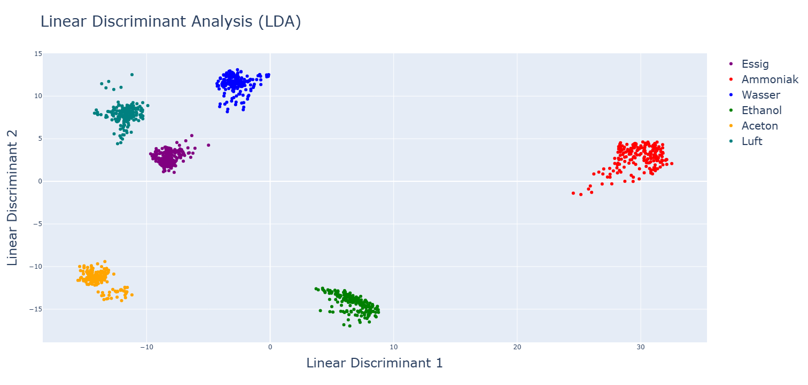

**Übertragung der Vorarbeiten auf den Demonstrator**

Die Übertragung der Vorbereitungen auf die Umsetzung eines Demonstrators mit der Hardware des Lüftungsdemonstrators und dem AI-on-Device-Board gestaltet sich schwierig, da es einige Herausforderungen gibt, die gelöst werden müssen.

1.  Umgebungsbedingungen: Die Gassensoren reagieren stark auf Veränderungen der Luftfeuchtigkeit und Umgebungstemperatur. Um diese abzubilden und zu kompensieren, sind sehr viele Messdaten bei unterschiedlichen Bedingungen nötig.

2.  Unterschiedliche Messwerte von Baugleichen Sensoren, Bauelemente-Sensoren haben von sich aus unterschiedliche Messwerte. Die Unterschiede sind so groß, dass ein generelles Training nicht funktioniert und eine Anpassung der Messwerte auf die Angleichung der Datenräume je Sensor erforderlich ist. Hier wurde vorgearbeitet und eine Methodik entwickelt, die die Angleichung der Datenräume ermöglichen soll. Eine umfassende Darstellung der Methodik, der entwickelten Algorithmen und der detaillierten Evaluationsergebnisse findet sich in der Veröffentlichung. Es sind noch tiefgreifende Untersuchungen notwendig, um das Verfahren so weiterzuentwickeln, dass die Datenräume unter allen Stoffen und bei allen Bedingungen angeglichen werden können.

3.  Die Erholungszeit zwischen den Sensoren beträgt derzeit mehrere Minuten. Es gibt Ansätze zur Verbesserung der Erholungszeit zwischen den Sensoren, die allerdings noch in späteren Forschungsarbeiten untersucht werden müssen. Für eine Demonstration der Gefahrstofferkennung ist es in der aktuellen Version nicht praktikabel, den Sensor für mehrere Minuten zu spülen, um valide Ergebnisse in angemessener Zeit zu erhalten.