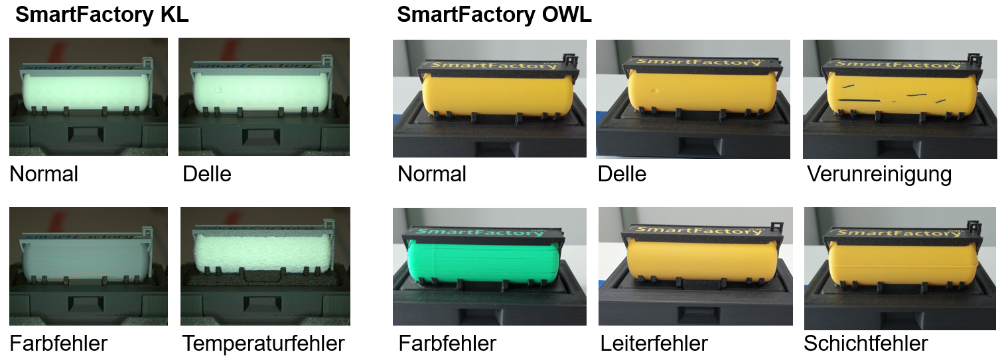
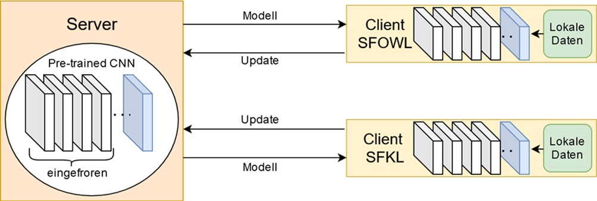

# FL-Demonstrator Bild-basierte Qualitätskontrolle in der Shared Production {#sec-004-fl_demo_shared_production}

<!--
---
author:
   - Stefanie Hittmeyer
---
--> 

## Motivation

Der SmartFactory-übergreifende Shared-Production-Demonstrator (siehe @sec-006-demo_shared_production) bildet die Grundlage für diesen Use Case. Die geografische Distanz von etwa 400 km zwischen den Standorten SmartFactoryOWL (Lemgo) und SmartFactoryKL (Kaiserslautern) erzeugt ein realistisches Szenario für föderiertes Lernen: An beiden Standorten entstehen standortspezifische Bilddaten, bei denen Faktoren wie Beleuchtungsbedingungen und Kameraperspektiven natürlicherweise Domain-Shift und Non-IID-Klassenverteilungen induzieren. Nach der Produktion durchläuft jedes Produkt eine kamerabasierte Qualitätskontrolle und wird entweder ins Lager transportiert oder zur Wiederverwertung aussortiert.

Föderiertes Lernen ermöglicht in diesem Kontext standortübergreifendes Lernen ohne Datenpooling und adressiert damit Datensouveränität sowie typische FL-Herausforderungen wie Non-IID-Daten, Personalisierung und Effizienz im Edge-Cloud-Kontinuum [@Kairouz2021]. Durch die Aggregation der Modellupdates entsteht ein globaler, domänenrobuster Feature‑Backbone, der an den einzelnen Standorten über lokale Köpfe oder Schwellenwerte personalisiert werden kann, sodass die Cross‑Site‑Generalisierung verbessert wird, ohne Rohdaten auszutauschen. Während zentrales Transfer-Learning in der Fertigungsinspektion etabliert ist (z.B. VGG16 mit eingefrorenen Convolutions und Feintuning des Klassifikationskopfes [@Weiher2023]), zeigt FL-basierte Qualitätsinspektion (z.B. FedOD mit YOLOv5/FedAvg) Robustheit bei Domain-Shift [@Hegiste2023]. Gleichzeitig reduziert der Austausch kompakter Modellgewichte anstelle großer Bilddatenströme den Kommunikationsaufwand und kann im Edge‑Cloud‑Kontinuum zu einer effizienteren Nutzung von Bandbreite und Energie beitragen. Arbeiten zu VGG16-basiertem FL berichten hohe Genauigkeiten auf Non-IID-Daten [@Alam2024], und synthetische Daten sowie Style-Transfer können Datenmangel und Domain-Gaps weiter reduzieren [@Lippemeier2024], [@Sprute2025]. Ziel dieses Use Cases ist der direkte Vergleich von lokalen Modellen, zentralem Pooling und föderiertem Lernen für die Qualitätskontrolle von 3D-gedruckten Bauteilen. Das zentral trainierte Modell fungiert dabei als Genauigkeitsobergrenze unter der (in Shared-Production-Szenarien oft unrealistischen) Annahme, dass alle Bilddaten standortübergreifend gepoolt werden können; das föderierte Modell versucht, sich dieser Obergrenze anzunähern, während alle Rohdaten an den jeweiligen Standorten verbleiben und Datensouveränität sowie IP-Schutz gewahrt bleiben. Die in diesem Demonstrator verwendeten  FL-Infrastruktur (Flower-Server und -Clients) und FL-Konzepte sind in @sec-002_integration_federeated_learning, @sec-004-fl-intro und @sec-004-evaluation-metriken detailliert beschrieben.

## Datengrundlage & Modellarchitektur

{#fig-failure width="90%"}

Es wurden Daten an zwei Standorten erhoben. In der SmartFactoryKL (KL) umfasst der Datensatz 30 Normalbilder und 30 fehlerhafte Bilder mit drei Defekttypen, darunter Delle, Farbfehler und Temperaturfehler. In der SmartFactoryOWL (OWL) liegen 20 Normal- und 72 Fehlerbilder vor, verteilt auf sechs Defekttypen, unter anderem Delle, Verunreinigung, Farbfehler, Leiterfehler und Schichtfehler; siehe @fig-failure . Damit zeigen sich deutliche Unterschiede in Verteilung und Defektvielfalt (Non‑IID) sowie standortspezifischer Domain‑Shift.

{#fig-cnn width="90%"}

Die Datenverteilung ist stark nicht‑IID: Während der Standort OWL einen deutlich höheren Anteil fehlerhafter Bilder aufweist, ist KL ausgeglichener. Zudem unterscheiden sich die Aufnahmebedingungen (z.B. Beleuchtung und Perspektive), was einen ausgeprägten Domain‑Shift erzeugt. Als Basismodell verwenden wir VGG16, vortrainiert auf ImageNet. Die konvolutionalen Schichten bleiben weitgehend eingefroren; lediglich die letzte konvolutionale Schicht wird selektiv feinjustiert, und ein neuer Klassifikationskopf wird trainiert (vgl. @fig-cnn [@Weiher2023]). Das föderierte Training erfolgte mit dem Flower-Framework [@Flower], wobei die lokal aktualisierten Modellgewichte per FedAvg aggregiert und entsprechend der lokalen Stichprobengröße gewichtet werden. Die Wirksamkeit von FL für visuelle Inspektion unter Domain‑Shift ist belegt [@Hegiste2023], und VGG16‑basiertes FL zeigt hohe Genauigkeiten auf heterogenen, verteilten Datensätzen [@Alam2024]. Zur weiteren Reduktion von Domänenlücken können synthetische und augmentierte Daten eingesetzt werden [@Lippemeier2024; @Sprute2025]. Insgesamt kombiniert der Ansatz domäneninvariante Repräsentationsbildung mit datensouveräner, sitespezifischer Anpassung und adressiert damit Heterogenität und Datenknappheit gleichermaßen.

Es wurden drei Trainingsansätze verglichen: Erstens lokale Modelle, die pro Standort jeweils 100 Epochen getrennt trainiert wurden, ohne Datenaustausch. Zweitens ein zentrales Modell, das die Daten beider Standorte (KL und OWL) pooled und 100 Epochen zentral trainiert. Drittens föderierte Modelle, bei denen nur Modellgewichte zwischen den Standorten und einem zentralen Aggregationsserver ausgetauscht werden, für variierende Kombinationen aus globalen Aggregationsrunden (R) und pro Runde durchgeführten lokalen Epochen (E) mit fixem R×E=100. Die Bewertung erfolgte standortweise anhand von Accuracy, Precision, Recall und F1-Score, wobei der F1-Score als Hauptmetrik für die Cross-Site-Generalisierung herangezogen wurde. Der F1-Score wurde als Hauptmetrik gewählt, da er Precision und Recall balanciert und somit sowohl Fehlalarme als auch übersehene Defekte berücksichtigt – beides kritisch für die industrielle Qualitätskontrolle.



## Ergebnisse

| Ansatz | R×E | Accuracy OWL | Accuracy KL | Precision OWL | Precision KL | Recall OWL | Recall KL | F1 OWL | F1 KL |
|--------|--------|-------:|-------:|-------:|-------:|-------:|-------:|-------:|-------:|
| Lokal | 100E pro Site | 1.00 | 0.50 | 1.00 | 0.50 | 1.00 | 1.00 | 1.00 | 0.60 |
| Zentral | 100E | 0.95 | 1.00 | 1.00 | 1.00 | 0.94 | 1.00 | 0.97 | 1.00 |
| Föd. | 2×50 | 0.94 | 0.83 | 1.00 | 0.83 | 0.93 | 0.80 | 0.96 | 0.90 |
| Föd. | 5×20 | 0.88 | 0.83 | 1.00 | 0.83 | 0.87 | 1.00 | 0.93 | 0.90 |
| Föd. | 20×5 | 0.89 | 0.92 | 1.00 | 0.90 | 0.87 | 1.00 | 0.92 | 0.95 |
| Föd. | 50×2 | 0.94 | 0.75 | 1.00 | 0.89 | 0.93 | 0.80 | 0.96 | 0.84 |

Die lokalen Modelle am Standort OWL erreichen zwar perfekte In‑Site‑Metriken, generalisieren jedoch nicht auf KL (F1 = 0,60). Dies deutet auf Overfitting und eine hohe Sensitivität gegenüber Domain‑Shift hin. Das zentrale Modell erzielt die beste Gesamtleistung (OWL F1 = 0,97; KL F1 = 1,00), da das Pooling die Domänendrift reduziert und die Entscheidungsschwellen besser kalibriert. In der Praxis ist dieses zentrale Modell jedoch eher als theoretische Genauigkeitsobergrenze zu verstehen, da es vollständiges Datenpooling über beide Standorte hinweg voraussetzt und damit Datensouveränitäts- und IP-Anforderungen typischer Shared-Production-Szenarien verletzt. Die föderierten Modelle nähern sich bei OWL mit den Konfigurationen 2×50 und 50×2 den zentralen F1‑Werten (jeweils 0,96) an, ohne dass Bilddaten die jeweiligen Standorte verlassen. Auf KL zeigt sich jedoch eine ausgeprägte R×E‑Sensitivität: 20×5 liefert die beste F1-Balance zwischen den Standorten (F1 = 0,92 in OWL; F1 = 0,95 in KL), während 50×2 viele Falschnegative verursacht (Recall‑Einbruch auf 0,80 in KL). Basierend auf unseren Ergebnissen bietet das 20×5-Schedule einen günstigen Trade-off zwischen Kommunikationsaufwand und Modellperformance und bringt das föderierte Modell besonders nah an die zentrale Genauigkeitsobergrenze heran. Als kommunikationsärmere Alternative bietet sich 2×50 bei leicht geringerer F1-Balance zwischen den Standorten. Allerdings sind weitere Experimente mit größeren Stichproben, zusätzlichen Standorten und statistischer Validierung erforderlich, um robuste Scheduling-Richtlinien für föderierte visuelle Qualitätskontrolle zu etablieren [@Kairouz2021].

## Diskussion

Föderiertes Lernen fungiert als Enabler für eine datensouveräne, standortübergreifende Qualitätskontrolle in der Shared Production: Anstatt Bilddaten zu teilen, werden nur Modellupdates ausgetauscht, sodass IP-Schutz und Datenschutz gewahrt bleiben. Für eine detaillierte Diskussion der Rolle von FL in der Shared Production siehe @sec-006-demo_shared_production.

Die aktuelle Evaluation ist durch den kleinen Datensatz (152 Bilder), nur zwei teilnehmende Standorte und ausgeprägten Non-IID-Skew sowie Domain-Shift eingeschränkt. Zudem basieren die Ergebnisse auf wenigen experimentellen Durchläufen ohne statistische Signifikanztests. Diese Faktoren limitieren die absolute Genauigkeit, statistische Aussagekraft und Generalisierbarkeit der Schlussfolgerungen. In zukünftigen Arbeiten können diese Limitationen adressiert werden durch:

-   Skalierung auf mehr Standorte, Samples und Produktionslinien mit zusätzlichen Defektkategorien;
-   Untersuchung von Personalisierungsstrategien (z.B. gemeinsamer Backbone mit lokalen Köpfen, FedBN) und fairness-bewusster Gewichtung;
-   Integration synthetischer Datengenerierung, einschließlich diffusionsbasierter Bildsynthese zur Reduktion von Datenmangel und Domain-Gaps;
-   Anwendung von föderiertem Active Learning zur Priorisierung informativer Samples [@Zelba2024].