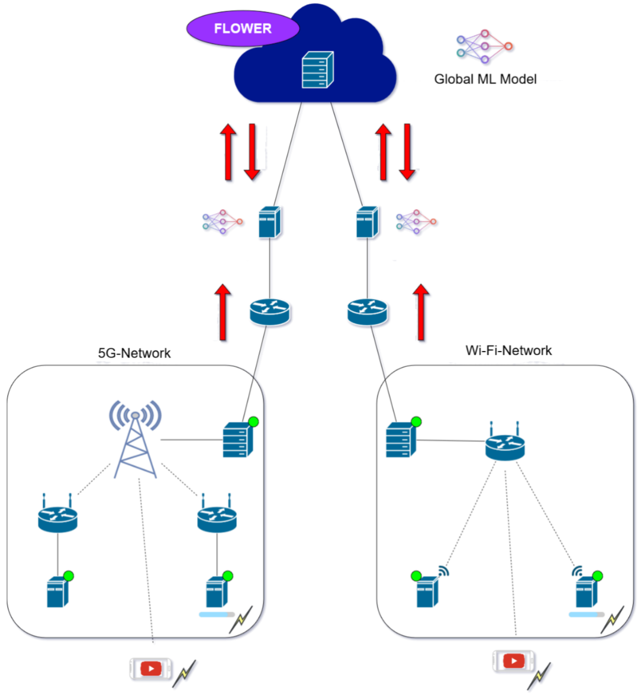

# FL-Demonstrator Wireless Network {#sec-004-fl_demo_wireless_network}

<!--
---
author:
    - Nina Großegesse
---
-->

Anomalieerkennung in industriellen Kommunikationsnetzen ist entscheidend für Robustheit, Dienstqualität (QoS) sowie eine sichere und zuverlässige Datenübertragung. Sie hilft, Fehlkonfigurationen, Softwarefehler, Hardwareausfälle, verminderte Leistung oder Cyberangriffe früh zu erkennen, damit Betreiber schnell reagieren und Service-Level-Agreements einhalten können. In modernen, heterogenen Umgebungen wie dem Edge-Cloud-Kontinuum (ECC) entstehen häufig nicht-IID Daten (z. B. durch unterschiedliche Topologien oder verschiedene zugrunde liegende Technologien), was die Entwicklung gut generalisierender Modelle erschwert. Föderiertes Lernen (FL) bietet hier einen datenschutzfreundlichen Ansatz: Modelle werden lokal in Netzwerksegmenten trainiert und ohne Austausch von Rohdaten zu einem globalen Modell aggregiert – besonders hilfreich, weil Anomalien in der Praxis selten auftreten und ungleich verteilt sein können.

Im Rahmen unserer Arbeit haben wir einen klassischen Autoencoder mit einer MLP-basierten Schwellwertauswahl kombiniert, um eine Anomaliedetektion in drahtlosen Kommunikationsnetzen hinsichtlich der Anwendung von föderiertem Lernen zu testen. Die Ergebnisse wurden im Rahmen eines wissenschaftlichen Papers veröffentlicht @grossegesse2025fedLearn.

{#fig-testbed width="80%" fig-align="center"}

@fig-testbed gibt einen Überblick über das verwendete Hardware-Testbed (siehe dafür auch @sec-003-demonstrator-performancemetrics-wirelessnetworks). Es besteht aus zwei lokalen Edge-Netzen mit unterschiedlichen Netzwerktechnologien (5G und Wi-Fi 5) sowie einer Cloud, die beide Netze über zwischengeschaltete On-Premise-Knoten verbindet. Das lokale 5G-Netz nutzt eine Indoor-5G-Basisstation in unserem Labor (80 MHz exklusiv lizenziertes Frequenzband als "5G-Standalone" betrieben), die mit dem 5G-Core beim Telekom-Provider gekoppelt ist. Zwei Messendpunkte sind über Wireless-Access-Router drahtlos an die Basisstation angebunden, ein dritter Endpunkt ist direkt im 5G-Core integriert. Zwischen allen drei Endpunkten wird systematisch bidirektionaler Messverkehr erzeugt. Das zweite lokale Netzwerk basiert auf 5-GHz-Wi-Fi („Wi-Fi 5“) und umfasst drei MINER-Messknoten: zwei sind drahtlos im Labor platziert, ein dritter ist per Kabel mit dem Wi-Fi-Router verbunden. Analog zum 5G-Aufbau wird auch hier bidirektionaler Messverkehr zwischen allen drei Knoten generiert. Konkret wird für jedes geordnete Paar von Messpunkten innerhalb eines lokalen Netzes ein Paketstrom erzeugt, dessen Pakete eine konstante Größe und ein konstantes Inter-Packet-Intervall besitzen.

Auf Basis dieses Testbeds wurde der Datensatz erzeugt. Für jeden Traffic-Flow wurden Paketgrößen und Inter-Packet-Zeiten zufällig gewählt; daraus ergeben sich zwölf Parameter pro Experiment über die sechs Messbeziehungen. Für jede Konfiguration wurden Latenz (als One-Way-Delay, OWD) und Jitter sowohl auf Applikations- als auch auf Interface-/Pcap-Ebene über ein Messintervall von zehn Sekunden erfasst und anschließend als JSON gespeichert. Die Paketgrößen variieren zwischen 300 und 1500 Byte, die Paketraten zwischen 10 und 100 Paketen pro Sekunde, was pro Flow Bitraten von etwa 20 bis 1200 kbps ergibt. Der 5G-Datensatz umfasst Messungen vom 29. Januar 2025 bis 24. Mai 2025; täglich zwischen 21:00 und 05:00 Uhr wurde alle vier Minuten eine zehnsekündige Messung durchgeführt, wobei es aufgrund gelegentlicher Messfehler nicht für jedes geplante Intervall gültige Ergebnisse gibt. Die Wi-Fi-Messungen wurden vom 23. Mai 2024 bis 31. Dezember 2024 aufgenommen; auch hier beträgt der Abstand vier Minuten, allerdings liefen die Messungen über den gesamten Tag. Für die Analyse und das Training wurden jeweils die erste und letzte Sekunde der Zeitreihen entfernt, um Verzerrungen im Kontext von Übergängen zu vermeiden. Die Messungen entsprechen prinzipiell denen in Abschnitt @sec-003-demonstrator-performancemetrics-wirelessnetworks, die Messzeiträume unterscheiden sich jedoch.

Zur Simulation von Anomalien wurde zusätzlich ein mobiles Gerät eingesetzt, das über iPerf3 gezielt hohe Last durch die Funknetze erzeugt. Im Wi-Fi-Fall wurden dazu zehn TCP-Flows mit je 100 MB/s angefordert, im 5G-Fall vierzig TCP-Flows mit je 200 MB/s. Diese Belastungsphasen wurden an ausgewählten Tagen jeweils für drei Stunden durchgeführt und dienen als Anomalie-Simulationen.

Im Rahmen der Vorverarbeitung musste berücksichtigt werden, dass die ursprünglichen OWD- und Jitter-Zeitreihen je nach Inter-Packet-Zeit unterschiedliche Längen haben und daher nicht direkt als Eingabe für Autoencoder geeignet sind. Um damit umzugehen, wurden zwei Strategien getestet: Einerseits die Extraktion statistischer Merkmale (u. a. Minimum, Maximum, Mittelwert, Standardabweichung sowie weitere Deskriptoren), wobei nach einer Feature-Selektion letztlich Mittelwert und Standardabweichung für OWD und Jitter verwendet wurden. Andererseits wurden die Zeitreihen auf eine fixe Länge von 801 Werten per Nearest-Neighbor-Interpolation resampelt. Im 5G-Szenario lieferte die Verwendung der oben genannten statistischen Merkmale um 16 % bessere Ergebnisse, weshalb sie für alle weiteren Experimente übernommen wurde.

Nach der Feature-Extraktion wurden die Daten in Trainings- und Testdaten aufgeteilt. Der Autoencoder wird ausschließlich mit Normaldaten trainiert (90 % Training, 10 % Validierung) und dabei über Wi-Fi und 5G hinweg balanciert. Für die Schwellwertauswahl (Threshold) wird ein separater, ebenfalls balancierter Datensatz genutzt, der Normal- und Anomalie-Beispiele über Sub-Sampling ausgleicht und anschließend zu 80 % in Trainingsdaten und 20 % in Testdaten aufgeteilt wird.

Für die vergleichende Evaluation wurden drei verschiedene Trainingsparadigmen betrachtet: In der dezentralen Variante trainiert jeder Client ein lokales Modell, das nur auf seinen lokalen Daten basiert. In der zentralen Variante wurden alle Client-Daten auf einen Server übertragen - dort wurde dann ein globales Modell trainiert. Beim föderierten Lernen verbleiben die Daten lokal, und es werden nur Modellparameter ausgetauscht, um ein globales Modell zu trainieren. Verglichen werden die finale Detektionsleistung mittels F1-Score, die Kommunikationskosten sowie die gesamte Trainingszeit.

## Architektur zur Anomalieerkennung {.unnumbered}

Für die Anomalieerkennung wird zunächst ein Autoencoder angewendet. Ein gut angepasster Autoencoder soll einen niedrigen Rekonstruktionsfehler erreichen, zugleich aber eine ausreichend kleine „Bottleneck“-Schicht besitzen, damit er nicht einfach die Eingabe identisch nachbildet. Deshalb wurden neben den Modellparametern auch die Hyperparameter systematisch optimiert. Dazu nutzen wir eine Bayes’sche Suchstrategie mit Optuna. Zuerst wurden sieben Bottleneck-Größen im Bereich 3 bis 21 getestet; gewählt wurde die kleinste Größe, die den Rekonstruktionsfehler nicht deutlich verschlechtert – das war eine Bottleneck-Größe von 12. Anschließend wurden weitere Hyperparameter optimiert. Obwohl die Optimierung für jedes Szenario separat durchgeführt wurde, erwiesen sich die im zentralisierten Setup gefundenen Einstellungen auch für die anderen Szenarien als passend.

Bei der Wahl des Grenzwertes zeigte sich, dass klassische, feste Schwellenwerte im Wi-Fi-Szenario gut funktionieren, im 5G-Szenario jedoch deutlich schlechter. Um das zu verbessern, wurde eine automatische, MLP-basierte Grenzwertauswahl eingeführt. Das MLP erhält als Eingabe den natürlichen Logarithmus des quadrierten Rekonstruktionsfehlers pro Feature. Die Architektur ist bewusst einfach und interpretierbar: In der ersten Schicht gibt es so viele Neuronen wie Eingabefeatures, wobei jedes Neuron genau ein Feature verarbeitet; eine zweite Schicht mit einem einzelnen Neuron fasst diese Signale zusammen und klassifiziert binär („Anomalie“ vs. „Normal“). Trainiert wird mit Binary Cross-Entropy und Adam. Ein Vorteil dieser Konstruktion ist, dass sich pro Feature ein Schwellwert direkt aus Gewicht und Bias des zugehörigen Neurons ableiten lässt (τ_i=-b_i^1/w_i^1). Um nur sinnvolle Features zu behalten, wird für jedes Feature geprüft, welcher durchschnittliche F1-Score erzielt wird, wenn ausschließlich dessen Schwellwert genutzt wird. Liegt dieser Wert über einem Grenzwert L, wird der gelernte Schwellwert übernommen; andernfalls wird stattdessen ein konservativer Schwellenwert auf Basis des 99,9-Perzentils der Normaldaten verwendet. Im FL-Szenario bleibt das Vorgehen grundsätzlich gleich, mit der zusätzlichen Bedingung, dass ein gelernter Schwellwert von allen Clients akzeptiert werden muss – sonst wird ebenfalls auf den Perzentil-basierten Wert zurückgegriffen. In den Experimenten wurde der Grenzwert L für 5G auf 65 % und für Wi-Fi auf 90 % gesetzt. Insgesamt ergibt sich dadurch ein einfach implementierbarer, nachvollziehbarer und effizienter Ansatz, der insbesondere dort hilft, wo Standard-Thresholding versagt.

## Föderiertes Lernen (FL) {.unnumbered}

Für die Experimente im föderierten Setup wurde das Flower-Framework verwendet, da es den Betrieb auf mehreren physischen Geräten unterstützt, verschiedene FL-Strategien mitbringt und unabhängig von der verwendeten ML-Bibliothek ist (u. a. kompatibel mit PyTorch und scikit-learn). Für die Entscheidung bezüglich einer passenden FL-Strategie wurden die folgenden drei repräsentative Strategien verglichen: FedAvg (gewichtetes Mitteln von Modellparametern), FedAdam (adaptiver Server-Optimizer auf Basis von Adam) und FedProx (FedAvg-Erweiterung mit proximalem Term, um besser mit nicht-IID Daten umzugehen). Für Details zu den verschiedenen FL-Strategien siehe @sec-004-fl-strategien. Jede Strategie wurde im Hinblick auf zwei Aufgaben evaluiert: beim Autoencoder-Training anhand des finalen Rekonstruktionsfehlers und für die MLP-basierten Schwellwertauswahl anhand des finalen F1-Scores. Zur statistischen Absicherung wird jedes Experiment fünfmal wiederholt. Die Anzahl der föderierten Runden wurde empirisch festgelegt: 500 Runden für den Autoencoder (nach Stabilisierung der Loss-Kurve) und 1300 Runden für das MLP, um eine Trainingsgenauigkeit von über 87 % zu erreichen. In beiden Fällen wurden pro Client zwei lokale Epochen genutzt.

Zunächst wurde die vorgeschlagene MLP-basierte Schwellwertauswahl mit dem in der Literatur üblichen Standard-Thresholding (z. B. Perzentil-basiert) verglichen. Dabei verbessert die Methode im 5G-Szenario die F1-Scores deutlich: für Anomaliedaten von 63 % auf 71 % (+8 Prozentpunkte) und für Normaldaten von 59 % auf 75 % (+16 Prozentpunkte). Im Wi-Fi-Szenario erreichen beide Verfahren praktisch 100 %. Insgesamt ist die Detektion im 5G-Szenario durchgängig schwieriger als in Wi-Fi, da die Verteilungen der gemessenen Metriken sich im 5G-Fall stark überlappen. Die Erklärung dafür liegt in den unterschiedlichen Zugriffsmechanismen begründet: Wi-Fi nutzt CSMA/CA mit dezentralem Kanalzugriff, wodurch unter hoher Last die Latenz stärker schwankt; 5G arbeitet mit zentralem Scheduling (gNodeB, OFDMA) und verteilt Ressourcen gleichmäßiger, was Anomalien in Wi-Fi tendenziell auf Basis der Analyse von Latenz und Jitter leichter sichtbar macht.

Hinsichtlich der verschiedenen getesteten FL-Strategien lieferte die Strategie FedAvg die vielversprechendsten Ergebnisse und wurde somit für die weiteren Tests ausgewählt. Mit MLP + FedAvg haben wir schließlich die drei Szenarien dezentral, zentral und föderiert verglichen. Die F1-Scores sind insgesamt sehr ähnlich: im 5G-Bereich liegen die Werte grob im Bereich \~71–76 % für Anomalie- und \~73–77 % für Normaldaten; im Wi-Fi-Bereich sind sie nahezu perfekt (\~99–100 %). Das zeigt, dass FL in diesem Setup eine vergleichbare Detektionsleistung wie zentrales Training erreichen kann, ohne Rohdaten zu zentralisieren.

Deutlicher werden die Unterschiede bei Kommunikationskosten und Trainingsdauer: Dezentral fällt erwartungsgemäß kein Kommunikationsoverhead an und die Trainingszeit ist sehr kurz (hier ca. 1 Minute für den Autoencoder und 5 Sekunden fürs MLP). Zentralisiertes Training benötigt in diesem Setup etwa 1,76 GB Datentransfer bei rund 2 Minuten 10 Sekunden Trainingszeit. Das FL-Szenario reduziert den Kommunikationsaufwand stark auf etwa 120 MB, benötigt aber deutlich länger (\~1,6 Stunden für den Autoencoder und \~7,4 Stunden fürs MLP), was auf zusätzlichen Netzwerk-Overhead und die non-IID-Daten zurückgeführt wird. Diese langsamere Konvergenz gilt als erwartbar, zeigt aber für die Skalierung in produktiven Umgebungen einen klaren Verbesserungsbedarf auf.

Schlussfolgernd lässt sich festhalten, dass die Kombination aus klassischem Autoencoder und MLP-basierter Threshold-Auswahl besonders in heterogenen Netzen wirksam ist und insbesondere die 5G-Ergebnisse gegenüber dem Standard-Thresholding verbessert. Föderiertes Lernen kann dabei die Detektionsleistung weitgehend erhalten, verbessert die Datensouveränität und senkt den Kommunikationsbedarf, wohingegen mit längeren Trainingszeiten zu rechnen ist.