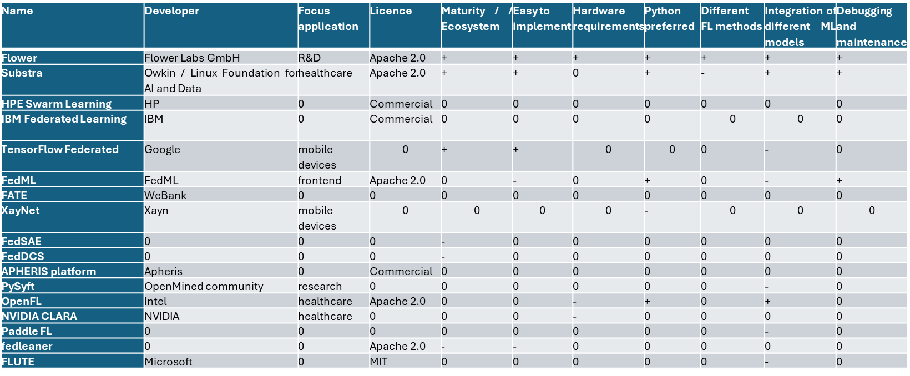

# Anforderungsanalyse {#sec-004-anforderungsanalyse}

<!--
---
author: 
  - Sabine Haag
---
-->

Bereits verfügbare Ansätze des föderierten Lernens wurden evaluiert. Die Eigenschaften der ausgewählten Verfahren wurden mit Blick auf die Anwendungsszenarien bewertet und sowohl das Potential hinsichtlich der Ressourceneffizienz als auch die Optimierungspotenziale untersucht.

Eine Analyse zu verfügbaren Frameworks zur Umsetzung von verteilten Lernsystemen zum Training von Merkmalsextraktoren wurde initial umgesetzt. Hierzu wurden zunächst Bewertungskriterien aufgestellt, auf deren Basis recherchierte Frameworks bewertet wurden. Die Kriterien sind: Fokus-Applikation, Lizenz des Frameworks, Aktive (Weiter-) Entwicklung des Frameworks, Fähigkeit zur Implementierung auf unterschiedlichen Endgeräten, Hürden bei der Implementierung und Adaption der Methoden, Anzahl an implementierten Algorithmen zur Verteilung von Modellparametern, Möglichkeit zur Integration eigens konzipierter Merkmalsextraktionsmodelle. Erfüllt ein Framework möglichst viele der geforderten Kriterien, dann kann es als besonders geeignet für den hier vorliegenden Kontext bezeichnet werden:

Das Framework sollte möglichst zugänglich für Forschungs-/ R&D-Applikationen und dabei gleichzeitig offen für eine Industrialisierung sein. Diese Flexibilität ist notwendig, um aktuelle Forschungsthemen wie bspw. das Federated-Clustering umzusetzen. Notwendig sind diese Forschungsarbeiten, da absehbar ist, dass industrielle Anwendungen nicht mit den klassischen Federated Learning Verfahren (klassischem Federated Averaging) umgesetzt werden können. Der Anbieter des Frameworks sollte im Idealfall kommerziell sein, um eine künftige Industrialisierung zu unterstützen. Gleichzeitig sollte das Frameworks als solches unter einer Lizenz stehen, die eine Nutzung im industriellen Kontext ermöglicht. Das Framework sollte einfach zu implementieren sein, eine gute Dokumentation haben sowie eine aktive Community aufweisen. Gleichzeitig sollte das Framework eine große Auswahl an Stand der Technik Methoden zum verteilten Lernen von Systemen haben und die Möglichkeit bieten, eigene Forschungsansätze zu integrieren.

Mittels dieser Kriterien wurde eine Recherche im Stand der Technik durchgeführt. Die Ergebnisse sind in der @fig-Bewertung_FL_Frameworks dargestellt. Die Bewertung dient ausschließlich der projektspezifischen technischen Einordnung verfügbarer Frameworks im Kontext der im Projekt betrachteten Anforderungen und erhebt keinen Anspruch auf allgemeine Vergleichbarkeit oder Vollständigkeit.

{#fig-Bewertung_FL_Frameworks fig-align="center" width="100%"}

Unter Berücksichtigung der im Projekt betrachteten Anforderungen erwies sich das FLOWER Framework als besonders geeignet. Dieses besitzt eine Lizenz, die die Weiternutzung des Frameworks gestattet. Das Framework ist in Python umgesetzt und besitzt eine effizient zu bedienende API. Gleichzeitig besteht die Möglichkeit, eine große Zahl an gängigen ML-Bibliotheken wie Sklearn oder Keras einzubinden. Es können per default unterschiedliche Strategien ausgewählt werden, wie Modelle verteilt gelernt werden sollen. Zwei wesentliche Merkmale von FLOWER sind, dass es zum einen um eigene Algorithmen und Methoden zum verteilten Lernen erweitert werden kann. Zum anderen besitzt es die Möglichkeit zunächst unterschiedliche Edge-Devices auf einem lokalen Rechner zu simulieren. Es bringt damit eine eigene Simulationsumgebung mit. Dies ist besonders für Entwicklungszwecke hilfreich. FLOWER implementiert standardmäßig die Möglichkeit, Modelle verteilt mittels des sogenannten Federated Averaging sowie des weighted Federated Averaging Algorithmus zu trainieren. Der Vorteil des weighted Federated Averaging Ansatzes ist, dass hierbei die Menge an Daten, die an einem Client (Edge-Device / Maschinensteuerung / IPC an Maschine) vorliegen, zum Gewichten der Wichtigkeit desselben verwendet wird. Die Gewichte dieses Clients werden entsprechend stärker berücksichtigt. Es wird anschließend, analog zum klassischen Federated Averaging Ansatz, das Mittel der Gewichte der einzelnen Clients gebildet. Das Flower Framework wurde, wie erwartet, in den letzten Jahren tatsächlich sehr aktiv weiterentwickelt: - Unterstützung für neue Machine-Learning-Frameworks (PyTorch, TensorFlow, JAX, Hugging Face u.a.) - Einführung von Flower Core und Flower Client für flexiblere und skalierbare Architekturen - Verbesserte Unterstützung für heterogene und cross-silo Szenarien (verschiedene Hardware und Datentypen) - Erweiterte APIs für benutzerdefinierte Aggregationsstrategien und fortgeschrittene Federated Learning Methoden (z.B. Federated Analytics, Federated Evaluation) - Integration von MLOps-Tools und Cloud-Umgebungen (Kubernetes, Docker u.a.) - Verbesserte Dokumentation, Tutorials und Community-Support - Performance-Optimierungen und Skalierbarkeit für große Experimente und Anwendungen - Unterstützung für Privacy-Preserving Techniken (Differential Privacy, Secure Aggregation)

Zusätzlich zur letzteren Betrachtung werden im Folgenden die Stärken, Schwächen, Chancen und Risiken bei der Verwendung des Weighted Federated Averaging Ansatzes dargestellt:

|  |  |
|------------------------------------|------------------------------------|
| Stärken | Schwächen |
| Alle Algorithmen, die mittels Anpassung von Gewichten trainiert werden, können verwendet werden. Darunter fallen vor allem Neuronale Netzwerke. In der Literatur bewährter Ansatz Verstanden und damit erweiterbar einfach zu vergleichen | Es bestehen in der Literatur Ansätze, die für spezielle Problemstellungen bessere Ergebnisse erwarten lassen. Bezieht lediglich Ungleichheiten in der Menge der Daten, nicht aber in deren Verteilung mit ein. |
|  |  |
| Chancen | Risiken |
| Kombination des Ansatzes mit noch zu entwickelnden Ideen zur Entwicklung eines leistungsstarken als auch breit einsetzbaren Algorithmus. Algorithmus erlaubt einfache Erweiterbarkeit | Das Vernachlässigen der Verteilung der Daten führt dazu, dass unter den Bedingungen, wie sie für reale Produktionsdatensätze vorherrschen, eine teilweise eingeschränkte Funktionsweise zu erwarten ist. |

Die genannten Schwächen können durch komplexere FL Strategien (siehe @sec-004-fl-strategien) adressiert werden.

## Praxisrelevante Aspekte im Zuge der Umsetzung industrieller Use-Cases

Bei den Use-Cases wurde grundsätzlich darauf geachtet, dass die verwendeten Datensätze die typischen Verteilungen widerspiegeln, wie sie in realen Anwendungen vorzufinden sind. Dabei wurde eine fundamentale Herausforderung bei der Implementierung kollaborativer Verfahren wie Federated Learning (FL) identifiziert. FL ist ein Ansatz, der sein volles Potenzial entfaltet, wenn Modelle auf einer signifikanten Anzahl diverser Datenquellen (Clients) trainiert werden, ohne dass ein Zugriff auf die Rohdaten der Clients erfolgt.

Die Demonstration des Potenzials von FL unterliegt in der Praxis einer zirkulären Abhängigkeit. In der initialen Phase steht typischerweise nur eine begrenzte Anzahl an Clients mit einer entsprechend limitierten Datenbasis zur Verfügung. Die Akquise weiterer Teilnehmer für das kollaborative Verfahren setzt jedoch den Nachweis eines quantifizierbaren Vorteils voraus, der wiederum eine Voraussetzung für die Skalierung der Technologie ist.

Eine hohe und zuverlässige System-Performance, welche die Überlegenheit von FL belegt, erfordert eine große und datendiverse Anzahl an Clients. Die für den Erfolgsnachweis notwendige kritische Masse an Teilnehmern wird jedoch erst durch den bereits erbrachten Erfolgsnachweis erreicht. Diese Bedingung erfordert eine strategische Entscheidung, anfängliche Unsicherheiten bezüglich der Performance in Kauf zu nehmen. Der Leistungsanstieg verläuft nicht linear mit der Anzahl der teilnehmenden Clients. Eine wesentliche Aufgabe besteht somit darin, das langfristige Potenzial der Architektur zu validieren und zu kommunizieren, um initiale Investitionen zu rechtfertigen, die sich erst nach Erreichen einer kritischen Teilnehmerzahl amortisieren.