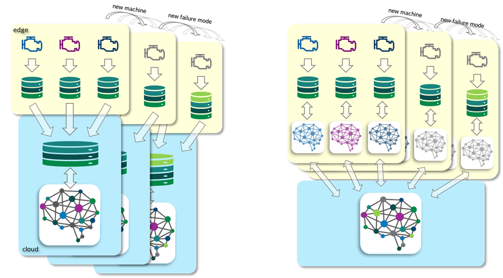
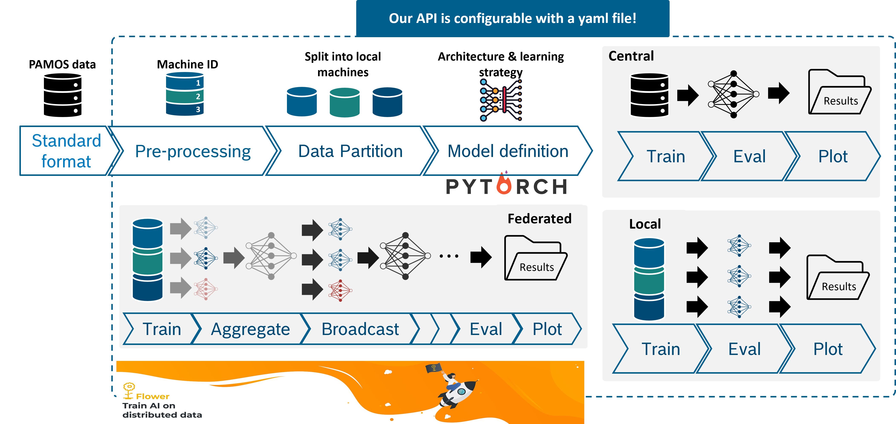

# Evaluation und Metriken von Föderiertem Lernen {#sec-004-evaluation-metriken}

<!--
---
author: 
  - Sabine Haag
  - Tobias Schlagenhauf
---
-->

Die Evaluation von Föderiertem Lernen im industriellen Kontext erfordert die Berücksichtigung spezifischer Metriken, die über die reine Modellleistung hinausgehen. Falls der Einsatz von FL nicht rein durch Datensouveränität motiviert ist, sind insbesondere der Energieverbrauch und die Ressourceneffizienz entscheidende Faktoren, um die Vorteile von FL gegenüber zentralisierten Ansätzen zu quantifizieren. In diesem Abschnitt werden relevante Metriken und Evaluationsmethoden vorgestellt, um die Ressourceneffizienz von FL-Systemen systematisch zu untersuchen, sowie die Herausforderungen und Lösungsansätze bei der praktischen Umsetzung von FL in realen industriellen Szenarien diskutiert. Daraus ergeben sich Empfehlungen für Unternehmen für den sinnvollen Einsatz von FL.

Es gibt keinen allgemeinen Trend, ob FL oder zentrales Training energieeffizienter ist. Der Energieverbrauch hängt stark von der Aufgabe, den Rahmenbedingungen und der Umsetzung ab. Daher müssen für die Untersuchungen Annahmen gemacht und für das betrachtete Umfeld aussagekräftige Szenarien gefunden werden, die auf einem Demonstrator abgebildet werden können (siehe @sec-004-fl_demo_intro). Wie ein FL-Ablauf im industriellen Kontext aussehen kann, wenn neue Anlagen und beispielsweise neue Anomalien (oder Produktvarianten, Prozessvarianten, etc.) hinzukommen, ist in @fig-cycle dargestellt.

{#fig-cycle fig-align="center" width="85%"}

## Metriken für die Evaluation von FL

Zu den üblichen Metriken für die Modellleistung (z. B. Accuracy, Precision, Recall, F1-Score, R2-Score) kommen bei der Evaluation von FL spezifische Metriken hinzu. Dazu gehören:

-   **Energieverbrauch**: Der Energieverbrauch kann auf verschiedenen Ebenen gemessen werden, z. B. pro Trainingsrunde, pro Client oder pro Kommunikationsrunde. Es ist wichtig, den Energieverbrauch sowohl für das lokale Training auf den Clients als auch für die Kommunikation mit dem Server zu berücksichtigen.

-   **Kommunikationskosten**: Diese Metrik quantifiziert die Menge der übertragenen Daten zwischen Clients und Server. Sie kann in Bytes oder als Anzahl der Kommunikationsrunden gemessen werden. Eine geringere Anzahl von Kommunikationsrunden oder eine geringere Datenmenge pro Runde kann auf eine höhere Übertragungseffizienz hinweisen.

-   **Ressourceneffizienz**: Diese Metrik berücksichtigt die Nutzung von Rechenressourcen (z. B. CPU, GPU) und Speicher auf den Clients. Sie kann in Form von durchschnittlicher Auslastung oder maximaler Nutzung gemessen werden.

-   **Dateneffizienz**: Diese Metrik bewertet, wie gut das FL-System mit begrenzten Daten auf den Clients umgehen kann. Sie kann durch die Leistung des Modells in Bezug auf die Anzahl der Trainingsbeispiele gemessen werden. Besonders zu erwähnen sind hier die oft hohen Kosten für die Annotation von Daten in industriellen Szenarien. Daher ist es wichtig, die Dateneffizienz von FL-Systemen zu bewerten, um den Nutzen von FL gegenüber alternativen Ansätzen (z.B. lediglich lokales Training) zu quantifizieren.

-   **Fairness**: In einigen Fällen kann es wichtig sein, die Fairness der Modellleistung über verschiedene Clients hinweg zu bewerten, insbesondere wenn die Daten heterogen sind. Metriken wie die Varianz der Genauigkeit oder die minimale Genauigkeit über alle Clients können hier relevant sein.

-   **Konvergenzgeschwindigkeit**: Diese Metrik misst, wie schnell das FL-Modell eine bestimmte Leistungsstufe erreicht. Entscheidend ist bei FL die Anzahl der Kommunikationsrunden, die erforderlich sind, um eine bestimmte Genauigkeit zu erreichen. Eine schnellere Konvergenz ist im Allgemeinen ressourcenschonender.

-   **Robustheit gegenüber Datenheterogenität**: Diese Metrik bewertet, wie gut das FL-System mit heterogenen Daten auf den Clients umgehen kann. Sie kann durch die Leistung des Modells auf verschiedenen Clients oder durch die Varianz der Leistung über alle Clients gemessen werden.

-   **Skalierbarkeit**: Diese Metrik bewertet, wie gut das FL-System mit einer zunehmenden Anzahl von Clients umgehen kann. Sie kann durch die Leistung des Modells oder den Energieverbrauch in Bezug auf die Anzahl der Clients gemessen werden.

-   **Hardware und IT-Infrastruktur**: Die Auswahl der Hardware für die Clients und den Server kann einen erheblichen Einfluss auf die Ressourceneffizienz von FL haben. Wir können im Projekt die realistische Annahme treffen, dass die bereits vorhandenen Edge Devices und die vorhandene IT-Infrastruktur genutzt werden können. Es ist jedoch wichtig, die Leistungsfähigkeit der Hardware und die Anforderungen der FL-Algorithmen zu berücksichtigen, um eine effiziente Nutzung der Ressourcen zu gewährleisten.

-   **Modellarchitektur und Hyperparameter**: Die Wahl der Modellarchitektur und der Hyperparameter hat einen großen Einfluss auf die Ressourceneffizienz. Dabei ist zu beachten, dass gerade die Hyperparameteroptimierung den Energieverbrauch erheblich erhöht durch mehrfache Durchführung des Trainings. Die Hyperparameteroptimierung sollte daher mit sorgfältig ausgewählten, reduzierten Trainingsläufen stattfinden, auch wenn dadurch nicht das globale Minimum ermittelt werden kann.

Welche Metriken betrachtet werden sollten, hängt von den spezifischen Zielen und Anforderungen des Projekts ab. Es ist wichtig, eine umfassende Evaluation durchzuführen, die sowohl die Modellleistung als auch die Ressourceneffizienz berücksichtigt, um den Nutzen zu quantifizieren und fundierte Entscheidungen über den Einsatz von FL in industriellen Szenarien zu treffen.

## FL-API zur Durchführung von Experimenten zum Federated Learning

Zur effizienten Durchführung von FL Experimenten ist es wichtig, eine geeignete Infrastruktur zu haben, die die verschiedenen Schritte des FL-Prozesses unterstützt. Dazu gehören die Verwaltung von Clients, die Koordination von Trainingsrunden, die Aggregation von Modellen und die Überwachung der Leistung. Im Projekt wurde dafür eine FL-API entwickelt, die auf dem Framework FLOWER basiert. Diese API ermöglicht es, verschiedene Experimente zum Federated Learning durchzuführen. Die Parametrierung wird durch ein yaml-File vorgenommen. Ein schematischer Aufbau der API ist in @fig-fl-API dargestellt.

{#fig-fl-API fig-align="center" width="85%"}

## Aktuelle methodische Forschungsherausforderungen und Lösungsansätze im Kontext des Federated Learning beim Umgang mit Realdaten in föderierten Systemen

Föderiertes Lernen wird häufig als Schlüsseltechnologie betrachtet, um Machine-Learning-Modelle in datenschutzsensitiven oder unternehmensübergreifenden Kontexten zu trainieren, ohne Rohdaten zentral zu sammeln. In der praktischen Umsetzung trifft FL jedoch auf Realitätsbedingungen, die sich deutlich von idealisierten Forschungs- oder Benchmark-Szenarien unterscheiden. Die zentralen Herausforderungen liegen nicht in einem einzelnen technischen Detail, sondern im Zusammenspiel aus Datenheterogenität, Systemrestriktionen, operativer Dynamik und begrenzter Beobachtbarkeit (kein direkter Einblick in lokale Daten).

Im Folgenden werden die wichtigsten Herausforderungen strukturiert dargestellt.

**Realdaten sind strukturell heterogen**\
Und diese Heterogenität ist nicht „Zufall“. In realen Anwendungen stammen Daten aus unterschiedlichen Quellen, die sich systematisch unterscheiden. Diese Unterschiede sind oft stabil (persistieren über Wochen/Monate) und entstehen aus realen Ursachen, z. B.:

-   Geräte- und Sensorheterogenität: Unterschiedliche Hardware-Generationen, Firmwarestände, Sensorqualitäten, Samplingraten, Messrauschen oder Kalibrierzustände führen zu systematischen Verschiebungen in den Daten. Selbst wenn das „gleiche Ereignis“ gemessen wird, sieht es in den Rohdaten unterschiedlich aus.

-   Nutzer- und Verhaltensheterogenität. In vielen Domänen (z. B. mobile Anwendungen, Wearables, Assistenzsysteme) unterscheiden sich Nutzer in Körpermerkmalen, Bewegungsstil, Routineverhalten und Interaktionsmustern. Dadurch entstehen Verteilungen, die nicht nur „leicht anders“, sondern qualitativ verschieden sein können.

-   Umgebungs- und Kontextwechsel. Realdaten werden unter wechselnden Bedingungen aufgenommen: unterschiedliche Orte, Temperaturen, Maschinenzustände, Tageszeiten, Kleidungsstücke, Untergründe, Produktionschargen etc. Kontextwechsel erzeugen zusätzliche Varianz, die sich zwischen Clients unterschiedlich stark ausprägt.

-   Datenqualität und Messfehler. Fehlende Werte, Ausreißer, sporadische Sensorfehler, Paketverluste, unvollständige Labels oder unscharfe Annotationen sind in Realdaten die Regel, nicht die Ausnahme. Die Fehlerstruktur ist dabei häufig client-spezifisch.

-   Unterschiedliche Datenmengen und Ungleichgewichte. Einige Clients liefern sehr viele Daten (High-usage), andere sehr wenige (Low-usage). Zudem können seltene Ereignisse (Anomalien, Sonderfälle) stark ungleich verteilt sein. Das beeinflusst nicht nur das Training, sondern auch die Aussagekraft von Evaluationen.

-   Wesentlich für den Projektkontext. Diese Faktoren erzeugen Heterogenität, die nicht durch „mehr Training“ oder „größere Modelle“ automatisch verschwindet. Sie ist strukturell bedingt – und damit ein Kernproblem bei der Übertragung von Forschungsprototypen in reale Systeme.

**Operative Einschränkungen in realen FL-Systemen verschärfen das Problem**\
Neben der Datenheterogenität existieren Systembedingungen, die in Benchmarks häufig nicht modelliert werden, in realen Projekten aber entscheidend sind.

-   Nicht-gleichzeitige Teilnahme und Verfügbarkeit (Partial Participation). Clients sind nicht immer online, nicht immer verfügbar und nehmen unregelmäßig teil. Das führt zu Trainingsrunden, in denen das globale Modell nur auf einem wechselnden Teil der Population basiert. Gerade bei heterogenen Daten können dadurch bestimmte Gruppen systematisch unterrepräsentiert bleiben.

-   Ressourcenrestriktionen am Client. Viele Clients sind energie-, speicher- oder rechenbeschränkt. Trainingsdauer, Batchgrößen, lokale Epochenzahl und Modellkomplexität müssen begrenzt werden. Diese Einschränkungen erhöhen die Varianz der lokalen Updates und erschweren robuste Konvergenz.

-   Kommunikation ist begrenzt und oft teuer. Kommunikationsfenster sind kurz, Bandbreite ist variabel, und in industriellen Settings können Kommunikationskosten oder Netztrennung relevant sein. FL muss daher mit wenigen Kommunikationsrunden oder starker Kompression funktionieren – was die Anforderungen an „schnelle und stabile Lernfortschritte“ erhöht.

-   Asynchrone und zeitvariable Systeme (Concept Drift / Data Drift). Reale Datenverteilungen sind nicht statisch. Nutzerverhalten, Geräteupdates, Produktionsprozesse oder saisonale Effekte verändern die Daten. Es entstehen Drift-Phänomene, die sich von Client zu Client unterscheiden. Dadurch kann ein Modell, das heute gut funktioniert, morgen bereits degradieren.

-   Beschränkte Diagnostik: Keine direkten Dateninspektionen. In FL sind zentrale Debugging-Mechanismen eingeschränkt: Man kann nicht einfach „in die Daten schauen“, Fehlercases manuell prüfen oder Datensätze bereinigen. Dies erschwert Root-Cause-Analysen bei Performanceeinbrüchen erheblich und macht robuste, datenunabhängige Monitoring- und Qualitätsindikatoren nötig.

**Warum klassische FL-Ansätze oft nicht ausreichen – typische Failure Modes**\
Viele Standardverfahren (z. B. FedAvg und Varianten) sind historisch auf idealisierte Bedingungen ausgelegt: relativ homogene Daten, regelmäßige Teilnahme, stationäre Verteilungen und ausreichend Kommunikation. Unter realen Bedingungen treten jedoch wiederkehrende Problembilder auf.

-   Instabile oder langsame Konvergenz. Wenn Clients sehr unterschiedliche Daten sehen, „ziehen“ lokale Updates in verschiedene Richtungen. Das globale Modell macht dann nur kleine Fortschritte, oszilliert oder benötigt deutlich mehr Runden, um brauchbare Qualität zu erreichen.
-   Unfaire oder unausgewogene Leistung zwischen Client-Gruppen. Selbst bei guter durchschnittlicher Testperformance kann es sein, dass bestimmte Client-Gruppen (z. B. seltene Geräteklassen oder Randbedingungen) systematisch schlechter bedient werden. Für industrielle Anwendungen ist diese „Tail-Performance“ oft kritischer als der Mittelwert.
-   Negative Übertragung zwischen inkompatiblen Clients (Negative Transfer). In heterogenen Populationen kann gemeinsames Training dazu führen, dass Wissen von einer Gruppe die andere Gruppe verschlechtert. Das ist insbesondere problematisch, wenn es keine Mechanismen gibt, um inkompatible Updates zu dämpfen oder Kooperationsstrukturen anzupassen.
-   Fehlende Anpassungsmechanismen an Subpopulationen. Reale Systeme bestehen häufig aus Subpopulationen (z. B. Gerätetypen, Nutzercluster, Betriebsmodi). Ein einziges globales Modell kann diese Vielfalt nicht immer sinnvoll abdecken. Ohne Strukturierung (z. B. Clusterbildung oder personalisierte Komponenten) bleiben Leistungsgrenzen bestehen.
-   Evaluation ist schwieriger als in zentralisierten Settings. Zentrale Testsets repräsentieren reale Vielfalt oft nur unvollständig. Zudem sind in Projekten häufig nur begrenzte, nicht vollständig gelabelte oder verzerrte Evaluationsdaten verfügbar. Dadurch entstehen Risiken, dass Verbesserungen „nur auf dem Papier“ sichtbar sind, aber nicht robust im Feld.

## Praktische Hinweise und Empfehlungen für den industriellen Einsatz

Aus den Experimenten und dem Prozess der Gestaltung und Durchführung der Experimente wurden im Projekt wertvolle Erkenntnisse für die industriellen Einsatzszenarien von Federated Learning gewonnen. Dabei zeigt sich ein differenziertes Bild. Federated Learning ist nicht immer die beste Wahl, kann unter bestimmten Bedingungen und für bestimmte Szenarien aber sehr hilfreich sein. Im Folgenden sind praxisrelevante Fragen und entsprechende Antworten dargestellt.

1.  **Wann sollte Federated Learning eingesetzt werden?**\
    Federated Learning ist insbesondere dann vorteilhaft, wenn:

-   Anlagen ähnliche Aufgaben erfüllen, jedoch unterschiedliche Datenmengen oder Fehlertypen aufweisen,
-   neue Anlagen mit minimalem Retrainingsaufwand integriert werden müssen,
-   seltene oder kritische Fehlertypen nur auf einzelnen Anlagen auftreten, deren Wissen jedoch global nutzbar sein soll,
-   Edge-Geräte über ausreichende Rechen- und Energieressourcen verfügen.

2.  **Welche Voraussetzungen der IT-Infrastruktur müssen vorliegen, um FL effizient einsetzen zu können?**\
    Für einen erfolgreichen Einsatz von Federated Learning sind folgende Aspekte hinsichtlich der Infrastruktur entscheidend:

-   eine zuverlässige Kommunikationsinfrastruktur zwischen Clients und Server,
-   die Fähigkeit der Clients, periodisch Modellupdates zu übertragen,
-   eine sorgfältige Abwägung zwischen Rechen- und Kommunikationskosten, da hohe Kommunikationslast die Energiegewinne teilweise reduzieren kann,
-   eine stabile Aggregationsstrategie für das globale Modell (z. B. FedAvg oder robuste Optimierungsverfahren).
-   Eine klare wirtschaftliche Gegenüberstellung der Kosten und des Nutzens, welche alle Aspekte (Aufbau Infrastruktur, Datenhaltung, Modelltraining, Modellübertrag, Betrieb und Wartung der Infrastruktur, Nutzen von Sekundäreffekten (Infrastruktur kann für weitere Themen genutzt werden)) berücksichtigt.

3.  **Unter welchen Bedingungen kann die Wirkung von FL maximiert werden?**\
    Für eine maximale Wirkung sollte Federated Learning:

-   als primärer Trainingsmechanismus eingesetzt werden und nicht nur zur nachträglichen Feinabstimmung,
-   durch periodische Retrainingszyklen ergänzt werden, insbesondere bei Auftreten neuer Fehlertypen,
-   zur Warm-Start-Initialisierung neuer Clients genutzt werden, um Energie- und Trainingsaufwand zu minimieren,
-   durch kontinuierliches Monitoring von Client-Drift und Anomalien über Produktionslinien hinweg begleitet werden.