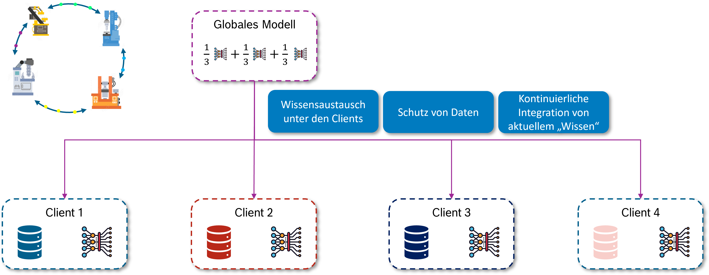
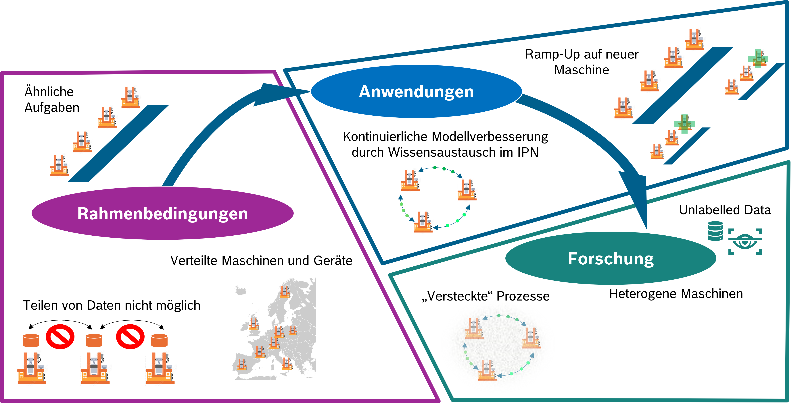
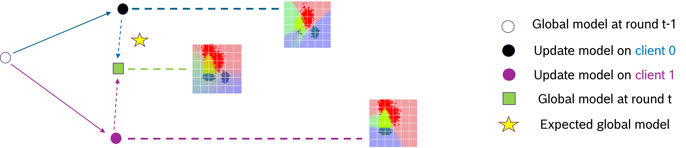

# Föderiertes Lernen - Grundlagen {#sec-004-fl-intro}

<!--
---
author: 
  - Sabine Haag
---
-->

Das maschinelle Lernen (ML) hat sich in den letzten Jahren als leistungsstarkes Werkzeug zur Datenanalyse und Prozessoptimierung etabliert, insbesondere durch den Einsatz von (tiefen) neuronalen Netzen. Traditionell basiert das Training solcher ML-Modelle auf der Annahme, dass alle relevanten Daten zentral an einem Ort, beispielsweise in einer Cloud, gesammelt und verarbeitet werden können. Dieser zentralisierte Ansatz erfordert, dass die Daten von ihren Ursprungsorten (z.B. Sensoren, Maschinen) zu einem zentralen Server transportiert werden.

Im industriellen Umfeld stößt dieser Ansatz jedoch auf erhebliche Herausforderungen:

- **Datensouveränität und Datenschutz**: Unternehmen sind oft nicht bereit, sensible Produktionsdaten aufgrund von Datenschutz-, IP- oder Wettbewerbsgründen unkontrolliert an externe oder zentrale Infrastrukturen weiterzugeben. Dies kann ein "Show-Stopper" für innovative, lernfähige Systeme sein.
- **Kommunikationsaufwand und Bandbreite**: Große Mengen an Sensordaten von Fertigungsanlagen erfordern eine enorme Bandbreite für die Übertragung an eine zentrale Cloud. Dies führt zu hohen Latenzzeiten und Datentransferkosten, die den Echtzeitanforderungen von Industrie-4.0-Systemen oft nicht genügen.
- **Ressourcen- und Energieeffizienz**: Der Betrieb leistungsstarker zentraler Rechencluster für das Training ist energieintensiv und teuer, insbesondere im Vergleich zu optimierten, spezialisierten Edge-Geräten. Die reine Datenübertragung liefert zudem keinen direkten Mehrwert für die Informationsgewinnung.
- **Skalierbarkeit und Herstellerbindung (Lock-in)**: Zentrale Cloud-Plattformen können zu Abhängigkeiten von proprietären Umgebungen führen und die Skalierbarkeit für diverse industrielle Anwendungen einschränken.

Vor diesem Hintergrund gewinnt das Föderierte Lernen (FL) zunehmend an Bedeutung als dezentraler Ansatz für das Training von ML-Modellen.

## Das Konzept des Föderierten Lernens

Föderiertes Lernen ermöglicht das Training von ML-Modellen über mehrere dezentrale Datenquellen hinweg, ohne dass die Rohdaten selbst ausgetauscht werden müssen. Anstatt die Daten zu den Modellen zu bringen, wird beim FL der umgekehrte Weg gegangen: Die Modelle werden zu den Daten gebracht.

Der grundlegende Prozess des Föderierten Lernens funktioniert typischerweise wie folgt:

1.  **Initialisierung eines globalen Modells**: Ein zentraler Server (oder eine vergleichbare Koordinationseinheit) initialisiert ein globales ML-Modell.
2.  **Modellverteilung an Clients**: Dieses globale Modell wird an eine Vielzahl von dezentralen Endgeräten, den sogenannten Clients, verteilt. Im industriellen Kontext können dies physisch getrennte Geräte wie Maschinen (IPCs), IoT-Geräte, Roboter oder intelligente Sensoren sein.
3.  **Lokales Training**: Jeder Client trainiert das erhaltene Modell unabhängig mit seinen lokal verfügbaren Daten. Die Rohdaten verlassen dabei niemals das Gerät des Clients, was den Datenschutz erheblich verbessert.
4.  **Übermittlung von Modellaktualisierungen**: Anstatt der Rohdaten sendet jeder Client nur die Aktualisierungen des Modells (z.B. Modellparameter oder Gradienten) an den zentralen Server zurück.
5.  **Aggregation**: Der zentrale Server aggregiert die von allen Clients erhaltenen Modellaktualisierungen, um ein verbessertes, aktuelleres globales Modell zu erstellen.
6.  **Wiederholung**: Dieser Prozess wird iterativ wiederholt, bis das Modell eine bestimmte Genauigkeit erreicht oder andere Abbruchkriterien erfüllt sind.

Dieser iterative Wissensaustausch unter den Clients ermöglicht eine kontinuierliche Modellverbesserung, ohne dass ein direkter Zugriff auf alle Daten notwendig ist. Der föderierte Lernprozess ist in @fig-FL_principle schematisch gezeigt.

{#fig-FL_principle fig-align="center" width="90%"}

## FL im industriellen Kontext

Im industriellen Kontext gibt es für FL spezielle Rahmenbedingungen, die sich von anderen Anwendungsdomänen unterscheiden, siehe @fig-FL_context.

{#fig-FL_context fig-align="center" width="80%"}

Die Einführung des Föderierten Lernens bietet der industriellen Fertigung zahlreiche **Vorteile**, die über die bloße Datenanalyse hinausgehen:

- **Erhöhte Datensouveränität und Sicherheit**: Der wichtigste Vorteil ist der Schutz der Rohdaten, die die lokalen Clients niemals verlassen. Dies ist entscheidend für Unternehmen, die aus Wettbewerbs- oder Datenschutzgründen sensible Produktionsdaten nicht teilen können oder wollen.
- **Verbesserte Ressourceneffizienz und Nachhaltigkeit**: Föderiertes Lernen reduziert den Datentransfer erheblich, da nur komprimierte Modellaktualisierungen statt großer Rohdatenmengen übertragen werden. Dies senkt nicht nur die Netzwerklast und -kosten, sondern führt auch zu einer besseren Energiebilanz. Modelle können auf leistungsarmen Edge-Knoten trainiert und ausgeführt werden, die weniger Energie verbrauchen und oft passiv gekühlt werden können.
- **Skalierbarkeit und Flexibilität im Edge-Cloud-Kontinuum**: FL ist ideal für verteilte Architekturen wie das Edge-Cloud-Kontinuum, wo Rechenleistung dynamisch zwischen lokalen Edge-Geräten und zentralen Cloud-Instanzen ausbalanciert wird. Es ermöglicht ein effektives Bereitstellen und Aktualisieren von Modellen für eine Vielzahl neuer Anwendungen und heterogener Maschinen.
- **Kontinuierliche Modellverbesserung und Generalisierung**: Durch den Wissensaustausch zwischen verschiedenen Maschinen oder Produktionslinien können Modelle kontinuierlich verbessert und robuster gemacht werden. Maschinen profitieren vom Wissen anderer, auch ohne direkten Zugriff auf deren spezifische Daten, was zu einer besseren Generalisierung und Robustheit der Modelle führt. Dies ist besonders nützlich beim Anfahren neuer Maschinen, bei denen noch keine lokalen Daten verfügbar sind, aber ein gutes Startmodell bereitgestellt werden soll.

Obwohl Föderiertes Lernen vielversprechend ist, bringt seine Anwendung im realen industriellen Kontext spezifische **Herausforderungen** mit sich, die Gegenstand intensiver Forschung sind:

- **Non-IID (nicht-identisch und/oder nicht-unabhängig verteilt) Daten**: In der realen Welt sind Daten der Clients oft nicht identisch oder nicht unabhängig verteilt. Dies kann durch unterschiedliche Merkmale, Domänen, Labels, Benutzerverhalten, Geräte- oder Sensorunterschiede sowie Kontextunterschiede entstehen. Standard-FL-Algorithmen zeigen bei solchen Non-IID-Daten oft einen deutlichen Leistungsabfall, da lokale Modellaktualisierungen in unterschiedliche Richtungen "ziehen" und die Aggregation zu einem Kompromiss führt, der für keinen Client optimal ist (siehe @fig-FL_non-IID).
- **Kommunikationsaufwand bei großen Modellen**: Obwohl FL den Rohdatentransfer reduziert, kann die Übermittlung von Modellparametern, insbesondere bei tiefen neuronalen Netzen, immer noch einen erheblichen Kommunikationsaufwand verursachen. Forschungsansätze wie Kompression und Dekodierung oder dezentrale FL-Verfahren ohne zentrale Einheit versuchen, dies zu minimieren.
- **Orchestrierung und Management heterogener Clients**: Die Koordination des Lernprozesses über eine große Anzahl heterogener und ressourcenbeschränkter Clients (z.B. intelligente Sensoren) stellt hohe Anforderungen an die Orchestrierung und das Management der Architektur. Fragen der Synchronisation (synchrones vs. asynchrones FL) müssen je nach Anwendungsszenario optimiert werden, wobei asynchrone Ansätze für leistungsarme Clients vorteilhafter sein können.
- **Messung und Bewertung der Ressourceneffizienz**: Um die Vorteile von FL systematisch nachzuweisen, bedarf es präziser Methoden zur Messung und Evaluierung des Ressourcen- und Energieverbrauchs im Edge-Cloud-Kontinuum.

{#fig-FL_non-IID fig-align="center" width="90%"}