# Demonstrator einer Roboterzelle für Palettierung {#sec-006-demo_roboter_use_case}

<!--
---
author:
    - Felix Strohmeier
    - Jens Henninger
---
-->

Der Demonstrator zeigt, wie eine industrielle Palettierzelle über ein Cloud-Edge-Dashboard live überwacht werden kann. Die Lösung wurde von Coboworx gemeinsam mit Salzburg Research und Empolis entwickelt und verbindet Daten aus der operativen Technologie der Roboterzelle mit wiederverwendbaren digitalen Services. Die Ergebnisse werden zielgruppengerecht bereitgestellt: lokal an der Maschine über ein Edge-Dashboard und ortsunabhängig über ein Cloud-Dashboard.

Im Mittelpunkt stehen drei Überwachungsziele. Erstens wird der Gesundheitszustand der Zelle beobachtet, indem relevante Kennwerte mit Sollzuständen verglichen werden. Weichen Messwerte über einen längeren Zeitraum signifikant ab, kann daraus ein Handlungs- oder Wartungsbedarf abgeleitet werden. Zweitens wird die Energieeffizienz betrachtet: Das System macht sichtbar, wie viel Energie die Roboterzelle verbraucht und ob der Verbrauch höher ist als gewöhnlich. Drittens bewertet der Demonstrator die Netzwerkqualität, insbesondere die MQTT-Latenz und damit die Verbindungsqualität zur Cloud. Ergänzend erzeugen der Grenzwertwächter von Empolis und das Netzwerkanalyse-Service von Salzburg Research passende Statusmeldungen und Alarme.

## Ausgangslage und Zielsetzung

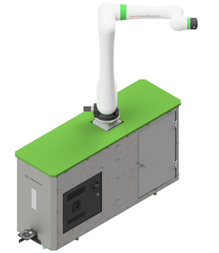{#fig-coboworx-palletierzelle width="50%"}

Coboworx entwickelt Roboterzellen wie zum Beispiel die in @fig-coboworx-palletierzelle gezeigte Palettierzelle, die durch digitale Services ergänzt werden. Solche Zellen sollen nicht nur mechanisch zuverlässig arbeiten, sondern ihren Zustand, ihre Leistung monitoren und mögliche Störungen identifizieren und melden. In der industriellen Automatisierung ist diese insofern wichtig, weil ungeplante Stillstände unmittelbare Auswirkungen auf Durchsatz, Liefertreue und Serviceaufwand haben.

Ziel des Demonstrators ist daher ein Live-Monitoring, das Maschinendaten aus der Zelle kontinuierlich aufnimmt, interpretiert und für unterschiedliche Rollen aufbereitet. Der Ansatz folgt dem EASY Edge-Cloud-Kontinuum: zeitkritische oder maschinennahe Informationen werden direkt an der Zelle angezeigt, während verdichtete Informationen zusätzlich in der Cloud für übergeordnete Auswertungen bereitstehen. Damit entsteht eine Brücke zwischen operativer Maschinenbedienung, technischem Service und Produktionsmanagement.

## Use Case und Anforderungen der Nutzergruppen

Der Use Case beruht auf der Annahme, dass verschiedene Rollen in der industriellen Automatisierung unterschiedliche Informationsbedarfe haben. Der Demonstrator bildet diese Bedarfe in zwei Oberflächen ab: ein Edge-Dashboard an der Roboterzelle und ein Cloud-Dashboard, das über einen Webbrowser erreichbar ist.

| Nutzergruppe | Informationsbedarf | Umsetzung im Demonstrator |
|------------------------|------------------------|------------------------|
| Maschinenbediener | Einfache Statusmeldungen und klare Betriebsanweisungen, um Stillstandszeiten zu verringern. | Anzeige verständlicher Meldungen am Edge-Dashboard direkt an der Zelle. |
| Service-Techniker | Detaillierte Live-Daten zur Fehlersuche und zur Bewertung von Komponenten, Sensoren und Kommunikationswegen. | Detailansicht im Edge-Dashboard mit Kurven, Kennwerten, Parametrierung und Statusmeldungen. |
| Produktionsleiter | Übergeordneter Überblick für Reporting, Produktionsoptimierung und standortunabhängige Kontrolle. | Cloud-Dashboard mit aggregierten Kennzahlen, Verbrauchsdaten und browserbasierter Darstellung. |

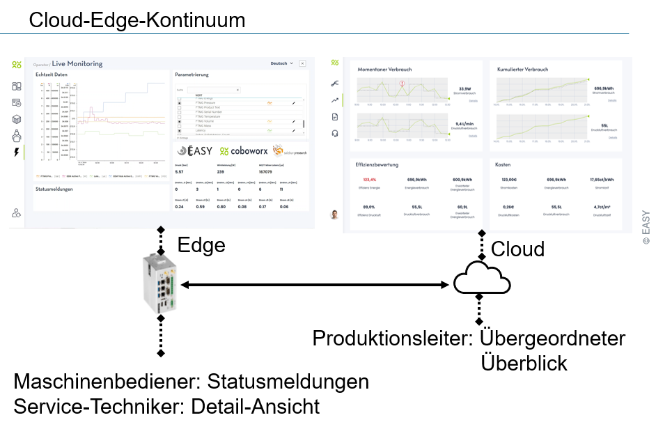{#fig-edge-cloud width="95%"}

Für Maschinenbediener ist entscheidend, dass sie nicht zwingend tiefes Domänenwissen aus Robotik oder IT benötigen. Die Oberfläche soll daher einfache Betriebsanweisungen und verständliche Statusmeldungen liefern. Service-Techniker benötigen dagegen mehr Detailtiefe, weil sie Fehlerursachen eingrenzen und konkrete Maßnahmen ableiten müssen. Produktionsleiter wiederum profitieren von einer verdichteten Perspektive, die Zustände, Verbräuche und Trends für Reporting und Optimierung verfügbar macht.

## Lösungsansatz im Edge-Cloud-Kontinuum

Das Edge-Dashboard ist für den Einsatz unmittelbar an der Roboterzelle vorgesehen. Dort sehen Maschinenbediener Statusmeldungen, während Service-Techniker in einer Detailansicht Live-Daten und Messkurven nutzen können. Der Vorteil dieser lokalen Bereitstellung liegt in der Nähe zum Prozess: Meldungen können unmittelbar mit der physischen Maschine, der Sensorik und der Peripherie abgeglichen werden.

Das Cloud-Dashboard ergänzt diese Sicht um eine ortsunabhängige Perspektive. Produktionsleiter müssen nicht dauerhaft an der Anlage stehen, sondern können Zustände, Energiekennzahlen und Trends über einen Browser verfolgen. @fig-sensordaten-dashboard zeigt als Beispiel Verbrauchs- und Effizienzübersichten, unter anderem für momentanen und kumulierten Verbrauch, Druckluftverbrauch, Energiekosten und Effizienzbewertung. Dadurch entsteht eine Verbindung zwischen Echtzeitbetrieb und langfristiger Produktionsoptimierung. Das Cloud-Dashboard ermöglicht des weiteren, verteilte Anlagen oder Standorte zentral zu überwachen und datengetriebene Entscheidungen zu treffen.

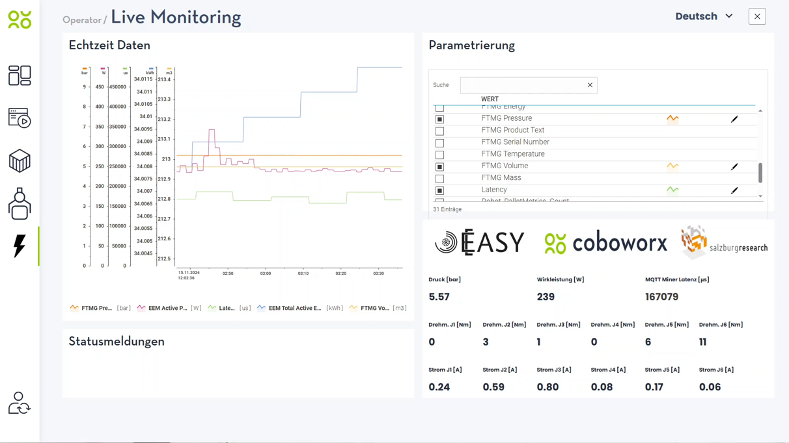{#fig-sensordaten-dashboard width="95%"}

## Technische Architektur

Die Architektur ist, wie in folgender Grafik abgebildet, in drei Ebenen gegliedert: OT, EASY-Edge und EASY-Cloud.

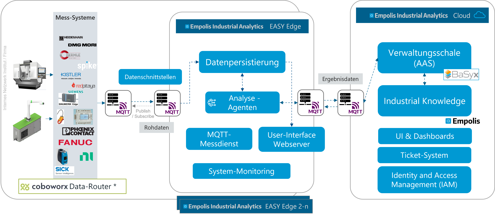{#fig-datenarchitektur-cbwrx}

Auf der OT-Ebene befinden sich die Datenquellen der Palettierzelle, darunter die Fanuc Robotersteuerung, ein Phoenix Contact Energiezähler und Sensorik, beispielsweise für Luftdruck beziehungsweise Luftstrom (Sick Durchflusssensor). Diese Komponenten sprechen unterschiedliche industrielle Protokolle wie Modbus TCP oder Modbus RTU. Ein Data Mapping Processor (dargestellt als "Coboworx Data-Router") bündelt und übersetzt die Rohdaten, sodass sie einheitlich weiterverarbeitet werden können. In einem einheitlichen Format werden die erfassten Daten über das standardisierte MQTT-Protokoll an den MQTT Broker der EASY-Edge versendet. Die EASY-Edge Runtime befindet sich auf einem dedizierten Edge-Device.

Auf der EASY-Edge-Ebene kommen die Sensor-Streamingdaten am MQTT-Broker an und werden in zu den OT-Geräten korrespondierenden Kafka-Topics verteilt (zusätzlicher MQTT-to-Kafka Datarouter) und somit persistiert. Die eingehenden Datenströme werden dynamisch an verschiedene Datensenken weitergeleitet: an das Edge-Dashboard, an Analyse- und Regelservices sowie, bei Bedarf, in Richtung Cloud. Grundlage hierfür ist auf dieser Ebene die skalierbare und performante EASY-Edge Runtime mit dynamischer Dienst-Orchestrierung.

Zwei wiederverwendbare Services sind im Demonstrator besonders relevant. Der Grenzwertwächter (vgl. @fig-datenarchitektur-cbwrx "Analyse-Agenten") wertet Live-Daten aus und meldet, wenn definierte Grenzwerte verletzt werden. Ein Beispiel ist die Überwachung der Druckluft: Fällt der Druck unter einen konfigurierten Grenzwert, z.B. 4 bar, erscheint die Warnung „Bitte Druckluft überprüfen“ im Edge-Dashboard. Der Grenzwertwächter wird im Detail in @sec-002-demo-planung-monitoring-agent als "Threshold Monitoring Agent" beschrieben. Analog kann ein "ML-Agent" eingesetzt werden, welcher auch im Folgenden und in @sec-002-demo-planung-monitoring-agent genauer beschrieben wird. Beide Agenten wurden mithilfe ihrer Beschreibung und Konfiguration in Verwaltungsschalen gesteuert, siehe @sec-sw-as-aas . Die Ergebnisse der Analyse-Agenten wurden ebenfalls in Verwaltungsschalen in der Cloud geschrieben.

Der Netzwerkanalyse-Service (MQTT-Messdienst) bewertet die Qualität der Verbindung anhand der Kommunikationsdaten. In der Demo wurde daraus etwa die Statusmeldung einer schlechten Internetverbindung abgeleitet. Die Umsetzung des MQTT-Messdienstes wird in @sec-mqtt-messdienst näher beschrieben.

Die Cloud-Ebene dient der übergeordneten Speicherung, Aufbereitung und Visualisierung. In der Architektur sind dafür unter anderem Datenrouter, Zeitreihendatenbank, Asset-Administration-Shell-Komponenten und Cloud-Dashboard vorgesehen. So können aktuelle Zustände und historische Verläufe zusammengeführt werden, ohne die lokale Bedienbarkeit der Zelle vom Cloud-Zugriff abhängig zu machen.

## Umsetzung Grenzwertwächter und Anomalie-Agent im Roboter Monitoring Use-Case

Zur Überwachung der Sensordaten wurden auf EASY-Edge Ebene zwei Monitoring-Agenten implementiert: Der Grenzwertwächter- und der Anomaliedetektion-Agent. Durch die Entwicklung dieser Agenten wurden konkret zwei häufig auftretende Use-Cases bzw. Störfälle adressiert:

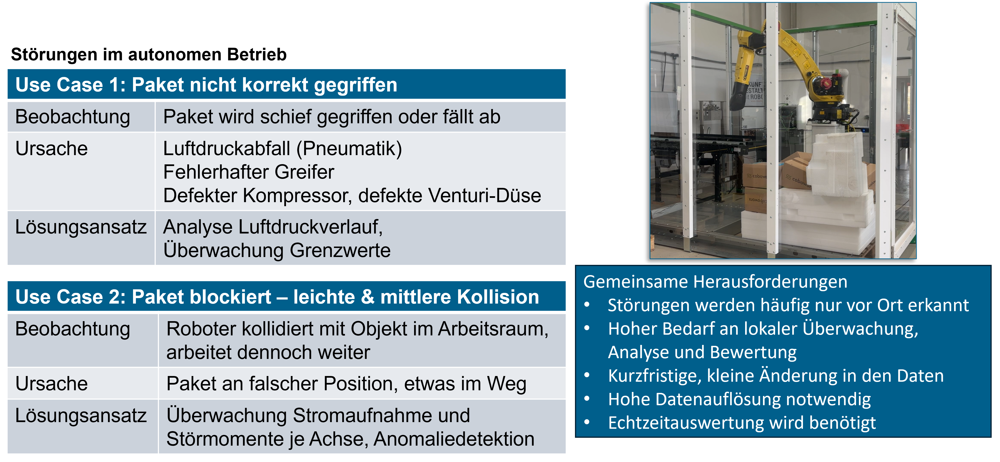{#fig-use-case-autonome-ueberwachung}

Beide Agenten werden im Detail in @sec-002-demo-planung-monitoring-agent als "Threshold Monitoring Agent" und "ML-Agent" beschrieben. Beide Agenten werden über die Konfiguration in der zugehörigen Verwaltungsschale gesteuert. Beim "ML-Agent" ist die Konfiguration die Zuweisung eines zugehörigen, passenden Machine-Learning Modells. Der Threshold-Monitoring-Agent wird je zu überwachende Features (bspw. "Robot_Temp_J1") mit einem "Value", dem Grenzwert" und einem "Qualifier", einer Relation konfiguriert. @fig-threshold-agent-config zeigt beispielsweise die Konfiguration: "Überwache Sensor Feature Robot_Temp_J1 und alarmiere mit der Dringlichkeit 'MIDDLE', wenn der Sensorwert über ('GREATER_THAN_0') den Wert 70 steigt":

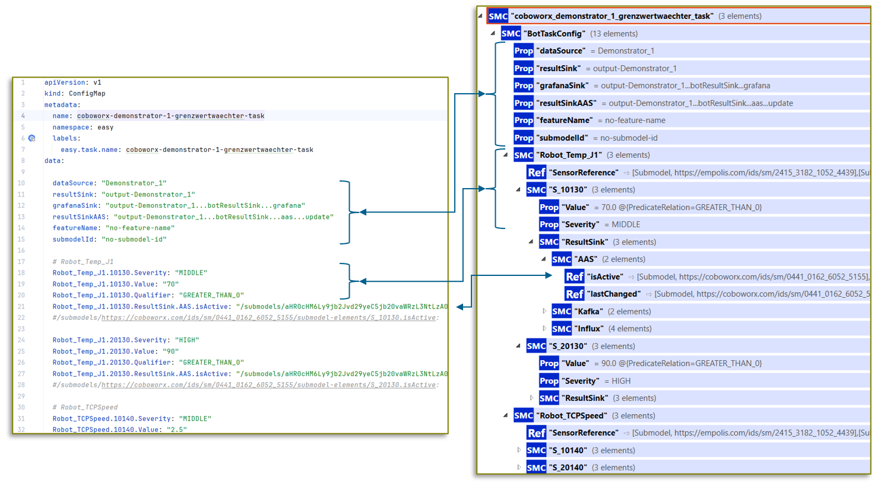{#fig-threshold-agent-config}

Der Grenzwertwächter wird im Detail in @sec-002-demo-planung-monitoring-agent als "Threshold Monitoring Agent" beschrieben.

Analog kann ein "ML-Agent" eingesetzt werden, welcher auch in @sec-002-demo-planung-monitoring-agent genauer beschrieben wird. Für den Einsatz von ML-Modellen wurden im Projekt Ansätze zur Anomaliedetektion mithilfe von ML-Modellen auf den Robotersteuerungsdaten verfolgt. Hierfür wurden Daten des Roboters in bestimmten Normal- und Fehlerfällen über mehrere Tage hinweg aufgezeichnet. Im normalen Betrieb der Palettierungszelle wurde eine Palette mit Paketen nach und nach bestückt. Um Fehlerfälle zu provozieren, wurden Störgegenstände in der Roboterzelle platziert. Diese sollen falsch platzierte oder nicht gegriffene Pakete simulieren. Bei schweren Kollisionen stoppt die maschineninterne Steuerung des Roboters den Prozess sofort. Bei leichten Kollisionen greift die maschineninterne Alarmierung nicht und der Prozess läuft weiter, es werden jedoch bspw. Pakete verschoben. Durch die daraus resultierende Fehlplatzierung und Störgegenstände kommt es in der Folge zu weiteren Fehlern, die nicht erkannt werden. Bei einem automatisierten Ablauf sind die Folgen hieraus fatal, während durch eine frühzeitige Warnung Folgefehler vermieden werden können. Der Messaufbau, insbesondere mit Störgegenständen ist in @fig-robotorzelle-anomalydata zu sehen.

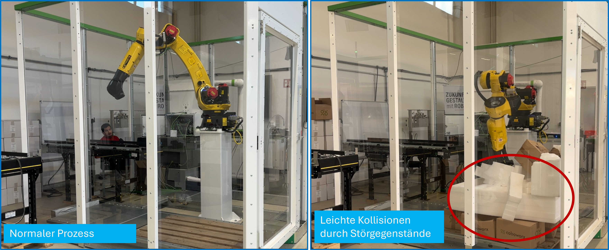{#fig-robotorzelle-anomalydata}

Die Daten aus dem Prozess im Normalzustand und in Störsituationen wurden analysiert und auf Anomalien untersucht. In diesem Schritt wurde das Framework "Labelstudio"[^demo_roboter_use_case-1] in die EASY-Plattform integriert und damit die in MinIO abgelegten Daten gelabeled, also die Zeitreihendaten mit Merkmalen wie "Anomaly", "Normal", "Active" und "Inactive" markiert. Die gelabelten Daten dienten als Grundlage für das Modell-Training zu Erkennung von Anomalien. Im Projekt wurden bereits vielversprechende Modelle zur Anomaliedetektion (CNN-Autoencoder) trainiert. Durch das Ausscheiden der Firma Coboworx gegen Projektende, konnten diese Modelle jedoch nicht mehr im Einsatz an der Maschine validiert werden.

[^demo_roboter_use_case-1]: <https://labelstud.io/>

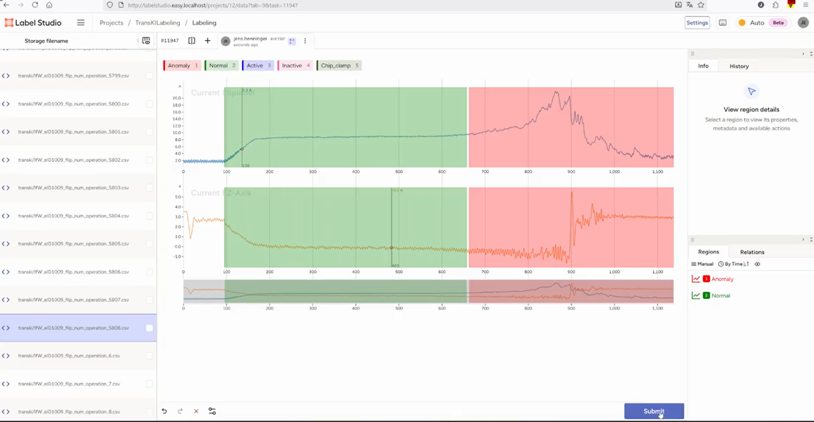{#fig-labelstudio-in-easy}

Zur Darstellung der Sensordaten wurden weitere Dashboards implementiert. Im folgenden Bild wird ein Ausschnitt dazu gezeigt. Hier werden die Sensordaten des "Disturbance Torque" (Störmoment) je Motorachse am Roboterarm dargestellt. Bei Störfällen, hervorgerufen durch falsch platzierte Pakete, zeigen sich Anomalien in den Signalen, insbesondere in den zur Fahrrichtung korrespondierenden Motorachse.

![Durch Störfälle ergeben sich Anomalien in den Signalen, insbesondere in den zur Fahrrichtung korrespondierenden Motorachsen, Achse J1 (SNPX_CUR_DIS_TRQ\[1\]) und J2 (SNPX_CUR_DIS_TRQ\[2\]).](pictures_roboter_use_case/Roboter_Daten_Dashboard.png){#fig-roboter-daten-dashboard}

Die Daten hierfür wurden ebenfalls über den Coboworx-spezifischen Datarouter in die EASY-Edge geroutet und zur globalen Darstellung und Überwachung auch zusätzlich in die EASY-Cloud Umgebung versendet.

Nach erfolgreicher Auswertung der Sensordaten durch den Grenzwertwächter oder den Anomalie-Agenten in der EASY-Edge wird der zur Überwachungsregel korrespondierende Status der Maschine aktualisiert. Konkret wird hierzu das "ResultSink.AAS.isActive" und "ResultSink.AAS.lastChanged" Element in der Verwaltungsschale der Roboterzelle (gehostet in BaSyx in der Cloud) aktualisiert. In folgendem Abbild wird hierfür das Submodel "Status" der Roboterzelle gezeigt, in der zum Statuscode "S_10130" die "isActive" Eigenschaft auf "true" gesetzt wurde:

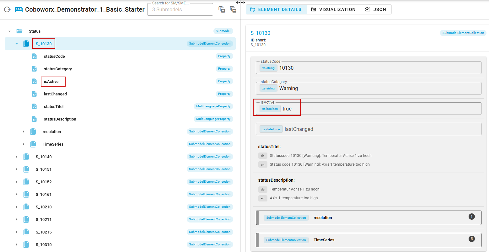{#aas-roboter-result}

Technisch umgesetzt wurde dies durch einen Eventing-Mechanismus: Der Analyse-Agent auf der EASY-Edge emittiert ein Event mit den Update-Informationen und dieses wird an den MQTT-Broker der EASY-Edge weitergeleitet. Zwischen EASY-Edge und EASY-Cloud besteht eine MQTT-Bridge zwischen Edge- und Cloud-Broker. Dadurch wird das Update-Event direkt in die Cloud synchronisiert. In der Cloud lauscht ein AAS-Event-Listener Service auf dieses Event und aktualisiert den Status in der Verwaltungsschale an entsprechender Stelle. Durch das Status-Update in der AAS der Roboterzelle wird durch BaSyx ein weiteres Update Event emittiert. Dieses Event wird wiederum von einem "Event-to-Empolis-Industrial-Knowledge" Service entgegengenommen und in die Empolis Industrial Knowledge Plattform in einen sogenannten "Maschinen-Community-Chat" versendet. Dabei wird zusätzlich ein Wissensartikel passend zum Status (bzw. Fehlercode) in der Wissensdatenbank gesucht und in der Nachricht verlinkt. Durch die Einbindung dieses Systems wird der Maschinenbediener direkt per Chat-Nachricht informiert, siehe @fig-ese-chat.

{#fig-ese-chat width="70%" width="80%"}

Zur Bündelung aller Informationen für einen Remote-Operator oder Manager, welche mehrere Maschinen steuern und überwachen sollen, wurde ein Portal implementiert, welches in @fig-ese-portal dargestellt wird.

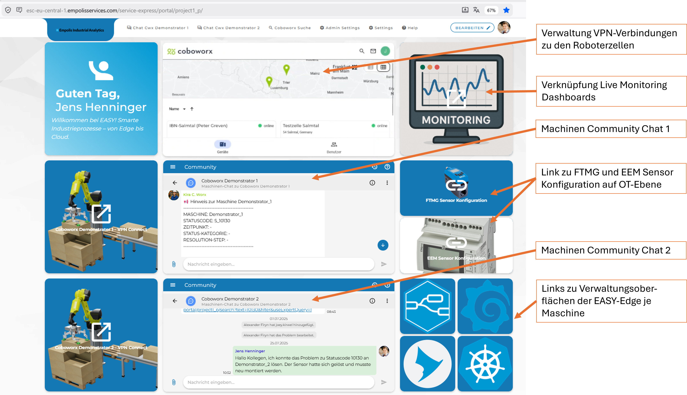{#fig-ese-portal}

Zu jedem Status- oder Fehlercode wurde ein Wissensartikel im Industrial Knowledge Portal angelegt, welcher zum gemeldeten Fehlerfall direkt die passenden Lösungsschritte bietet. Im Fall des oben exemplarisch gemeldeten Fehlers "S_10130" wird folgende Dokumentation geliefert, siehe @fig-ese-artikel:

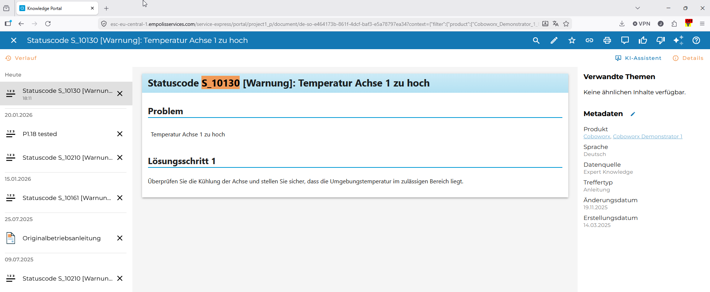{#fig-ese-artikel}

Durch die Umsetzung dieses Roboter Monitoring Use-Cases wurde über das Edge-Cloud-Kontinuum eine nahtlose Verbindung zwischen OT-Ebene, Auswertung der Sensordaten auf Edge-Ebene und Verknüpfung der Ergebnisse mit Chat-Funktionalitäten oder Wissensdatenbanken in der Cloud hergestellt und somit die Vorteile jeder Ebene bestmöglich ausgeschöpft und kombiniert.

## Umsetzung MQTT Messdient {#sec-mqtt-messdienst}

Zur Sicherstellung einer stabilen und vorhersagbaren Kommunikation zwischen Edge-Komponenten und Cloud-Infrastrukturen wurde ein spezialisierter MQTT-Messdienst entwickelt. Dieser Dienst dient sowohl der systematischen Überwachung aktiver MQTT-Verbindungen als auch der frühzeitigen Erkennung von Performanceabweichungen. Bei Überschreitung definierter Grenzwerte können somit Alarmmeldungen ausgelöst werden, die in bestehende Betriebs- und Monitoringprozesse integrierbar sind. Damit bildet der Dienst ein essenzielles Werkzeug für Betreiber verteilter IoT- und/oder OT-Systeme, in denen Latenz, Durchsatz und Zuverlässigkeit von zentraler Bedeutung sind.

Die Implementierung basiert auf der Open-Source-Komponente "mqttloader" [@banno2021mqttloader], welche für Last- und Stresstests im MQTT-Umfeld entwickelt wurde. Der Funktionsumfang wurde entsprechend erweitert, um die für EASY notwendigen praxisorientierte Mess- und Monitoringanforderungen abzudecken. Die große Anzahl von konfigurierbaren Parametern ermöglicht einen flexiblen Einsatz der Komponente, sodass sowohl leichte Lastszenarien als auch realitätsnahe Hochlastsituationen abgebildet werden können und deren Performance gemessen werden kann. Basierend auf der Java-MQTT Implementierung von Eclipse PAHO, unterstützt der Dienst sowohl MQTTv3 als auch MQTTv5 und ist somit mit allen gängigen Brokern interoperabel.

Zur Evaluierung der Transportqualität stehen sämtliche MQTT-Mechanismen zur Verfügung: unterschiedliche Quality-of-Service-Level, Shared Subscriptions zur Lastverteilung sowie Retained Messages. Das Sendeintervall der Publisher kann im Mikrosekundenbereich konfiguriert werden, wodurch sich selbst hochfrequente Datenströme nachbilden lassen. Zusätzlich erlaubt der Dienst definierte Ramp-up- und Ramp-down-Phasen, d.h. Intervalle zu Beginn und am Ende der Messungen können für Berechnungen ausgeschlossen werden, um Benchmarks nicht durch Start- oder Stopp-Phasen zu verfälschen.

Optional lässt sich eine Zeitsynchronisierung via NTP aktivieren, um Latenzanalysen mit konsistenten Zeitstempeln zu gewährleisten, höhere Messgenauigkeiten sind durch die Synchronisierung der jeweiligen Mess-Hosts erreichbar (z.B. via GPS), bzw. kann durch Round-Trip-Messungen von einem Host aus das Zeitsynchronisationsproblem umgangen werden. Für produktionsnahe Tests unterstützt der Messdienst TLS-basierte Transportverschlüsselung sowie die gängigen Authentifizierungsmechanismen.

Die Konfiguration erfolgt wahlweise über Dateien oder Umgebungsvariablen, wodurch eine einfache Automatisierung in CI/CD-Pipelines oder orchestrierten Umgebungen ermöglicht wird. Die Messergebnisse lassen sich in unterschiedlichen Formaten ausgeben – insbesondere JSON zur strukturierten Weiterverarbeitung oder Plain Text für vereinfachte Analyseprozesse. Je nach Anforderungen an Persistenz oder Visualisierung der Messergebnisse können als Zielsysteme wiederum MQTT-Systeme, InfluxDB-Instanzen oder Dateisysteme definiert werden.

Für den produktiven Einsatz wurde der Dienst vollständig dockerisiert und für Kubernetes-basierte Installationen optimiert. Dadurch kann er flexibel skalieren, automatisiert ausgerollt werden und sich nahtlos in bestehende Observability-Stacks integrieren. Zusammenfassend ermöglicht der MQTT-Messdienst eine robuste, flexible und reproduzierbare Überwachung der Kommunikationspfade zwischen Edge und Cloud als Grundlage zuverlässiger IoT-Architekturen für industrielle Anwendungen.

## Demonstration und Dashboard-Funktionen

In der gezeigten Demo arbeitet ein kollaborativer Fanuc-CRX-Roboter auf einer Linearachse und palettiert Kartons zwischen zwei Paletten (@fig-demoaufbau). Direkt an der Zelle befindet sich ein Touchscreen-Monitor mit dem Edge-Dashboard. Die gezeigte Monitoransicht richtet sich vor allem an Service-Techniker und kombiniert mehrere Informationsarten: Kurvendarstellungen von Echtzeitdaten, numerische Kennwerte, eine Parametrierungsansicht sowie einen Bereich für Statusmeldungen zum Gesundheitszustand.

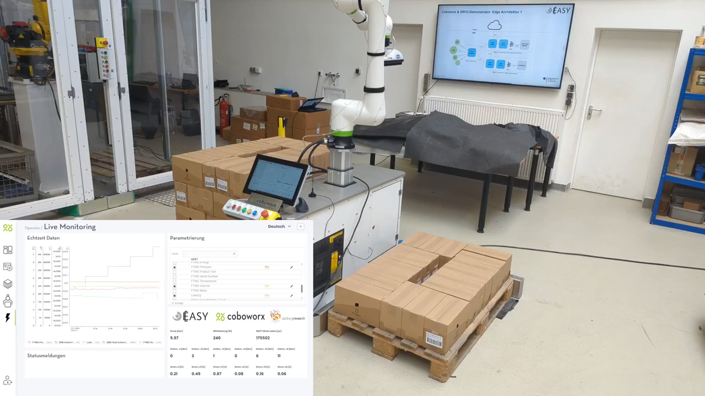{#fig-demoaufbau width="95%"}

Die Live-Daten umfassen unter anderem Luftdruck, Wirkleistung, kumulierte Energie, Volumen- beziehungsweise Druckluftwerte, MQTT-Latenz sowie Achsdaten des Roboters (Drehmomente und Ströme je Gelenk). Über die Parametrierung können relevante Werte ausgewählt oder angepasst werden, sodass die Oberfläche an den jeweiligen Diagnosefall angepasst werden kann. Neben der reinen Messwertanzeige ist entscheidend, dass die integrierten Services die Daten interpretieren und Meldungen erzeugen. Dadurch kann ein Netzwerkproblem oder ein Grenzwertverstoß unmittelbar im Kontext der laufenden Anlage sichtbar werden.

## Nutzenbewertung und Fazit

Der Demonstrator macht deutlich, dass Live-Monitoring in der industriellen Automatisierung mehr ist als eine Datensammlung. Der Nutzen entsteht durch die rollenorientierte Aufbereitung: Bediener erhalten reduzierte, handlungsnahe Hinweise; Service-Techniker bekommen die nötige Detailtiefe für die Fehlersuche; Produktionsleiter können übergeordnete Kennzahlen für Reporting und Optimierung nutzen. Gleichzeitig unterstützt die Architektur eine klare Trennung zwischen maschinennaher Echtzeitinformation und cloudbasierter Auswertung.

Technisch überzeugt der Ansatz durch Modularität. Daten aus heterogenen OT-Quellen werden standardisiert, über MQTT verteilt und können durch wiederverwendbare Dienste ausgewertet werden. Der Grenzwertwächter und die Netzwerkanalyse zeigen beispielhaft, wie zusätzliche Services in eine bestehende Roboterzelle integriert werden können, ohne die Dashboard-Logik monolithisch aufzubauen. Die Verwendung von Standards wie MQTT, Kafka und Asset Administration Shell erleichtert zudem die Skalierung auf weitere Maschinen, Zellen oder Auswertungsdienste.

Zusammenfassend demonstriert die Lösung einen praxistauglichen Weg zu transparenteren, wartungsfreundlicheren und energiebezogen auswertbaren Palettierzellen. Sie reduziert die Distanz zwischen Datenentstehung an der Maschine und Entscheidungsunterstützung für Betrieb, Service und Management. Als nächster Entwicklungsschritt bietet sich an, die vorhandenen Live- und Verlaufsdaten stärker für prädiktive Wartung, automatische Handlungsempfehlungen und systematische Energieoptimierung zu nutzen.