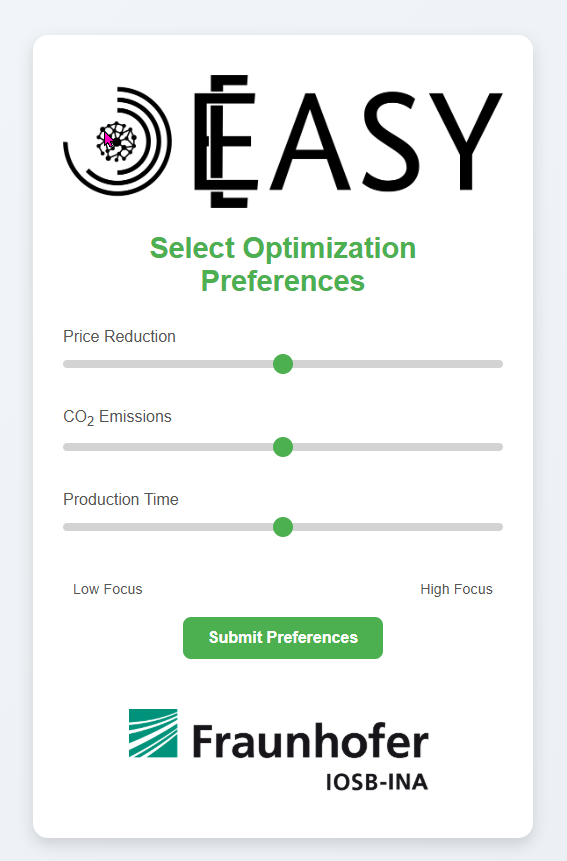
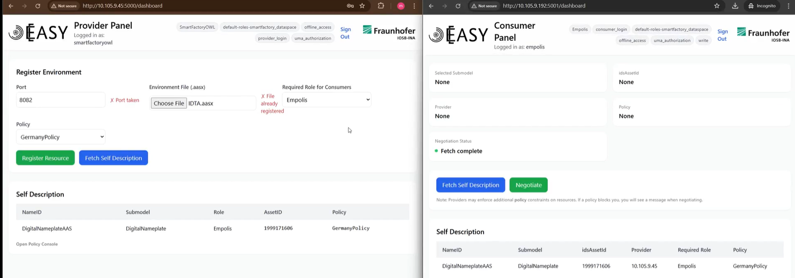

# Demo Shared Production {#sec-006-demo_shared_production}

<!--
---
author:
   - Dennis Heitkamp
   - Stefanie Hittmeyer
   - Lukas Klein
---
-->

## Motivation
Shared Production bezeichnet ein kooperatives Produktionskonzept, bei dem mehrere Unternehmen oder organisatorische Einheiten gemeinsam Produktionsressourcen, Infrastrukturen und Kompetenzen nutzen, um Wertschöpfungsprozesse effizienter und flexibler zu gestalten. 
Im Gegensatz zu klassischen, unternehmensintern organisierten Produktionsstrukturen basiert Shared Production auf der Idee der geteilten Nutzung von Produktionsmitteln sowie der koordinierten Zusammenarbeit über Unternehmensgrenzen hinweg [@Haese2015SharingEconomy].
Ziel ist es, Skaleneffekte zu realisieren, Investitionskosten zu reduzieren und gleichzeitig die Anpassungsfähigkeit an volatile Marktbedingungen zu erhöhen. Im Projekt EASY dient Shared Production als Referenzszenario, um die Themen der vorangegangenen Kapitel, wie u.A. verteilte Planung, Föderiertes Lernen und sichere Datenräume, in einer realistischen, standortübergreifenden Produktion zu integrieren.

Die zunehmende Relevanz von Shared Production ist eng mit technologischen Entwicklungen im Rahmen der Digitalisierung und Industrie 4.0 verknüpft. Fortschritte in den Bereichen Cyber-Physische Systeme, industrielle Vernetzung, Cloud-Computing und datengetriebene Produktionsplanung ermöglichen eine transparente und effiziente Koordination verteilter Produktionsressourcen. 
Dadurch wird es möglich, Produktionskapazitäten bedarfsgerecht zu teilen und Produktionsprozesse dynamisch zu orchestrieren, ohne dass die beteiligten Akteure ihre organisatorische Autonomie vollständig aufgeben müssen.

Neben ökonomischen Vorteilen bietet Shared Production auch ein erhebliches Potenzial zur Förderung nachhaltiger Produktionsweisen. 
Durch eine verbesserte Auslastung bestehender Anlagen können Ressourcen effizienter genutzt und der Bedarf an zusätzlichen Investitionen reduziert werden. 
Gleichzeitig ermöglicht die Zusammenarbeit zwischen unterschiedlichen Akteuren den Austausch von Know-how und die gemeinsame Entwicklung innovativer Produktionslösungen. 
Vor diesem Hintergrund stellt Shared Production einen vielversprechenden Ansatz dar, um den steigenden Anforderungen an Effizienz, Flexibilität und Nachhaltigkeit in modernen Produktionssystemen gerecht zu werden. Die in diesem Demonstrator verwendeten Planungs- und Ontologiekonzepte werden in den Kapiteln @sec-005-5.2 und @sec-005-5.3 ausführlich vorgestellt.

## Probleme und Herausforderungen der Shared Production

### Planungsdomäne
Die erste Herausforderung liegt in der intelligenten Planung zur Ausführung von Tasks an verschiedenen Standorten.
Die besagte Herausforderung der adressierten Planungsdomäne besteht in der formal konsistenten und zugleich praxisnahen Abbildung heterogener Produktionsumgebungen in ein maschinell verarbeitbares Planungsmodell. Ausgangspunkt ist die Anforderung, individuelle Kundenaufträge automatisiert in valide, optimierte und ausführbare Produktionsprozesse zu überführen. Dies erfordert eine präzise Modellierung von Ressourcen, Fähigkeiten, Vorbedingungen, Effekten sowie relevanten Optimierungskriterien (z. B. Zeit, Kosten, Nachhaltigkeitsmetriken) in einer Weise, die sowohl semantisch eindeutig als auch algorithmisch zugänglich ist.

Die Schwierigkeit liegt insbesondere in der Heterogenität der beteiligten Systeme (Maschinen, Roboter, IT-Dienste), der Verteilung über ein Edge-Cloud-Continuum sowie der Notwendigkeit, deren Fähigkeiten dynamisch und interoperabel zu beschreiben. Planungsdomänen müssen dabei nicht nur syntaktisch korrekt, sondern auch semantisch vollständig sein, sodass KI-Planungsverfahren valide Aktionsmodelle generieren können. Gleichzeitig sind Kundenpräferenzen und domänenspezifische Metriken formal in die Planungsprobleme zu integrieren, um eine zielgerichtete Optimierung zu ermöglichen.

Die Herausforderung besteht somit in der durchgängigen Transformation von informell formulierten Kundenanforderungen über semantische Repräsentationen hin zu formalen Planungsdomänen, ohne Informationsverlust und unter Sicherstellung der Ausführbarkeit in realen Produktionsumgebungen.

### Datensicherheit
Die zweite zentrale Herausforderung in der verteilten Produktion ist die Gewährleistung von Datensicherheit und Datensouveränität. Verteilte Produktionssysteme zeichnen sich dadurch aus, dass sie über mehrere Standorte – häufig sogar firmenübergreifend – organisiert sind. Dadurch entstehen neue Fragestellungen hinsichtlich der sicheren Nutzung und des Schutzes sensibler Produktionsdaten. Im Kontext der verteilten Produktion muss insbesondere geklärt werden, welche Daten wem zugänglich gemacht werden dürfen, unter welchen Bedingungen dies geschieht und wie eine missbräuchliche Nutzung verhindert werden kann.

Neben klassischen IT-Security-Maßnahmen wie Authentifizierung, OAuth2 oder rollenbasierter Zugriffskontrolle (RBAC) ist in diesem Zusammenhang vor allem die Interaktion zwischen verschiedenen Stakeholdern – Produzenten und Konsumenten – relevant. Es stellt sich beispielsweise die Frage, welcher Produzent über die für den Kunden relevanten Daten verfügt und ob diese überhaupt geteilt werden dürfen. Falls eine Freigabe möglich ist, müssen zudem Dauer, Umfang und Bedingungen der Nutzung eindeutig definiert werden. Darüber hinaus sind rechtliche Rahmenbedingungen zu berücksichtigen: Welche Vorgaben ergeben sich aus Datenschutz- und Vertragsrecht? Welche Konsequenzen treten ein, wenn Daten missbräuchlich verwendet werden? Nicht zuletzt ist auch die Frage zu klären, welche Datenarten überhaupt ausgetauscht werden (z. B. Planungs- und Prozessdaten, siehe Planungsdomäne) und wie diese klassifiziert und geschützt werden können.

Für eine verteilte Produktion ist daher ein verbindlicher Regelkatalog notwendig, der Verhaltensweisen, Zugriffsrechte und Sanktionen definiert, an den sich alle Beteiligten halten müssen. Ziel ist es, dass jeder Teilnehmer jederzeit die Kontrolle über seine Daten behält und eigenständig bestimmen kann, wie diese verwendet werden – ein Kernprinzip der Datensouveränität.

Eine geeignete Lösung für dieses Problem bietet GAIA-X. GAIA-X ist ein europäisches, föderiertes Dateninfrastruktur-Projekt, das darauf abzielt, Datenräume zu schaffen, in denen Datenaustausch unter Einhaltung definierter Regeln und Standards möglich ist. Im Kern ermöglicht GAIA-X die Einrichtung von föderierten Datenräumen, in denen Datenanbieter (Producer) und Datennutzer (Consumer) sicher und vertrauenswürdig interagieren können. Dabei werden insbesondere Policy- und Governance-Mechanismen bereitgestellt, die die Bedingungen für Datenzugriff und -nutzung verbindlich regeln [@GaiaXHubWasIstGaiaX].

Der typische Anwendungsfall in GAIA-X lässt sich wie folgt beschreiben: Ein Producer und ein Consumer treten einem Datenraum bei. Ziel des Datenraums ist die Bereitstellung und Verteilung eines digitalen Datenprodukts. Der Producer stellt das Datenprodukt bereit und kann es – sofern gewünscht – unter festgelegten Nutzungsbedingungen (Policies) in den föderierten Katalog des Datenraums einbringen. Der Consumer kann den Katalog durchsuchen, ein geeignetes Datenprodukt auswählen und erhält Einsicht in die zugehörigen Policies. Anschließend verhandeln Producer und Consumer über die Nutzungsbedingungen. Wird eine Einigung erzielt, schließen beide Parteien einen rechtsgültigen Vertrag, und der Consumer erhält entsprechend den vereinbarten Regeln Zugriff auf das Datenprodukt. Dadurch werden Datensouveränität, Nachvollziehbarkeit und rechtliche Absicherung im Datenaustausch gewährleistet.

### Qualitätskontrolle
Die dritte Herausforderung steht in engem Zusammenhang mit der Datensouveränität: die Qualitätskontrolle in der verteilten Produktion. In jeder Produktion ist das Auftreten von Abweichungen und Fehlzuständen unvermeidlich, etwa infolge von Maschinenstörungen, Materialinkonsistenzen oder Logistikfehlern. Solche Abweichungen können die Produktqualität mindern; die Aufgabe besteht daher nicht nur darin, den Fehler zu erkennen, sondern auch dessen Ursache und den verantwortlichen Standort zuverlässig zu identifizieren.

Föderiertes Lernen beschleunigt in der Shared Production die Übernahme neuer Fehlerbilder und stabilisiert Entscheidungen unter Domain‑Shift: Kontinuierliche Aggregation und gezielte Personalisierung (z. B. lokale Köpfe, FedBN) reduzieren Fehlalarme, erhalten die Cross‑Site‑Übertragbarkeit und bilden standortspezifische Besonderheiten ab. Ergänzend erhöhen Edge‑seitige Anomalieerkennung auf Prozessdaten und föderiertes Active Learning die Effizienz der Datenauswahl; seltene Defekte werden schneller erkannt und Fehlerursachen lassen sich leichter einem Standort zuordnen.

## Umsetzung der Shared Production
Um die 3 Probleme zu untersuchen wurde ein verteilter Demonstrator entworfen und in den beiden SmartFactories (SmartFactoryOWL in Lemgo und SmartFactoryKL in Kaiserslautern) aufgebaut.
Die beiden Module des Demonstrators für sich betrachtet sind identisch. Jedes Modul beinhaltet einen 3D-Drucker mit Filamentwechslereinheit (Prusa MK4S mit MMU3),
einen Robotergreifarm (UR5e) mit Greifer, ein Transportsystem zum Warenlager und eine Kamera zur Qualitätskontrolle. Die beiden Module sind über zwei Bundesländer (NRW und RLP) verteilt und stehen ca. 400km weit auseinder und schaffen dadurch ein realistisches Szenario bei dem Standortfaktoren wirklich eine Rolle spielen.
Interessenten der Demo können die Module über eine Web-UI bedienen. In der Weboberfläche kann der Kunde ein Produkt auswählen und es konfigurieren (Farbe und Material). Danach können noch Präferenzen für die Planung eingegeben werden und schlieslich wird der auftrag in einer der SmartFactories ausgeführt. Abschließend wird die Qualitätskontrolle ausgeführt und das Produkt am ende entweder ins Warenlagertransportiert oder ins Recycling gegeben.

### Planung mit KTF und Ontologien
Das Problem der Planung wurde mittels einem durchgängigen, semantisch fundierten Ansatzes gelöst: Produktionsressourcen wurden als Digitale Zwillinge mittels Asset Administration Shell (AAS) beschrieben und zusätzlich in einer Ontologie formalisiert. Ein Knowledge Transformation Framework (KTF) überführte diese semantischen Beschreibungen automatisch in PDDL-Planungsdomänen und -Probleme. Darauf aufbauend kombinierte das System klassische KI-Planung mit Case-Based Reasoning, um gültige und optimierte Prozesspläne zu erzeugen. Diese Pläne wurden anschließend in ausführbare Workflow-Modelle transformiert und in einer Edge-Cloud-Umgebung überwacht ausgeführt (siehe @sec-005-zusammenfassung).

### Nutzerpräferenzen aus Real-World Use Cases
Die Kunden einer Shared-Production-Umgebung können sich in sehr unterschiedlichen wirtschaftlichen und strategischen Ausgangslagen befinden. Während ein Kunde (Kunde A) primär das Ziel verfolgt, Produktionskosten entlang der gesamten Wertschöpfungskette zu minimieren, legt ein anderer Kunde (Kunde B) möglicherweise den Fokus auf die Reduktion seines CO₂-Fußabdrucks und damit auf ökologische Nachhaltigkeitsaspekte. Diese divergierenden Zielsetzungen führen dazu, dass ein einheitlicher Produktionsplan nicht zwangsläufig den individuellen Anforderungen aller Kunden gerecht wird.

Um diesem Umstand Rechnung zu tragen, sieht das Shared-Production-Konzept die Möglichkeit vor, kundenspezifische Optimierungspräferenzen zu definieren und zu berücksichtigen. Diese Präferenzen spiegeln die jeweiligen wirtschaftlichen, ökologischen oder strategischen Zielsetzungen der Kunden wider und können beispielsweise Kosten-, Emissions-, Zeit- oder Qualitätskriterien umfassen.

Die vom Nutzer festgelegten Optimierungspräferenzen @fig-user-prefs werden an einen zentralen Planungsservice übermittelt. Dieser übernimmt die Aufgabe, die Präferenzen im Kontext der verfügbaren Produktionsressourcen, Prozessrestriktionen und Kapazitäten zu evaluieren. Auf dieser Basis werden unterschiedliche Produktionsszenarien analysiert und gegeneinander abgewogen. Ziel dieses Evaluierungsprozesses ist es, einen Produktionsplan zu ermitteln, der die angegebenen Präferenzen bestmöglich erfüllt und gleichzeitig die technischen und organisatorischen Randbedingungen der Shared-Production-Umgebung einhält.

Das Ergebnis dieses Planungsprozesses ist ein optimierter Produktionsplan, der individuell auf die Anforderungen des jeweiligen Kunden zugeschnitten ist. Durch die systematische Integration von Optimierungspräferenzen wird es somit ermöglicht, innerhalb einer gemeinsamen Produktionsinfrastruktur unterschiedliche Zielsetzungen parallel zu unterstützen. Dies erhöht sowohl die Flexibilität als auch die Attraktivität der Shared Production für Kunden mit heterogenen wirtschaftlichen und nachhaltigkeitsbezogenen Anforderungen.

{#fig-user-prefs} 

### Konzeption und Umsetzung eines sicheren Datenraums zur Verwaltung digitaler Produktzwillinge
Für den kontrollierten Austausch digitaler Datenprodukte zwischen verschiedenen Akteuren wurde ein Datenraum erstellt. Die Teilnehmer dieses Datenraums sind zwei SmartFactories sowie die Kunden des betrachteten Use Cases. Innerhalb des Datenraums übernehmen die SmartFactories die Rolle der Datenproduzenten (Producer), während die Kunden als Datenkonsumenten (Consumer) auftreten. Ziel ist es, den Kunden einen sicheren und regelkonformen Zugriff auf die für sie relevanten digitalen Datenprodukte zu ermöglichen, ohne dabei die Hoheit der Hersteller über ihre Daten zu gefährden.

Die im Datenraum bereitgestellten digitalen Datenprodukte entsprechen den Digitalen Zwillingen der gefertigten Produkte, die in Form von Asset Administration Shells (AAS) umgesetzt sind. Wird ein Produkt durch einen Kunden beauftragt, liegt die Verantwortung für die Erstellung, Verwaltung und Pflege der zugehörigen AAS zunächst beim jeweiligen Hersteller. Im Rahmen der vorliegenden Demonstration werden exemplarisch die Submodelle Nameplate sowie Handover Documentation erstellt und in die AAS integriert. Perspektivisch ist darüber hinaus die Einbindung eines Digitalen Produktpasses vorgesehen, sodass dieser bereits zu Beginn des Produktlebenszyklus erzeugt und kontinuierlich angereichert werden kann.

Nach der Erstellung wird die AAS des Produkts sicher auf einem AASX-Server des Herstellers abgelegt. Zu diesem Zeitpunkt befindet sich der Digitale Zwilling vollständig unter der Kontrolle des Producers. Sobald der Kunde Zugriff auf die AAS seines neu beauftragten Produkts erhalten möchte, wird die AAS vom Hersteller in den Datenraum eingebracht. Dabei definiert der Producer eine Zugriffsrichtlinie (Policy), die die Nutzung der AAS durch den Consumer regelt. In der aktuellen Implementierung stehen hierfür drei unterschiedliche Policies zur Verfügung:

- uneingeschränkter Zugriff,

- Zugriff beschränkt auf den Standort Europa,

- zeitlich begrenzter Zugriff mit einer Nutzungsdauer von einem Jahr.

Kommt zwischen Producer und Consumer eine Einigung über die anzuwendende Policy zustande, erhält der Consumer Zugriff auf die AAS und kann diese entsprechend der definierten Rahmenbedingungen nutzen.

Die finale Architektur besteht aus folgenden Komponenten: 

- einem Identity Provider (Keycloak)

- einem Datenraumkonnektor (Eclipse Dataspace Connector) 

- einer Erweiterung des Datenraumkonnektors, welche speziell für den Austausch von AAS entwickelt wurde (Fraunhofer IOSB Fa³ST-Extension).

- Provider Services

- Consumer Services

Zusammenbilden diese Komponenten einen Datenraum-orientierten Workflow indessen Industrielle Komponenten inklusive einer Selbstbeschreibung vom Provider in den Datenraum hinzugefügt werden und vom Consumer gefunden und genutzt werden können, sofern vorher bestimmte Richtlinien (Policies/Roles) eingehalten werden. Das System stellt dabei sicher, dass die Nutzung der Ressourcen des Datenraumes nur von authorisierten Benutzern erfolgt.

Damit ein Datenaustausch erfolgen kann müssen zwei Kriterien erfüllt sein. 

1. der Provider erlaubt einer Bestimmten Rolle etwaige Ressourcen im Förderierten Katalog überhaupt zusehen 
2. Provider und Consumer einigen sich auf eine Policy.

In diesem Use Case fragen mehrere Consumer einen Producer nach den Digitalen Zwillingen ihrer bestellten Produkte. Damit Firma A nicht im Föderierten Katalog einsehen kann, dass Firma B Produkte beauftragt hat werden die Elemente im Föderierten über den Identity Provider geschützt. Lediglich die Consumer mit einer passende Rolle können die entsprechende Einträge sehen. Für jedes nun angezeigt Element können Provider und Consumer sich auf eine Policy einigen und die Daten austauschen.
 
Der Identity Provider Keycloak ist hierbei eine Single-Source-of-Truth für die Authentifizierung und die Authorisierung und Nutzerverwaltung. Innerhalb Keycloaks wurde ein Realm (SmartFactory_Dataspace) erstellt indem für jeden Nutzer des Datenraumes ein eigener Client erstellt wurde. Diese Clients stellen Provider und Consumer dar.
Die Nutzer authentifizieren sich über OpenID Connect und ihre Rollen (z.B. bosch_operator, empolis_operator) werden in den ausgestellten acces tokens abgelegt. Jeder Service im Datenraum verwendet diese Methode der Authorisierung. Diese Zentralisierung des Identiy Provider ermöglicht konsistenten Zugriff auf den entsprechenden Ressource über Unternehmensgrenzen hinweg.

### Provider

Zusätzlicher zur REST-API des Datenraumes erhalten Provider und Consumer eine eigene Web-GUI. Der Provider kann sich in den Datenraum einloggen und erhält eine Übersicht über seine hochgeladenen Ressourcen, sowie weitere Aktionen, z.B. den Upload neuer Rssourcen in den Datenraum. Für den Upload einer neuen Ressource gibt der Nutzer einen neuen freien Port an, wählt eine gültige AASX Datei aus (Digitaler Zwilling der Ressource), vergibt Rollen und setzt eine Policy für die Nutzung @sec-006-demo_shared_production.

### Consumer

Auch der Consumer kann sich über eine Web-GUI in den Datenraum einloggen und kann den Föderierten Katalog nach Ressourcen durchsuchen. Sofern der Consumer die passenden Rollen hat, kann er entsprechenden Ressourcen sehen und diese anfragen. Nach Anfrage erfolgt die Verhandlung der Policy, derzeit muss der Consumer die Policy des Providers in Gänze akzeptieren. Nach der erfolgreichen Verhandlung erhält der Consumer Zugriff auf die Ressource. 

{#fig-edc-view}

### Federated Learning für bildbasierte Qualitätskontrolle in der Shared Production
Federated Learning fungiert in diesem Demonstrator als Bindeglied und Enabler zwischen Shared-Production-Szenario, GAIA‑X‑basiertem Datenraum und Edge‑Cloud‑Kontinuum. Anstatt Bilddaten aus der Qualitätskontrolle standortübergreifend zu poolen, trainieren SmartFactoryOWL und SmartFactoryKL ein gemeinsames, VGG16‑basiertes Modell föderiert, sodass ausschließlich Modellupdates übertragen werden und alle Rohdaten in den Werken verbleiben (vgl. @sec-004-fl_demo_shared_production). Durch die Aggregation der Modellgewichte entsteht ein globaler, domänenrobuster Feature‑Backbone, der lokal über spezifische Köpfe und Schwellenwerte an Beleuchtung, Perspektive und Defektverteilung der jeweiligen Linie angepasst werden kann. Das zentral trainierte Modell dient dabei als theoretische Genauigkeitsobergrenze; föderierte Konfigurationen – insbesondere ein 5×20‑Schedule – nähern sich dieser Grenze in der Praxis an, ohne Datensouveränität oder IP‑Schutz zu verletzen. In Kombination mit dem Datenraum, der Digitale Zwillinge und Zugriffsrichtlinien verwaltet, und der EASY‑Laufzeitumgebung im Edge‑Cloud‑Kontinuum ermöglicht FL damit eine skalierbare, daten- und energieeffiziente, bildbasierte Qualitätskontrolle in der Shared Production, die sowohl Cross‑Site‑Generalisierung als auch sitespezifische Optimierung unterstützt.

## Kausale Analyseverfahren für standortübergreifendes Produktionsmonitoring
 
Die zuvor beschriebenen Herausforderungen der Qualitätskontrolle und Fehlerdiagnose in verteilten Produktionsumgebungen erfordern methodische Ansätze, die über klassische zustandsbasierte Verfahren hinausgehen. Während bildbasierte Qualitätskontrolle und Federated Learning die Erkennung von Abweichungen ermöglichen, bleibt die Frage nach den zugrundeliegenden Ursachen und der Fehlerausbreitung über mehrere Produktionsstandorte hinweg oft unbeantwortet. Um diese Lücke zu schließen, wurden im Rahmen des Projekts kausale Analyseverfahren entwickelt, die explizite Abhängigkeitsmodelle zwischen Prozessgrößen identifizieren und damit eine fundierte Fehlerdiagnose ermöglichen.
 
### Zielsetzung und Anforderungsanalyse
 
Im Rahmen dieser Arbeit wurden zunächst systematisch Anforderungen an Datenanalyseverfahren für das Monitoring und die Diagnose von Produktionsanlagen identifiziert. Darauf aufbauend wurde ein prototypischer kausaler Lernalgorithmus entwickelt und evaluiert.
 
Motivation bildet die Beobachtung, dass klassische zustandsbasierte Verfahren zwar Abweichungen erkennen, aber nur eingeschränkt erklären, warum eine Abweichung auftritt und wie sich Fehler über eine Anlage ausbreiten. Für eine effektive Wartung und Fehlersuche werden daher explizite Abhängigkeits- und Kausalmodelle benötigt, die skalierbar sind, heterogene Datenquellen robust verarbeiten und sich für verteilte Lernansätze eignen.
 
Die Anforderungsanalyse identifizierte folgende zentrale Herausforderungen:
 
* Erkennbarkeit gerichteter Zusammenhänge zwischen Prozessgrößen (nicht nur Korrelation)
* Umgang mit Zeitreihen und Nicht-Stationarität (Preprocessing und statistische Tests)
* Quantitative Qualitätsmaße für die Güte eines Kausalmodells mit direktem Bezug zur Diagnosefähigkeit
* Einbettbarkeit in eine Verwaltungsschale (AAS), um semantische Informationen (Anlagenzuordnung, Variablentypen) zu nutzen
* Perspektive auf verteiltes/föderiertes Lernen zur Unterstützung von Szenarien mit mehreren Anlagen oder Mandanten
 
Als Benchmark dient der Tennessee-Eastman-Prozess (TEP), der in zahlreichen Veröffentlichungen zu Fault Diagnosis und kausalem Lernen etabliert ist.
 
### Auswahl und Konzeption der Verfahren
 
Basierend auf einer systematischen Literaturrecherche zu modell- und signalbasierten Diagnoseverfahren sowie zu Methoden der kausalen Entdeckung (u. a. @gao2015survey; @hlavavckova2007causality; @huang2020detecting; @li2024federated) wurden verschiedene methodische Ansätze hinsichtlich ihrer Eignung für das industrielle Anlagenmonitoring evaluiert.
 
Modellbasierte Verfahren wie Beobachter und Paritätsrelationen bieten zwar einen soliden konzeptionellen Rahmen, erfordern jedoch detaillierte physikalische Modelle, deren Erstellung für komplexe Produktionsanlagen mit erheblichem Aufwand verbunden ist. Signalkorrelations- und spektrale Verfahren, beispielsweise Motor Current Signature Analysis (MCSA) oder Zeit-Frequenz-Methoden, zeigen zwar Abhängigkeiten zwischen Signalen auf, liefern jedoch keine Informationen über die kausale Richtung dieser Zusammenhänge.
 
Im Gegensatz dazu ermöglichen statistische kausale Verfahren wie Granger-Kausalität und Transfer-Entropy die Identifikation gerichteter Abhängigkeitsstrukturen auf Basis informationstheoretischer Größen. Diese datengetriebenen Ansätze erfordern keine explizite Prozessmodellierung und sind somit besonders für komplexe Anlagen geeignet, bei denen vollständige physikalische Modelle nicht verfügbar oder zu aufwendig zu erstellen sind.
 
Für die prototypische Umsetzung wurden bewusst etablierte, gut interpretierbare Verfahren gewählt: Granger-Kausalität dient als lineares Referenzverfahren zur Identifikation gerichteter Abhängigkeiten, während Transfer-Entropy als nichtlineares, modellfreies Maß den gerichteten Informationsfluss auch bei komplexeren Zusammenhängen erfassen kann. Ergänzend wurde ein qualitätsbasiertes Auswahlkriterium entwickelt, das über die rein statistische Signifikanz hinausgeht und den tatsächlichen Nutzen eines Kausalmodells für Prognose- und Diagnoseaufgaben quantifiziert.
 
### Implementierung des kausalen Lernprototyps
 
Zur Validierung und Evaluation der ausgewählten Verfahren wurde eine modulare Python-basierte Pipeline entwickelt und auf den Tennessee-Eastman-Prozess-Datensatz angewendet. Die Implementierung folgt einem systematischen Verarbeitungsworkflow, der verschiedene Vorverarbeitungs-, Analyse- und Evaluationsschritte integriert.
 
#### Datenaufbereitung
 
Die Vorverarbeitung der TEP-Daten stellt einen kritischen Schritt dar, um die Voraussetzungen für die nachfolgenden kausalen Analyseverfahren zu gewährleisten. Nach dem Einlesen der Rohdaten aus RData-Dateien in strukturierte DataFrames erfolgt zunächst eine Qualitätssicherung, bei der konstante Variablen identifiziert und aus dem Datensatz entfernt werden, da diese keine Informationen über dynamische Prozesszusammenhänge liefern können.
 
Ein zentraler Aspekt der Aufbereitung ist die Sicherstellung der Stationarität, da viele zeitreihenbasierte Analyseverfahren diese als Grundvoraussetzung haben. Hierzu wird jede Variable mittels Augmented Dickey-Fuller (ADF) und Kwiatkowski-Phillips-Schmidt-Shin (KPSS) Test systematisch auf stationäres Verhalten geprüft. Nicht-stationäre Zeitreihen werden durch einen mehrstufigen Transformationsprozess behandelt: Zunächst wird bei strikt positiven Variablen eine Log-Transformation angewendet, um Varianzinstationarität zu reduzieren. Anschließend erfolgt eine Differenzbildung, die bei Bedarf iterativ wiederholt wird, bis Stationarität erreicht ist.
 
Für die Anwendung entropiebasierter Verfahren wird zusätzlich eine optionale Diskretisierung der kontinuierlichen Zeitreihen durchgeführt. Hierbei werden die Wertebereiche in gleichbreite Bins unterteilt, wodurch diskrete Zustandsräume entstehen, die für die Berechnung von Transferentropie erforderlich sind.
 
Durch diese systematische Vorverarbeitung wird sichergestellt, dass sowohl klassische zeitreihenbasierte Methoden wie die Granger-Kausalität als auch entropiebasierte Maße wie die Transfer-Entropy auf statistisch validen und methodisch geeigneten Datengrundlagen operieren können.
 
#### Granger-Kausalität
 
Für die Granger-Analyse werden alle geordneten Paare von Variablen betrachtet. Für jedes Paar wird:
 
* ein Granger-Kausalitätstest für mehrere Lags durchgeführt,
* aus den zugehörigen p-Werten derjenige Lag mit dem minimalen p-Wert bestimmt,
* eine gerichtete Kante aufgenommen, sofern der minimale p-Wert unterhalb eines Signifikanzniveaus α liegt.
 
Die Ergebnisse werden als Menge gerichteter Kanten mit zugehörigen p-Werten abgelegt, z. B. in der Form (Quelle, Ziel) → p-Wert.
 
#### Transfer-Entropy
 
Die Transfer-Entropy wird als nichtlineares Maß für gerichteten Informationsfluss eingesetzt:
 
* Die Zeitreihen werden zunächst in Klassen diskretisiert,
* für jedes geordnete Variablenpaar wird die Transfer-Entropy berechnet,
* die Signifikanz wird mittels Permutationstest geprüft, indem die TE der Originaldaten mit einer Nullverteilung aus permutierten Reihen verglichen wird,
* nur signifikante Relationen werden als gerichtete Kanten in ein Kanten-Set übernommen.
 
Zur besseren Vergleichbarkeit ist zusätzlich eine optionale Normierung der TE-Werte vorgesehen, sodass unterschiedliche Skalen auf einen gemeinsamen Wertebereich abgebildet werden können.
 
#### Graphaufbau, Visualisierung und Ergebnisdarstellung
 
Die Ergebnisse der verschiedenen kausalen Analyseverfahren werden in einem integrierten Ansatz zusammengeführt, um ein robustes Gesamtbild der kausalen Prozessstruktur zu erhalten. Hierbei wird eine kausale Kantenliste konstruiert, die für jede identifizierte gerichtete Abhängigkeit dokumentiert, ob diese durch Granger-Kausalität, Transfer-Entropy oder konsistent durch beide Verfahren nachgewiesen wurde. Diese methodische Triangulation erhöht die Zuverlässigkeit der identifizierten kausalen Strukturen, da Abhängigkeiten, die von mehreren Verfahren mit unterschiedlichen Annahmen bestätigt werden, als besonders robust gelten.
 
Die identifizierten kausalen Strukturen werden als gerichtete Graphen visualisiert, wobei etablierte Graph-Bibliotheken zum Einsatz kommen. Die resultierende graphische Darstellung wird persistent als PNG-Datei gespeichert und ermöglicht eine intuitive Interpretation der Informationsflüsse und Abhängigkeitsketten innerhalb des Produktionsprozesses. Ergänzend erfolgt eine tabellarische Auswertung der identifizierten Kanten, die quantitative Kenngrößen wie normierte Transfer-Entropy-Werte, Granger-p-Werte sowie eine explizite Kennzeichnung des zugrunde liegenden Analyseverfahrens umfasst. Diese mehrdimensionale Dokumentation ermöglicht sowohl eine visuelle Exploration der Prozessstruktur als auch eine quantitative Bewertung der Signalstärke einzelner kausaler Verbindungen.
 
### Einbindung der Verwaltungsschale (AAS)
 
Zur Nutzung semantischer Informationen wurde ein erster Prototyp zur Integration in eine Verwaltungsschale entwickelt:
 
* Für jede Prozessinstanz des TEP wird ein AAS-ähnliches JSON-Objekt erzeugt, das u. a. Asset-ID, Fehlernummer, Simulationslauf, Zeitstempel und den Variablenvektor enthält.
* Die Struktur orientiert sich konzeptionell an der IDTA-Spezifikation für Submodelle (insbesondere Nameplate) und an der Idee einer Strukturierung mittels SubmodelElementCollections.
* Konzeptionell wurde aufgezeigt, wie AAS-Informationen (z. B. Zuordnung einer Messgröße zu einem Anlagenteil, Messgröße vs. Stellgröße, Ex-Zone) künftig genutzt werden können, um
  * die Suche nach Kanten zu beschränken (z. B. nur innerhalb eines Moduls),
  * gefundene Kausalbeziehungen anlagentechnisch zu interpretieren,
  * hierarchische, modular verschachtelte Modelle zu unterstützen.
 
Damit ist die Grundlage gelegt, kausale Abhängigkeitsgraphen nicht nur auf Variablenebene, sondern semantisch angereichert in der Anlagenstruktur abzulegen und wiederzuverwenden.
 
### Qualitätskriterium und Evaluation
 
Ein zentrales methodisches Element der vorliegenden Arbeit ist die Entwicklung eines qualitätsbasierten Evaluationskriteriums, das die Güte eines Kausalmodells nicht ausschließlich über statistische Signifikanzmaße, sondern über dessen praktische Vorhersageleistung bewertet. Dieser Ansatz verknüpft die identifizierten kausalen Strukturen explizit mit der Diagnosefähigkeit des Gesamtsystems und ermöglicht eine anwendungsorientierte Bewertung unterschiedlicher kausaler Entdeckungsverfahren.
 
#### Konstruktion prädiktiver Kausalmodelle
 
Auf Basis der durch Granger-Kausalität und Transfer-Entropy identifizierten gerichteten Abhängigkeiten wird für jede Zielvariable eine Menge kausaler Vorgänger (Parents) abgeleitet. Diese Struktur bildet die Grundlage für variable-spezifische Prognosemodelle, wobei jede Zielvariable durch ihre im Kausalgraph identifizierten Eingangsgrößen modelliert wird.
 
Für die prädiktive Modellierung werden Regressionsdatensätze konstruiert, die zeitverzögerte (gelaggte) Werte der Prädiktorvariablen als Features nutzen. Dies berücksichtigt explizit die zeitliche Struktur der kausalen Beziehungen und erlaubt die Vorhersage zukünftiger Zustände basierend auf historischen Informationen. Die Daten werden zeitlich konsistent in Trainings- und Testdatensätze aufgeteilt (typischerweise im Verhältnis 80:20), wobei die zeitliche Ordnung streng gewahrt bleibt, um unrealistische Look-ahead-Bias-Effekte zu vermeiden.
 
Als Basisprognosemodell wird ein Random-Forest-Regressor eingesetzt, der durch seine Ensemble-Struktur robust gegenüber Überanpassung ist und nichtlineare Zusammenhänge erfassen kann, ohne dass explizite Modellannahmen über die funktionale Form der Beziehungen getroffen werden müssen. Die modulare Architektur der Implementierung ermöglicht die spätere Integration alternativer Modellklassen wie Ridge-Regression für lineare Zusammenhänge oder LSTM-Netzwerke für komplexe zeitliche Abhängigkeiten.
 
#### Quantitative Bewertung und Modellselektion
 
Die Evaluationsmetrik umfasst drei komplementäre Fehlermaße: Mean Squared Error (MSE) als primäres Kriterium für die Vorhersagegüte, Mean Absolute Error (MAE) zur Bewertung der durchschnittlichen Abweichung und das Bestimmtheitsmaß R² zur Quantifizierung der erklärten Varianz. Diese werden für jede Zielvariable und jede Kausalmodell-Variante (basierend auf Granger-Inputs bzw. TE-Inputs) berechnet.
 
Die vergleichende Bewertung folgt einer hierarchischen Entscheidungslogik: Primär wird das Modell mit geringerem MSE präferiert, bei statistischer Gleichwertigkeit entscheidet der MAE, und als tertiäres Kriterium dient das Bestimmtheitsmaß R². Durch Aggregation über alle Zielvariablen lässt sich quantifizieren, welches kausale Entdeckungsverfahren insgesamt die höhere Prognosequalität liefert.
 
Dieser Ansatz etabliert eine unmittelbare Verbindung zwischen Kausalstruktur und praktischem Nutzen: Ein Kausalmodell, das zu besseren Vorhersagen führt, ermöglicht auch eine präzisere Anomalieerkennung und fundiertere Diagnoseentscheidungen, da es die tatsächlichen Informationsflüsse im Prozess besser abbildet.
 
### Ergebnisse
 
Der Prototyp konnte auf dem TEP-Datensatz stabile kausale Graphen für mehrere Dutzend Prozessvariablen berechnen.
 
* Granger-Kausalität zeigte insbesondere bei weitgehend linearen Beziehungen gute Ergebnisse.
* Transfer-Entropy war in der Lage, zusätzliche nichtlineare und zeitverzögerte Zusammenhänge aufzudecken.
* Die Prognose-basierte Bewertung verdeutlichte, dass kein Verfahren allein alle relevanten Zusammenhänge erfasst; eine kombinierte Betrachtung (TE + Granger) ist für Diagnosezwecke am aussagekräftigsten.
 
### Perspektive: Integration in den Shared-Production-Demonstrator
 
Die entwickelten Verfahren bilden eine methodische Grundlage für die erweiterte Qualitätskontrolle im verteilten Demonstrator der SmartFactoryOWL und SmartFactoryKL. Die Identifikation kausaler Zusammenhänge zwischen Prozessparametern an beiden Standorten ermöglicht eine präzisere Lokalisation von Fehlerquellen über die 400 km hinweg und trägt damit zur Verbesserung der Gesamtproduktqualität bei. In Verbindung mit den bereits implementierten bildbasierten Qualitätskontrollverfahren und dem GAIA-X-basierten Datenraum entsteht so ein ganzheitliches Monitoring- und Diagnosesystem für die Shared Production.
 
### Zusammenfassung
 
Die vorliegende Arbeit präsentiert einen funktionsfähigen Analyse- und Diagnosebaustein für industrielle Produktionsanlagen, der auf kausalen Lernverfahren basiert und mehrere methodische Anforderungen integriert adressiert. Der entwickelte Ansatz erfüllt die identifizierten Anforderungen an gerichtete, interpretierbare Abhängigkeitsmodelle, indem er sowohl lineare Zusammenhänge mittels Granger-Kausalität als auch nichtlineare Informationsflüsse durch Transfer-Entropy systematisch erfasst und dokumentiert.
 
Ein wesentliches Alleinstellungsmerkmal liegt in der Verknüpfung der kausalen Strukturidentifikation mit prognosebasierten Qualitätsmetriken, die eine direkte Bewertung der Diagnosefähigkeit ermöglichen. Durch diesen Ansatz wird die Brücke zwischen theoretischer Kausalanalyse und praktischem Nutzen für Wartungs- und Fehlerdiagnoseaufgaben geschlagen. Die Güte eines identifizierten Kausalmodells bemisst sich damit nicht ausschließlich an statistischen Signifikanzmaßen, sondern an dessen Fähigkeit, zukünftige Prozesszustände präzise vorherzusagen.
 
Die Integration in das Konzept der Asset Administration Shell ermöglicht die semantische Anreicherung der kausalen Modelle mit anlagentechnischen Kontextinformationen, ist im Rahmen des Projekts jedoch nur konzeptionell integriert. Dies unterstützt nicht nur die Interpretierbarkeit der identifizierten Strukturen, sondern schafft auch die Voraussetzung für eine standardisierte Wiederverwendbarkeit über verschiedene Anlagen und Organisationsgrenzen hinweg.
 
Insgesamt demonstriert die Arbeit die Machbarkeit einer (halb-)automatischen Erkennung kausaler Abhängigkeiten in komplexen Prozessdaten und liefert einen skalierbaren methodischen Rahmen für datengetriebene Diagnose- und Wartungsstrategien in der industriellen Produktion.