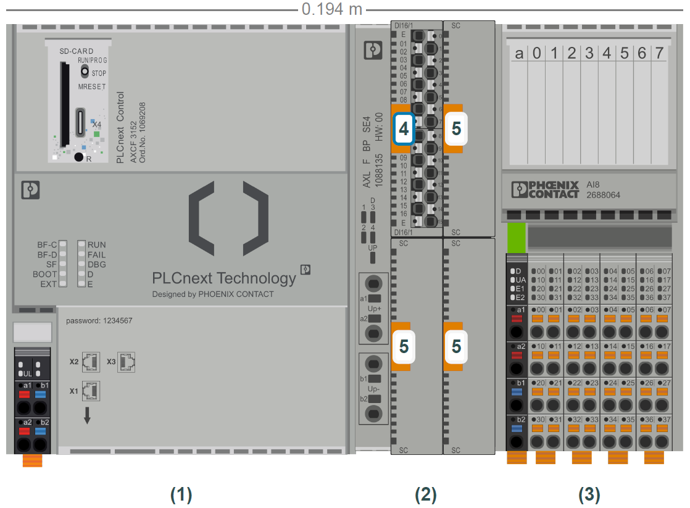
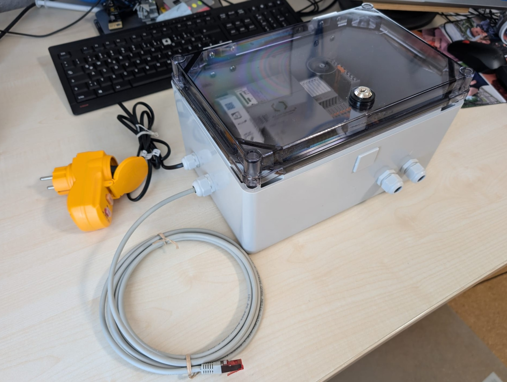
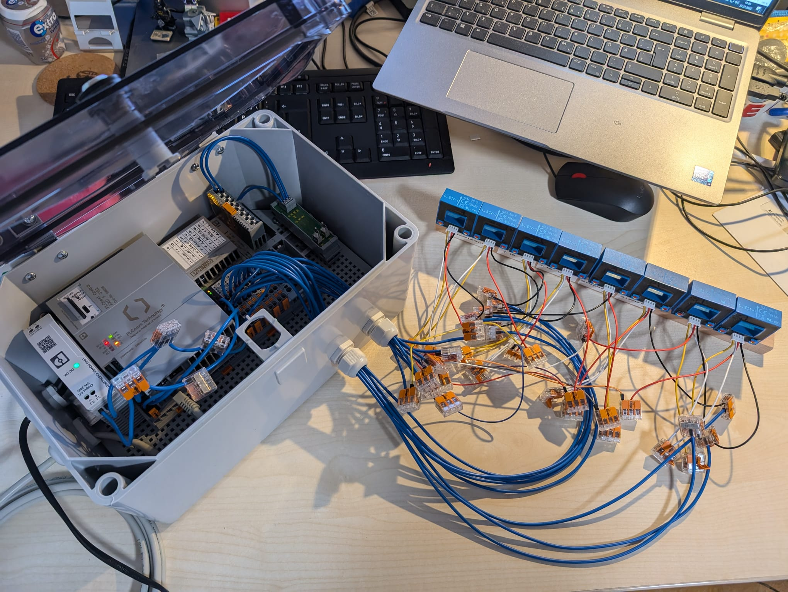
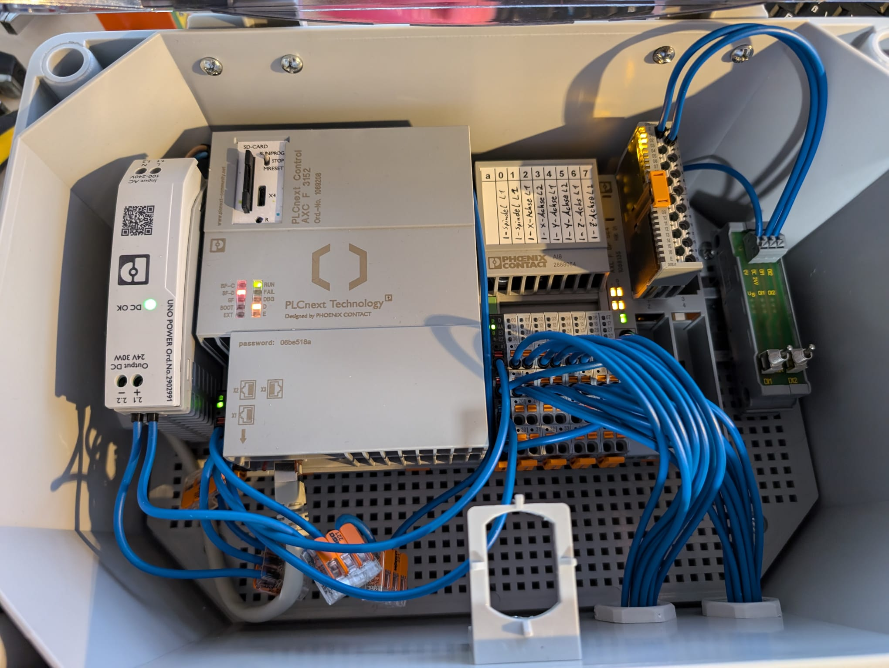
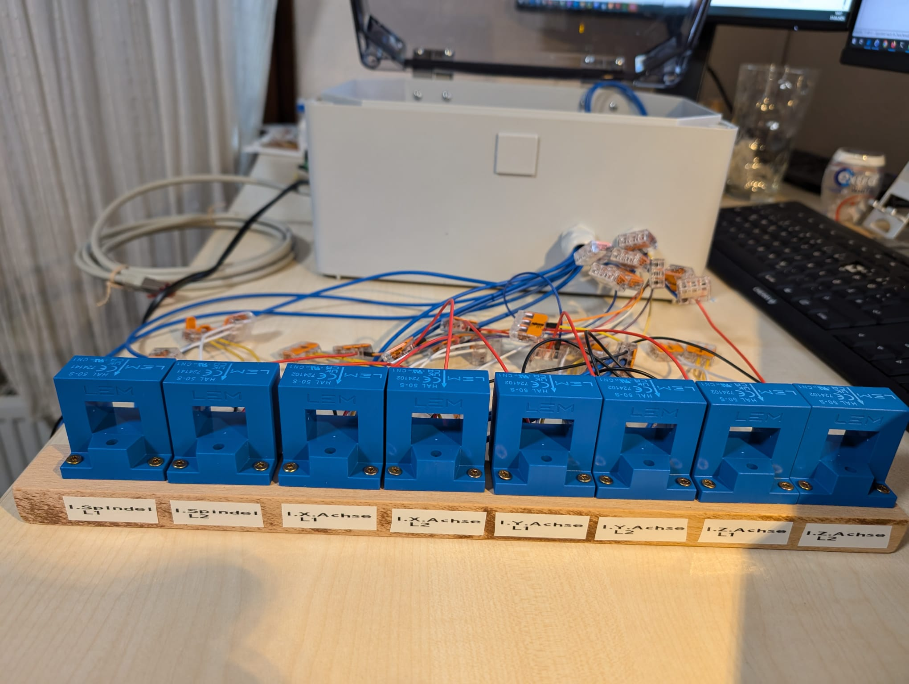
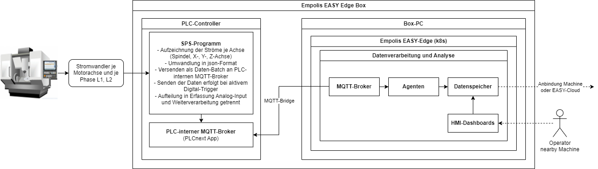
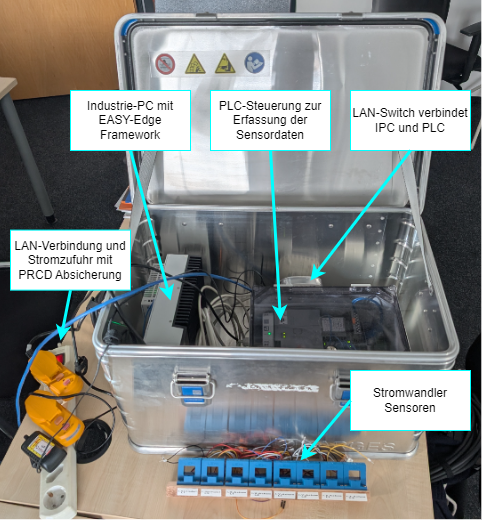
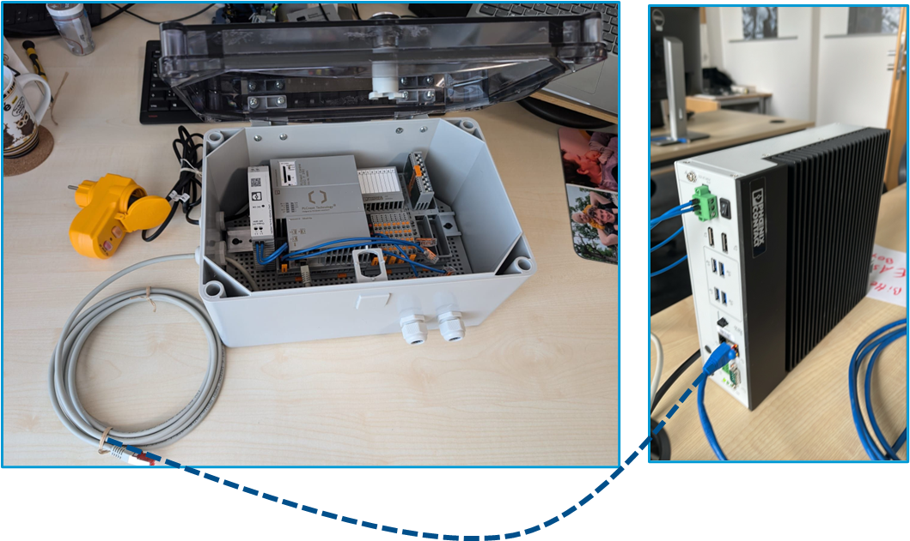

# Demonstrator Plug&Play EASY-Box für die Zerspanung {#sec-006-demo_zerspanung_easy_box}

Im Rahmen des EASY Projekts wurde die EASY-Edge-Box als hardwaretechnische Plug-and-Play-Lösung konzipiert und umgesetzt, auf der das EASY-Edge System in Form des in @sec-002_laufzeitumgebung_architektur_easy_cloud_edge beschriebenen Kubernetes-Clusters betrieben wird. Ziel war es, eine kompakte, flexibel einsetzbare und industrietaugliche Box bereitzustellen. Die EASY-Box ist dabei einsatzbereit ausgelegt und kann durch die Anbindung der Stromwandler sowie den Betrieb über einen handelsüblichen Schuko-Stecker und LAN-Anbindung ohne zusätzliche Infrastruktur in Betrieb genommen werden. Für den sicheren industriellen Einsatz wurde die EASY-Box mit industrietauglicher Hardware ausgestattet und gemäß DGUV Vorschrift 3 geprüft und erfüllt die Anforderungen an den Schutz gegen Staub und Spritzwasser nach DIN EN 60529 (Schutzart IP54). Dadurch ist sie sowohl für den Einbau im Maschinenschaltschrank als auch für den autarken Betrieb in industrieller Umgebung geeignet.

Die EASY-Edge Box besteht aus folgenden Komponenten:

| Bezeichnung | Typ | Hersteller |
|------------------------|------------------------|------------------------|
| **Sensorik** |  |  |
| Stromwandler 200 A |  | LEM |
| DC-DC Converter | DC-DC Converter 24VDC - +/- 15 VDC | Traco Power |
| **Ein-/Ausgabemodule** |  |  |
| Anaologeingabemodul | AXL F AI8 1F Axioline F | Phoenix Contact |
| Digitaleingabemodul | AXL SE DI16/1 Axioline | Phoenix Contact |
| Backplane | AXL F BP SE4 Axioline F | Phoenix Contact |
| Kippschalter |  | Wago |
| **Controller** |  |  |
| SPS-Steuerung | AXC-F3152 | Phoenix Contact |
| **Industrie-PC** |  |  |
| Box-PC | VL3 BPC - Box-PC (konfiguriert) | Phoenix Contact |
| **Zubehör** |  |  |
| Netzteil für Box-PC | Output 24V DC, 5A, 120W, Input 240 V AC |  |
| Netzteil für PLC Controller | Output 24V DC, ca. 1,25A --\> 30W |  |
| Personenschutz-Zwischenstecker | PRCD |  |
| Montageplatte, Leergehäuse | divers |  |
| Hutschienen, Schrauben, Kabelverschraubungen, Anschlussklemmen, Adernendhülsen, Schaltlitze | divers |  |

Im folgenden Abbild @fig-plc-easy-box wird der Zusammenbau des PLC-Controllers inklusive Eingabemodule gezeigt:

{#fig-plc-easy-box width="80%" fig-align="center"}

Die Montage dieser Komponenten erfolgte in einem Gehäuse, Verdrahtung intern und nach außen zur Plug & Play Variante mit LAN-Anschluss, Stromversorgung und Zuleitungen zu den Stromwandlern.

::: {#fig-easy-box-demo layout-ncol="2"}
{#fig-easy-box-demo-4 width=95% fig-align="center"}

{#fig-easy-box-demo-1 width=95% fig-align="center"}

{#fig-easy-box-demo-2 width=95% fig-align="center"}

{#fig-easy-box-demo-3 width=95% fig-align="center"}

Plug & Play EASY Edge-Box mit PLC-Steuerung
:::

Folgendes Diagramm @fig-easy-box-diagram fasst die strukturelle Aufteilung der EASY-Edge Box Komponenten zusammen:

{#fig-easy-box-diagram fig-align="center"}

Auf dem PLC läuft ein SPS-Programm, das die analogen Eingangssignale hochfrequent erfasst, konkret die Phasenströme L1 und L2 der einzelnen Motorachsen (X, Y, Z sowie Spindel). Die Messdaten werden über die Analogeingänge durch das SPS-Programm erfasst, zwischengespeichert und anschließend in Form von JSON-Batches über MQTT übertragen. Auf einem separaten Industrie-PC wird das EASY-Edge-System betrieben (siehe @sec-002_laufzeitumgebung_architektur_easy_cloud_edge), das unter anderem einen MQTT-Broker sowie eine MQTT-Bridge zur Kommunikation mit dem PLC bereitstellt. Innerhalb des EASY-Edge-Systems erfolgt eine weitere Datenaufbereitung sowie die Ausführung von Anwendungen wie dem Anomaly-Detection-Agent oder Threshold-Agent zur Überwachung und Ereigniserkennung. Die Ergebnisse der Analyse können mittels Monitoring-Dasboards einem Maschinenbediener visualisiert werden, wobei der Zugriff browserbasiert erfolgt. Daraus abgeleitete Events können zur Steuerung an die Maschine weitergeleitet werden. Zur globalen Ergebnisrepräsentation können die Ergebnisse wiederum per MQTT in die EASY-Cloud weitergeleitet werden und in der zugehörigen Verwaltungsschale persistiert werden. Ein Industrie-PC kann die Daten mehrerer PLC-Controller (mehrerer Maschinen) verarbeiten.
Auf dem Industrie-PC (konfigurierter Phoenix Contact VL3 Box-PC) wurde ein Debian Betriebssystem installiert. Zudem Rancher-Desktop, indem eine k3d Kubernetes Distribution läuft, worauf der EASY-Edge Kubernetes Cluster integriert wurde. Im gleichen lokalen Netzwerk oder bei bestehender VPN-Verbindung kann man sich per ssh und zusätzlich per Remote-Desktop verbinden. Durch gezielte Kubernetes Patches wurde das EASY-Edge System an die spezifischen Anforderungen und Randbedingungen des eingesetzten Industrie-PCs angepasst. Die EASY-Edge Services können zudem per Browser unter der Adresse https://phoenix-contact-vl3-bpc-01/ erreicht werden.

Zusammen mit dem Industrie-PC (VL3 Box-PC) wurde das Setup in eine Zarges-Kiste verbaut. Das komplette Setup wird in den folgendem Abbildern @fig-easy-box-gesamt-1 und @fig-easy-box-gesamt-2 gezeigt:

{#fig-easy-box-gesamt-1 fig-align="center"}

{#fig-easy-box-gesamt-2 fig-align="center"}

In Folgeprojekten wird das System an weiteren CNC-Maschinen konnektiert und unter realer Belastung und mit weiteren Zerspanungs-Use-Cases getestet. Dabei wird das System auch auf anderen Hardwarekomponenten, wie bspw. von Hersteller Beckhoff, ausgerollt und getestet.