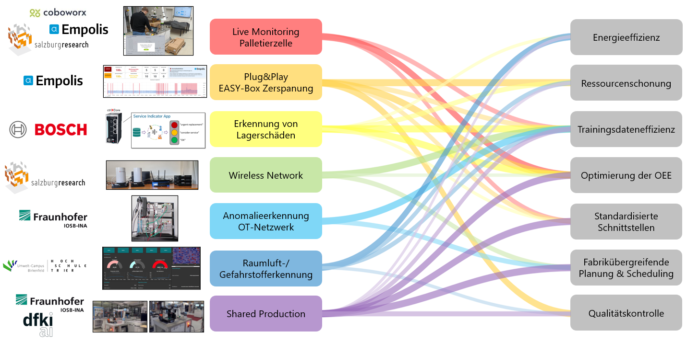

# Evaluation der Demonstratoren {#sec-006-evaluation_demonstratoren}

<!--
---
author:
   - Dennis Heitkamp, Stefanie Hittmeyer
---
-->

Nach der erfolgreichen Entwicklung und Implementierung der einzelnen Demonstratoren erfolgt im Rahmen dieses Arbeitspakets deren strukturierte Evaluation. Ziel ist es, den Nutzen der Demonstratoren anhand gemeinsam abgestimmter ökologischer und ökonomischer Wirkungsdimensionen transparent darzustellen und die Ergebnisse konsortial zu analysieren.

Im Vorfeld wurden im Konsortium ökologische und ökonomische Wirkungsdimensionen definiert, entlang derer die Demonstratoren eingeordnet werden. Diese Wirkungsdimensionen sind:

- Energieeffizienz 
- Ressourcenschonung
- Trainingsdateneffizienz
- Optimierung der Overall Equipment Effectiveness (OEE)
- Standardisierte Schnittstellen
- Fabrikübergreifende Planung und Scheduling
- Qualitätskontrolle

Auf Basis dieser Wirkungsdimensionen werden die einzelnen Demonstratoren analysiert und bewertet. Die Evaluierungen erfolgen jeweils entlang der zuvor festgelegten Gewichtung und Methodik und werden konsortial zusammengeführt und dokumentiert.

## Live Monitoring Palletierzelle

Der Demonstrator zur Erkennung von Störungen in einer Roboterzelle (vgl. @sec-006-demo_roboter_use_case) adressiert mehrere der Wirkungsdimensionen in unterschiedlicher Ausprägung. Besonders stark ist er in der Optimierung der OEE, da durch die frühzeitige Störungserkennung, die Reduktion ungeplanter Stillstände sowie die verkürzte Time-to-Repair die Anlagenverfügbarkeit deutlich verbessert wird. Ebenfalls hoch ist der Beitrag zu standardisierten Schnittstellen, da die Integration der Verwaltungsschale und das Edge-Cloud-Kontinuum eine interoperable und skalierbare Systemarchitektur unterstützen. Auch die Ressourcenschonung profitiert spürbar, da Ausfälle, unnötige Serviceeinsätze und Verschleiß reduziert werden. Der Energiebedarf wird indirekt gesenkt, allerdings ohne expliziten Fokus auf Energieoptimierung. Die Qualitätskontrolle ist mittelmäßig ausgeprägt, da sie sich vor allem auf Zustandsüberwachung und Anomaliedetektion konzentriert. Die Trainingsdateneffizienz wird nicht adressiert, und auch fabrikübergreifendes Scheduling spielt im Anwendungsfall keine Rolle, da der Fokus klar auf der einzelnen Roboterzelle und deren Predictive Maintenance liegt.

## Plug&Play EASY-Box für die Zerspanung

Der Demonstrator Plug&Play EASY-Box zur Überwachung des Werkzeugverschleißes in der Zerspanung (vgl. @sec-006-demo_zerspanung_easy_box) erfüllt die Wirkungsdimensionen insgesamt sehr gut im Bereich der produktionsnahen Optimierung. Besonders stark ist der Beitrag zur OEE, da durch die kontinuierliche Verschleißerkennung, die bessere Auslastung der Werkzeuge sowie die Optimierung von Rüstzeiten und Zerspanprozessen direkte Verbesserungen der Anlagenverfügbarkeit und Produktivität erzielt werden. Ebenfalls hoch ist der Nutzen im Bereich Ressourcenschonung, da Werkzeuge effizienter genutzt und Standzeiten besser ausgenutzt werden, wodurch Verschleiß und unnötiger Materialeinsatz reduziert werden. Die Qualitätskontrolle ist ebenfalls gut abgedeckt, da die Werkzeugzustandsüberwachung eine zentrale Rolle für die Prozessqualität in der Fertigung spielt. Standardisierte Schnittstellen sind durch die Integration in die EASY-Architektur, die Plattform sowie den Edge-Ansatz mit Federated Learning klar adressiert und als stark einzustufen. Die Trainingsdateneffizienz ist mittel bis gut ausgeprägt, da Federated Learning zwar nicht zwingend weniger Daten erzeugt, aber die zentrale Datensammlung reduziert und verteiltes Lernen ermöglicht. Der Energiebedarf wird indirekt positiv beeinflusst, jedoch ohne explizite Energieoptimierung als Zielgröße. Ein fabrikübergreifendes Scheduling ist nicht im Fokus, da der Use Case klar auf die Werkzeug- und Prozessoptimierung in der Zerspanung ausgerichtet ist.

## Erkennung von Lagerschäden
 
Der Demonstrator zur Erkennung von Lagerschäden (vgl. Kapitel @sec-004-fl_demo_CWRU) untersucht Federated Learning als Trainingsparadigma für die Zustandsüberwachung von Kugellagern in heterogenen Maschinenflotten. Besonders stark ist der Beitrag zur OEE, da durch die robuste und frühzeitige Detektion von Lagerschäden ungeplante Stillstände reduziert und Wartungsmaßnahmen bedarfsgerecht geplant werden können. Die Experimente zeigen, dass föderiert trainierte Modelle eine hohe Dateneffizienz aufweisen: Sie erreichen eine Endleistung nahe der zentralen Referenz, generalisieren besser auf neue Clients und bislang unbekannte Fehlertypen und ermöglichen den Wissenstransfer seltener Anomalien über die gesamte Flotte. Gleichzeitig wird Energieeffizienz adressiert, indem der zusätzliche Energieverbrauch des Trainings am Labordemonstrator mit Janitza‑Messgeräten erfasst und mit lokalem Training verglichen wird; Federated Learning erreicht dabei die Zielgenauigkeit mit geringerem Gesamtenergieverbrauch und stabilerer Konvergenz. Ressourcenschonung wird sowohl durch die Vermeidung von Folgeschäden und Notfallreparaturen als auch durch den reduzierten Bedarf an mehrfach redundanten lokalen Trainings unterstützt. Standardisierte Schnittstellen spielen eine unterstützende Rolle über die ctrlX‑Plattform und die Messinfrastruktur, stehen aber weniger im Fokus als die systematische Evaluierung von Daten- und Energieeffizienz. Ein fabrikübergereifendes Scheduling wird in diesem Demonstrator nicht betrachtet, da der Schwerpunkt klar auf der komponenten- und flottenweiten Zustandsüberwachung liegt.

## Wireless Network

Der Demonstrator Wireless Network (vgl. @sec-004-fl_demo_wireless_network) adressiert die Wirkungsdimensionen vor allem im Kontext von Performance‑Monitoring, dynamischen QoS‑Mechanismen und verteiltem Lernen. Besonders stark ist der Beitrag zur OEE, da die frühzeitige Erkennung und Optimierung von Netzengpässen Ausfälle, Latenzspitzen und Kommunikationsfehler reduziert und Eingriffe gezielt auslöst. Ein fabrikübergreifendes Scheduling ist hoch adressiert, weil netzwerkbewusste Planung und stabile Verbindungen die standortübergreifende Koordination ermöglichen. Ressourcenschonung ist gut ausgeprägt: adaptive Bandbreitennutzung und Edge‑nahe Verarbeitung vermeiden unnötige Transfers und Überprovisionierung. Der Energiebedarf wird mittel und eher indirekt verbessert, etwa durch weniger Datenverkehr und die platzierte Rechenlast im Edge‑Cloud‑Kontinuum, ohne explizite Energiemetriken. Die Trainingsdateneffizienz ist mittel: Federated‑Learning‑Ansätze erlauben dezentrales Lernen ohne zentrale Rohdatenaggregation, stehen jedoch nicht primär im Vordergrund. Standardisierte Schnittstellen sind voraussichtlich relevant (Netzwerk‑Telemetrie und Cloud‑APIs), im Steckbrief jedoch nicht explizit benannt und damit nur teilweise adressiert. Die Qualitätskontrolle wird mittel unterstützt, indem stabile Kommunikationspfade Prozess- und Prüfsysteme absichern, ohne eine direkte Produktprüfung zu implementieren.

## Anomalieerkennung in der OT‑Netzwerkkommunikation

Der Demonstrator zur Anomalieerkennung in der OT‑Netzwerkkommunikation (vgl. @sec-004-network_anomaly_detection) adressiert die Wirkungsdimensionen vor allem im Kontext von OT‑Schutz, netzwerkbasierter Anomaliedetektion und verteiltem, datenschutzwahrendem Lernen. Besonders stark ist der Beitrag zur OEE, da die frühzeitige Erkennung von Netzwerkangriffen ungeplante Stillstände und Folgeschäden verhindert und Interventionen zielgerichtet auslöst. Ebenfalls gut ist die Ressourcenschonung, weil Ausfälle, Nacharbeit und Notfallmaßnahmen vermieden werden und durch verteiltes Lernen zentrale Datentransfers entfallen. Die Qualitätskontrolle ist mittel ausgeprägt: Die Sicherung der Prozess‑ und Datenintegrität unterstützt Produkt‑ und Prozessqualität indirekt, steht aber nicht als klassische Produktprüfung im Mittelpunkt. Standardisierte Schnittstellen sind derzeit nicht explizit ausgewiesen; die Lösung arbeitet zwar netzwerkbasiert, konkrete Protokoll‑ oder API‑Standards werden jedoch nicht genannt. Die Trainingsdateneffizienz ist mittel: Anomaliedetektion und Federated/Privacy‑Preserving Learning reduzieren den Bedarf an gelabelten, zentral aggregierten Daten, der Schwerpunkt liegt jedoch auf Sicherheit und Datenschutz. Der Energiebedarf wird indirekt verbessert, etwa durch weniger Datenübertragung und Edge‑nahe Auswertung, ohne explizite Energieoptimierung. Ein fabrikübergreifendes Scheduling ist nicht Bestandteil des Demonstrators, da der Fokus auf der Absicherung von OT‑Netzwerken im Produktionsumfeld liegt.

## Raumluft-/Gefahrstofferkennung

Der Demonstrator zur Raumluft-/Gefahrstofferkennung adressiert die Wirkungsdimensionen vor allem im Kontext von Qualitätskontrolle, Anomaliedetektion und dezentraler, energieeffizienter Datenverarbeitung. Besonders stark ist der Beitrag zur Energieeffizienz, da neben Low-Energy-Edge-Hardware auch End-to-End energieoptimierte Methoden eingesetzt werden sowie mittels Federated Learning die Datenmenge des energieintensiven Datenaustauschs reduziert wird. Ebenfalls hoch ist der Beitrag zur Ressourcenschonung, weil energie- und ressourceneffiziente Architektur- und Betriebsweisen explizit im Fokus stehen. Auch der Beitrag zur Qualitätskontrolle ist hoch, da die kontinuierliche Raumluft- und Gefahrstoffüberwachung unmittelbar zur Produkt- und Prozesssicherheit beiträgt. Die Trainingsdateneffizienz wird in mittlerem Maße und eher indirekt unterstützt: Anomaliedetektion und Federated Learning verringern zwar Label- und zentrale Datenbedarfe, sind jedoch nicht als eigenständiges datenminimales Ziel ausgelegt. Die OEE wird ebenso in mittlerem Maße und indirekt unterstützt, indem eine frühzeitige Anomalie- und Gefahrstofferkennung Stillstände, Nacharbeit und Sicherheitsereignisse reduzieren kann, ohne dass die OEE-Optimierung der primäre Fokus ist. Standardisierte Schnittstellen sind derzeit nicht ausgewiesen und werden daher nur geringfügig adressiert. Ein fabrikübergreifendes Scheduling ist nicht Bestandteil des Demonstrators, da der Schwerpunkt auf lokaler Überwachung und sicherheitsrelevanter Qualitätsabsicherung liegt.

## Shared Production

Der Demonstrator zur Shared Production (vgl. @sec-006-demo_shared_production) adressiert die Wirkungsdimensionen vor allem im Kontext von fabrikübergreifender Planung, Kapazitätsabgleich und der flexiblen Integration neuer Anlagen. Besonders stark ist der Beitrag zum fabrikübergreifenden Scheduling, da Aufträge standortübergreifend verteilt, Engpässe vermieden und Kapazitäten dynamisch genutzt werden. Die OEE profitiert hoch, weil Auslastungsschwankungen geglättet, Stillstände reduziert und Durchsatz sowie Termintreue verbessert werden. Ressourcenschonung ist ebenfalls hoch, da Maschinen, Personal und Material effizienter eingesetzt und unnötige Rüst‑ und Wartezeiten vermieden werden. Der Energiebedarf wird mittel bis gut adressiert, sofern energie‑ bzw. CO2‑bewusste Planungsziele berücksichtigt werden; eine explizite Energieoptimierung ist nicht zentral ausgewiesen. Standardisierte Schnittstellen ermöglichen die einfache Integration neuer Anlagen und Partner. Die Trainingsdateneffizienz und Qualitätskontrolle werden durch die Verwendung von föderiertem Lernen in der Bild-basierten Qualitätskontrolle unterstützt.

## Fazit und Gesamtbild der Demonstratoren

Die konsortiale Auswertung zeigt, dass die EASY‑Demonstratoren die im Projekt definierten ökologischen und ökonomischen Wirkungsdimensionen komplementär abdecken. Jeder Demonstrator setzt eigene Schwerpunkte, im Gesamtbild werden jedoch alle sieben Dimensionen adressiert (siehe @fig-whole-demo-eva):

- **Optimierung der Overall Equipment Effectiveness (OEE)** wird insbesondere durch die Demonstratoren zur Live‑Überwachung der Palettierzelle, zur Werkzeugverschleißüberwachung (Plug&Play EASY‑Box für die Zerspanung) und zur Lagerschaden‑Detektion deutlich unterstützt.  
- **Energieeffizienz** ist vor allem bei der Raumluft‑/Gefahrstofferkennung ausgeprägt, wird aber auch in den Demonstratoren zu Wireless Network und OT‑Netzwerkkommunikation durch reduzierte Datenübertragung und Edge‑nahe Verarbeitung adressiert.  
- **Ressourcenschonung** steht insbesondere bei der Werkzeugverschleißüberwachung (Plug&Play EASY‑Box) und bei der Raumluft‑/Gefahrstofferkennung im Fokus, wird aber auch durch zustandsbasierte Instandhaltung (Lagerschaden‑Detektion, Live‑Monitoring Palettierzelle) unterstützt.  
- **Trainingsdateneffizienz** wird durch die Federated Learning Ansätze in mehreren Demonstratoren verbessert, indem Label‑ und zentrale Datenbedarfe reduziert und verteilte Lernprozesse ermöglicht werden, ohne dass Rohdaten zentralisiert werden müssen.  
- **Standardisierte Schnittstellen** werden vor allem durch die Nutzung von Verwaltungsschalen, MQTT/OPC UA sowie Cloud‑basierten Services in den Produktions‑ und Monitoring‑Demonstratoren vorangetrieben und schaffen die Basis für Interoperabilität im Edge‑Cloud‑Kontinuum.  
- **Fabrikübergreifende Planung und Scheduling** wird im Shared‑Production‑Demonstrator adressiert, der standortübergreifende Kapazitätsabgleiche, Planung und die Integration realer Smart‑Factory‑Ressourcen ermöglicht.  
- **Qualitätskontrolle** wird sowohl durch bild‑ und sensorbasierte Verfahren (Shared Production, Raumluft‑/Gefahrstofferkennung) als auch durch Überwachung von Anlagenzuständen unterstützt.

In Summe lässt sich feststellen, dass die entwickelten Demonstratoren zeigen, wie sich im EASY Edge‑Cloud‑Kontinuum ökologische und ökonomische Zielsetzungen miteinander verbinden lassen: von energie‑ und datenbewusster Analytik über zustandsorientierte Instandhaltung bis hin zur fabrikübergreifenden Produktionsplanung.

{#fig-whole-demo-eva}
