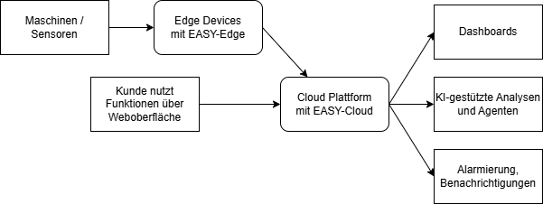
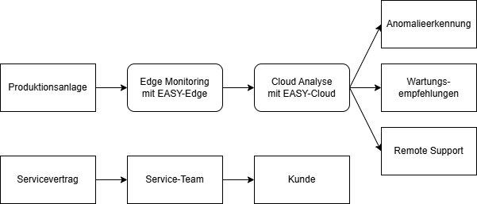
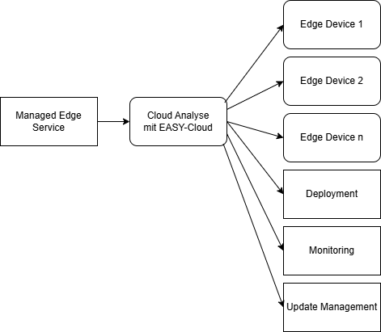

# Geschäftsmodelle {#sec-007-geschaeftsmodelle}

In diesem Kapitel steht die Überführung der entwickelten Technologien und Plattformkomponenten in tragfähige Geschäftsmodelle im Mittelpunkt. Ziel ist es, die im EASY Projekt entstandenen Lösungen nicht nur technisch, sondern auch wirtschaftlich erfolgreich nutzbar zu machen und langfristig in industrielle Anwendungen zu überführen.

Der Fokus liegt dabei auf der Entwicklung datengetriebener Serviceangebote auf Basis der aufgebauten EASY Edge-Cloud-Infrastruktur. Durch die Kombination von standardisierten Schnittstellen, digitalen Zwillingen sowie KI-gestützten Analyse- und Planungsverfahren können neue digitale Services im Produktions- und Serviceumfeld geschaffen werden. Dazu zählen beispielsweise zustandsbasierte Wartung, intelligente Fehlerdiagnose, Monitoring-Lösungen oder digitale Assistenzsysteme. Diese ermöglichen eine proaktive und effizientere Gestaltung von Betriebs- und Supportprozessen.

Kunden profitieren hierbei insbesondere von einer höheren Anlagenverfügbarkeit, reduzierten Stillstandszeiten sowie einer verbesserten Transparenz über Maschinen- und Prozesszustände (Overall Equipment Effectiveness, OEE). Gleichzeitig entsteht die Möglichkeit, bestehende Serviceangebote um datenbasierte Mehrwertdienste zu erweitern und neue digitale Geschäftsmodelle aufzubauen.

Ein weiterer Schwerpunkt liegt auf der Standardisierung der Schnittstellen zwischen Feldebene, Edge und Cloud. Durch den Einsatz standardisierter Kommunikationsmechanismen sowie der Asset Administration Shell wird die Integration neuer Maschinen, Geräte und Softwarekomponenten erheblich vereinfacht. Langfristig soll dadurch eine möglichst flexible Plug-and-Play-Integration erreicht werden. Dies reduziert den Aufwand für Konfiguration und Inbetriebnahme und verbessert gleichzeitig die Skalierbarkeit der entwickelten Lösungen.

Aus technologischer Sicht entsteht dadurch eine Plattform, die sich flexibel an unterschiedliche Kundenanforderungen und Branchen anpassen lässt. Auf dieser Grundlage können sowohl projektbezogene Individualisierungen als auch standardisierte Produkt- und Servicepakete angeboten werden. Ebenso werden nutzungs- oder abonnementsbasierte Modelle möglich, beispielsweise im Sinne von „Software-as-a-Service“ oder „Monitoring-as-a-Service“.

Insgesamt ergeben sich daraus mehrere Markt- und Geschäftspotenziale. Dazu zählen insbesondere neue digitale Serviceangebote im Bereich Analyse, Wartung und Produktionsunterstützung, die Skalierbarkeit durch standardisierte und portable Systemarchitekturen sowie wiederkehrende Erlösmodelle durch abonnement- oder servicebasierte Angebote. Darüber hinaus tragen reduzierte Integrationsaufwände und eine vereinfachte Systemeinführung zu einer höheren Kundenzufriedenheit und langfristigen Kundenbindung bei.

**Plattform-as-a-Service (PaaS)**

Ein mögliches Geschäftsmodell besteht in der Bereitstellung der entwickelten Infrastruktur als Plattformlösung. Kunden erhalten hierbei eine standardisierte Laufzeitumgebung für Edge- und Cloud-Anwendungen, inklusive Kubernetes-Basis, Monitoring, Benutzerverwaltung, Datenintegration und Verwaltungsschalen-Infrastruktur. Die eigentlichen Fachanwendungen (bspw. die Analyse-Agenten) können anschließend modular ergänzt werden. Der Anbieter übernimmt dabei Betrieb, Wartung, Updates und Erweiterung der Plattformkomponenten.

{#fig-plattform-as-a-service}

**Software-as-a-Service (SaaS)**

Auf dieser Plattform aufbauend können einzelne Analyse- oder Produktionsservices als Fachanwendungen direkt als Software-as-a-Service angeboten werden. Kunden nutzen hierbei bestimmte Anwendungen, ohne diese selbst implementieren, betreiben oder warten zu müssen. Durch die Kubernetes Plattform und den modularen Aufbau lassen sich aus Betreibersicht einzelne Komponenten (Agenten) direkt integrieren. Die Verwaltungsschale unterstützt dies durch standardisierte (Schnittstellen-)Beschreibungen.

Mögliche modulare Komponenten können sein:

-   Zustandsüberwachung durch Monitoring-Agenten

-   KPI-Dashboards

-   Produktionsanalyse

-   Alarmierungs- und Assistenzsysteme

-   Energiemonitoring

-   Predictive Maintenance durch KI-gestützte Datenauswertung

Die Monetarisierung erfolgt beispielsweise über Nutzeranzahl, Datenvolumen oder Funktionsumfang (bspw. Implementierung spezialisierter Analyse-Agenten).

{#fig-software-as-a-service}

**Monitoring- und Wartungsservice**

Ein weiteres Geschäftsmodell besteht in datenbasierten Service- und Wartungsangeboten. Die Plattform ermöglicht eine kontinuierliche Erfassung und Analyse von Maschinen- und Betriebsdaten. Dadurch können Wartungsbedarfe frühzeitig erkannt und ungeplante Ausfälle reduziert werden.

Zum einen kann der Betreiber der Plattform dies als Service für Kunden anbieten, bspw. in Form einer Leitwarte, welche proaktiv alarmiert oder Anlagenoptimierungen durchführt. Weiterhin kann bspw. ein Anlagen- und Maschinenhersteller diese Plattform widerum seinen Kunden (Betreiber der Maschine) anbieten, damit diese darüber ihre Anlagen überwachen können.

Der Anbieter übernimmt hierbei beispielsweise:

-    Systemüberwachung

-    Alarmmanagement

-    Predictive Maintenance

-    Fehleranalyse

-    Remote-Support

-    Wartungsservices

Dieses Modell eignet sich insbesondere für langfristige Serviceverträge und Managed Services.

{#fig-sw-wartungsservice}

**Outcome based Services**

Outcome based Services werden zukünftig eine immer größere Verbreitung finden. Dabei zahlt der Kunde keine fixe Nutzungsgebühr. Kunde und Lieferant vereinbaren Zielgrößen, die durch die Nutzung des Service verbessert werden, d.h. es wird der direkte geschäftliche Nutzen gemessen (Outcome) und als Basis der Preisbildung genutzt. Die EASY Platform unterstützt dieses Modell durch die leichte Messbarkeit unterschiedlichster Größen im Prozess. Alle der vorgenannten Anwendungsfälle lassen sich mit diesem Modell umsetzen. Kunde und Lieferant werden dadurch zu strategischen Partnern, weil der geschäftliche Erfolg des Kunden auch im direkten wirtschaftlichen Interesse des Lieferanten liegt.

**Edge-Verwaltung**

Da die Plattform gezielt auf verteilte Edge-Umgebungen ausgelegt ist, entsteht zusätzlich Potenzial im Bereich des zentralen Edge-Managements. Dazu zählen:

-   Verwaltung verteilter Edge Devices und Maschinen

-   Automatisierte (Software-) Rollouts

-   Versionsmanagement und Remote-Updates

-   Monitoring des Geräte- und Maschinenzustands

Insbesondere bei größeren verteilten Produktionsumgebungen oder über Standorte hinweg entsteht hier ein skalierbares Betriebsmodell.

{#fig-edge-verwaltung-geschaeft}

**Zusammenfassung**

Die entwickelte Plattform ermöglicht die Kombination verschiedener Geschäftsmodelle innerhalb eines gemeinsamen technologischen Ökosystems. Durch die Verwendung standardisierter Technologien wie Kubernetes und Verwaltungsschalen entsteht eine portable und herstellerunabhängige Grundlage für digitale Industrieanwendungen.

Dadurch können sowohl klassische Softwareprodukte als auch wiederkehrende digitale Serviceangebote realisiert werden. Gleichzeitig erlaubt die modulare Architektur eine flexible Anpassung an unterschiedliche Branchen, Kundenanforderungen und Betriebsmodelle.